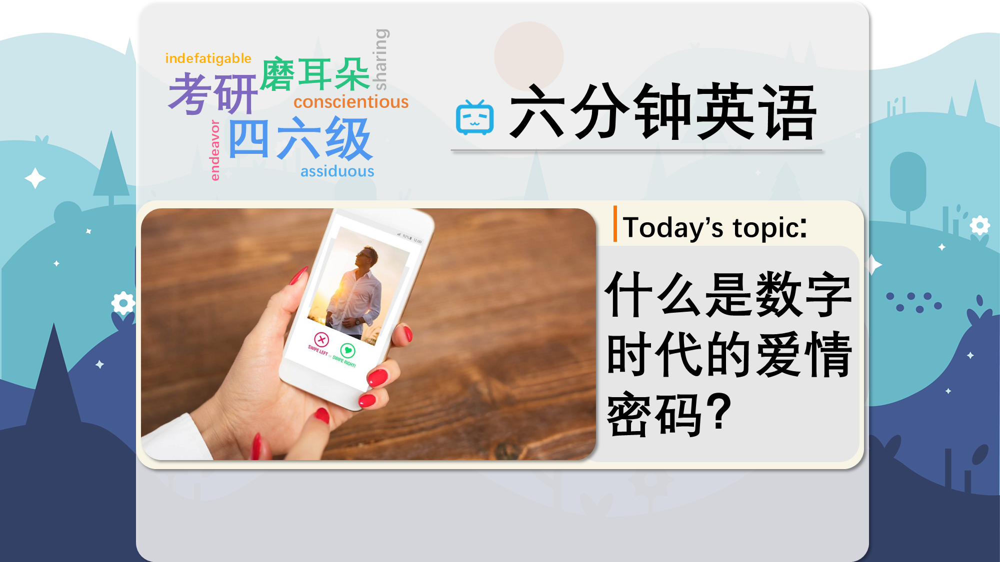

### 【英文脚本】
Dan
Hello. And welcome to 6 Minute English. I'm Dan.

Rob
And hello, I'm Rob.

Dan
In today's programme we're going to be looking at what our brains are doing when we are using dating apps. Now, Rob, have you ever used a dating app?

Rob
No way, I would never use one.

Dan
Hmm, so Rob, can you explain, when talking about dating apps, what we mean by swipe left and swipe right?

Rob
Ah, yes. These are not new words but technology has given them new meaning. To swipe is the movement of your finger on a smartphone to change the screen you're looking at. So imagine turning the page in a book, well, on a phone, you swipe. In some dating apps, they show you pictures of people you might find attractive. If you do like them, you swipe right. If you don't like them, you swipe left.

Dan
We will dig deeper into this topic shortly, but first, a question. In the UK, approximately how many marriages start with the couple meeting online? Is it: a) One in three; b) One in four c) One in five What do you think?

Rob
Well, all of those seem quite high to me, so I'm going to guess in the middle, one in four.

Dan
Well, we'll find out if you're right later in the programme. Now, Alice Gray is a science communicator and blogger. Recently she was a guest on BBC Radio 4's Woman's Hour programme and she was asked about what goes on in our brains when we use dating apps compared to when we meet people in real life. What difference does she say there is?

Alice Gray
It's very easy to think that with these instantaneous swipe left, swipe right, that the process in our brain of how we pick out a suitable mate would be very different, when actually it's really similar to how we do it in person.

Rob
So she says that what goes on in our brains is actually very similar. Online we make decisions very quickly about who we like. These decisions are almost immediate - she used the adjective instantaneous for this. So we make these instantaneous decisions then choose to swipe left or swipe right. In real life, we do the same thing. We know almost immediately when we see someone if we find them attractive or not.

Dan
Although of course in digital dating, one you've swiped left you will never see that person again and you won't have the chance to meet. In the real world you could meet someone you don't find attractive instantaneously and then get to know them and find that you do quite like them.

Rob
Yes, that is true, but then possibly they won't like you. And then you have to deal with rejection. Rejection is when someone doesn't find you attractive and they don't want to spend time with you or get to know you.

Dan
So what's the difference in our brains between online rejection and real life rejection? Here's Alice Gray again.

Alice Gray
We see that a lot of the patterns associated with rejection in real life and rejection on dating apps are similar, just the exposure to the rate of the amount of rejection you get on dating apps is a lot higher than the ones in real life. So in real life you'll have time to, sort of, compute the rejection, get over it a little bit, and dust yourself off and get on with it. Whereas the rate of rejection on dating apps is so high it's often hard to cope with one coming in after another.

Rob
So, she says that our brain's response to real life and online rejection is quite similar, but in the digital world you can be rejected many more times.

Dan
In real life you have a bit more time to recover from the rejection, to get over it, as she says. You can dust yourself off which is a way of saying you think positively to make yourself feel better - imagine falling over on the ground, when you get up, you might be covered in dust and dirt, you need to dust yourself off to make yourself ready again, before you carry on.

Rob
In the online world though, you don't have that time. Online dating apps can lead to many rejections and psychologically that can be difficult to manage. Another way of saying 'difficult to manage' is difficult to cope with.

Dan
Well, we don't want you to reject us, so time now to give you the answer to that quiz question before a recap of today's vocabulary. I asked: in the UK, approximately how many marriages start with the couple meeting online? Is it: a) One in three; b) One in four c) One in five.

Rob
Hmmm, so I said b) one in four – 25%. Was I right?

Dan
Sorry, Rob, the answer is a), one in three. Does that surprise you?

Rob
Yes, it does, I didn't think it would be that high.

Dan
It's the sign of the times, Rob. Digital world – digital dating! Let's have a look at that vocabulary.

Rob
OK, well, we started with the verb to swipe. The movement of our finger on smartphone or tablet screen to indicate whether we like someone or not. Swipe right for like, swipe left if you don't like.

Dan
Our decisions on whether we find someone attractive or not are often instantaneous. This adjective means immediate, at once.

Rob
Rejection is when you let someone know that you are not interested in them, you don't want to be romantically involved with them.

Dan
If you are rejected you might need some time to feel better, and for this you can use the phrasal verb get over. It can take some time to get over a rejection.

Rob
Yeah, I know! Being positive and optimistic after a rejection can be described as dusting yourself off. But, having many rejections can be difficult to cope with, which means it can be difficult to manage, difficult to keep positive.

Dan
Well, we hope you don't swipe left on this programme and you will join us again next time Remember you can find us on Instagram, Facebook, Twitter, YouTube and of course our website bbclearningenglish.com.

Rob
And don't forget our new BBC Learning English app.

Dan
Oh good idea. See you soon. Bye.

Rob
Bye bye!

### 【中英文双语脚本】
Dan(担)
Hello. And welcome to 6 Minute English. I'm Dan.
你好。欢迎来到六分钟英语。我是 Dan。

Rob(罗伯)
And hello, I'm Rob.
大家好，我是 罗伯。

Dan(担)
In today's programme we're going to be looking at what our brains are doing when we are using dating apps. Now, Rob, have you ever used a dating app?
在今天的节目中，我们将看看当我们使用约会应用节目时，我们的大脑在做什么。现在，罗伯，你用过约会应用吗？

Rob(罗伯)
No way, I would never use one.
不可能，我永远不会用。

Dan(担)
Hmm, so Rob, can you explain, when talking about dating apps, what we mean by swipe left and swipe right?
嗯，那么 罗伯，您能否解释一下，在谈论约会应用程序时，我们所说的向左滑动和向右滑动是什么意思？

Rob(罗伯)
Ah, yes. These are not new words but technology has given them new meaning. To swipe is the movement of your finger on a smartphone to change the screen you're looking at. So imagine turning the page in a book, well, on a phone, you swipe. In some dating apps, they show you pictures of people you might find attractive. If you do like them, you swipe right. If you don't like them, you swipe left.
啊，是的。这些不是新词，但技术赋予了它们新的含义。滑动是您在智能手机上的手指移动以更改您正在查看的屏幕。所以想象一下，在书中翻页，嗯，在手机上，你滑动。在一些约会应用程序中，他们会向您展示您可能会觉得有吸引力的人的照片。如果你喜欢他们，你可以向右滑动。如果你不喜欢他们，你可以向左滑动。

Dan(担)
We will dig deeper into this topic shortly, but first, a question. In the UK, approximately how many marriages start with the couple meeting online? Is it: a) One in three; b) One in four c) One in five What do you think?
我们稍后将深入探讨这个话题，但首先是一个问题。在英国，大约有多少婚姻是从这对夫妇在网上见面开始的？是：a） 三分之一；b） 四分之一 c） 五分之一 你怎么看？

Rob(罗伯)
Well, all of those seem quite high to me, so I'm going to guess in the middle, one in four.
嗯，所有这些在我看来都相当高，所以我猜一下，四分之一。

Dan(担)
Well, we'll find out if you're right later in the programme. Now, Alice Gray is a science communicator and blogger. Recently she was a guest on BBC Radio 4's Woman's Hour programme and she was asked about what goes on in our brains when we use dating apps compared to when we meet people in real life. What difference does she say there is?
好吧，我们将在该计划的后面发现您是否正确。现在，Alice Gray 是一名科学传播者和博主。最近，她做客了 BBC Radio 4 的 Woman's Hour 节目，她被问及当我们使用约会应用节目时，与在现实生活中认识人时相比，我们的大脑中发生了什么。她说有什么区别呢？

Alice Gray(爱丽丝·格雷)
It's very easy to think that with these instantaneous swipe left, swipe right, that the process in our brain of how we pick out a suitable mate would be very different, when actually it's really similar to how we do it in person.
我们很容易认为，通过这些瞬间向左滑动、向右滑动，我们大脑中如何挑选合适伴侣的过程会非常不同，而实际上这与我们亲自做事的方式非常相似。

Rob(罗伯)
So she says that what goes on in our brains is actually very similar. Online we make decisions very quickly about who we like. These decisions are almost immediate - she used the adjective instantaneous for this. So we make these instantaneous decisions then choose to swipe left or swipe right. In real life, we do the same thing. We know almost immediately when we see someone if we find them attractive or not.
所以她说，我们大脑中发生的事情实际上非常相似。在网上，我们很快就决定了我们喜欢谁。这些决定几乎是立竿见影的 —— 她为此使用了形容词 instantaneous。因此，我们立即做出这些决定，然后选择向左滑动或向右滑动。在现实生活中，我们做同样的事情。当我们看到某人时，我们几乎立即知道我们是否觉得他们有吸引力。

Dan(担)
Although of course in digital dating, one you've swiped left you will never see that person again and you won't have the chance to meet. In the real world you could meet someone you don't find attractive instantaneously and then get to know them and find that you do quite like them.
当然，在数字约会中，您向左滑动的约会将永远不会再看到那个人，您也没有机会见面。在现实世界中，您可能会立即遇到一个您认为没有吸引力的人，然后了解他们并发现您确实非常喜欢他们。

Rob(罗伯)
Yes, that is true, but then possibly they won't like you. And then you have to deal with rejection. Rejection is when someone doesn't find you attractive and they don't want to spend time with you or get to know you.
是的，这是真的，但那样的话，他们可能不会喜欢你。然后你必须面对拒绝。拒绝是指有人觉得你没有吸引力，他们不想花时间和你在一起或了解你。

Dan(担)
So what's the difference in our brains between online rejection and real life rejection? Here's Alice Gray again.
那么，在我们的大脑中，在线拒绝和现实生活中的拒绝有什么区别呢？又是 Alice Gray。

Alice Gray(爱丽丝·格雷)
We see that a lot of the patterns associated with rejection in real life and rejection on dating apps are similar, just the exposure to the rate of the amount of rejection you get on dating apps is a lot higher than the ones in real life. So in real life you'll have time to, sort of, compute the rejection, get over it a little bit, and dust yourself off and get on with it. Whereas the rate of rejection on dating apps is so high it's often hard to cope with one coming in after another.
我们看到，与现实生活中的拒绝和约会应用程序上的拒绝相关的许多模式是相似的，只是你在约会应用程序上被拒绝的比率比现实生活中的要高得多。所以在现实生活中，你会有时间，在某种程度上，计算一下被拒绝的情况，稍微克服它，然后掸掉身上的灰尘，继续前进。虽然约会应用程序的拒绝率如此之高，但通常很难应对一个接一个的进来。

Rob(罗伯)
So, she says that our brain's response to real life and online rejection is quite similar, but in the digital world you can be rejected many more times.
所以，她说我们的大脑对现实生活和在线拒绝的反应非常相似，但在数字世界中，你可能会被拒绝很多次。

Dan(担)
In real life you have a bit more time to recover from the rejection, to get over it, as she says. You can dust yourself off which is a way of saying you think positively to make yourself feel better - imagine falling over on the ground, when you get up, you might be covered in dust and dirt, you need to dust yourself off to make yourself ready again, before you carry on.
正如她所说，在现实生活中，你有更多的时间从拒绝中恢复过来，克服它。你可以把自己掸掉，这是一种说你积极思考让自己感觉更好的方式 —— 想象一下摔倒在地上，当你站起来时，你可能会沾满灰尘和污垢，你需要把自己掸掉灰尘，让自己再次做好准备，然后再继续。

Rob(罗伯)
In the online world though, you don't have that time. Online dating apps can lead to many rejections and psychologically that can be difficult to manage. Another way of saying 'difficult to manage' is difficult to cope with.
然而，在网络世界中，你没有那个时间。在线约会应用程序可能会导致许多拒绝，并且在心理上可能难以管理。“难以管理”的另一种说法是难以应对。

Dan(担)
Well, we don't want you to reject us, so time now to give you the answer to that quiz question before a recap of today's vocabulary. I asked: in the UK, approximately how many marriages start with the couple meeting online? Is it: a) One in three; b) One in four c) One in five.
好吧，我们不希望您拒绝我们，所以现在是时候在回顾今天的词汇之前为您提供该测验问题的答案了。我问：在英国，大约有多少婚姻是从这对夫妇在网上见面开始的？是：a） 三分之一；b） 四分之一 c） 五分之一。

Rob(罗伯)
Hmmm, so I said b) one in four – 25%. Was I right?
嗯，所以我说 b） 四分之一 – 25%。我是对的吗？

Dan(担)
Sorry, Rob, the answer is a), one in three. Does that surprise you?
对不起，罗伯，答案是 a），三分之一。这让你感到惊讶吗？

Rob(罗伯)
Yes, it does, I didn't think it would be that high.
是的，确实如此，我没想到会那么高。

Dan(担)
It's the sign of the times, Rob. Digital world – digital dating! Let's have a look at that vocabulary.
这是时代的标志，罗伯。数字世界 – 数字约会！让我们来看看这个词汇。

Rob(罗伯)
OK, well, we started with the verb to swipe. The movement of our finger on smartphone or tablet screen to indicate whether we like someone or not. Swipe right for like, swipe left if you don't like.
好了，我们从动词 to swipe 开始。我们的手指在智能手机或平板电脑屏幕上的移动，以表明我们是否喜欢某人。向右滑动表示喜欢，不喜欢则向左滑动。

Dan(担)
Our decisions on whether we find someone attractive or not are often instantaneous. This adjective means immediate, at once.
我们决定是否发现某人有吸引力通常是即时的。这个形容词的意思是立即的。

Rob(罗伯)
Rejection is when you let someone know that you are not interested in them, you don't want to be romantically involved with them.
拒绝是指你让某人知道你对他们不感兴趣，你不想和他们发生浪漫关系。

Dan(担)
If you are rejected you might need some time to feel better, and for this you can use the phrasal verb get over. It can take some time to get over a rejection.
如果你被拒绝了，你可能需要一些时间来感觉好些，为此你可以使用短语动词 get over。克服拒绝可能需要一些时间。

Rob(罗伯)
Yeah, I know! Being positive and optimistic after a rejection can be described as dusting yourself off. But, having many rejections can be difficult to cope with, which means it can be difficult to manage, difficult to keep positive.
是的，我明白！被拒绝后保持积极乐观可以被描述为掸掉自己的灰尘。但是，有很多拒绝可能很难应对，这意味着很难管理，很难保持积极。

Dan(担)
Well, we hope you don't swipe left on this programme and you will join us again next time Remember you can find us on Instagram, Facebook, Twitter, YouTube and of course our website bbclearningenglish.com.
好吧，我们希望您不要在这个节目上向左滑动，下次您会再次加入我们请记住，您可以在 Instagram、Facebook、Twitter、YouTube 上找到我们，当然还有我们的网站 bbclearningenglish.com。

Rob(罗伯)
And don't forget our new BBC Learning English app.
别忘了我们新的 BBC Learning English 应用程序。

Dan(担)
Oh good idea. See you soon. Bye.
哦，好主意。一会见。再见。

Rob(罗伯)
Bye bye!
再见！

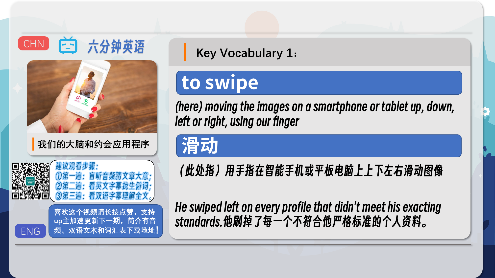
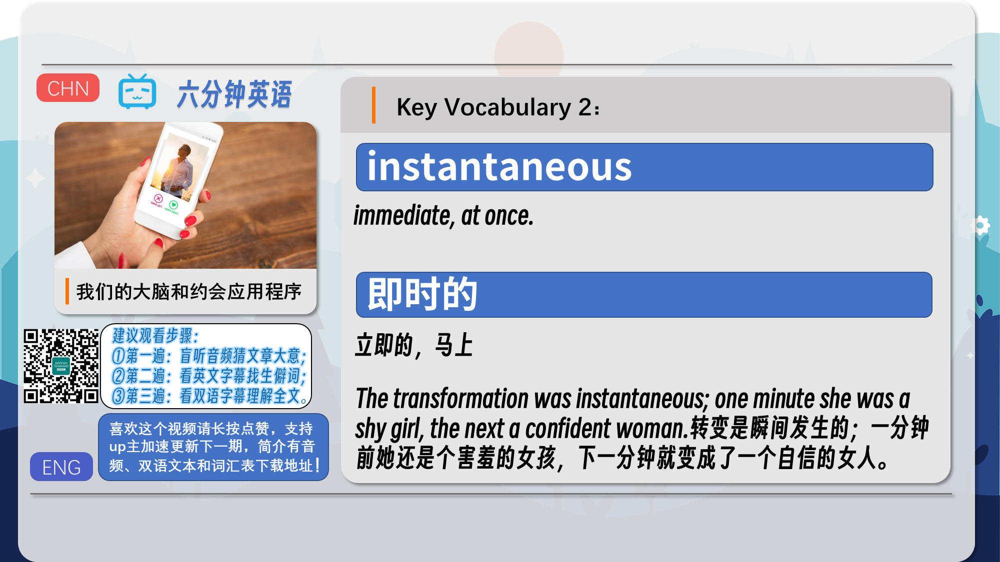
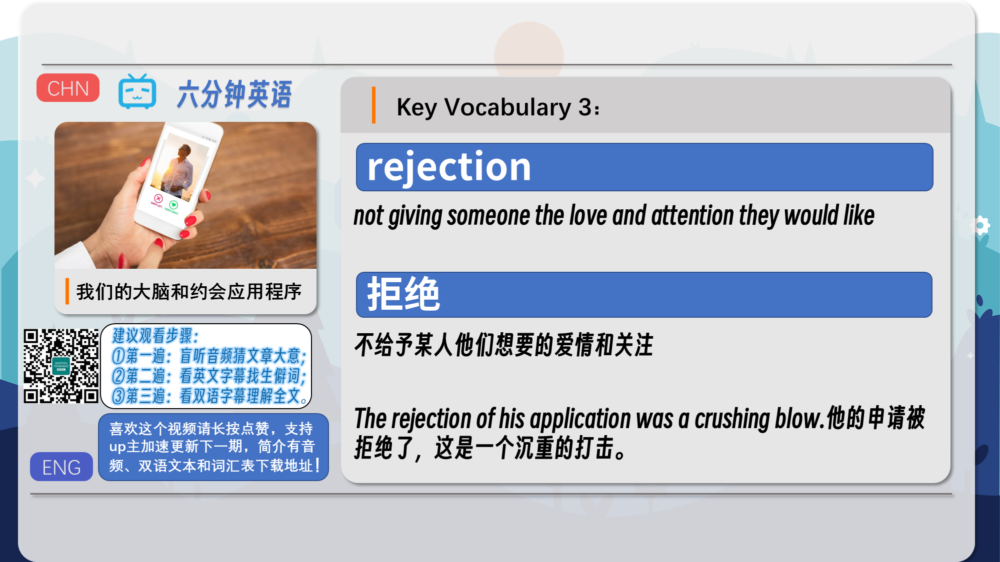
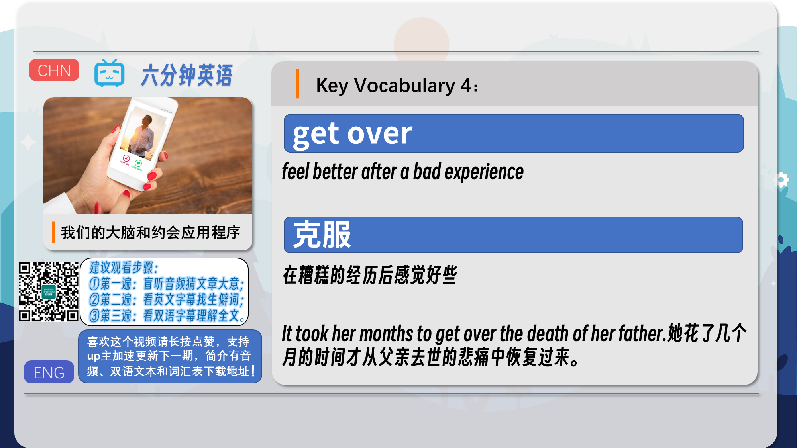
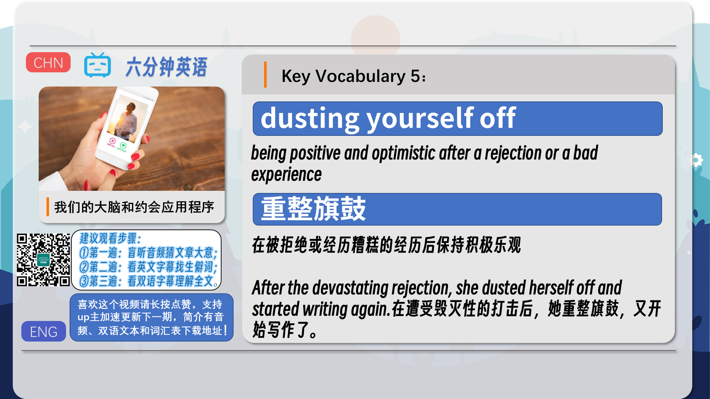
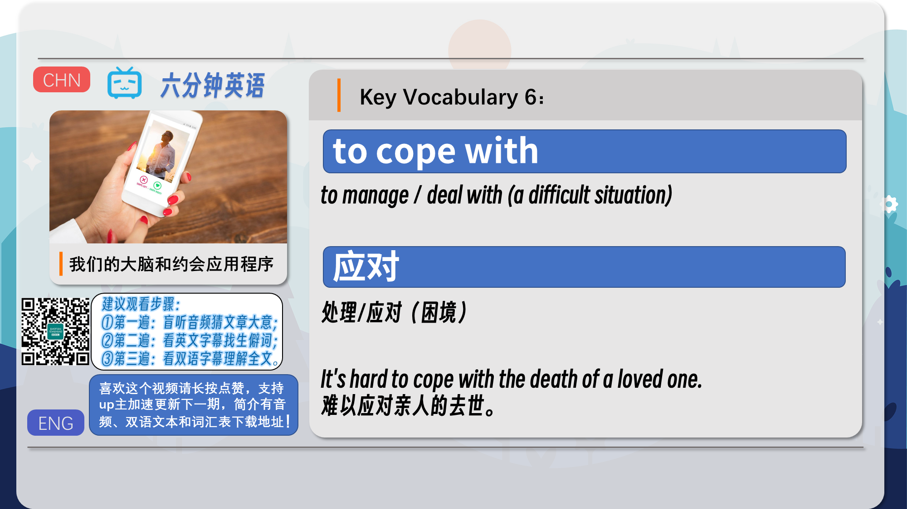
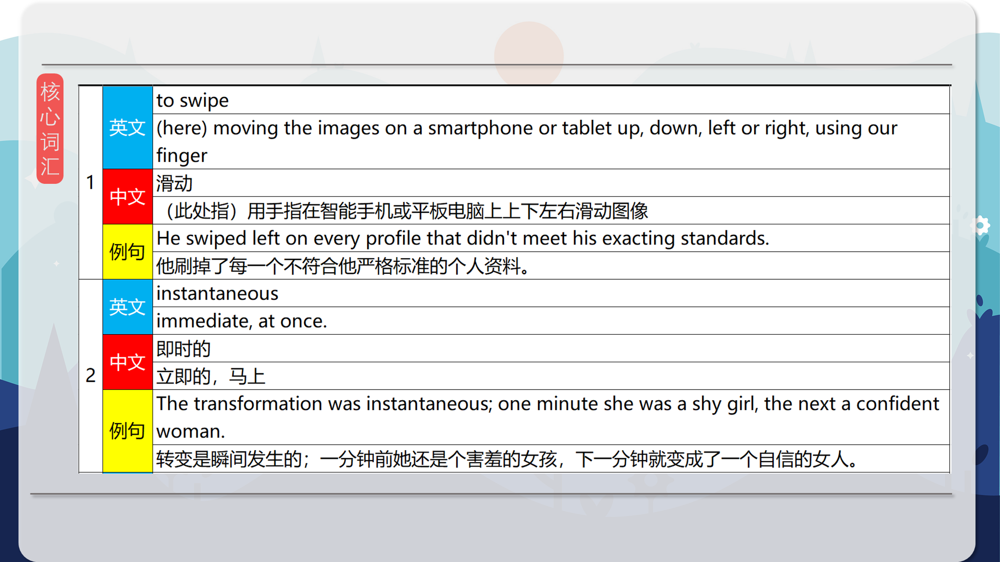
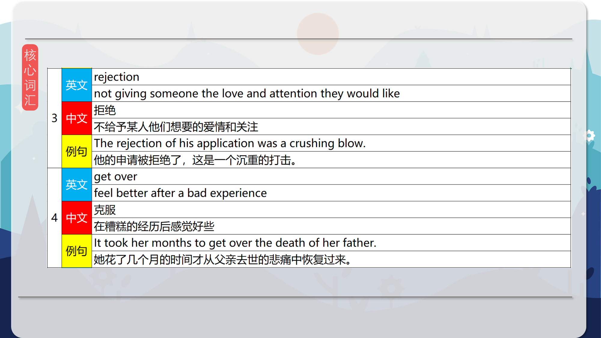
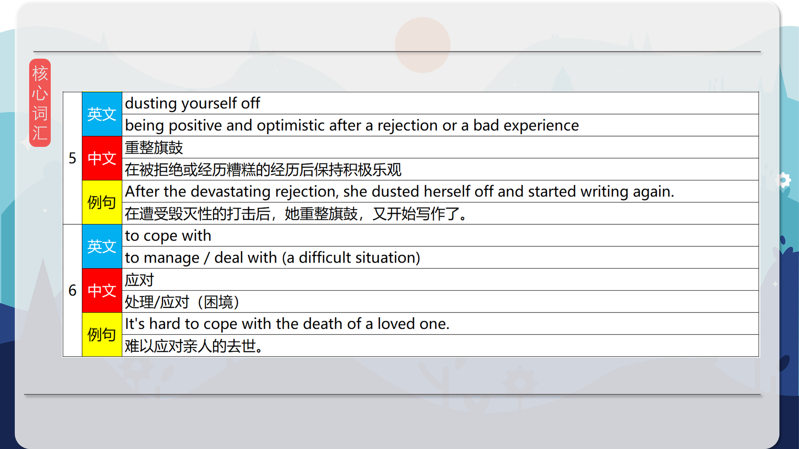
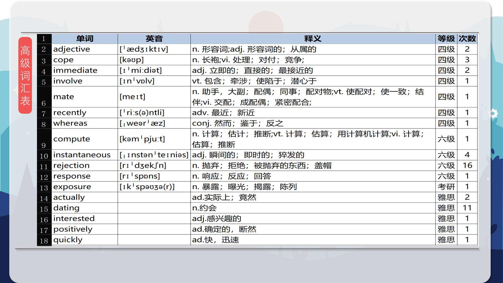
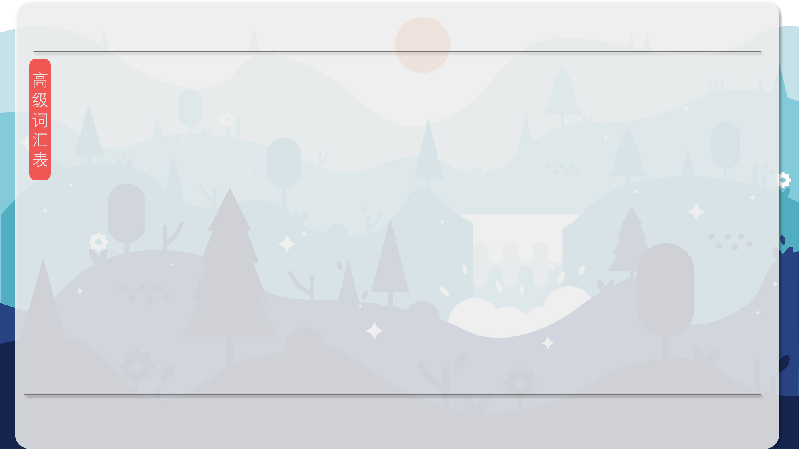
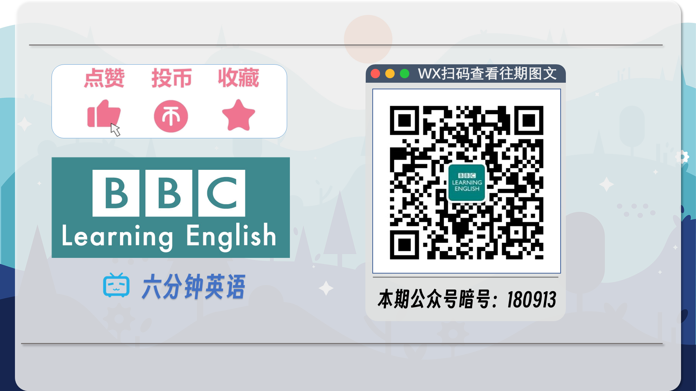

### 【核心词汇】
#### to swipe
(here) moving the images on a smartphone or tablet up, down, left or right, using our finger
滑动
（此处指）用手指在智能手机或平板电脑上上下左右滑动图像
He swiped left on every profile that didn't meet his exacting standards.
他刷掉了每一个不符合他严格标准的个人资料。
#### instantaneous
immediate, at once.
即时的
立即的，马上
The transformation was instantaneous; one minute she was a shy girl, the next a confident woman.
转变是瞬间发生的；一分钟前她还是个害羞的女孩，下一分钟就变成了一个自信的女人。
#### rejection
not giving someone the love and attention they would like
拒绝
不给予某人他们想要的爱情和关注
The rejection of his application was a crushing blow.
他的申请被拒绝了，这是一个沉重的打击。
#### get over
feel better after a bad experience
克服
在糟糕的经历后感觉好些
It took her months to get over the death of her father.
她花了几个月的时间才从父亲去世的悲痛中恢复过来。
#### dusting yourself off
being positive and optimistic after a rejection or a bad experience
重整旗鼓
在被拒绝或经历糟糕的经历后保持积极乐观
After the devastating rejection, she dusted herself off and started writing again.
在遭受毁灭性的打击后，她重整旗鼓，又开始写作了。
#### to cope with
to manage / deal with (a difficult situation)
应对
处理/应对（困境）
It's hard to cope with the death of a loved one.
难以应对亲人的去世。

在公众号里输入6位数字，获取【对话音频、英文文本、中文翻译、核心词汇和高级词汇表】电子档，6位数字【暗号】在文章的最后一张图片，如【220728】，表示22年7月28日这一期。公众号没有的文章说明还没有制作相关资料。年度合集在B站【六分钟英语】工房获取，每年共计300+文档，感谢支持！