### 【英文脚本】
Neil
Hello. Welcome to 6 Minute English, I'm Neil.

Rob
And I'm Rob.

Neil
Rob, would you say that were a snowflake?

Rob
Wow, I can't believe you said that, that's so offensive. How could you be so rude?

Neil
So I guess that's a yes then? Sorry, I only asked.

Rob
Don't worry, I wasn't really upset, I just wanted to demonstrate the meaning of the word. The word snowflake has taken on a new meaning in recent years. These days it's used as an insult. It's used to criticise people or groups that are seen to be very easily offended or upset by things that others say.

Neil
There is usually a political side to it too, isn't there?

Rob
Yes, people who use the word snowflake tend to be from the political right and they usually use it about those on the political left, particularly millennials - young, socially aware adults.

Neil
Well we'll explore this topic in more detail shortly, but first a quiz question. In which year was snowflake one of Collins Dictionary's words of the year? Was it… a) 1996; b) 2006 c) 2016.

Rob
Well, we said it's quite a recent word so I'm going for c) 2016.

Neil
Well, we'll find out if you're right later on in the programme. The topic of offence is a very complicated one. First what do we mean by offence Rob?

Rob
Thanks for that. That is a really difficult question. Something that is offensive is rude, insulting and makes people feel hurt and upset. What's difficult about it though is that we don't all find the same things offensive. Some people can be deliberately offensive and some people may be offensive without meaning to be.

Neil
Also, different people respond to offence in different ways - some accept it as the price of free speech and some try to stop the people they think are offensive from saying the things they do.

Rob
These terms come up quite a lot in discussions about equality, race, religion and of course, politics.

Neil
The topic was discussed in detail in the BBC Radio programme Sweet Reason. Evan Davis presented the programme and here is the first part of his summary of the discussion. What does he say is the reason some people talk about offence?

Evan Davis
First, on occasion, people probably do invoke offence when really they just have a political disagreement and on occasion groups that suffer discrimination or exclusion perhaps find it exhilarating or uniting to call out that discrimination.

Neil
He says that some people take offence when it's just a political disagreement. He says they invoke offence.

Rob
If you invoke something it means that you use it to support your point or explain your action. So to invoke offence is to say that we are acting this way because we are offended by what you have said, although the offence may only be a political difference rather than something truly offensive.

Neil
Davis goes on to say that groups that do suffer from discrimination may get some feelings of unity when they call out discrimination. They feel more together when they publicise and highlight the discrimination they have experienced. Even though some offence that is taken may not be genuine, that doesn't mean people don't have a right to be offended. Here's Evan Davis again.

Evan Davis
Where the so-called snowflakes surely have a point is this, societies are entitled to make certain things taboo and the millennials use of the word offensive is simply designed to say some views are not just wrong they are in a special category of wrong.

Rob
His point here is that societies can decide that certain things are taboo. In this context something that is taboo is something that is regarded by society as being shocking and offensive and that it is OK for people to be offended by these things.

Neil
And I think the point he makes is a good one. The word snowflake is usually used as an insult - but some people may feel proud to be a snowflake because it means they are standing up for a particular standard, they have a level of decency and social responsibility that is higher than that of those who are calling them snowflakes.

Rob
Well I hope we haven't caused any offence today. Before we review the vocabulary, can we have the answer to today's question Neil?

Neil
Of course, I asked in which year was snowflake one of Collins Dictionary's words of the year? Was it… a) 1996; b) 2006 c) 2016.

Rob
And I said c) 2016. It's got to be right!

Neil
Well, do you want to hear the story? Interestingly the term was coined in 1996 in the book Fight Club, but it was in 2016 that it was one of the dictionary's words of the year. Now let's review our words of the day. First there is offence.

Rob
People can take offence and be offended by something that is offensive. Something that is offensive could be rude, insulting and shocking. It might take the form of humiliation or discrimination against a person or group.

Neil
The term snowflake is a word used by some people to talk about other people who they think get offended too easily and unnecessarily. They don't want to change their language or ideas just because snowflakes get upset. Then we had the word invoke. If you invoke something you use it as a reason to explain your actions and feelings.

Rob
To call something out is to challenge it, to highlight it and look for justification.

Neil
And finally we have taboo. Something that society says is offensive and shocking. So there we have it. What do you think Rob of this topic.

Rob
Well it is a very difficult subject, particularly when it comes to politics, religion and society. Free speech is good but at times, particularly on social media, I think can be unnecessarily unpleasant.

Neil
Well, try not to be offended but it is time for us to leave you for this programme. Do join us next time. Remember you can find us on Instagram, Facebook, Twitter, YouTube and of course our website bbclearningenglish.com. And of course, we have a new app which you can find on our website. It's free and it's brilliant isn't it Rob?

Rob
Absolutely!

Neil
See you soon, bye.

Rob
Bye!

### 【中英文双语脚本】
Neil(尼尔)
Hello. Welcome to 6 Minute English, I'm Neil.
你好。欢迎来到六分钟 English，我是 Neil。

Rob(罗伯)
And I'm Rob.
我是 罗伯。

Neil(尼尔)
Rob, would you say that were a snowflake?
罗伯，你会说那是一片雪花吗？

Rob(罗伯)
Wow, I can't believe you said that, that's so offensive. How could you be so rude?
哇，我真不敢相信你这么说，这太冒犯了。你怎么能这么粗鲁呢？

Neil(尼尔)
So I guess that's a yes then? Sorry, I only asked.
所以我想这是肯定的吗？对不起，我只是问了。

Rob(罗伯)
Don't worry, I wasn't really upset, I just wanted to demonstrate the meaning of the word. The word snowflake has taken on a new meaning in recent years. These days it's used as an insult. It's used to criticise people or groups that are seen to be very easily offended or upset by things that others say.
别担心，我并不是真的不高兴，我只是想演示这个词的含义。近年来，雪花这个词有了新的含义。如今，它被用作侮辱。它被用来批评那些被认为很容易被别人所说的话冒犯或不安的人或团体。

Neil(尼尔)
There is usually a political side to it too, isn't there?
它通常也有政治的一面，不是吗？

Rob(罗伯)
Yes, people who use the word snowflake tend to be from the political right and they usually use it about those on the political left, particularly millennials - young, socially aware adults.
是的，使用雪花这个词的人往往来自政治右翼，他们通常用它来指代政治左翼人士，尤其是千禧一代 —— 年轻的、有社会意识的成年人。

Neil(尼尔)
Well we'll explore this topic in more detail shortly, but first a quiz question. In which year was snowflake one of Collins Dictionary's words of the year? Was it… a) 1996; b) 2006 c) 2016.
好吧，我们稍后将更详细地探讨这个主题，但首先是一个测验问题。snowflake 是哪一年的 Collins Dictionary 年度词汇之一？是不是......a） 1996 年；b） 2006 c） 2016 年。

Rob(罗伯)
Well, we said it's quite a recent word so I'm going for c) 2016.
嗯，我们说这是一个很新的词，所以我选择 c） 2016。

Neil(尼尔)
Well, we'll find out if you're right later on in the programme. The topic of offence is a very complicated one. First what do we mean by offence Rob?
好吧，我们稍后会发现您在该计划中是否正确。冒犯的话题是一个非常复杂的话题。首先，我们所说的冒犯 罗伯 是什么意思？

Rob(罗伯)
Thanks for that. That is a really difficult question. Something that is offensive is rude, insulting and makes people feel hurt and upset. What's difficult about it though is that we don't all find the same things offensive. Some people can be deliberately offensive and some people may be offensive without meaning to be.
谢谢你。这是一个非常困难的问题。冒犯性的东西是粗鲁的、侮辱性的，会让人感到受伤和不安。然而，困难的是，我们并不都觉得同样的事情令人反感。有些人可能会故意冒犯，有些人可能会无意冒犯。

Neil(尼尔)
Also, different people respond to offence in different ways - some accept it as the price of free speech and some try to stop the people they think are offensive from saying the things they do.
此外，不同的人对冒犯的反应也不同 —— 有些人认为这是言论自由的代价，有些人试图阻止他们认为冒犯的人说出他们所做的事情。

Rob(罗伯)
These terms come up quite a lot in discussions about equality, race, religion and of course, politics.
这些术语在关于平等、种族、宗教，当然还有政治的讨论中经常出现。

Neil(尼尔)
The topic was discussed in detail in the BBC Radio programme Sweet Reason. Evan Davis presented the programme and here is the first part of his summary of the discussion. What does he say is the reason some people talk about offence?
BBC 广播节目 Sweet Reason 详细讨论了这个话题。Evan Davis 介绍了该计划，以下是他对讨论的总结的第一部分。他说有些人谈论冒犯的原因是什么？

Evan Davis(埃文·戴维斯)
First, on occasion, people probably do invoke offence when really they just have a political disagreement and on occasion groups that suffer discrimination or exclusion perhaps find it exhilarating or uniting to call out that discrimination.
首先，有时人们可能确实会援引冒犯，而实际上他们只是存在政治分歧，有时遭受歧视或排斥的群体可能会觉得大声疾呼这种歧视令人振奋或团结起来。

Neil(尼尔)
He says that some people take offence when it's just a political disagreement. He says they invoke offence.
他说，当这只是政治分歧时，有些人会感到冒犯。他说他们引发了冒犯。

Rob(罗伯)
If you invoke something it means that you use it to support your point or explain your action. So to invoke offence is to say that we are acting this way because we are offended by what you have said, although the offence may only be a political difference rather than something truly offensive.
如果你引用了某项内容，则意味着你用它来支持你的观点或解释你的操作。因此，援引冒犯就是说我们之所以这样做，是因为我们对你所说的话感到冒犯，尽管冒犯可能只是政治上的分歧，而不是真正冒犯性的东西。

Neil(尼尔)
Davis goes on to say that groups that do suffer from discrimination may get some feelings of unity when they call out discrimination. They feel more together when they publicise and highlight the discrimination they have experienced. Even though some offence that is taken may not be genuine, that doesn't mean people don't have a right to be offended. Here's Evan Davis again.
戴维斯继续说，确实遭受歧视的群体在大声疾呼歧视时可能会获得一些团结的感觉。当他们宣传和强调他们所经历的歧视时，他们会感觉更加团结。即使受到的一些冒犯可能不是真实的，但这并不意味着人们没有权利被冒犯。埃文·戴维斯 又来了。

Evan Davis(埃文·戴维斯)
Where the so-called snowflakes surely have a point is this, societies are entitled to make certain things taboo and the millennials use of the word offensive is simply designed to say some views are not just wrong they are in a special category of wrong.
所谓的雪花肯定有道理，社会有权将某些事情定为禁忌，而千禧一代使用冒犯性这个词只是为了说一些观点不仅是错误的，而且属于一类特殊的错误。

Rob(罗伯)
His point here is that societies can decide that certain things are taboo. In this context something that is taboo is something that is regarded by society as being shocking and offensive and that it is OK for people to be offended by these things.
他在这里的观点是，社会可以决定某些事情是禁忌。在这种情况下，禁忌的东西就是被社会视为令人震惊和冒犯的东西，人们被这些事情冒犯是可以的。

Neil(尼尔)
And I think the point he makes is a good one. The word snowflake is usually used as an insult - but some people may feel proud to be a snowflake because it means they are standing up for a particular standard, they have a level of decency and social responsibility that is higher than that of those who are calling them snowflakes.
我认为他提出的观点很好。雪花这个词通常被用作侮辱 —— 但有些人可能会为自己是雪花而感到自豪，因为这意味着他们正在捍卫特定的标准，他们的体面和社会责任水平高于那些称他们为雪花的人。

Rob(罗伯)
Well I hope we haven't caused any offence today. Before we review the vocabulary, can we have the answer to today's question Neil?
好吧，我希望我们今天没有引起任何冒犯。在我们回顾词汇之前，我们能回答今天的问题吗 尼尔？

Neil(尼尔)
Of course, I asked in which year was snowflake one of Collins Dictionary's words of the year? Was it… a) 1996; b) 2006 c) 2016.
当然，我问雪花是哪一年的柯林斯词典年度词汇之一？是不是......a） 1996 年；b） 2006 c） 2016 年。

Rob(罗伯)
And I said c) 2016. It's got to be right!
我说 c） 2016 年。它必须是正确的！

Neil(尼尔)
Well, do you want to hear the story? Interestingly the term was coined in 1996 in the book Fight Club, but it was in 2016 that it was one of the dictionary's words of the year. Now let's review our words of the day. First there is offence.
那么，你想听这个故事吗？有趣的是，这个词是在 1996 年的《搏击俱乐部》一书中创造的，但直到 2016 年，它才成为词典的年度词汇之一。现在让我们回顾一下我们今天的词汇。首先是冒犯。

Rob(罗伯)
People can take offence and be offended by something that is offensive. Something that is offensive could be rude, insulting and shocking. It might take the form of humiliation or discrimination against a person or group.
人们可能会因为冒犯性的事情而受到冒犯和冒犯。冒犯性的内容可能是粗鲁的、侮辱性的和令人震惊的。它可能表现为对个人或群体的羞辱或歧视。

Neil(尼尔)
The term snowflake is a word used by some people to talk about other people who they think get offended too easily and unnecessarily. They don't want to change their language or ideas just because snowflakes get upset. Then we had the word invoke. If you invoke something you use it as a reason to explain your actions and feelings.
雪花一词是一些人用来谈论他们认为太容易和不必要地被冒犯的其他人的词。他们不想仅仅因为雪花不安就改变他们的语言或想法。然后我们有了 invoke 这个词。如果你援引某样东西，你就把它作为解释你的行为和感受的理由。

Rob(罗伯)
To call something out is to challenge it, to highlight it and look for justification.
指出某件事就是挑战它，突出它并寻找理由。

Neil(尼尔)
And finally we have taboo. Something that society says is offensive and shocking. So there we have it. What do you think Rob of this topic.
最后，我们有禁忌。社会所说的令人反感和震惊的东西。所以我们有了它。你觉得这个话题的 罗伯 怎么样。

Rob(罗伯)
Well it is a very difficult subject, particularly when it comes to politics, religion and society. Free speech is good but at times, particularly on social media, I think can be unnecessarily unpleasant.
嗯，这是一个非常困难的话题，尤其是在政治、宗教和社会方面。言论自由是好的，但有时，尤其是在社交媒体上，我认为可能会带来不必要的不愉快。

Neil(尼尔)
Well, try not to be offended but it is time for us to leave you for this programme. Do join us next time. Remember you can find us on Instagram, Facebook, Twitter, YouTube and of course our website bbclearningenglish.com. And of course, we have a new app which you can find on our website. It's free and it's brilliant isn't it Rob?
好吧，尽量不要被冒犯，但现在是我们离开您参加这个计划的时候了。下次请加入我们。请记住，您可以在 Instagram、Facebook、Twitter、YouTube 上找到我们，当然还有我们的网站 bbclearningenglish.com。当然，我们有一个新的应用节目，您可以在我们的网站上找到。它是免费的，而且很棒，不是 罗伯 吗？

Rob(罗伯)
Absolutely!
绝对！

Neil(尼尔)
See you soon, bye.
再见。

Rob(罗伯)
Bye!
再见！

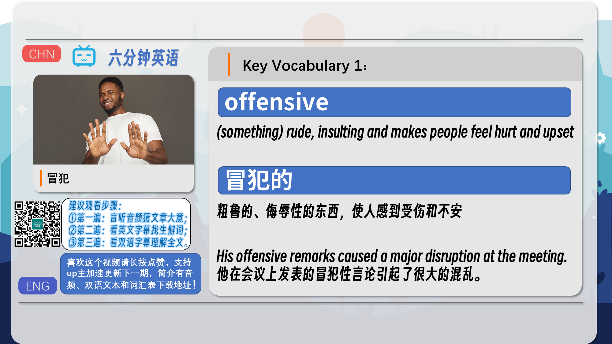
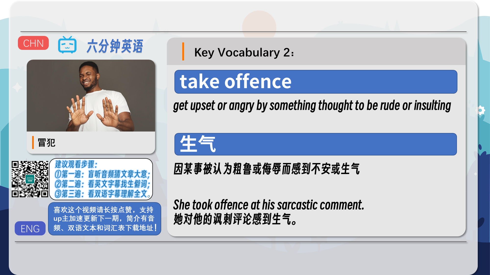
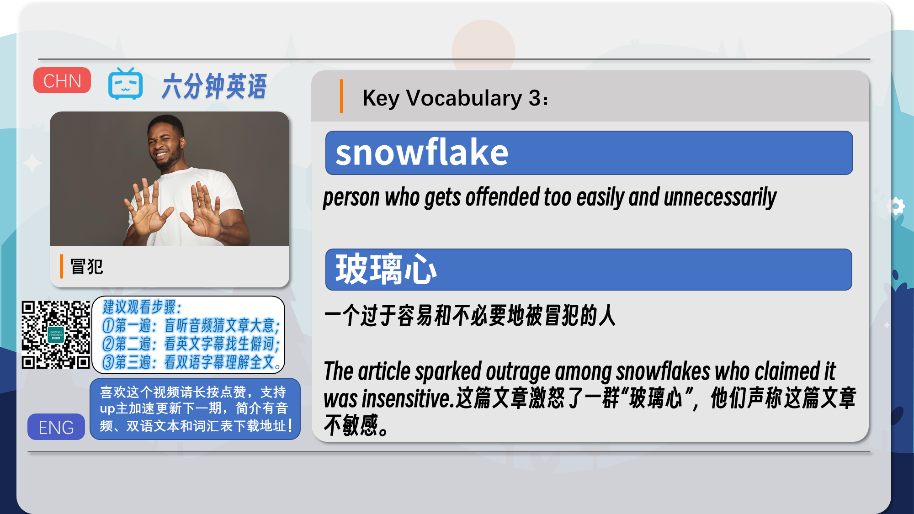
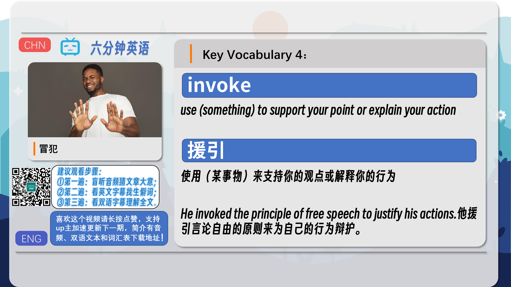
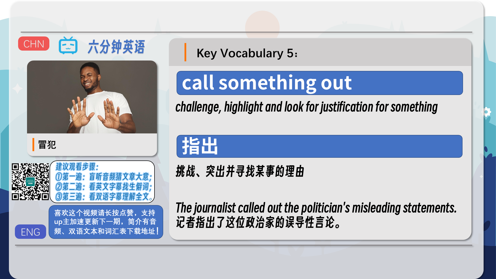
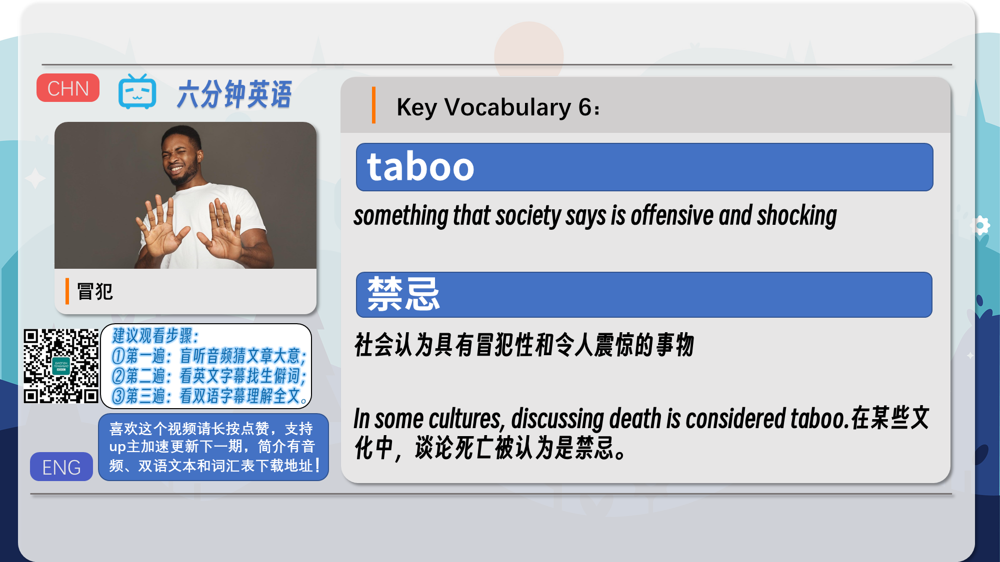
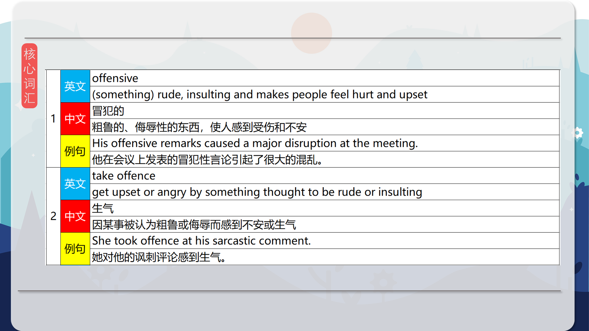
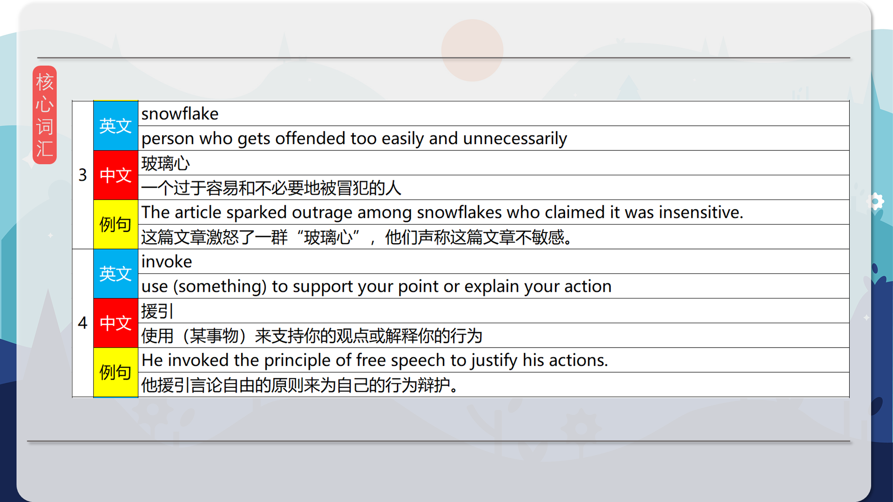
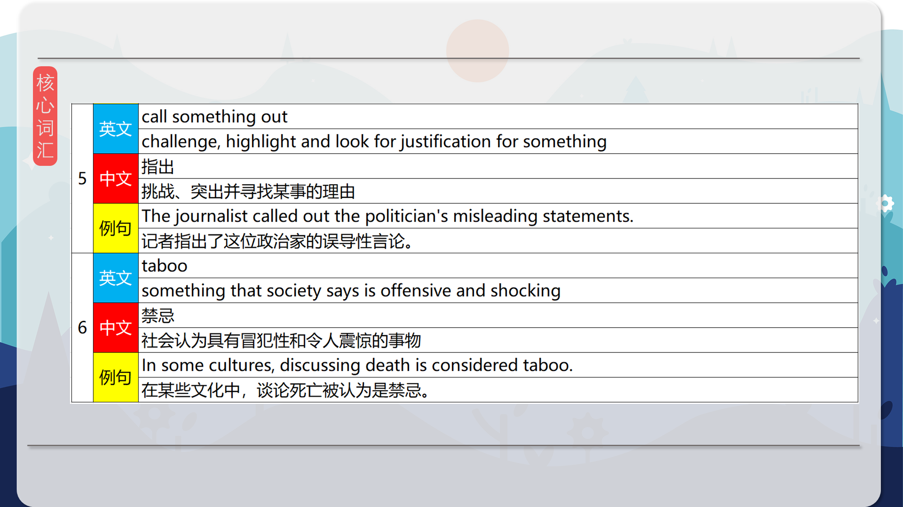
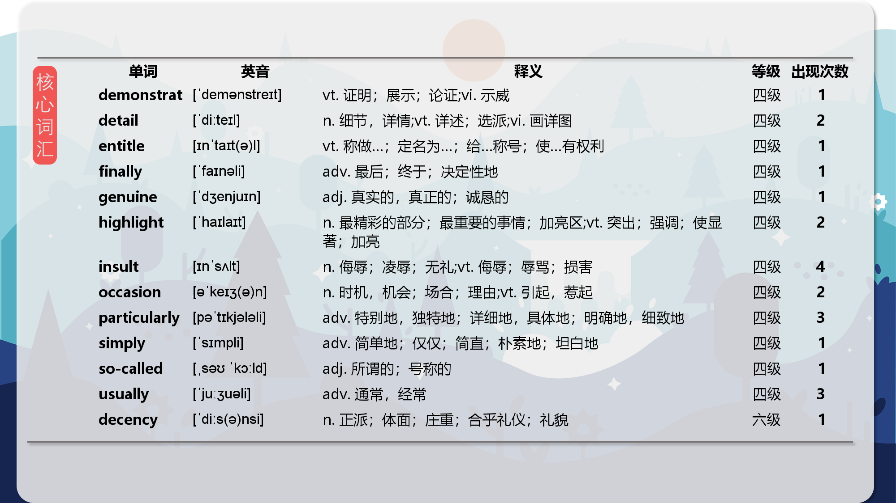
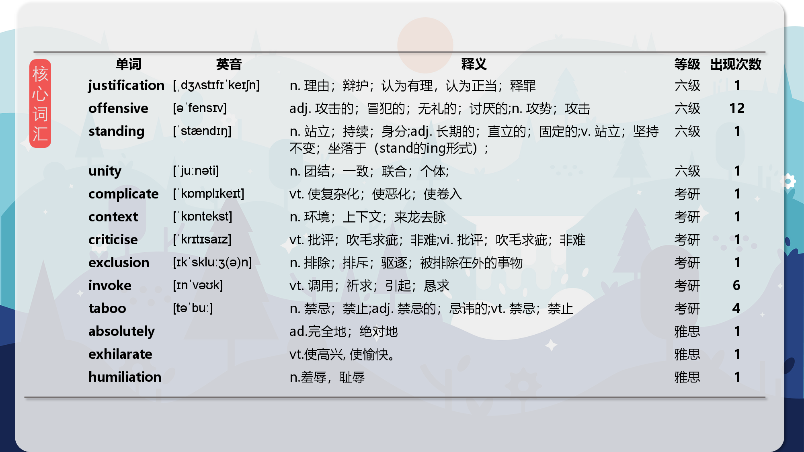
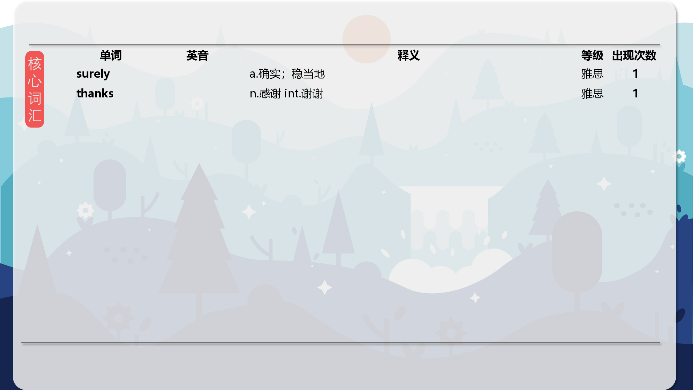

### 【核心词汇】
#### offensive
(something) rude, insulting and makes people feel hurt and upset
冒犯的
粗鲁的、侮辱性的东西，使人感到受伤和不安
His offensive remarks caused a major disruption at the meeting.
他在会议上发表的冒犯性言论引起了很大的混乱。
#### take offence
get upset or angry by something thought to be rude or insulting
生气
因某事被认为粗鲁或侮辱而感到不安或生气
She took offence at his sarcastic comment.
她对他的讽刺评论感到生气。
#### snowflake
person who gets offended too easily and unnecessarily
玻璃心
一个过于容易和不必要地被冒犯的人
The article sparked outrage among snowflakes who claimed it was insensitive.
这篇文章激怒了一群“玻璃心”，他们声称这篇文章不敏感。
#### invoke
use (something) to support your point or explain your action
援引
使用（某事物）来支持你的观点或解释你的行为
He invoked the principle of free speech to justify his actions.
他援引言论自由的原则来为自己的行为辩护。
#### call something out
challenge, highlight and look for justification for something
指出
挑战、突出并寻找某事的理由
The journalist called out the politician's misleading statements.
记者指出了这位政治家的误导性言论。
#### taboo
something that society says is offensive and shocking
禁忌
社会认为具有冒犯性和令人震惊的事物
In some cultures, discussing death is considered taboo.
在某些文化中，谈论死亡被认为是禁忌。

在公众号里输入6位数字，获取【对话音频、英文文本、中文翻译、核心词汇和高级词汇表】电子档，6位数字【暗号】在文章的最后一张图片，如【220728】，表示22年7月28日这一期。公众号没有的文章说明还没有制作相关资料。年度合集在B站【六分钟英语】工房获取，每年共计300+文档，感谢支持！