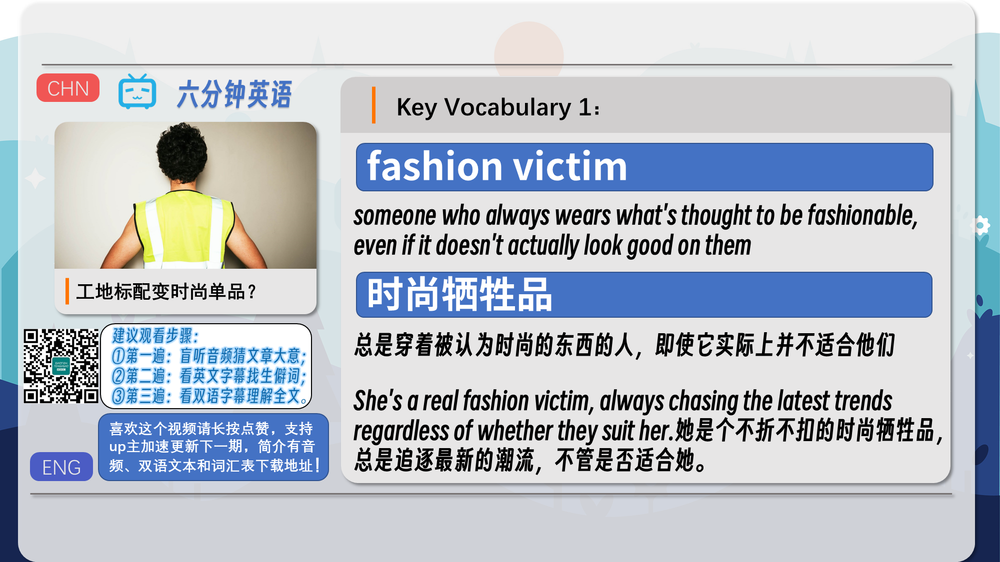
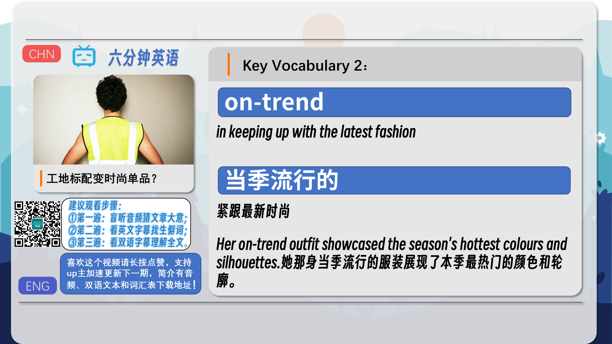
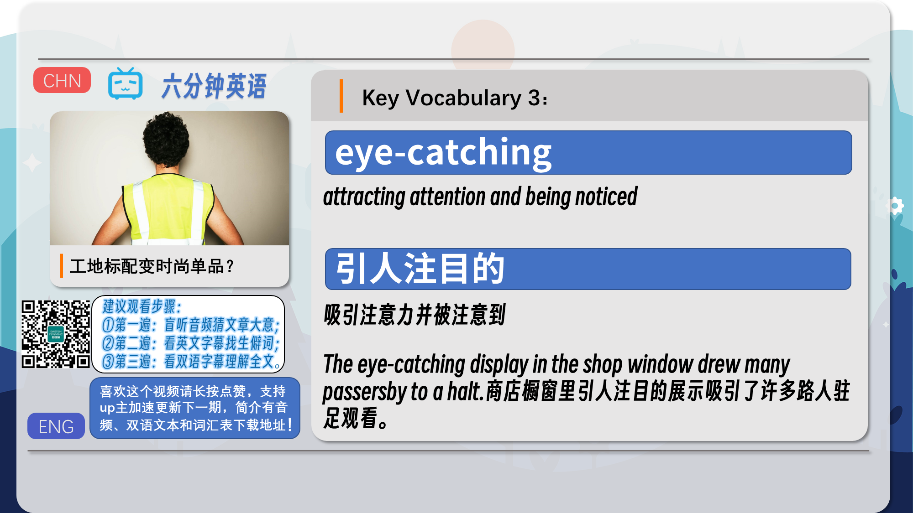
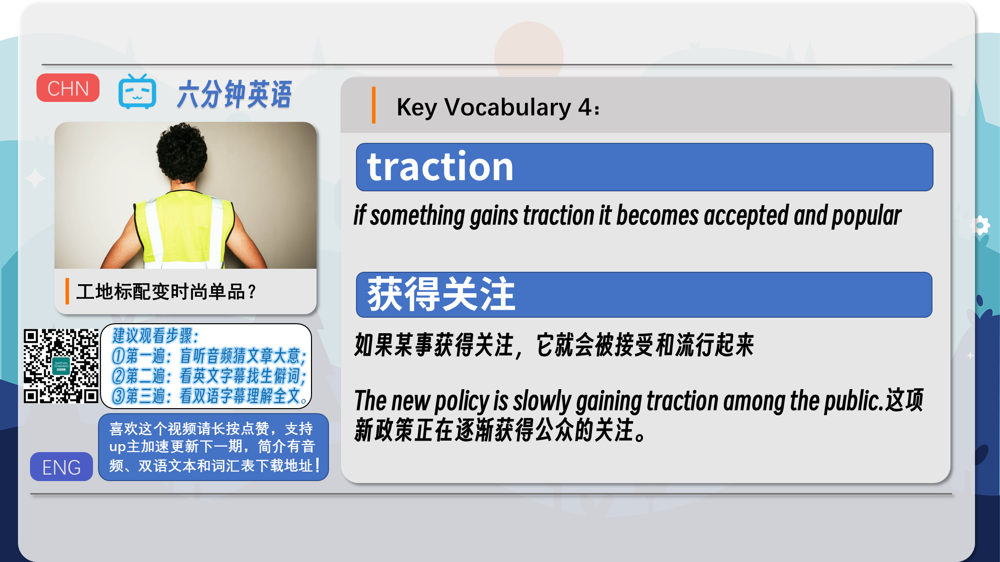
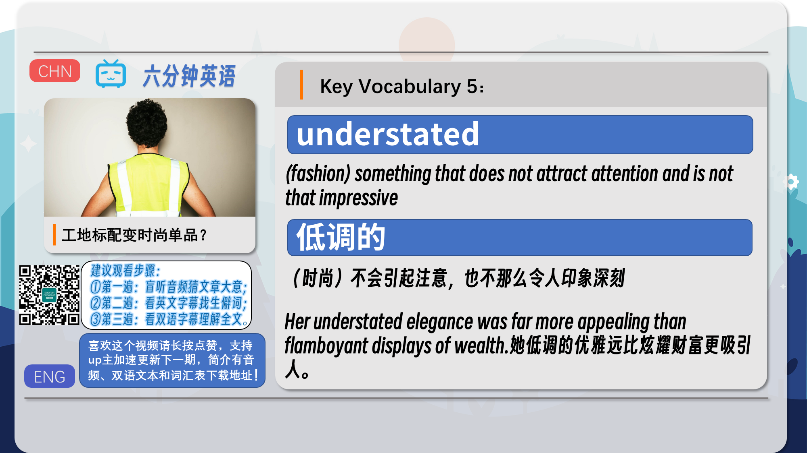
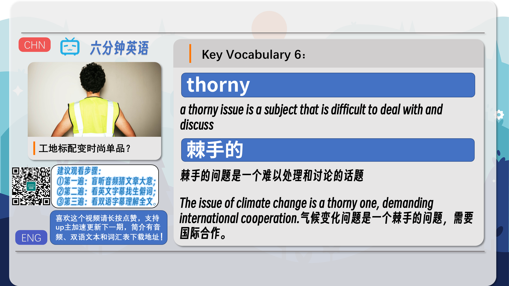
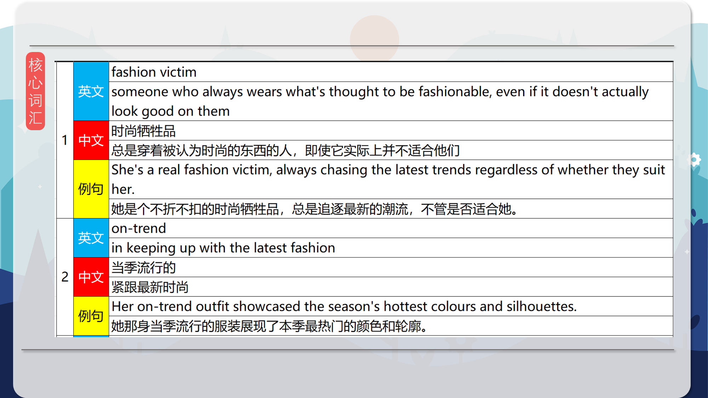
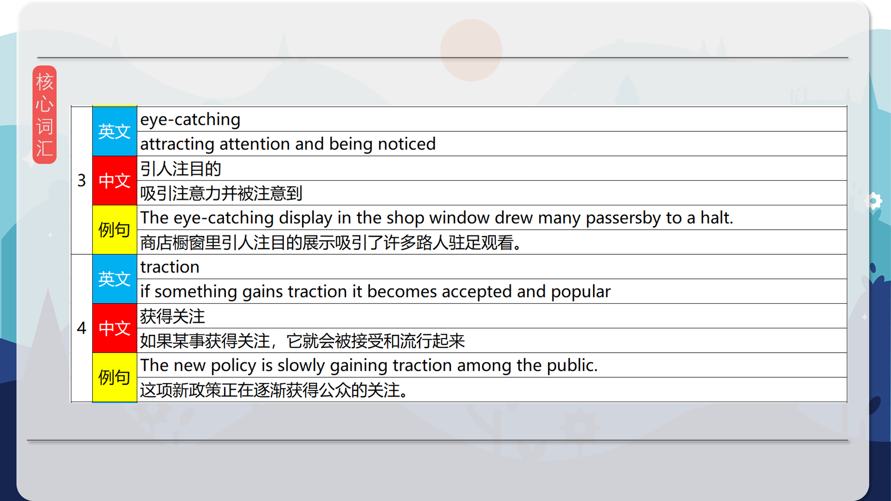
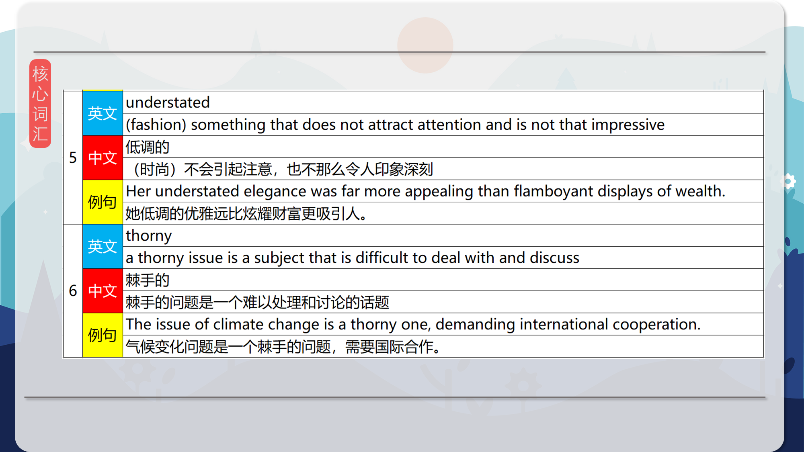

### 【英文脚本】
Neil
Hello. Welcome to 6 Minute English, I'm Neil.

Rob
And I'm Rob.

Neil
Rob, it's good to see you keeping up with fashion by wearing the high-vis jacket – although I have to say it is a bit dazzling.

Rob
Neil, I'm no fashion victim – this high-vis or high-visibility jacket is for safety. I wear it when I'm cycling around London and I've just forgotten to take it off.

Neil
And a fashion victim, by the way, is someone who always wears what's thought to be fashionable, even if it doesn't actually look good on them. But wearing high-vis clothing has become the latest fashion statement – that's something you wear to attract attention and people who know something about fashion.

Rob
Well, I can assure you, I don't wear my bright jacket to look cool but in today's programme we'll be discussing why some people do. But first Neil, have you got a question for us to think about?

Neil
OK, we know that fashions come and go but in which decade were leg warmers worn as a popular fashion accessory? Was it… a) the 1970s; b) the 1980s or c) the 1990s?

Rob
I do remember these so I'll say b) the 1980s.

Neil
Well, we'll reveal the answer at the end of the programme. Now let's talk more about the oddest item of clothing to hit the catwalk this year - the humble hi-vis jacket.

Rob
Yes, they were designed to be worn for safety by people like cyclists and pedestrians and by workers who need to be seen if, for example, they're working in the road or directing traffic. So it's strange to think that now people choose to wear them to be on-trend – that's following the latest fashion.

Neil
Hannah Marriott is the Fashion Editor of the Guardian newspaper. She told the BBC Radio 4 programme You and Yours, why she thought people were turning to bright, luminous clothing. What was the reason?

Hannah Marriott, Fashion Editor, The Guardian
There's also just a trend at the moment for people wearing very bright things, very eye- catching things, it feels that with social media, you know, everyone's scrolling down their Instagram screens at such speed and anything that sort of catches the eye, that seems yeah, like a bit of a talking point, something that's going to get a bit of attention - those kind of trends are getting a bit more traction at the moment - than the sort of understated cashmere jumper kind of fashion.

Rob
So her reason is social media. In our fast-paced lives, we're quickly scrolling through our social media feeds and people want to stand out, attract our attention and be noticed.

Neil
And these attention-seekers need to wear some eye-catching – something that will catch your eye and be noticed. High-vis clothing certainly does that!

Rob
Hannah mentioned that wearing something different creates a talking point – something that you or I may discuss at work or on social media – even if it is to say 'that guys looks ridiculous'! And she also mentions that people are becoming interested in and accepting these kinds of trends – the word she used was traction.

Neil
Traction here means this fashion trend is starting to stick. Of course fashion comes at a price. While an ordinary high-vis vest used for workwear is normally affordable, when they're sold as a fashion item they can go for much higher prices, particularly if they have a designer label showing on the front.

Rob
This raises an important question. We know that many people wearing high-vis jackets are doing important jobs, so does this fashion devalue what they're doing?

Neil
Yes, it's something Hannah Marriott talked about. Let's hear from her again. What word does she use to describe a difficult issue?

Hannah Marriott, Fashion Editor, The Guardian
Every time fashion borrows from workwear, there're always some sort of thorny issues around it - particularly when you're charging £2000 for something that is actually very similar to, you know, a uniform that somebody might be wearing who doesn't actually make that much money, you know, there's obviously some thorny class issues there.

Neil
So she used the word thorny to describe the issue of things worn at work becoming expensive fashion items. Thorny issues are subjects that are difficult deal with. Here she particularly mentioned the issue of class – so different groups of people in society in different economic positions – some can afford clothing for fashion, others can only afford clothing for work.

Rob
And the other issue is that if everyone starts wearing high-vis clothing, then the people who need to stand out for their own safety may not stand out as easily.

Neil
And we wouldn't want to miss you when you're out cycling on your bike, Rob. But would we miss you if you were wearing a pair of leg warmers? Earlier I asked in which decade were leg warmers worn as a popular fashion accessory. Was it… a) the 1970s; b) the 1980s or c) the1990s?

Rob
Yes, and I said b) the 1980s. It's got to be right!

Neil
Well, you know your fashion, Rob – it was indeed the 1980s. Leg warmers were originally worn by dancers to keep their muscles from cramping after stretching, but in the early 1980s they became fashionable for teenage girls to wear.

Rob
OK, let's move on and recap on some of the vocabulary we've mentioned today. Starting with fashion victim – that's someone who always wears what's thought to be fashionable, even if it doesn't actually look good on them. Like that pair of red jeans you used to wear, Neil.

Neil
They, Rob, were on-trend – that means 'in keeping up with the latest fashion'. Of course wearing something red is very eye-catching which means attracting attention and being noticed.

Rob
Next we mentioned traction. If something gains traction it becomes accepted and popular. And then we had understated. In fashion, this describes something that does not attract attention and is not that impressive.

Neil
And then we discussed the word thorny. A tree or bush with thorns is difficult to touch and handle and similarly a thorny issue is a subject that is difficult to deal with and discuss.

Rob
Well, we've covered some thorny and less thorny issues today but we know that fashions change and maybe high-vis fashion won't be here forever.

Neil
That's it for now but please join us next time for 6 Minute English. See you soon. Goodbye.

Rob
Bye bye!

### 【中英文双语脚本】
Neil(尼尔)
Hello. Welcome to 6 Minute English, I'm Neil.
你好。欢迎来到六分钟 English，我是 Neil。

Rob(罗伯)
And I'm Rob.
我是 罗伯。

Neil(尼尔)
Rob, it's good to see you keeping up with fashion by wearing the high-vis jacket – although I have to say it is a bit dazzling.
罗伯，很高兴看到你穿着高可见度夹克跟上时尚 —— 尽管我不得不说它有点令人眼花缭乱。

Rob(罗伯)
Neil, I'm no fashion victim – this high-vis or high-visibility jacket is for safety. I wear it when I'm cycling around London and I've just forgotten to take it off.
Neil，我不是时尚的受害者 —— 这件高可见度或高能见度夹克是为了安全。我在伦敦骑自行车时戴着它，只是忘了摘下它。

Neil(尼尔)
And a fashion victim, by the way, is someone who always wears what's thought to be fashionable, even if it doesn't actually look good on them. But wearing high-vis clothing has become the latest fashion statement – that's something you wear to attract attention and people who know something about fashion.
顺便说一句，时尚受害者是那些总是穿着被认为是时尚的东西的人，即使它实际上在他们身上看起来并不好。但穿着高可见度的衣服已经成为最新的时尚宣言 —— 这是你穿来吸引注意力和对时尚有所了解的人的东西。

Rob(罗伯)
Well, I can assure you, I don't wear my bright jacket to look cool but in today's programme we'll be discussing why some people do. But first Neil, have you got a question for us to think about?
好吧，我可以向你保证，我穿上鲜艳的夹克并不是为了看起来很酷，但在今天的节目中，我们将讨论为什么有些人会这样做。但首先，Neil，您有没有一个问题要我们考虑？

Neil(尼尔)
OK, we know that fashions come and go but in which decade were leg warmers worn as a popular fashion accessory? Was it… a) the 1970s; b) the 1980s or c) the 1990s?
好吧，我们知道时尚来来去去，但是在哪个十年里，暖腿套作为流行的时尚配饰佩戴？是不是......a） 1970 年代；b） 1980 年代还是 c） 1990 年代？

Rob(罗伯)
I do remember these so I'll say b) the 1980s.
我确实记得这些，所以我会说 b） 1980 年代。

Neil(尼尔)
Well, we'll reveal the answer at the end of the programme. Now let's talk more about the oddest item of clothing to hit the catwalk this year - the humble hi-vis jacket.
好吧，我们将在节目结束时揭晓答案。现在让我们更多地谈谈今年 T 台上最奇怪的服装 —— 不起眼的高可见度夹克。

Rob(罗伯)
Yes, they were designed to be worn for safety by people like cyclists and pedestrians and by workers who need to be seen if, for example, they're working in the road or directing traffic. So it's strange to think that now people choose to wear them to be on-trend – that's following the latest fashion.
是的，为了安全起见，它们被设计为供骑自行车的人和行人以及需要在道路上工作或指挥交通的工人佩戴。所以，现在人们选择穿着它们来紧跟潮流，这很奇怪 —— 这是在追随最新的时尚。

Neil(尼尔)
Hannah Marriott is the Fashion Editor of the Guardian newspaper. She told the BBC Radio 4 programme You and Yours, why she thought people were turning to bright, luminous clothing. What was the reason?
Hannah Marriott 是《卫报》的时尚编辑。她告诉 BBC Radio 4 节目 You and Yours，为什么她认为人们会转向明亮、发光的衣服。原因是什么？

Hannah Marriott, Fashion Editor, The Guardian(Hannah Marriott，《卫报》时尚编辑)
There's also just a trend at the moment for people wearing very bright things, very eye- catching things, it feels that with social media, you know, everyone's scrolling down their Instagram screens at such speed and anything that sort of catches the eye, that seems yeah, like a bit of a talking point, something that's going to get a bit of attention - those kind of trends are getting a bit more traction at the moment - than the sort of understated cashmere jumper kind of fashion.
目前还有一种趋势是，人们穿着非常明亮、非常引人注目的衣服，感觉有了社交媒体，你知道的，每个人都以如此快的速度向下滚动他们的 Instagram 屏幕，任何吸引眼球的东西，这似乎是的，就像一个话题，一些会得到一些关注的东西 —— 这些趋势目前越来越受欢迎 —— 而不是那种低调的羊绒毛衣那种时尚。

Rob(罗伯)
So her reason is social media. In our fast-paced lives, we're quickly scrolling through our social media feeds and people want to stand out, attract our attention and be noticed.
所以她的理由是社交媒体。在我们快节奏的生活中，我们快速浏览社交媒体信息，人们希望脱颖而出，吸引我们的注意力并引起注意。

Neil(尼尔)
And these attention-seekers need to wear some eye-catching – something that will catch your eye and be noticed. High-vis clothing certainly does that!
这些寻求关注的人需要穿一些引人注目的衣服 —— 一些会吸引你眼球并被注意到的东西。High-vis 服装当然可以做到这一点！

Rob(罗伯)
Hannah mentioned that wearing something different creates a talking point – something that you or I may discuss at work or on social media – even if it is to say 'that guys looks ridiculous'! And she also mentions that people are becoming interested in and accepting these kinds of trends – the word she used was traction.
Hannah 提到，穿着不同的衣服会成为一个话题 —— 你或我可能会在工作中或社交媒体上讨论的东西 —— 即使是说“那些家伙看起来很荒谬”！她还提到，人们对这类趋势越来越感兴趣并接受 —— 她使用的词是牵引力。

Neil(尼尔)
Traction here means this fashion trend is starting to stick. Of course fashion comes at a price. While an ordinary high-vis vest used for workwear is normally affordable, when they're sold as a fashion item they can go for much higher prices, particularly if they have a designer label showing on the front.
这里的牵引力意味着这种时尚趋势开始流行起来。当然，时尚是有代价的。虽然用于工作服的普通高可见度背心通常价格实惠，但当它们作为时尚单品出售时，它们的价格可能会高得多，特别是如果它们的正面有设计师品牌。

Rob(罗伯)
This raises an important question. We know that many people wearing high-vis jackets are doing important jobs, so does this fashion devalue what they're doing?
这就提出了一个重要的问题。我们知道，许多穿着高可见度夹克的人都在做重要的工作，那么这种时尚是否贬低了他们正在做的事情的价值呢？

Neil(尼尔)
Yes, it's something Hannah Marriott talked about. Let's hear from her again. What word does she use to describe a difficult issue?
是的，这是 Hannah Marriott 谈到的事情。让我们再次听到她的心声。她用什么词来形容一个难题？

Hannah Marriott, Fashion Editor, The Guardian(Hannah Marriott，《卫报》时尚编辑)
Every time fashion borrows from workwear, there're always some sort of thorny issues around it - particularly when you're charging £2000 for something that is actually very similar to, you know, a uniform that somebody might be wearing who doesn't actually make that much money, you know, there's obviously some thorny class issues there.
每次时尚借鉴工作服时，总会有一些棘手的问题 —— 尤其是当你收取 2000 英镑的价格买一件实际上非常相似的东西时，你知道，某人可能穿着的制服实际上赚不到那么多钱，你知道，那里显然存在一些棘手的阶级问题。

Neil(尼尔)
So she used the word thorny to describe the issue of things worn at work becoming expensive fashion items. Thorny issues are subjects that are difficult deal with. Here she particularly mentioned the issue of class – so different groups of people in society in different economic positions – some can afford clothing for fashion, others can only afford clothing for work.
所以她用 thorny 这个词来描述工作时穿的东西变成昂贵的时尚单品的问题。棘手的问题是难以处理的话题。在这里，她特别提到了阶级问题 —— 因此社会上处于不同经济地位的不同群体 —— 有些人买得起时尚服装，有些人只能买得起工作用的衣服。

Rob(罗伯)
And the other issue is that if everyone starts wearing high-vis clothing, then the people who need to stand out for their own safety may not stand out as easily.
另一个问题是，如果每个人都开始穿着高可见度的衣服，那么需要为了自身安全而脱颖而出的人可能不会那么容易脱颖而出。

Neil(尼尔)
And we wouldn't want to miss you when you're out cycling on your bike, Rob. But would we miss you if you were wearing a pair of leg warmers? Earlier I asked in which decade were leg warmers worn as a popular fashion accessory. Was it… a) the 1970s; b) the 1980s or c) the1990s?
当您骑自行车外出时，我们不想错过您，罗伯。但是，如果您穿着一双护腿套，我们会想念您吗？早些时候，我问护腿套是哪十年的流行时尚配饰。是不是......a） 1970 年代；b） 1980 年代还是 c） 1990 年代？

Rob(罗伯)
Yes, and I said b) the 1980s. It's got to be right!
是的，我说的是 b） 1980 年代。它必须是正确的！

Neil(尼尔)
Well, you know your fashion, Rob – it was indeed the 1980s. Leg warmers were originally worn by dancers to keep their muscles from cramping after stretching, but in the early 1980s they became fashionable for teenage girls to wear.
嗯，你知道你的时尚，罗伯 - 那确实是 1980 年代。暖腿套最初是舞者穿着的，以防止她们的肌肉在伸展后抽筋，但在 1980 年代初期，它们成为十几岁女孩穿的时尚。

Rob(罗伯)
OK, let's move on and recap on some of the vocabulary we've mentioned today. Starting with fashion victim – that's someone who always wears what's thought to be fashionable, even if it doesn't actually look good on them. Like that pair of red jeans you used to wear, Neil.
好，让我们继续回顾我们今天提到的一些词汇。从时尚受害者开始 —— 那是总是穿着被认为是时尚的衣服的人，即使它实际上穿在他们身上并不好看。就像你以前穿的那条红色牛仔裤一样，Neil。

Neil(尼尔)
They, Rob, were on-trend – that means 'in keeping up with the latest fashion'. Of course wearing something red is very eye-catching which means attracting attention and being noticed.
他们，罗伯，紧跟潮流 —— 这意味着“跟上最新的时尚”。当然，穿红色衣服非常引人注目，这意味着吸引注意力并被注意到。

Rob(罗伯)
Next we mentioned traction. If something gains traction it becomes accepted and popular. And then we had understated. In fashion, this describes something that does not attract attention and is not that impressive.
接下来我们提到了牵引力。如果某件事获得牵引力，它就会被接受和流行。然后我们就低估了。在时尚界，这描述了不引起注意且不那么令人印象深刻的事物。

Neil(尼尔)
And then we discussed the word thorny. A tree or bush with thorns is difficult to touch and handle and similarly a thorny issue is a subject that is difficult to deal with and discuss.
然后我们讨论了 thorny 这个词。长有荆棘的树木或灌木丛很难触摸和处理，同样，棘手的问题也是一个难以处理和讨论的话题。

Rob(罗伯)
Well, we've covered some thorny and less thorny issues today but we know that fashions change and maybe high-vis fashion won't be here forever.
好吧，我们今天已经讨论了一些棘手和不那么棘手的问题，但我们知道时尚会发生变化，也许高可见度的时尚不会永远存在。

Neil(尼尔)
That's it for now but please join us next time for 6 Minute English. See you soon. Goodbye.
现在就到这里了，但请下次加入我们的六分钟英语。一会见。再见。

Rob(罗伯)
Bye bye!
再见！

### 【核心词汇】
#### fashion victim
someone who always wears what's thought to be fashionable, even if it doesn't actually look good on them
时尚牺牲品
总是穿着被认为时尚的东西的人，即使它实际上并不适合他们
She's a real fashion victim, always chasing the latest trends regardless of whether they suit her.
她是个不折不扣的时尚牺牲品，总是追逐最新的潮流，不管是否适合她。
#### on-trend
in keeping up with the latest fashion
当季流行的
紧跟最新时尚
Her on-trend outfit showcased the season's hottest colours and silhouettes.
她那身当季流行的服装展现了本季最热门的颜色和轮廓。
#### eye-catching
attracting attention and being noticed
引人注目的
吸引注意力并被注意到
The eye-catching display in the shop window drew many passersby to a halt.
商店橱窗里引人注目的展示吸引了许多路人驻足观看。
#### traction
if something gains traction it becomes accepted and popular
获得关注
如果某事获得关注，它就会被接受和流行起来
The new policy is slowly gaining traction among the public.
这项新政策正在逐渐获得公众的关注。
#### understated
(fashion) something that does not attract attention and is not that impressive
低调的
（时尚）不会引起注意，也不那么令人印象深刻
Her understated elegance was far more appealing than flamboyant displays of wealth.
她低调的优雅远比炫耀财富更吸引人。
#### thorny
a thorny issue is a subject that is difficult to deal with and discuss
棘手的
棘手的问题是一个难以处理和讨论的话题
The issue of climate change is a thorny one, demanding international cooperation.
气候变化问题是一个棘手的问题，需要国际合作。

在公众号里输入6位数字，获取【对话音频、英文文本、中文翻译、核心词汇和高级词汇表】电子档，6位数字【暗号】在文章的最后一张图片，如【220728】，表示22年7月28日这一期。公众号没有的文章说明还没有制作相关资料。年度合集在B站【六分钟英语】工房获取，每年共计300+文档，感谢支持！