### 【英文脚本】
Neil
Hello. Welcome to 6 Minute English, I'm Neil.

Rob
And I'm Rob.

Neil
Rob, what generation are you?

Rob
Well what are my choices?

Neil
You can't choose what generation you are, it depends on when you were born.

Rob
Oh, OK then, what are the different generations?

Neil
Well, there are baby boomers, who were born in between the 1940s and the early 1960s. Then there was Generation X, born between the mid1960s and the early 1980s. Then there is Generation Y, also known as millennials, born mid 1980s to late 1990s, and ...

Rob
OK, let me guess, Generation Z? Born in the late nineties or early noughties?

Neil
You're very smart. So, which one are you?

Rob
Ah, that would give away my age wouldn't it! OK, I have to confess I am Generation X. And what about you Neil?

Neil
Yes me too, Generation X. But today we're going to focus on Generation Z, also known as Gen Z. What marks Gen Z in particular is that they are the social media generation. They have never known a time without social media.

Rob
Oh, poor them!

Neil
Mmm, well, that's one view. Other opinions are available. Before we look at Gen-Z in more detail, a question though. No one can quite agree on who first used the term 'social media', but we do know from which decade it came. Was it: a) the 1980s; b) the 1990s c) the noughties, that is the first decade of the 21st Century. Rob, what's your answer?

Rob
Well, come on, it's quite a recent thing. It's got to be c) the noughties.

Neil
We'll find out the answer later in the programme. Now we're going to hear from Hiral Patel who is an analyst for Barclays. She appeared on BBC Radio 4's You and Yours programme and was asked whether there was much difference between millennials and Generation Z. Does she think they are the same or different?

Hiral Patel
Most people view Generation Z as mini-millennials - and that's because there is an obsession with the word 'millennial'. Our research shows that Gen Z are different and they have their own set of values and preferences which consumer brands need to cater for. Our research found that Gen Z are tech-innate, hyper-informed consumers, and extremely savvy. This hyper-connected world that we live in today is a new norm for them.

Neil
So Rob, does Hiral Patel think there is much difference between the two generations?

Rob
Yes, she does. But she comments that not everyone does. Millennial is a term that is used so frequently that many people think it refers to all young people. Gen-Z, she says are not mini-millennials, they are quite different and have their own values and preferences.

Neil
And this is important for consumer brands, for companies who want to sell to this generation. They need to cater for that generation, which means they need to provide goods that Gen Z want.

Rob
And she describes Gen Z as being tech-innate, hyper-informed consumers.

Neil
It's a bit of a mouthful but essentially it means that they are extremely comfortable with modern technology and social media and as a result have a lot of information about what's going on in the world. This makes them savvy.

Rob
And being savvy means being able to understand situations well and make clever decisions because of this knowledge.

Neil
Now I think I'm pretty savvy when it comes to modern connected technology and media, but I didn't grow up with it, it's new. For Gen Z, this level of technology is what is normal, it's all around and always has been, it's their norm, as Hiral Patel put it. Here she is again:

Hiral Patel
Most people view Generation Z as mini-millennials - and that's because there is an obsession with the word 'millennial'. Our research shows that Gen Z are different and they have their own set of values and preferences which consumer brands need to cater for. Our research found that Gen Z are tech-innate, hyper-informed consumers, and extremely savvy. This hyper-connected world that we live in today is a new norm for them.

Neil
Right time to review this week's vocabulary, but first let's have an answer to that quiz. In what decade was the term 'social media' first coined? Was it: a) the 1980s; b) the 1990s c) the noughties What did you say Rob?

Rob
Yeah, well I said c) the noughties.

Neil
You're wrong. Perhaps unsurprisingly, the 1990s is the answer. I'm sure most of you got that one correct. Right, now, the vocabulary.

Rob
Yes this week we've been talking about generations. This is a term used to describe people born in a particular period of time, usually, but not always a period of about 18 to 20 years.

Neil
And we were focussing on Generation Z or Gen Z which includes those born in the early noughties, which is the first decade of the 21st Century from 2000 to 2009.

Rob
The next expression was to cater for. This means to provide something that is needed or wanted for a particular group. And if you are trying to sell something, you need to cater for your target market.

Neil
And if your market is Gen Z you need to be aware that they are tech innate, hyper- informed. They have grown up with connected technology and are very knowledgeable.

Rob
This makes them extremely savvy. This adjective means smart and intelligent. In this context it means they are able to make smart decisions about what to buy because they are connected so many sources of information. And for Gen Z, this level of interaction and connectivity is the norm. It's what is normal, what is usual for them. So where I struggle sometimes with modern life and technology - for Gen Z, it's easy.

Neil
Well that may be true but I'm savvy enough to know that it's time to end the programme. Do join us again next time and remember you can find us on Instagram, Facebook, Twitter, YouTube and of course our website bbclearningenglish.com. And let's not forget our app Rob!

Rob
Download it now. It's free!

Neil
Join us again next time. Goodbye.

Rob
Bye!

### 【中英文双语脚本】
Neil(尼尔)
Hello. Welcome to 6 Minute English, I'm Neil.
你好。欢迎来到六分钟 English，我是 Neil。

Rob(罗伯)
And I'm Rob.
我是 罗伯。

Neil(尼尔)
Rob, what generation are you?
罗伯，你是哪一代人？

Rob(罗伯)
Well what are my choices?
那么我有哪些选择呢？

Neil(尼尔)
You can't choose what generation you are, it depends on when you were born.
你不能选择你是哪一代，这取决于你是什么时候出生的。

Rob(罗伯)
Oh, OK then, what are the different generations?
哦，好吧，有哪些不同的世代呢？

Neil(尼尔)
Well, there are baby boomers, who were born in between the 1940s and the early 1960s. Then there was Generation X, born between the mid1960s and the early 1980s. Then there is Generation Y, also known as millennials, born mid 1980s to late 1990s, and ...
嗯，有婴儿潮一代，他们出生于 1940 年代到 1960 年代初之间。然后是 X 世代，出生于 1960 年代中期至 1980 年代初之间。然后是 Y 世代，也被称为千禧一代，出生于 1980 年代中期至 1990 年代后期，以及......

Rob(罗伯)
OK, let me guess, Generation Z? Born in the late nineties or early noughties?
好吧，让我猜猜，Z 世代？出生于 90 年代末还是 90 年代初？

Neil(尼尔)
You're very smart. So, which one are you?
你很聪明。那么，你是哪一个呢？

Rob(罗伯)
Ah, that would give away my age wouldn't it! OK, I have to confess I am Generation X. And what about you Neil?
啊，那会暴露我的年龄，不是吗！好吧，我不得不承认我是 X 世代。那你呢，尼尔？

Neil(尼尔)
Yes me too, Generation X. But today we're going to focus on Generation Z, also known as Gen Z. What marks Gen Z in particular is that they are the social media generation. They have never known a time without social media.
是的，我也是，X 世代。但今天我们将关注 Z 世代，也称为 Z 世代。Z 世代的特别之处在于他们是社交媒体一代。他们从未经历过没有社交媒体的时代。

Rob(罗伯)
Oh, poor them!
哦，可怜的他们！

Neil(尼尔)
Mmm, well, that's one view. Other opinions are available. Before we look at Gen-Z in more detail, a question though. No one can quite agree on who first used the term 'social media', but we do know from which decade it came. Was it: a) the 1980s; b) the 1990s c) the noughties, that is the first decade of the 21st Century. Rob, what's your answer?
嗯，嗯，这是一种观点。其他意见也可用。在我们更详细地研究 Z 世代之前，有一个问题。没有人能完全同意谁首先使用“社交媒体”这个词，但我们确实知道它来自哪个十年。是：a） 1980 年代；b） 1990 年代 c） 新世纪，即 21 世纪的第一个十年。罗伯，你的答案是什么？

Rob(罗伯)
Well, come on, it's quite a recent thing. It's got to be c) the noughties.
嗯，拜托，这是最近的事情。它必须是 c） 新世纪。

Neil(尼尔)
We'll find out the answer later in the programme. Now we're going to hear from Hiral Patel who is an analyst for Barclays. She appeared on BBC Radio 4's You and Yours programme and was asked whether there was much difference between millennials and Generation Z. Does she think they are the same or different?
我们稍后会在节目中找到答案。现在，我们将听取巴克莱银行分析师 Hiral Patel 的发言。她出现在 BBC Radio 4 的 You and Yours 节目中，并被问及千禧一代和 Z 世代之间是否有太大差异。她认为它们是相同的还是不同的？

Hiral Patel(希拉尔·帕特尔)
Most people view Generation Z as mini-millennials - and that's because there is an obsession with the word 'millennial'. Our research shows that Gen Z are different and they have their own set of values and preferences which consumer brands need to cater for. Our research found that Gen Z are tech-innate, hyper-informed consumers, and extremely savvy. This hyper-connected world that we live in today is a new norm for them.
大多数人将 Z 世代视为迷你千禧一代 —— 那是因为人们对“千禧一代”这个词很着迷。我们的研究表明，Z 世代是不同的，他们有自己的一套价值观和偏好，消费品牌需要迎合这些价值观和偏好。我们的研究发现，Z 世代是天生的技术型、消息灵通的消费者，而且非常精明。我们今天生活的这个高度互联的世界对他们来说是一种新常态。

Neil(尼尔)
So Rob, does Hiral Patel think there is much difference between the two generations?
那么 罗伯，Hiral Patel 认为这两代人之间有很大差异吗？

Rob(罗伯)
Yes, she does. But she comments that not everyone does. Millennial is a term that is used so frequently that many people think it refers to all young people. Gen-Z, she says are not mini-millennials, they are quite different and have their own values and preferences.
是的，她知道。但她评论说，并不是每个人都这样做。千禧一代是一个被频繁使用的术语，以至于许多人认为它指的是所有年轻人。她说，Z 世代不是迷你千禧一代，他们完全不同，有自己的价值观和偏好。

Neil(尼尔)
And this is important for consumer brands, for companies who want to sell to this generation. They need to cater for that generation, which means they need to provide goods that Gen Z want.
这对于消费品牌和想要向这一代销售产品的公司来说非常重要。他们需要迎合这一代人的需求，这意味着他们需要提供 Z 世代想要的商品。

Rob(罗伯)
And she describes Gen Z as being tech-innate, hyper-informed consumers.
她将 Z 世代描述为与生俱来的技术、消息灵通的消费者。

Neil(尼尔)
It's a bit of a mouthful but essentially it means that they are extremely comfortable with modern technology and social media and as a result have a lot of information about what's going on in the world. This makes them savvy.
这有点拗口，但从本质上讲，这意味着他们对现代技术和社交媒体非常满意，因此有很多关于世界上正在发生的事情的信息。这使他们变得精明。

Rob(罗伯)
And being savvy means being able to understand situations well and make clever decisions because of this knowledge.
精明意味着能够很好地理解情况并因为这些知识而做出明智的决定。

Neil(尼尔)
Now I think I'm pretty savvy when it comes to modern connected technology and media, but I didn't grow up with it, it's new. For Gen Z, this level of technology is what is normal, it's all around and always has been, it's their norm, as Hiral Patel put it. Here she is again:
现在我认为我对现代互联技术和媒体非常了解，但我不是伴随着它长大的，它是新的。对于 Z 世代来说，这种技术水平是正常的，正如 Hiral Patel 所说，它无处不在，而且一直都是，这是他们的常态。她又来了：

Hiral Patel(希拉尔·帕特尔)
Most people view Generation Z as mini-millennials - and that's because there is an obsession with the word 'millennial'. Our research shows that Gen Z are different and they have their own set of values and preferences which consumer brands need to cater for. Our research found that Gen Z are tech-innate, hyper-informed consumers, and extremely savvy. This hyper-connected world that we live in today is a new norm for them.
大多数人将 Z 世代视为迷你千禧一代 —— 那是因为人们对“千禧一代”这个词很着迷。我们的研究表明，Z 世代是不同的，他们有自己的一套价值观和偏好，消费品牌需要迎合这些价值观和偏好。我们的研究发现，Z 世代是天生的技术型、消息灵通的消费者，而且非常精明。我们今天生活的这个高度互联的世界对他们来说是一种新常态。

Neil(尼尔)
Right time to review this week's vocabulary, but first let's have an answer to that quiz. In what decade was the term 'social media' first coined? Was it: a) the 1980s; b) the 1990s c) the noughties What did you say Rob?
是时候复习本周的词汇了，但首先让我们来回答一下这个测验。“社交媒体”一词最早是在哪个十年创造的？是：a） 1980 年代；b） 1990 年代 c） 新世纪 你说 罗伯 什么？

Rob(罗伯)
Yeah, well I said c) the noughties.
是的，我说的是 c） 新世纪。

Neil(尼尔)
You're wrong. Perhaps unsurprisingly, the 1990s is the answer. I'm sure most of you got that one correct. Right, now, the vocabulary.
你错了。也许不足为奇，1990 年代就是答案。我相信你们中的大多数人都猜对了。好了，现在，词汇。

Rob(罗伯)
Yes this week we've been talking about generations. This is a term used to describe people born in a particular period of time, usually, but not always a period of about 18 to 20 years.
是的，本周我们一直在谈论几代人。这是一个术语，用于描述在特定时期出生的人，通常但并不总是大约 18 到 20 年。

Neil(尼尔)
And we were focussing on Generation Z or Gen Z which includes those born in the early noughties, which is the first decade of the 21st Century from 2000 to 2009.
我们专注于 Z 世代或 Z 世代，包括出生在二十世纪初的人，即 21 世纪的第一个十年，从 2000 年到 2009 年。

Rob(罗伯)
The next expression was to cater for. This means to provide something that is needed or wanted for a particular group. And if you are trying to sell something, you need to cater for your target market.
下一个表达是迎合。这意味着提供特定群体需要或想要的东西。如果你想卖东西，你需要迎合你的目标市场。

Neil(尼尔)
And if your market is Gen Z you need to be aware that they are tech innate, hyper- informed. They have grown up with connected technology and are very knowledgeable.
如果你的市场是 Z 世代，你需要意识到他们是技术天生的，消息灵通。他们在互联技术中长大，知识渊博。

Rob(罗伯)
This makes them extremely savvy. This adjective means smart and intelligent. In this context it means they are able to make smart decisions about what to buy because they are connected so many sources of information. And for Gen Z, this level of interaction and connectivity is the norm. It's what is normal, what is usual for them. So where I struggle sometimes with modern life and technology - for Gen Z, it's easy.
这使他们非常精明。这个形容词的意思是聪明和聪明。在这种情况下，这意味着他们能够对购买什么做出明智的决定，因为他们连接了如此多的信息来源。对于 Z 世代来说，这种水平的互动和连接是常态。这是正常的，对他们来说是正常的。因此，我有时会与现代生活和技术作斗争 —— 对于 Z 世代来说，这很容易。

Neil(尼尔)
Well that may be true but I'm savvy enough to know that it's time to end the programme. Do join us again next time and remember you can find us on Instagram, Facebook, Twitter, YouTube and of course our website bbclearningenglish.com. And let's not forget our app Rob!
嗯，这可能是真的，但我很精明，知道是时候结束这个项目了。下次请再次加入我们，请记住您可以在 Instagram、Facebook、Twitter、YouTube 上找到我们，当然还有我们的网站 bbclearningenglish.com。别忘了我们的应用节目 罗伯！

Rob(罗伯)
Download it now. It's free!
立即下载。注册完全免费！

Neil(尼尔)
Join us again next time. Goodbye.
下次再来我们。再见。

Rob(罗伯)
Bye!
再见！

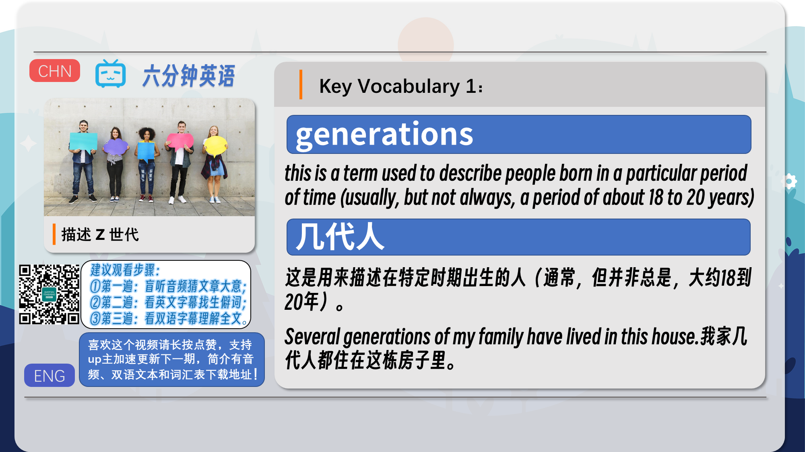
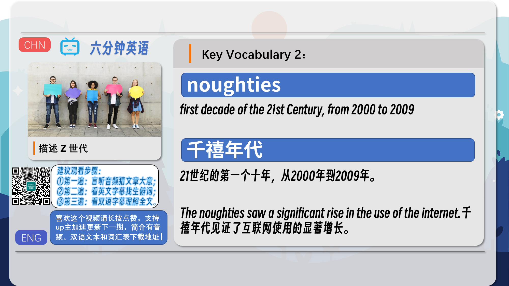
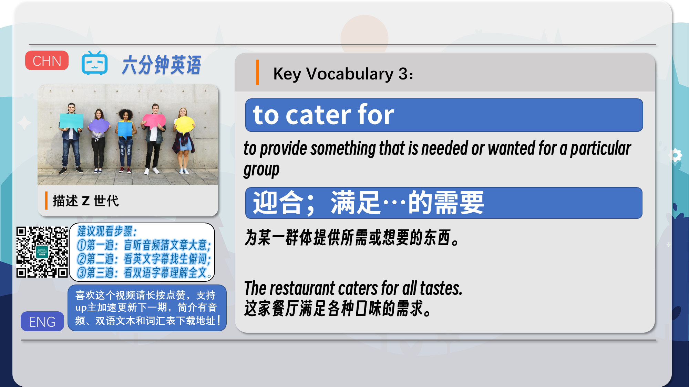
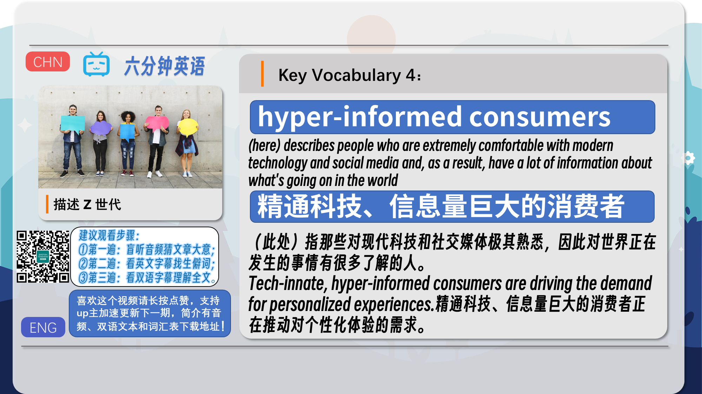
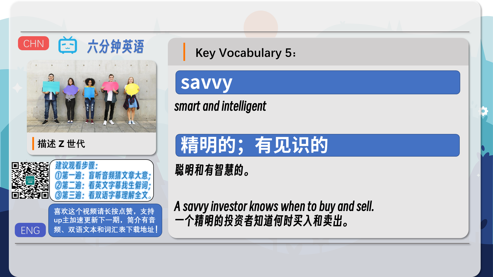
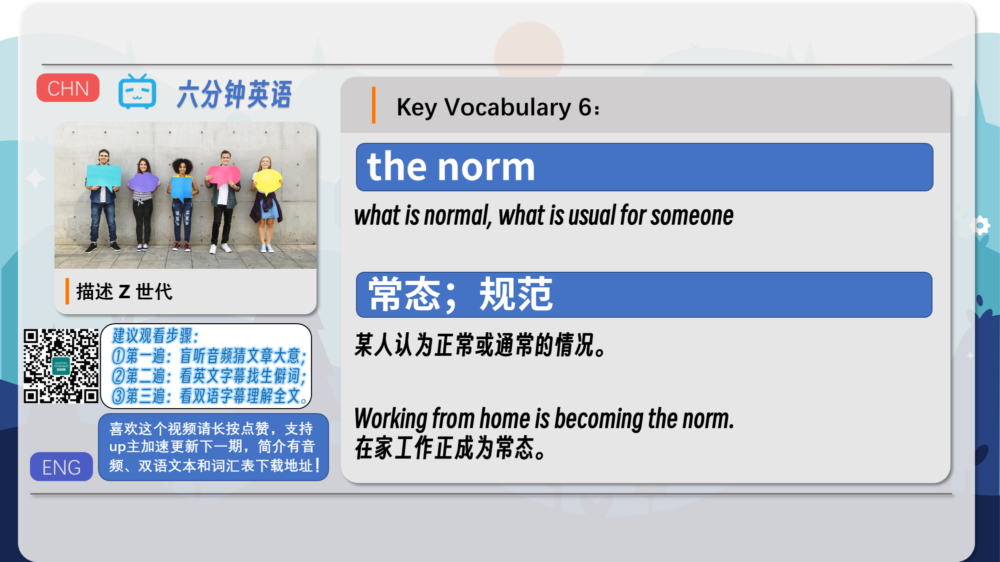
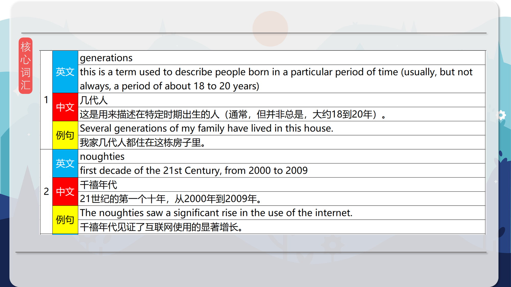
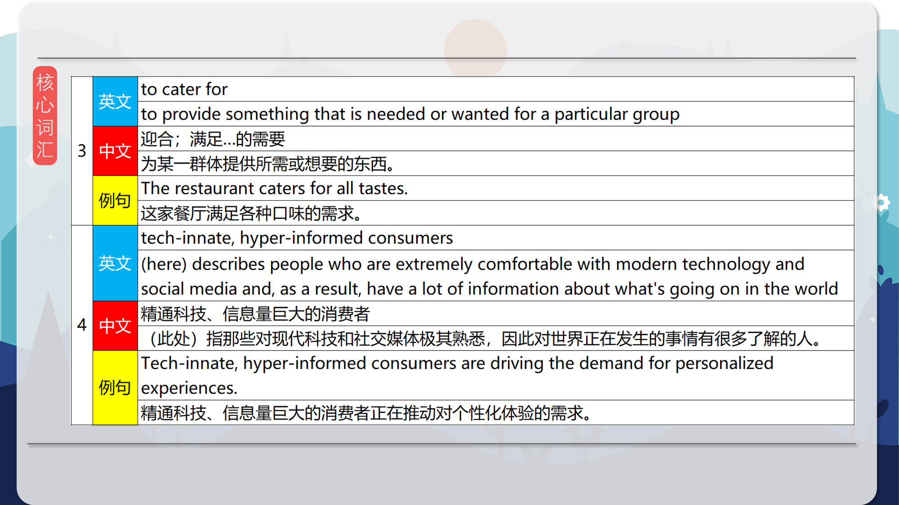
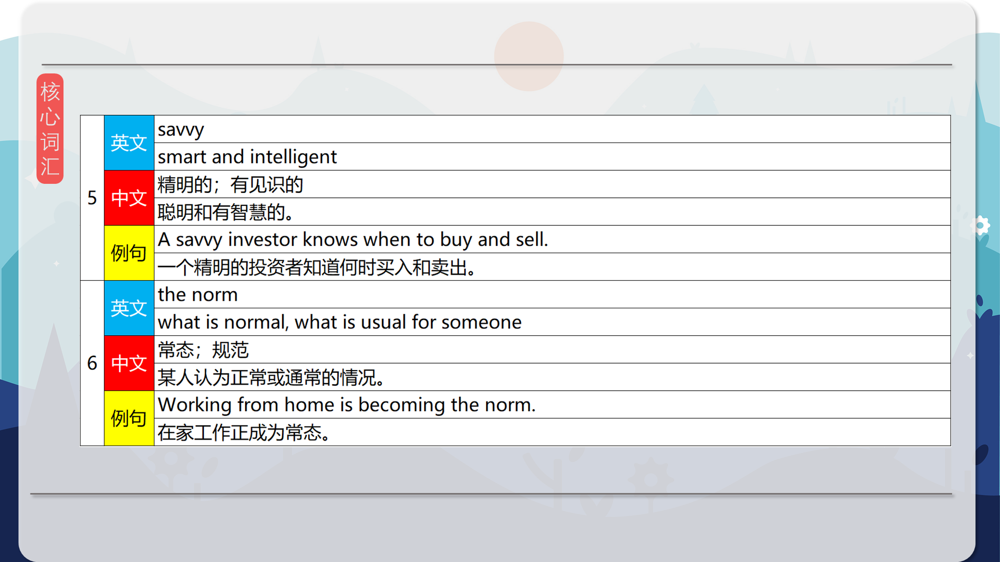
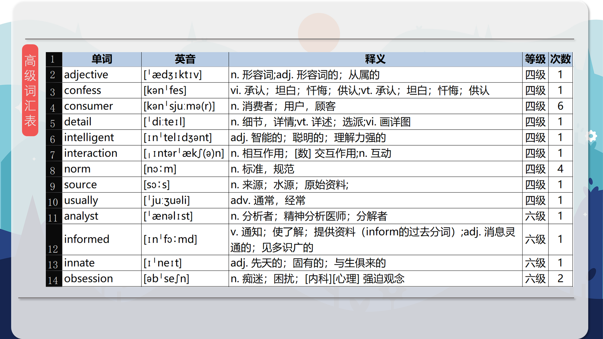
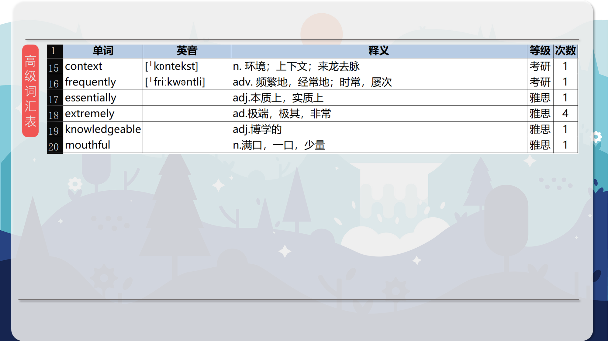

### 【核心词汇】
#### generations
this is a term used to describe people born in a particular period of time (usually, but not always, a period of about 18 to 20 years)
几代人
这是用来描述在特定时期出生的人（通常，但并非总是，大约18到20年）。
Several generations of my family have lived in this house.
我家几代人都住在这栋房子里。
#### noughties
first decade of the 21st Century, from 2000 to 2009
千禧年代
21世纪的第一个十年，从2000年到2009年。
The noughties saw a significant rise in the use of the internet.
千禧年代见证了互联网使用的显著增长。
#### to cater for
to provide something that is needed or wanted for a particular group
迎合；满足…的需要
为某一群体提供所需或想要的东西。
The restaurant caters for all tastes.
这家餐厅满足各种口味的需求。
#### tech-innate, hyper-informed consumers
(here) describes people who are extremely comfortable with modern technology and social media and, as a result, have a lot of information about what's going on in the world
精通科技、信息量巨大的消费者
（此处）指那些对现代科技和社交媒体极其熟悉，因此对世界正在发生的事情有很多了解的人。
Tech-innate, hyper-informed consumers are driving the demand for personalized experiences.
精通科技、信息量巨大的消费者正在推动对个性化体验的需求。
#### savvy
smart and intelligent
精明的；有见识的
聪明和有智慧的。
A savvy investor knows when to buy and sell.
一个精明的投资者知道何时买入和卖出。
#### the norm
what is normal, what is usual for someone
常态；规范
某人认为正常或通常的情况。
Working from home is becoming the norm.
在家工作正成为常态。

在公众号里输入6位数字，获取【对话音频、英文文本、中文翻译、核心词汇和高级词汇表】电子档，6位数字【暗号】在文章的最后一张图片，如【220728】，表示22年7月28日这一期。公众号没有的文章说明还没有制作相关资料。年度合集在B站【六分钟英语】工房获取，每年共计300+文档，感谢支持！