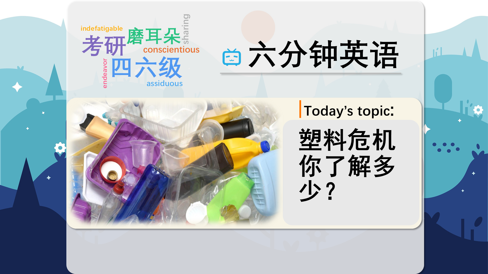

### 【英文脚本】
Neil
Hello, and welcome to 6 Minute English. I'm Neil.

Rob
And hello, I'm Rob.

Neil
Today we're talking about plastic.

Rob
Yes, it's our addiction to plastic that is of concern because this material doesn't decay very quickly, so once we've used it; it hangs around for a very long time.

Neil
It is a problem – and decay, by the way, describes the natural process of something being destroyed or breaking down into small particles. We hear so much about the consequences of having too much waste plastic around, don't we?

Rob
Indeed. Not only does it cause a mess - wildlife, particularly marine animals, are at risk when they become entangled in plastic waste, or ingest it. It's an issue that needs tackling – or dealing with. And that's what we'll be discussing today and finding out what could be done to solve this plastic crisis.

Neil
OK, first, let's challenge you to answer a question about plastic, Rob. The first synthetic plastic – that's plastic made entirely from man-made materials - was created over 100 years ago. Do you know what its brand name was? Was it… a) Bakelite; b) Lucite or c) Formica?

Rob
I'm no expert, so I'll say c) Formica.

Neil
Well, we'll reveal the answer at the end of the programme. Now let's talk more about plastic. This man-mad substance is everywhere - from clothing to crisp packets, and bottles to buckets.

Rob
But the problem is that most of it isn't biodegradable – that's a word that describes something that can decay naturally without harming anything. Each year, 400 million tonnes of plastic is produced and 40% of that is single-use. So why don't we stop using it?

Neil
It's not that easy, Rob, and it's something Lucy Siegle, a BBC reporter and author, has been talking about. She was speaking in a discussion on the Costing the Earth programme on BBC Radio 4, and explained the issue we have with quitting plastic but also how our attitude is changing…

Lucy Siegle, BBC reporter and author
We have this weird psychological attachment to this material that's been around and it's like a push and pull. At the one time, we're so horrified by what we're seeing – the whales dying, the oceans vomiting plastic, beaming in from all over the world, and at the same time we're being told we can't live without it, so that creates a psychological dissonance –which I think is the barrier to behavioural change but I'm finding now awareness has peaked and it's going over into activism.

Rob
She mentioned the word psychological – that's something that affects or involves our mind – so here, psychological attachment means that in our mind we feel we have to use plastic – we're addicted.

Neil
But we also see the negative impact of plastic – like whales dying – and in our mind we're also thinking we must stop! This has created what Lucy says is a 'psychological dissonance' - dissonance means a disagreement between two opposing ideas – so we're having an argument in our head about the right thing to do – this is the 'push and pull' of thoughts she referred to.

Rob
And this dissonance has been the barrier to us trying to solve the plastic issue – but now we're starting to do something about it – we're taking action to reduce our plastic waste – we're turning to activism. That's taking action to change something – it could be social or political change, or a change in our behaviour or attitude.

Neil
Of course there has been a big push – that means people have been strongly encouraged – to recycle.

Rob
Maybe in an ideal world the best thing to do is go plastic-free – but that isn't easy, is it?

Neil
No, it isn't, and it's something Lucy Siegle spoke about. Getting rid of plastic in our lives is a gradual process. But where does she think we can make the biggest difference?

Lucy Siegle, BBC reporter and author
I really think that to concentrate on stopping the flow of plastics into your life is easier and more effective in the long term, than trying to go plastic-free from the outset. We are in the UK, a supermarket culture, so a lot of the tips and tricks to decreasing the flow of plastic are getting round supermarket culture.

Rob
She says we have a supermarket culture in the UK. Culture here describes a way of life – or a way that we generally behave – and in terms of food shopping, we tend to do that in supermarkets.

Neil
So, for example, customers can make a big difference by putting pressure on supermarkets to use less plastic packaging. It does seem that the future of plastic is in our hands – we need to be more careful about how and when we use it – and use our collective power to force change if it's needed.

Rob
But there's no doubt plastic is useful for many things so it will be a long time before it disappears altogether.

Neil
And earlier I asked you what was the name of the first synthetic plastic, invented over a 100 years ago. Was it… a) Bakelite; b) Lucite or c) Formica?

Rob
And I said c) Formica. Was I right?

Neil
Formica is a type of hard plastic used for covering tables and working areas in kitchens – but it's not the oldest type. That was Bakelite.

Rob
I may have got that wrong but hopefully I'll have more success recapping some of today's vocabulary – starting with decay, which describes the natural process of something being destroyed or breaking down into small particles – which plastic takes a long time to do.

Neil
Next we had biodegradable – that's a word to describe something that can decay naturally without harming anything.

Rob
Then we had psychological – that's something that affects or involves your mind.

Neil
Next up, we had dissonance, which describes a disagreement between two opposing ideas.

Rob
And then we mentioned activism - that's taking action to change something. We also mentioned the phrase a big push which means people are strongly encouraged or persuaded to do something, usefully by force.

Neil
And finally we had culture. In our context of supermarket culture, it describes a way of life – or a way that we generally behave.

Rob
Thanks, Neil. Now, remember you can find more learning English programmes and materials on our website bbclearningenglish.com. That's it for now but please join us next time for 6 Minute English. Goodbye.

Neil
Goodbye.

### 【中英文双语脚本】
Neil(尼尔)
Hello, and welcome to 6 Minute English. I'm Neil.
您好，欢迎来到六分钟 English。我是 Neil。

Rob(罗伯)
And hello, I'm Rob.
大家好，我是 罗伯。

Neil(尼尔)
Today we're talking about plastic.
今天我们谈论的是塑料。

Rob(罗伯)
Yes, it's our addiction to plastic that is of concern because this material doesn't decay very quickly, so once we've used it; it hangs around for a very long time.
是的，我们对塑料的依赖令人担忧，因为这种材料不会很快腐烂，所以一旦我们用过它；它会存在很长时间。

Neil(尼尔)
It is a problem – and decay, by the way, describes the natural process of something being destroyed or breaking down into small particles. We hear so much about the consequences of having too much waste plastic around, don't we?
这是一个问题 —— 顺便说一句，衰变描述了某物被破坏或分解成小颗粒的自然过程。我们听到了很多关于周围有太多废塑料的后果，不是吗？

Rob(罗伯)
Indeed. Not only does it cause a mess - wildlife, particularly marine animals, are at risk when they become entangled in plastic waste, or ingest it. It's an issue that needs tackling – or dealing with. And that's what we'll be discussing today and finding out what could be done to solve this plastic crisis.
事实上。它不仅会造成混乱 —— 野生动物，尤其是海洋动物，当它们被塑料垃圾缠住或摄入时，它们就会处于危险之中。这是一个需要解决或处理的问题。这就是我们今天要讨论的内容，并找出可以做些什么来解决这场塑料危机。

Neil(尼尔)
OK, first, let's challenge you to answer a question about plastic, Rob. The first synthetic plastic – that's plastic made entirely from man-made materials - was created over 100 years ago. Do you know what its brand name was? Was it… a) Bakelite; b) Lucite or c) Formica?
好的，首先，让我们挑战您回答一个关于塑料的问题，罗伯。第一种合成塑料 - 完全由人造材料制成的塑料 - 是在 100 多年前创造的。你知道它的品牌名称是什么吗？是不是......a） 电木；b） 有机玻璃还是 c） 富美家？

Rob(罗伯)
I'm no expert, so I'll say c) Formica.
我不是专家，所以我会说 c） 富美家。

Neil(尼尔)
Well, we'll reveal the answer at the end of the programme. Now let's talk more about plastic. This man-mad substance is everywhere - from clothing to crisp packets, and bottles to buckets.
好吧，我们将在节目结束时揭晓答案。现在让我们更多地谈谈塑料。这种让人疯狂的物质无处不在 —— 从衣服到薯片包，从瓶子到桶。

Rob(罗伯)
But the problem is that most of it isn't biodegradable – that's a word that describes something that can decay naturally without harming anything. Each year, 400 million tonnes of plastic is produced and 40% of that is single-use. So why don't we stop using it?
但问题是，其中大部分是不可生物降解的 —— 这个词用来描述可以自然腐烂而不会伤害任何东西的东西。每年生产 4 亿吨塑料，其中 40% 是一次性塑料。那么，我们为什么不停止使用它呢？

Neil(尼尔)
It's not that easy, Rob, and it's something Lucy Siegle, a BBC reporter and author, has been talking about. She was speaking in a discussion on the Costing the Earth programme on BBC Radio 4, and explained the issue we have with quitting plastic but also how our attitude is changing…
这并不容易，罗伯，这是 BBC 记者兼作家 Lucy Sigle 一直在谈论的事情。她在 BBC Radio 4 的 Costing the Earth 节目的讨论中发表了讲话，并解释了我们戒除塑料的问题，以及我们的态度是如何改变的......

Lucy Siegle, BBC reporter and author(露西·西格尔，BBC记者兼作家)
We have this weird psychological attachment to this material that's been around and it's like a push and pull. At the one time, we're so horrified by what we're seeing – the whales dying, the oceans vomiting plastic, beaming in from all over the world, and at the same time we're being told we can't live without it, so that creates a psychological dissonance –which I think is the barrier to behavioural change but I'm finding now awareness has peaked and it's going over into activism.
我们对这种一直存在的材料有一种奇怪的心理依恋，它就像一种推拉。曾经，我们对所看到的感到非常震惊 —— 鲸鱼死亡，海洋吐出塑料，从世界各地涌入，与此同时，我们被告知我们不能没有它，所以这造成了心理上的不和谐 —— 我认为这是行为改变的障碍，但我发现现在意识已经达到顶峰，并且正在转变为行动主义。

Rob(罗伯)
She mentioned the word psychological – that's something that affects or involves our mind – so here, psychological attachment means that in our mind we feel we have to use plastic – we're addicted.
她提到了心理这个词 – 这是影响或涉及我们思想的东西 – 所以在这里，心理依恋意味着在我们的思想中，我们觉得我们必须使用塑料 – 我们上瘾了。

Neil(尼尔)
But we also see the negative impact of plastic – like whales dying – and in our mind we're also thinking we must stop! This has created what Lucy says is a 'psychological dissonance' - dissonance means a disagreement between two opposing ideas – so we're having an argument in our head about the right thing to do – this is the 'push and pull' of thoughts she referred to.
但我们也看到了塑料的负面影响 —— 就像鲸鱼死亡一样 —— 在我们心中，我们也在想我们必须停止！这造成了露西所说的“心理失调” —— 不调是指两个对立的想法之间的分歧 —— 所以我们在脑海中争论如何做 —— 这就是她提到的思想的“推拉”。

Rob(罗伯)
And this dissonance has been the barrier to us trying to solve the plastic issue – but now we're starting to do something about it – we're taking action to reduce our plastic waste – we're turning to activism. That's taking action to change something – it could be social or political change, or a change in our behaviour or attitude.
这种不和谐一直是我们试图解决塑料问题的障碍 —— 但现在我们开始采取行动 —— 我们正在采取行动减少塑料垃圾 —— 我们正在转向行动主义。这就是采取行动来改变某事 —— 它可以是社会或政治变化，或者是我们行为或态度的改变。

Neil(尼尔)
Of course there has been a big push – that means people have been strongly encouraged – to recycle.
当然，已经有很大的推动力 —— 这意味着人们受到了强烈的鼓励 —— 回收利用。

Rob(罗伯)
Maybe in an ideal world the best thing to do is go plastic-free – but that isn't easy, is it?
也许在理想情况下，最好的办法是无塑料 —— 但这并不容易，不是吗？

Neil(尼尔)
No, it isn't, and it's something Lucy Siegle spoke about. Getting rid of plastic in our lives is a gradual process. But where does she think we can make the biggest difference?
不，不是，这是 Lucy Siegle 谈到的事情。在我们的生活中摆脱塑料是一个循序渐进的过程。但她认为我们可以在哪些方面做出最大的改变呢？

Lucy Siegle, BBC reporter and author(露西·西格尔，BBC记者兼作家)
I really think that to concentrate on stopping the flow of plastics into your life is easier and more effective in the long term, than trying to go plastic-free from the outset. We are in the UK, a supermarket culture, so a lot of the tips and tricks to decreasing the flow of plastic are getting round supermarket culture.
我真的认为，从长远来看，专注于阻止塑料流入您的生活比从一开始就尝试无塑料更容易、更有效。我们身处英国，拥有一种超市文化，因此许多减少塑料流动的技巧和窍门都在超市文化中得到传播。

Rob(罗伯)
She says we have a supermarket culture in the UK. Culture here describes a way of life – or a way that we generally behave – and in terms of food shopping, we tend to do that in supermarkets.
她说我们在英国有一种超市文化。这里的文化描述了一种生活方式 —— 或者我们通常的行为方式 —— 就食品购买而言，我们倾向于在超市里这样做。

Neil(尼尔)
So, for example, customers can make a big difference by putting pressure on supermarkets to use less plastic packaging. It does seem that the future of plastic is in our hands – we need to be more careful about how and when we use it – and use our collective power to force change if it's needed.
因此，例如，客户可以通过向超市施加压力，要求他们减少使用塑料包装，从而产生很大的不同。塑料的未来似乎确实掌握在我们手中 —— 我们需要更加谨慎地使用塑料的方式和时间 —— 并在需要时利用我们的集体力量来推动变革。

Rob(罗伯)
But there's no doubt plastic is useful for many things so it will be a long time before it disappears altogether.
但毫无疑问，塑料对很多东西都有用，所以它完全消失还需要很长时间。

Neil(尼尔)
And earlier I asked you what was the name of the first synthetic plastic, invented over a 100 years ago. Was it… a) Bakelite; b) Lucite or c) Formica?
早些时候，我问你 100 多年前发明的第一种合成塑料叫什么名字。是不是......a） 电木；b） 有机玻璃还是 c） 富美家？

Rob(罗伯)
And I said c) Formica. Was I right?
我说 c） 富美家。我是对的吗？

Neil(尼尔)
Formica is a type of hard plastic used for covering tables and working areas in kitchens – but it's not the oldest type. That was Bakelite.
富美家是一种用于覆盖厨房桌子和工作区域的硬塑料 —— 但它并不是最古老的类型。那就是电木。

Rob(罗伯)
I may have got that wrong but hopefully I'll have more success recapping some of today's vocabulary – starting with decay, which describes the natural process of something being destroyed or breaking down into small particles – which plastic takes a long time to do.
我可能弄错了，但希望我能更成功地重述今天的一些词汇 —— 从衰变开始，它描述了某物被破坏或分解成小颗粒的自然过程 —— 塑料需要很长时间才能完成。

Neil(尼尔)
Next we had biodegradable – that's a word to describe something that can decay naturally without harming anything.
接下来是可生物降解的 —— 这个词用来描述可以自然腐烂而不会伤害任何东西的东西。

Rob(罗伯)
Then we had psychological – that's something that affects or involves your mind.
然后我们有了心理 – 这是影响或涉及你的思想的东西。

Neil(尼尔)
Next up, we had dissonance, which describes a disagreement between two opposing ideas.
接下来，我们有 Dissonance，它描述了两个对立想法之间的分歧。

Rob(罗伯)
And then we mentioned activism - that's taking action to change something. We also mentioned the phrase a big push which means people are strongly encouraged or persuaded to do something, usefully by force.
然后我们提到了行动主义 —— 即采取行动来改变某些事情。我们还提到了 a big push 这个词，意思是人们被强烈鼓励或说服去做某事，通过武力做某事。

Neil(尼尔)
And finally we had culture. In our context of supermarket culture, it describes a way of life – or a way that we generally behave.
最后，我们有了文化。在我们超市文化的背景下，它描述了一种生活方式 —— 或者我们通常的行为方式。

Rob(罗伯)
Thanks, Neil. Now, remember you can find more learning English programmes and materials on our website bbclearningenglish.com. That's it for now but please join us next time for 6 Minute English. Goodbye.
谢谢，Neil。现在，请记住，您可以在我们的网站上找到更多学习英语的节目和材料 bbclearningenglish.com。现在就到这里了，但请下次加入我们的六分钟英语。再见。

Neil(尼尔)
Goodbye.
再见。

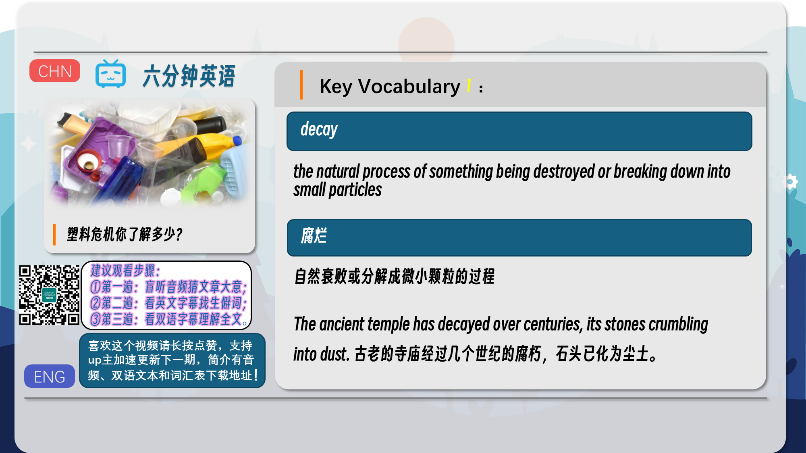
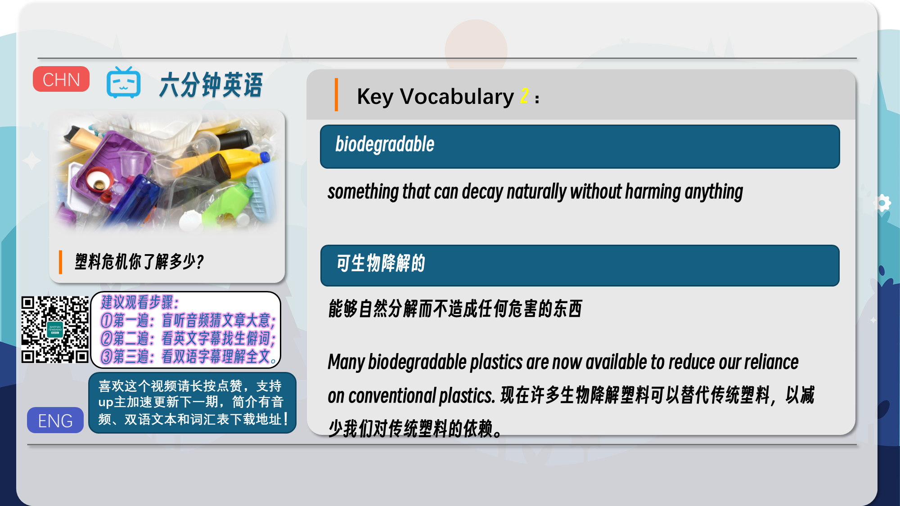
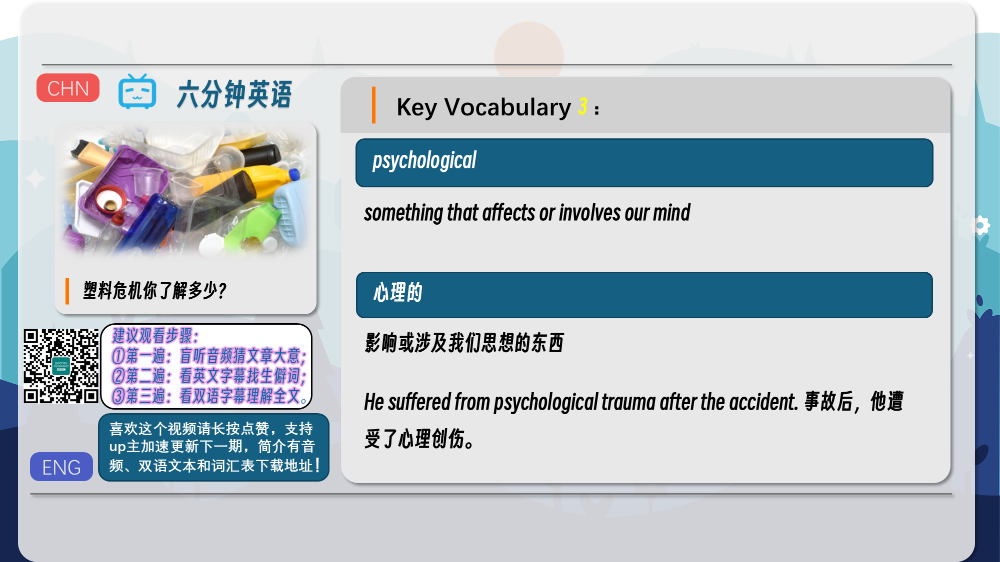
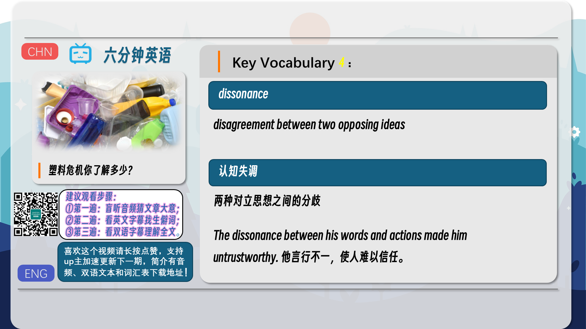
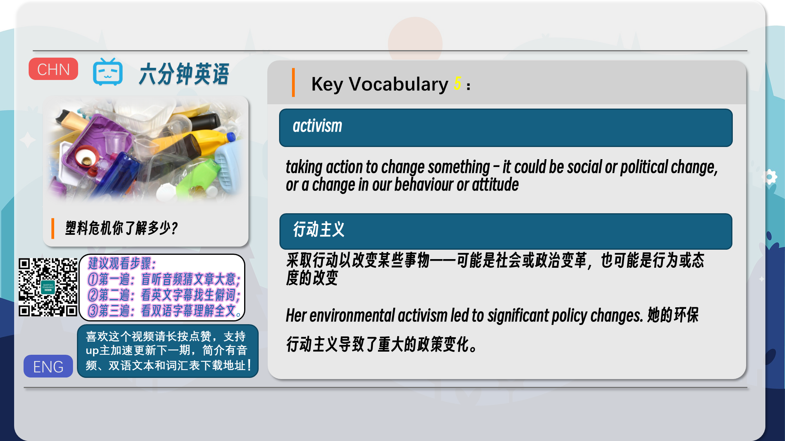
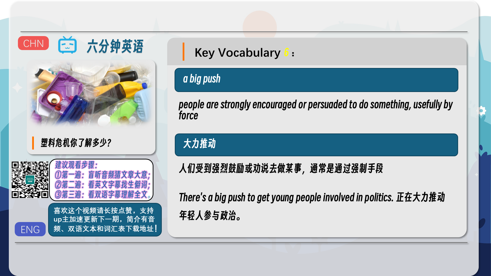
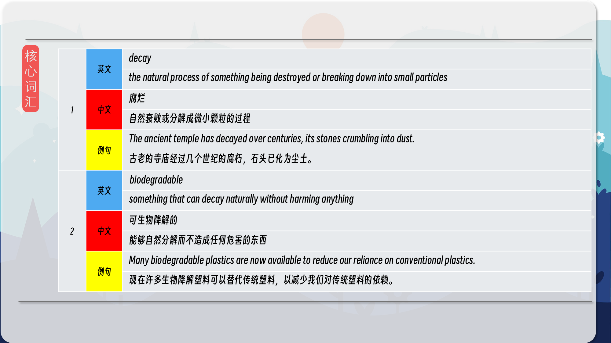
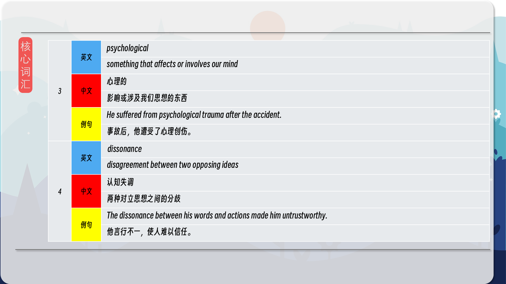
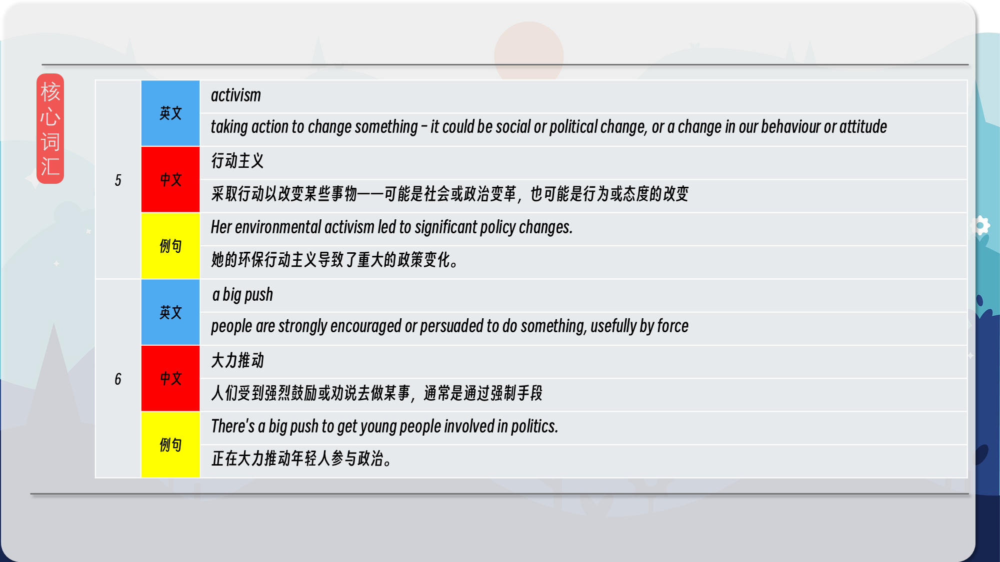
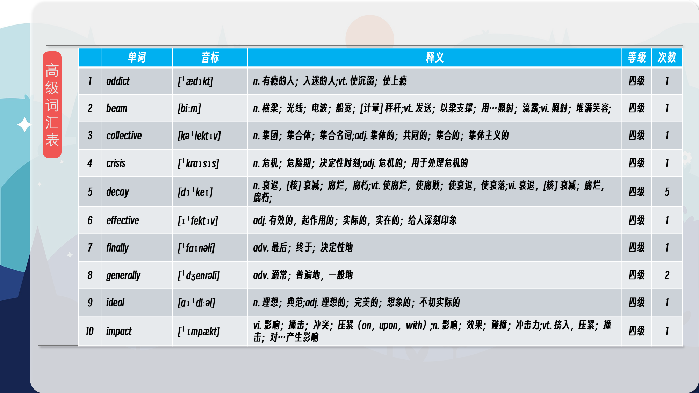
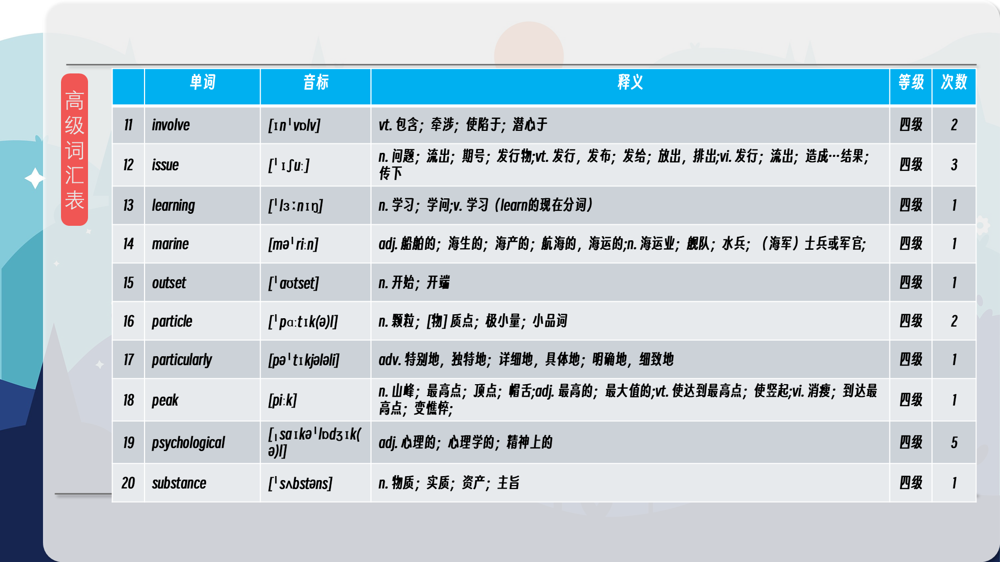
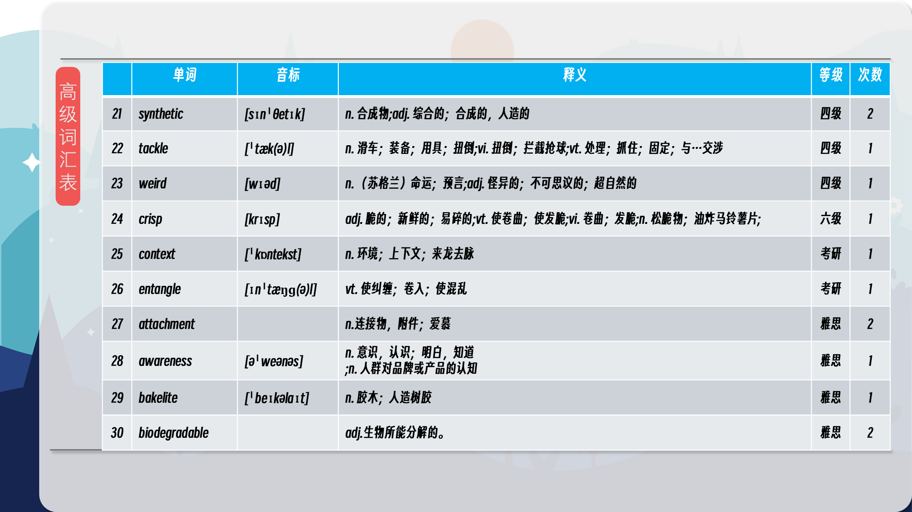
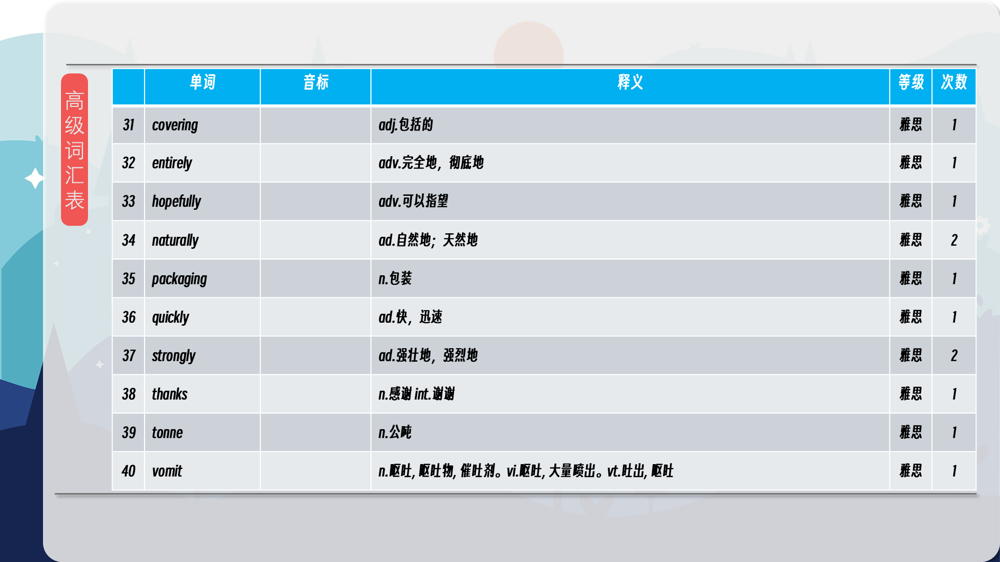

### 【核心词汇】
#### decay
the natural process of something being destroyed or breaking down into small particles
腐烂
自然衰败或分解成微小颗粒的过程
The ancient temple has decayed over centuries, its stones crumbling into dust.
古老的寺庙经过几个世纪的腐朽，石头已化为尘土。
#### biodegradable
something that can decay naturally without harming anything
可生物降解的
能够自然分解而不造成任何危害的东西
Many biodegradable plastics are now available to reduce our reliance on conventional plastics.
现在许多生物降解塑料可以替代传统塑料，以减少我们对传统塑料的依赖。
#### psychological
something that affects or involves our mind
心理的
影响或涉及我们思想的东西
He suffered from psychological trauma after the accident.
事故后，他遭受了心理创伤。
#### dissonance
disagreement between two opposing ideas
认知失调
两种对立思想之间的分歧
The dissonance between his words and actions made him untrustworthy.
他言行不一，使人难以信任。
#### activism
taking action to change something – it could be social or political change, or a change in our behaviour or attitude
行动主义
采取行动以改变某些事物——可能是社会或政治变革，也可能是行为或态度的改变
Her environmental activism led to significant policy changes.
她的环保行动主义导致了重大的政策变化。
#### a big push
people are strongly encouraged or persuaded to do something, usefully by force
大力推动
人们受到强烈鼓励或劝说去做某事，通常是通过强制手段
There's a big push to get young people involved in politics.
正在大力推动年轻人参与政治。

在公众号里输入6位数字，获取【对话音频、英文文本、中文翻译、核心词汇和高级词汇表】电子档，6位数字【暗号】在文章的最后一张图片，如【220728】，表示22年7月28日这一期。公众号没有的文章说明还没有制作相关资料。年度合集在B站【六分钟英语】工房获取，每年共计300+文档，感谢支持！