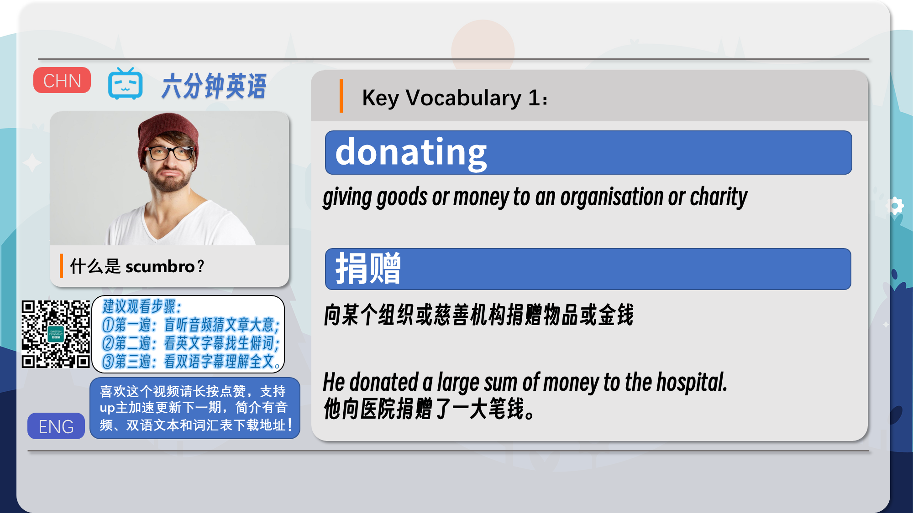
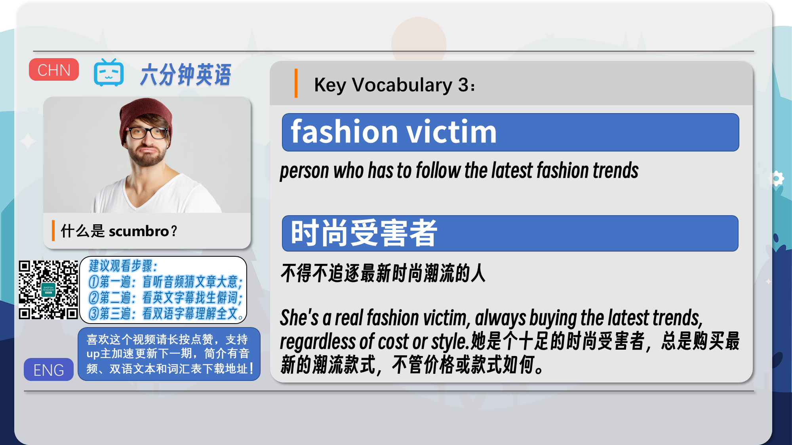
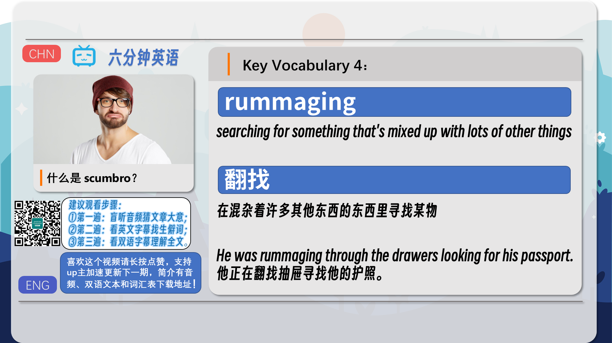
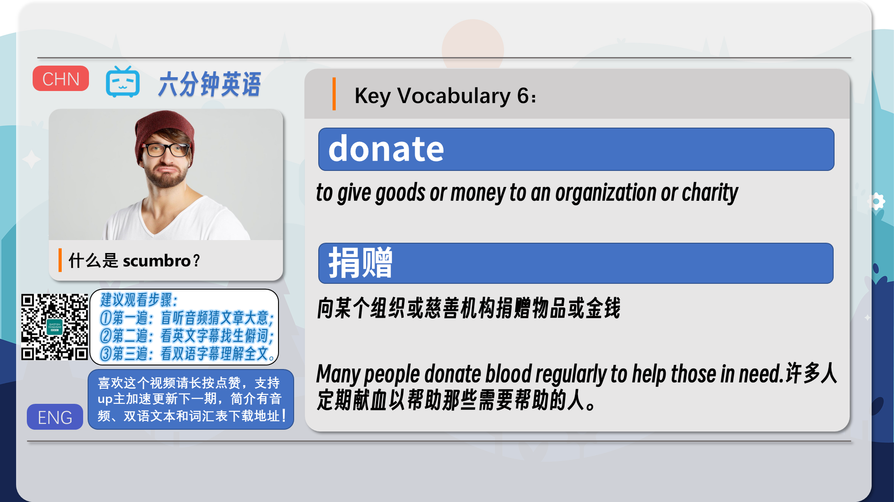
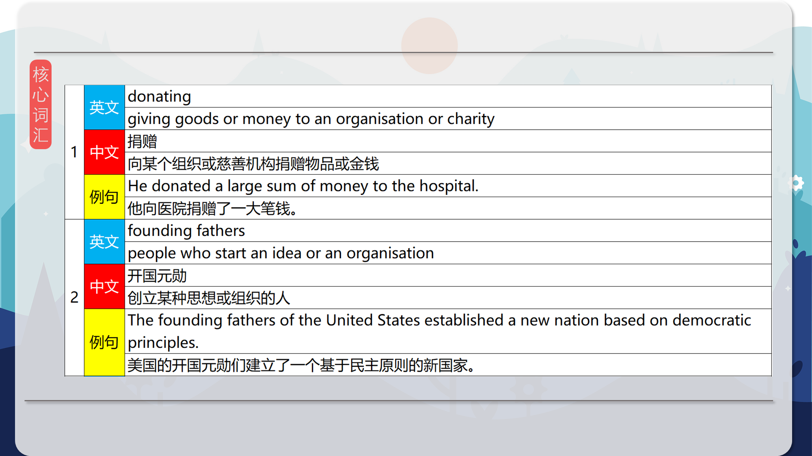
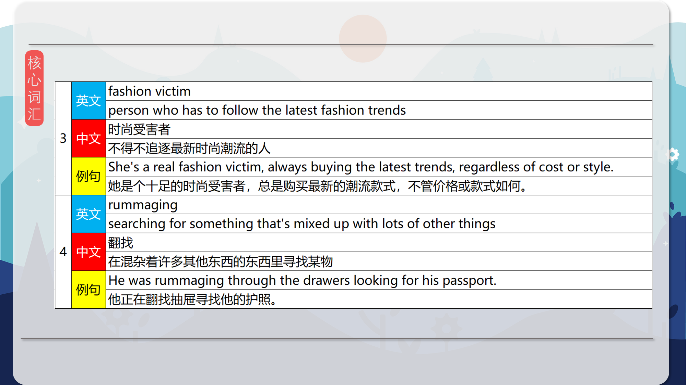
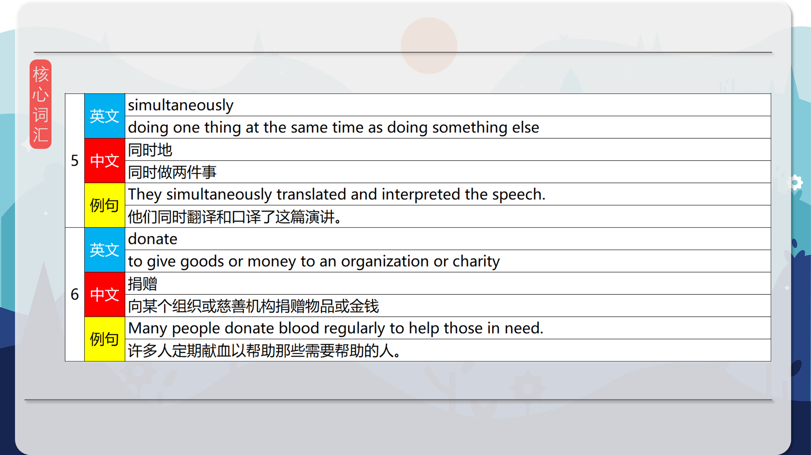

### 【英文脚本】
Catherine
Hello. Welcome to 6 Minute English, I'm Catherine.

Rob
And hello, I'm Rob.

Catherine
Now Rob, do you ever buy things at a charity shop?

Rob
Yes I do. They are a great place to pick up a bargain and I also donate items to charity shops too. And a charity shop, by the way, is a shop where people take their unwanted items and then the shop sells them and makes money and the money goes to the charity.

Catherine
Exactly that's good to hear Rob, because donating – that's giving money or goods to an organisation – helps charities raise money. And you might be interested to know that dressing up in second-hand clothes is back in fashion – well sort of - and that's what we're discussing today – is looking like you're dressing in charity shops clothes a new fashion statement?

Rob
It should be interesting but first Catherine, aren't you going to set me a question to answer – and not a second-hand one please!

Catherine
It's a brand new question today Rob, for you and the listeners at home – do you know when the first official charity shop opened its doors in the UK? Was it in… a) 1928; b) 1948, or c) 1968?

Rob
I'll go for 1948.

Catherine
OK, and we'll find out the answer later. But now back to our discussion about charity shops and fashion. And there's a new look in town, which some people are calling 'scumbro'. Scumbro combines the word 'scummy' which means 'dirty and messy' with the word 'bro', which is an informal way of referring to a boy or man. So scumbro is a fashion for men – but women can adopt it too.

Rob
It's a bit of an insulting name and here's the odd thing about this new fashion style: Being scumbro is about buying expensive designer-brands that look like they are from a charity shop. Very odd!

Catherine
Well, it's something Amber Graafland knows about. She is the Fashion & Beauty Director for the Daily Mirror newspaper and she's been telling BBC Radio 4's You and Yours programme all about it. So, how did this trend start?

Amber Graafland, Fashion & Beauty Director, Daily Mirror
Well I think the name came from a Vanity Fair article, and I think Justin Bieber, the likes of Jonah Hill to thank for this look, Pete Davidson, who's actually the fiancée of Ariana Grande – he's definitely one of the founding fathers of scumbro. And I think, like most of these trends, they're started by celebrities and then, I mean look, it's been picked up by everybody by the sounds of things.

Rob
OK, so the fashion magazine Vanity Fair invented the name but the trend has spread because celebrities have been dressing in this style.

Catherine
Yes and Amber mentioned a number of celebrities who are the founding fathers of the trend – that's a term used to describe people who start an idea or an organisation.

Rob
Yes, the trend has been picked up – or copied - by people who you might describe as fashion victims – people who have to follow the latest fashion trends.

Catherine
Well Rob, I'm no fashion victim – but I say, maybe, one day, I might want to look scumbro – or maybe scumsis! So how exactly should I dress?

Rob
OK, well let's hear from Amber Graafland again. How does she describe the characteristics of this fashion trend?

Amber Graafland, Fashion & Beauty Director, Daily Mirror
It's all about wearing these oversized clothes that are overpriced and I think it's not just about looking like you've rummaged in a teenager's dressing up box. These are very, very expensive items – you mentioned the labels Prada, Versace, Gucci, Supreme – while it's basically about looking simultaneously like you've made no effort, but the underlying thing is you do need to see the effort has gone in there.

Rob
Wow, this fashion trend does involve a lot of effort! It's not just about looking messy – like you've rummaged in a teenager's dressing up box. Rummaging is when you search for something that's mixed up with lots of other things.

Catherine
No don't be rummaging! The trick seems to be to look like you've not made any effort but at the same time, you're show you have made an effort! And that's the meaning of the word simultaneously – doing one thing at the same time as another thing.

Rob
And I guess by showing you've made an effort, you wear designer labels – showing you've paid lots of money.

Catherine
The issue here is clothes from charity shops are supposed to be cheap. Some people even buy these clothes because it is all they can afford – but the irony here is some people are choosing to pay lots and lots of money to look like they're wearing second-hand clothes – and the charity shops aren't making any money from it.

Rob
Well if you're a fashion victim it's something you have to do.

Catherine
And there's one thing I have to do now and that's give you the answer to today's quiz question. So I asked you earlier when the first official charity shop opened its doors in the UK?

Rob
And I said 1948.

Catherine
And you are correct this week Rob. Well done! The very first shop, run by the charity Oxfam, opened its doors in Oxford in 1948, as a direct result of an appeal launched to help post-war Greece.

Rob
Very interesting. Right, let's remind ourselves of some of today's vocabulary, starting with the word donating which means 'giving goods or money to an organisation or charity'.

Catherine
Then we mentioned founding fathers - a term used to describe people who start an idea or an organisation.

Rob
We also mentioned that Catherine was no fashion victim – a person who has to follow the latest fashion trends.

Catherine
Rummaging was a word that described searching for something that's mixed up with lots of other things. And then we had simultaneously which means 'doing one thing at the same time as doing something else'.

Rob
Well you can simultaneously listen to this programme and look at our website if you like. The web address is bbclearningenglish.com.

Catherine
But that’s all we have time for now. Join us again next time. Goodbye.

Rob
Bye!

### 【中英文双语脚本】
Catherine(凯瑟 琳)
Hello. Welcome to 6 Minute English, I'm Catherine.
你好。欢迎来到六分钟 English，我是 Catherine。

Rob(罗伯)
And hello, I'm Rob.
大家好，我是 罗伯。

Catherine(凯瑟 琳)
Now Rob, do you ever buy things at a charity shop?
现在 罗伯，你有没有在慈善商店买过东西？

Rob(罗伯)
Yes I do. They are a great place to pick up a bargain and I also donate items to charity shops too. And a charity shop, by the way, is a shop where people take their unwanted items and then the shop sells them and makes money and the money goes to the charity.
是的，我愿意。他们是讨价还价的好地方，我也向慈善商店捐赠物品。顺便说一句，慈善商店是人们拿走他们不需要的物品，然后商店出售它们并赚钱的商店，这些钱捐给了慈善机构。

Catherine(凯瑟 琳)
Exactly that's good to hear Rob, because donating – that's giving money or goods to an organisation – helps charities raise money. And you might be interested to know that dressing up in second-hand clothes is back in fashion – well sort of - and that's what we're discussing today – is looking like you're dressing in charity shops clothes a new fashion statement?
“ 听到 罗伯 说这句话真是太好了，因为捐赠 —— 即向组织提供资金或物品 —— 有助于慈善机构筹集资金。您可能有兴趣知道，穿着二手衣服又回来了 —— 嗯 —— 这就是我们今天要讨论的内容 —— 看起来像你在慈善商店穿衣服是一种新的时尚宣言吗？

Rob(罗伯)
It should be interesting but first Catherine, aren't you going to set me a question to answer – and not a second-hand one please!
这应该很有趣，但首先，凯瑟琳，你不打算给我一个问题来回答吗 —— 请不要是二手问题！

Catherine(凯瑟 琳)
It's a brand new question today Rob, for you and the listeners at home – do you know when the first official charity shop opened its doors in the UK? Was it in… a) 1928; b) 1948, or c) 1968?
罗伯，今天对于您和家里的听众来说，这是一个全新的问题 —— 您知道英国第一家官方慈善商店是什么时候开业的吗？是在......a） 1928 年；b） 1948 年，还是 c） 1968 年？

Rob(罗伯)
I'll go for 1948.
我会选择 1948 年。

Catherine(凯瑟 琳)
OK, and we'll find out the answer later. But now back to our discussion about charity shops and fashion. And there's a new look in town, which some people are calling 'scumbro'. Scumbro combines the word 'scummy' which means 'dirty and messy' with the word 'bro', which is an informal way of referring to a boy or man. So scumbro is a fashion for men – but women can adopt it too.
好的，我们稍后会找出答案。但现在回到我们关于慈善商店和时尚的讨论。镇上出现了一种新的面貌，有些人称之为 “scumbro”。Scumbro 将“scummy”一词与“bro”一词相结合，“bro”一词是称呼男孩或男人的非正式方式。所以 scumbro 是男性的时尚 —— 但女性也可以采用它。

Rob(罗伯)
It's a bit of an insulting name and here's the odd thing about this new fashion style: Being scumbro is about buying expensive designer-brands that look like they are from a charity shop. Very odd!
这个名字有点侮辱人，这种新时尚风格的奇怪之处在于：成为渣男就是购买昂贵的设计师品牌，这些品牌看起来像是来自慈善商店的。很奇怪！

Catherine(凯瑟 琳)
Well, it's something Amber Graafland knows about. She is the Fashion & Beauty Director for the Daily Mirror newspaper and she's been telling BBC Radio 4's You and Yours programme all about it. So, how did this trend start?
嗯，这是 Amber Graafland 知道的事情。她是每日镜报的时尚与美容总监，她一直在向BBC广播4台的You and Yours节目讲述这一切。那么，这种趋势是如何开始的呢？

Amber Graafland, Fashion & Beauty Director, Daily Mirror(Amber Graafland，时尚与美容总监，每日镜报)
Well I think the name came from a Vanity Fair article, and I think Justin Bieber, the likes of Jonah Hill to thank for this look, Pete Davidson, who's actually the fiancée of Ariana Grande – he's definitely one of the founding fathers of scumbro. And I think, like most of these trends, they're started by celebrities and then, I mean look, it's been picked up by everybody by the sounds of things.
嗯，我认为这个名字来自《名利场》的一篇文章，我想贾斯汀·比伯，要感谢乔纳·希尔等人，皮特·戴维森，他实际上是阿丽亚娜·格兰德的未婚妻 —— 他绝对是渣男的创始人之一。我认为，就像大多数这些趋势一样，它们是由名人发起的，然后，我的意思是，它已经被每个人的声音所接受。

Rob(罗伯)
OK, so the fashion magazine Vanity Fair invented the name but the trend has spread because celebrities have been dressing in this style.
好吧，时尚杂志《名利场》发明了这个名字，但这种趋势已经蔓延开来，因为名人一直在穿着这种风格。

Catherine(凯瑟 琳)
Yes and Amber mentioned a number of celebrities who are the founding fathers of the trend – that's a term used to describe people who start an idea or an organisation.
Yes and Amber 提到了一些名人，他们是这一趋势的奠基人 —— 这是一个用来描述提出想法或组织的人的术语。

Rob(罗伯)
Yes, the trend has been picked up – or copied - by people who you might describe as fashion victims – people who have to follow the latest fashion trends.
是的，这种趋势已经被你描述为时尚受害者的人所接受或复制 —— 他们必须追随最新的时尚潮流。

Catherine(凯瑟 琳)
Well Rob, I'm no fashion victim – but I say, maybe, one day, I might want to look scumbro – or maybe scumsis! So how exactly should I dress?
好吧，罗伯，我不是时尚的受害者 —— 但我说，也许，有一天，我可能想看起来渣男 —— 或者可能是渣男！那么我到底应该怎么着装呢？

Rob(罗伯)
OK, well let's hear from Amber Graafland again. How does she describe the characteristics of this fashion trend?
好的，让我们再次听到 Amber Graafland 的声音。她如何描述这种时尚潮流的特点？

Amber Graafland, Fashion & Beauty Director, Daily Mirror(Amber Graafland，时尚与美容总监，每日镜报)
It's all about wearing these oversized clothes that are overpriced and I think it's not just about looking like you've rummaged in a teenager's dressing up box. These are very, very expensive items – you mentioned the labels Prada, Versace, Gucci, Supreme – while it's basically about looking simultaneously like you've made no effort, but the underlying thing is you do need to see the effort has gone in there.
这一切都与穿着这些价格过高的超大号衣服有关，我认为这不仅仅是看起来像你在青少年的装扮盒中翻找过。这些都是非常非常昂贵的商品 —— 你提到了 Prada、Versace、Gucci、Supreme 等品牌 —— 虽然基本上看起来你没有付出任何努力，但潜在的问题是你确实需要看到努力已经在那里。

Rob(罗伯)
Wow, this fashion trend does involve a lot of effort! It's not just about looking messy – like you've rummaged in a teenager's dressing up box. Rummaging is when you search for something that's mixed up with lots of other things.
哇，这种时尚趋势确实需要付出很多努力！这不仅仅是看起来凌乱 —— 就像你在青少年的装扮盒里翻找一样。翻找是指您搜索与许多其他事物混合在一起的东西。

Catherine(凯瑟 琳)
No don't be rummaging! The trick seems to be to look like you've not made any effort but at the same time, you're show you have made an effort! And that's the meaning of the word simultaneously – doing one thing at the same time as another thing.
不，不要翻找！诀窍似乎是看起来你没有付出任何努力，但与此同时，你表明你已经付出了努力！这就是这个词的含义 – 同时做一件事和另一件事。

Rob(罗伯)
And I guess by showing you've made an effort, you wear designer labels – showing you've paid lots of money.
我想，通过表明你付出了努力，你佩戴了名牌 —— 表明你付出了很多钱。

Catherine(凯瑟 琳)
The issue here is clothes from charity shops are supposed to be cheap. Some people even buy these clothes because it is all they can afford – but the irony here is some people are choosing to pay lots and lots of money to look like they're wearing second-hand clothes – and the charity shops aren't making any money from it.
这里的问题是慈善商店的衣服应该很便宜。有些人甚至购买这些衣服，因为这是他们能负担得起的 —— 但具有讽刺意味的是，有些人选择花很多很多钱来看起来像他们穿着二手衣服 —— 而慈善商店并没有从中赚到任何钱。

Rob(罗伯)
Well if you're a fashion victim it's something you have to do.
好吧，如果你是时尚界的受害者，这是你必须做的事情。

Catherine(凯瑟 琳)
And there's one thing I have to do now and that's give you the answer to today's quiz question. So I asked you earlier when the first official charity shop opened its doors in the UK?
我现在必须做一件事，那就是给你今天测验问题的答案。所以我刚才问你，英国第一家官方慈善商店是什么时候开业的？

Rob(罗伯)
And I said 1948.
我说的是 1948 年。

Catherine(凯瑟 琳)
And you are correct this week Rob. Well done! The very first shop, run by the charity Oxfam, opened its doors in Oxford in 1948, as a direct result of an appeal launched to help post-war Greece.
本周你是对的，罗伯。干的好！第一家商店由慈善机构乐施会经营，于 1948 年在牛津开业，这是为了帮助战后希腊而发起的呼吁的直接结果。

Rob(罗伯)
Very interesting. Right, let's remind ourselves of some of today's vocabulary, starting with the word donating which means 'giving goods or money to an organisation or charity'.
非常有趣。好吧，让我们提醒自己今天的一些词汇，从“捐赠”这个词开始，意思是“向组织或慈善机构捐赠物品或金钱”。

Catherine(凯瑟 琳)
Then we mentioned founding fathers - a term used to describe people who start an idea or an organisation.
然后我们提到了开国元勋 —— 一个用来描述发起一个想法或组织的人的术语。

Rob(罗伯)
We also mentioned that Catherine was no fashion victim – a person who has to follow the latest fashion trends.
我们还提到，Catherine 不是时尚的受害者 —— 一个必须追随最新时尚潮流的人。

Catherine(凯瑟 琳)
Rummaging was a word that described searching for something that's mixed up with lots of other things. And then we had simultaneously which means 'doing one thing at the same time as doing something else'.
Rummaging 这个词形容寻找与许多其他事物混在一起的东西。然后我们有了 同时，这意味着“在做一件事的同时做另一件事”。

Rob(罗伯)
Well you can simultaneously listen to this programme and look at our website if you like. The web address is bbclearningenglish.com.
好吧，如果您愿意，您可以同时收听此节目并查看我们的网站。网址为 bbclearningenglish.com。

Catherine(凯瑟 琳)
But that’s all we have time for now. Join us again next time. Goodbye.
但这就是我们现在的全部时间。下次再来我们。再见。

Rob(罗伯)
Bye!
再见！

### 【核心词汇】
#### donating
giving goods or money to an organisation or charity
捐赠
向某个组织或慈善机构捐赠物品或金钱
He donated a large sum of money to the hospital.
他向医院捐赠了一大笔钱。
#### founding fathers
people who start an idea or an organisation
开国元勋
创立某种思想或组织的人
The founding fathers of the United States established a new nation based on democratic principles.
美国的开国元勋们建立了一个基于民主原则的新国家。
#### fashion victim
person who has to follow the latest fashion trends
时尚受害者
不得不追逐最新时尚潮流的人
She's a real fashion victim, always buying the latest trends, regardless of cost or style.
她是个十足的时尚受害者，总是购买最新的潮流款式，不管价格或款式如何。
#### rummaging
searching for something that's mixed up with lots of other things
翻找
在混杂着许多其他东西的东西里寻找某物
He was rummaging through the drawers looking for his passport.
他正在翻找抽屉寻找他的护照。
#### simultaneously
doing one thing at the same time as doing something else
同时地
同时做两件事
They simultaneously translated and interpreted the speech.
他们同时翻译和口译了这篇演讲。
#### donate
to give goods or money to an organization or charity
捐赠
向某个组织或慈善机构捐赠物品或金钱
Many people donate blood regularly to help those in need.
许多人定期献血以帮助那些需要帮助的人。

在公众号里输入6位数字，获取【对话音频、英文文本、中文翻译、核心词汇和高级词汇表】电子档，6位数字【暗号】在文章的最后一张图片，如【220728】，表示22年7月28日这一期。公众号没有的文章说明还没有制作相关资料。年度合集在B站【六分钟英语】工房获取，每年共计300+文档，感谢支持！