### 【英文脚本】
Neil
Hello. Welcome to 6 Minute English, I'm Neil.

Rob
And hello, I'm Rob.

Neil
Now Rob, how creative are you?

Rob
Very creative, I think. Creativity is in my bones! Look at this wonderful script that I wrote and we're presenting right now.

Neil
You are what we could call 'a creative' – a noun which means someone with a lot of imagination and ideas. In our job we have to create – or make – content that teaches English creatively.

Rob
Creativity is becoming more important for everyone. The World Economic Forum forecasts that by 2020, creativity will be in the top three most important skills for future jobs. This is particularly relevant for younger people who will be entering the world of work soon – and that's what we'll be discussing today. But before we do, Neil, have you created a question for us to answer?

Neil
Yes, and it's about the very creative artist Banksy. He created a well-known piece of artwork that has been in the news recently, but do you know what it is called? Is it… a) Girl with Balloon; b) Girl with Red Balloon c) Balloon Girl.

Rob
I can see the picture in my head – so I think it's c) Balloon Girl.

Neil
OK, and we'll find out the answer later. But now back to our discussion about creativity. Experts say that students need to focus more on creativity to help them get a job. That's perhaps surprising in the UK, when some of our creative industries – that's businesses that make music, art and TV for example – are world famous. We are creative people, Rob!

Rob
Of course, but there's not such a focus on being creative in education now and that might have an effect in the future. It's something Bernadette Duffy, an early years consultant, has been discussing on BBC Radio 4's Bringing up Britain programme. What does she say we have been focusing too much on in schools?

Bernadette Duffy, early years consultant
We focus on the things that are legitimately important but we teach them in a way that makes them easier to measure. I think we need to redress the balance that puts the focus purely on gaining the skills and far far more on actually using them in a creative way because that's what's going to make a difference for the future.

Neil
So Bernadette feels we teach skills in a way that can be easily measured and tested. She says we teach these skills legitimately – which here means fairly and reasonably. But she feels we don't teach a creative approach to learning skills.

Rob
So we mean things like problem solving. I guess, even tasks like data inputting and preparing spreadsheets can be approached creatively. In any job, it's sometimes good to 'think outside the box' or find new ways of doing things.

Neil
Bernadette thinks we should move away from just learning skills and start using these skills creatively – she used the expression 'redress the balance' which means 'change things to make them fairer and more equal'.

Rob
Well, here at the BBC we have to creative. In fact one of our values states that 'creativity is the lifeblood of our organisation'. Lifeblood here means 'the most important thing to make something a success'.

Neil
Rob, I can see creativity is in your blood – but on an everyday level how can we all improve our creativity – be like you?!

Rob
Well, Neil, I'm no expert but Innovation Manager, Nick Skillicorn is. He's also been speaking to the BBC and explaining what we can do to help ourselves. What does he suggest?

Nick Skillicorn, Innovation Manager
On a daily basis, everyone should take fifteen minutes of what I call unfocused time – time that they're not looking at any screen, time that they can essentially get back into their own head, slow down a bit, and start forming these new connections between disparate ideas that result in divergent new original ideas.

Neil
So we need free time to collect all our different thoughts in our head – what Nick calls disparate ideas to create new and amazing ideas.

Rob
Disparate ideas are very different ideas, all unrelated. And we need what we might call headspace – that's when your mind is in a good state and you can think clearly. For me, I have headspace when I'm lying in the bath or out riding my bike – there are no interruptions.

Neil
Well, you certainly don't get your ideas sitting at a desk, focusing on one task – we all need some downtime to get creative. But children going into school now will grow up to do a job that doesn't yet exist. And faced with the challenges of AI, automation, green issues and an ageing population, creativity and imagination will be vital.

Rob
Right, well, let's get back to talking about the creativity of Banksy now.

Neil
Ah yes, because earlier I asked you which one of his well-known pieces of artwork has been in the news recently? Is it… a) Girl with Balloon; b) Girl with Red Balloon c) Balloon girl.

Rob
And I said c) Balloon Girl. I know it was a girl and a balloon.

Neil
Not quite right, Rob. The artwork is titled 'Girl with Balloon.' This was recently auctioned in London but amazingly shredded in its frame as someone's winning bid was accepted!

Rob
Wow, that's a very creative way to destroy a picture! I will do the same with this script soon but not before we have recapped some of today's vocabulary. Starting with 'a creative' - a person whose job is to use a lot of imagination and come up with new ideas, such as someone who works in the media or advertising.

Neil
Then we mentioned legitimately – which describes doing something fairly and reasonably.

Rob
Next we heard the expression 'redress the balance'. This means to make things fairer and more equal.

Neil
We also talked about creativity being the lifeblood of the BBC. Lifeblood here means the most important thing to make something a success. And I know creativity is running through your veins, Rob!

Rob
Thanks, Neil. We also heard the word disparate, meaning very different and unrelated. And we talked about headspace, which is when your mind is in a good state and you can think clearly.

Neil
Before we head off to find some headspace, don't forget to visit our website at bbclearningenglish.com for more great learning English content. That’s all we have time for now. Do join us again though. Goodbye.

Rob
Bye bye!

### 【中英文双语脚本】
Neil(尼尔)
Hello. Welcome to 6 Minute English, I'm Neil.
你好。欢迎来到六分钟 English，我是 Neil。

Rob(罗伯)
And hello, I'm Rob.
大家好，我是 罗伯。

Neil(尼尔)
Now Rob, how creative are you?
现在 罗伯，你的创意如何？

Rob(罗伯)
Very creative, I think. Creativity is in my bones! Look at this wonderful script that I wrote and we're presenting right now.
我认为非常有创意。创造力就在我的骨子里！看看我写的这个精彩的剧本，我们现在正在展示。

Neil(尼尔)
You are what we could call 'a creative' – a noun which means someone with a lot of imagination and ideas. In our job we have to create – or make – content that teaches English creatively.
您就是我们可以称之为“创意者”的人 —— 一个名词，意思是具有丰富想象力和想法的人。在我们的工作中，我们必须创建或制作具有创造性英语教学的内容。

Rob(罗伯)
Creativity is becoming more important for everyone. The World Economic Forum forecasts that by 2020, creativity will be in the top three most important skills for future jobs. This is particularly relevant for younger people who will be entering the world of work soon – and that's what we'll be discussing today. But before we do, Neil, have you created a question for us to answer?
创造力对每个人来说都变得越来越重要。世界经济论坛预测，到 2020 年，创造力将成为未来工作最重要的三大技能之一。这对于即将进入职场的年轻人尤其重要，这就是我们今天要讨论的内容。但在我们这样做之前，Neil，您是否提出了一个问题让我们回答？

Neil(尼尔)
Yes, and it's about the very creative artist Banksy. He created a well-known piece of artwork that has been in the news recently, but do you know what it is called? Is it… a) Girl with Balloon; b) Girl with Red Balloon c) Balloon Girl.
是的，这是关于非常有创造力的艺术家 Banksy 的。他创作了一件最近上了新闻的著名艺术品，但你知道它叫什么吗？是吗。。。a） 带气球的女孩；b） 带红气球的女孩 c） 气球女孩。

Rob(罗伯)
I can see the picture in my head – so I think it's c) Balloon Girl.
我可以在脑海中看到这幅画 —— 所以我认为它是 c） Balloon Girl。

Neil(尼尔)
OK, and we'll find out the answer later. But now back to our discussion about creativity. Experts say that students need to focus more on creativity to help them get a job. That's perhaps surprising in the UK, when some of our creative industries – that's businesses that make music, art and TV for example – are world famous. We are creative people, Rob!
好的，我们稍后会找出答案。但现在回到我们关于创造力的讨论。专家表示，学生需要更多地关注创造力，以帮助他们找到工作。这在英国可能很令人惊讶，因为我们的一些创意产业 —— 例如制作音乐、艺术和电视的企业 —— 举世闻名。我们是有创造力的人，罗伯！

Rob(罗伯)
Of course, but there's not such a focus on being creative in education now and that might have an effect in the future. It's something Bernadette Duffy, an early years consultant, has been discussing on BBC Radio 4's Bringing up Britain programme. What does she say we have been focusing too much on in schools?
当然，但现在没有那么注重教育的创造力，这可能会在未来产生影响。这是早期教育顾问伯纳黛特·达菲 在 BBC Radio 4 的“培养英国”节目中一直在讨论的问题。她说我们在学校里太关注什么了？

Bernadette Duffy, early years consultant(Bernadette Duffy，早期教育顾问)
We focus on the things that are legitimately important but we teach them in a way that makes them easier to measure. I think we need to redress the balance that puts the focus purely on gaining the skills and far far more on actually using them in a creative way because that's what's going to make a difference for the future.
我们专注于合法重要的事情，但我们以一种更容易衡量的方式教授它们。我认为我们需要纠正这种平衡，这种平衡将重点纯粹放在获得技能上，而更多地放在以创造性的方式实际使用它们上，因为这将对未来产生影响。

Neil(尼尔)
So Bernadette feels we teach skills in a way that can be easily measured and tested. She says we teach these skills legitimately – which here means fairly and reasonably. But she feels we don't teach a creative approach to learning skills.
因此，Bernadette 认为我们以一种易于衡量和测试的方式教授技能。她说，我们合法地教授这些技能 —— 这里的意思是公平合理的。但她认为我们没有教授一种创造性的方法来学习技能。

Rob(罗伯)
So we mean things like problem solving. I guess, even tasks like data inputting and preparing spreadsheets can be approached creatively. In any job, it's sometimes good to 'think outside the box' or find new ways of doing things.
所以我们指的是解决问题之类的事情。我想，即使是数据输入和准备电子表格等任务也可以创造性地完成。在任何工作中，有时“跳出框框思考”或寻找新的做事方式都是好的。

Neil(尼尔)
Bernadette thinks we should move away from just learning skills and start using these skills creatively – she used the expression 'redress the balance' which means 'change things to make them fairer and more equal'.
Bernadette 认为我们应该从仅仅学习技能开始创造性地使用这些技能 —— 她使用了“redress the balance”这个词，意思是“改变事物，让它们更公平、更平等”。

Rob(罗伯)
Well, here at the BBC we have to creative. In fact one of our values states that 'creativity is the lifeblood of our organisation'. Lifeblood here means 'the most important thing to make something a success'.
好吧，在 BBC，我们必须发挥创造力。事实上，我们的价值观之一就是“创造力是我们组织的命脉”。Lifeblood 在这里的意思是“使某事成功最重要的事情”。

Neil(尼尔)
Rob, I can see creativity is in your blood – but on an everyday level how can we all improve our creativity – be like you?!
罗伯，我能看出创造力流淌在你的血液中 —— 但在日常层面上，我们如何才能提高我们的创造力 —— 像你一样？！

Rob(罗伯)
Well, Neil, I'm no expert but Innovation Manager, Nick Skillicorn is. He's also been speaking to the BBC and explaining what we can do to help ourselves. What does he suggest?
好吧，Neil，我不是专家，但创新经理 Nick Skillicorn 是。他还一直在接受 BBC 的采访，解释我们可以做些什么来帮助自己。他建议什么呢？

Nick Skillicorn, Innovation Manager(Nick Skillicorn，创新经理)
On a daily basis, everyone should take fifteen minutes of what I call unfocused time – time that they're not looking at any screen, time that they can essentially get back into their own head, slow down a bit, and start forming these new connections between disparate ideas that result in divergent new original ideas.
每天，每个人都应该花 15 分钟我所说的无重点时间 —— 他们不看任何屏幕的时间，他们基本上可以回到自己的脑海中，放慢一点速度，开始在不同的想法之间形成这些新的联系，从而导致不同的新原创想法。

Neil(尼尔)
So we need free time to collect all our different thoughts in our head – what Nick calls disparate ideas to create new and amazing ideas.
因此，我们需要空闲时间在脑海中收集所有不同的想法 —— Nick 称之为不同的想法，以创造新的和令人惊叹的想法。

Rob(罗伯)
Disparate ideas are very different ideas, all unrelated. And we need what we might call headspace – that's when your mind is in a good state and you can think clearly. For me, I have headspace when I'm lying in the bath or out riding my bike – there are no interruptions.
不同的想法是截然不同的想法，都是不相关的。我们需要我们所谓的头脑空间 – 那时你的大脑处于良好的状态，你可以清晰地思考。对我来说，当我躺在浴缸里或骑自行车时，我有头部空间 —— 不会被打扰。

Neil(尼尔)
Well, you certainly don't get your ideas sitting at a desk, focusing on one task – we all need some downtime to get creative. But children going into school now will grow up to do a job that doesn't yet exist. And faced with the challenges of AI, automation, green issues and an ageing population, creativity and imagination will be vital.
好吧，你肯定不会把你的想法放在办公桌前，专注于一项任务 —— 我们都需要一些休息时间来发挥创意。但是现在上学的孩子长大后会从事一份尚不存在的工作。面对人工智能、自动化、绿色问题和人口老龄化的挑战，创造力和想象力将至关重要。

Rob(罗伯)
Right, well, let's get back to talking about the creativity of Banksy now.
好了，好吧，现在让我们回到 Banksy 的创造力上来。

Neil(尼尔)
Ah yes, because earlier I asked you which one of his well-known pieces of artwork has been in the news recently? Is it… a) Girl with Balloon; b) Girl with Red Balloon c) Balloon girl.
啊，是的，因为之前我问你最近他的哪一件知名作品上了新闻？是吗。。。a） 带气球的女孩；b） 带红气球的女孩 c） 气球女孩。

Rob(罗伯)
And I said c) Balloon Girl. I know it was a girl and a balloon.
我说 c） 气球女孩。我知道那是一个女孩和一个气球。

Neil(尼尔)
Not quite right, Rob. The artwork is titled 'Girl with Balloon.' This was recently auctioned in London but amazingly shredded in its frame as someone's winning bid was accepted!
不太对劲，罗伯。这件作品的标题是“带气球的女孩”。这辆车最近在伦敦拍卖，但令人惊讶的是，由于有人的中标被接受，它被撕碎了！

Rob(罗伯)
Wow, that's a very creative way to destroy a picture! I will do the same with this script soon but not before we have recapped some of today's vocabulary. Starting with 'a creative' - a person whose job is to use a lot of imagination and come up with new ideas, such as someone who works in the media or advertising.
哇，这是一种非常有创意的销毁图片的方法！我很快就会对这个脚本做同样的事情，但在此之前，我们会回顾一下今天的一些词汇。从“创意人员”开始 - 其工作是发挥大量想象力并提出新想法的人，例如在媒体或广告行业工作的人。

Neil(尼尔)
Then we mentioned legitimately – which describes doing something fairly and reasonably.
然后我们提到了 legimately – 它描述了公平合理地做某事。

Rob(罗伯)
Next we heard the expression 'redress the balance'. This means to make things fairer and more equal.
接下来，我们听到了“redress the balance”这个说法。这意味着让事情变得更公平、更平等。

Neil(尼尔)
We also talked about creativity being the lifeblood of the BBC. Lifeblood here means the most important thing to make something a success. And I know creativity is running through your veins, Rob!
我们还谈到了创造力是 BBC 的命脉。Lifeblood 在这里意味着使某事成功最重要的事情。我知道创造力在你的血管中流淌，罗伯！

Rob(罗伯)
Thanks, Neil. We also heard the word disparate, meaning very different and unrelated. And we talked about headspace, which is when your mind is in a good state and you can think clearly.
谢谢，Neil。我们还听到了 disparate 这个词，意思是非常不同且不相关。我们谈到了顶空，即当你的大脑处于良好状态并且可以清晰思考时。

Neil(尼尔)
Before we head off to find some headspace, don't forget to visit our website at bbclearningenglish.com for more great learning English content. That’s all we have time for now. Do join us again though. Goodbye.
在我们出发寻找一些空间之前，不要忘记访问我们的网站 bbclearningenglish.com 以获取更多精彩的英语学习内容。这就是我们现在的全部时间。不过，请再次加入我们。再见。

Rob(罗伯)
Bye bye!
再见！

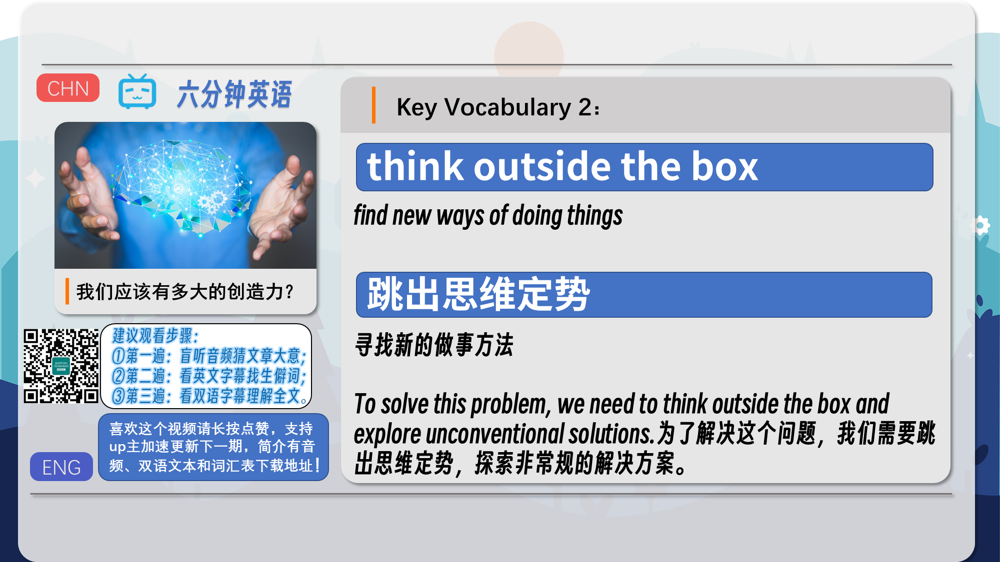
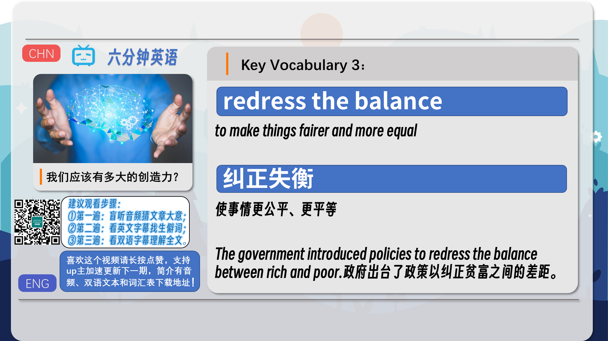
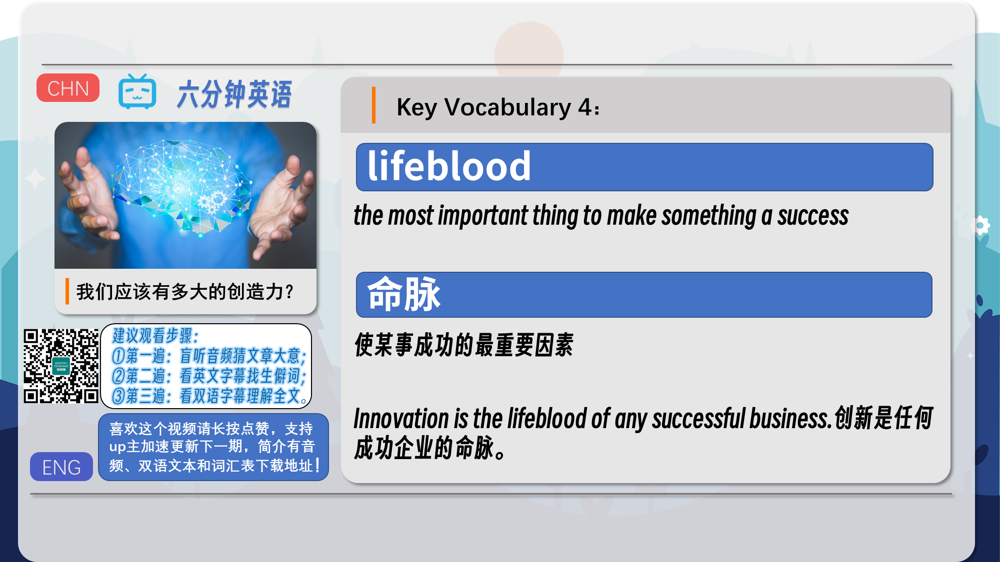
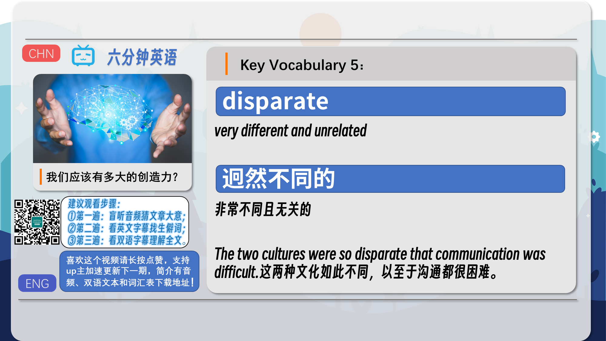
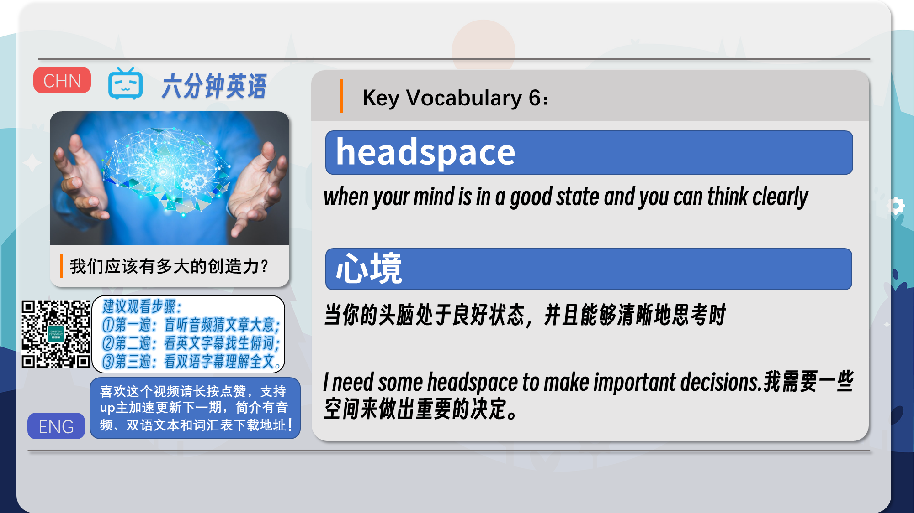
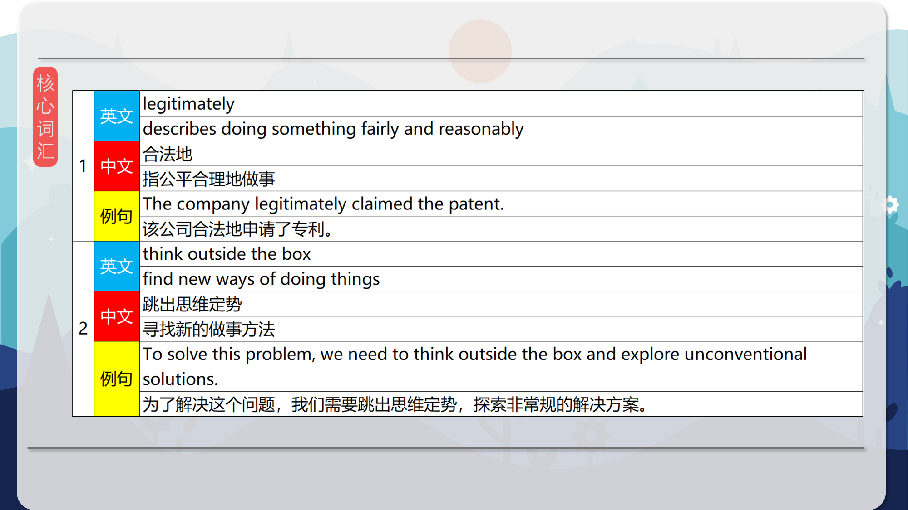
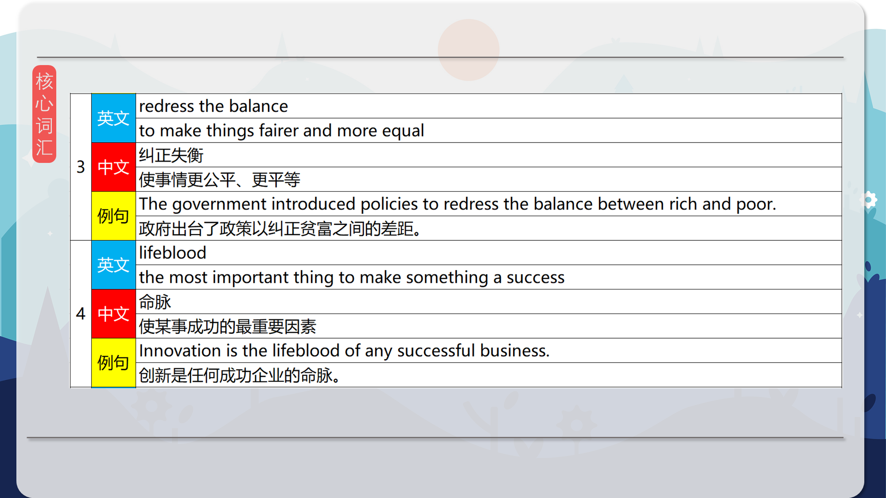
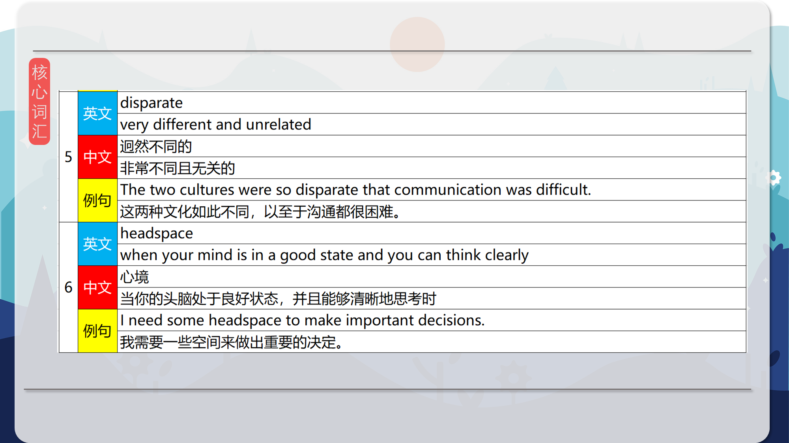
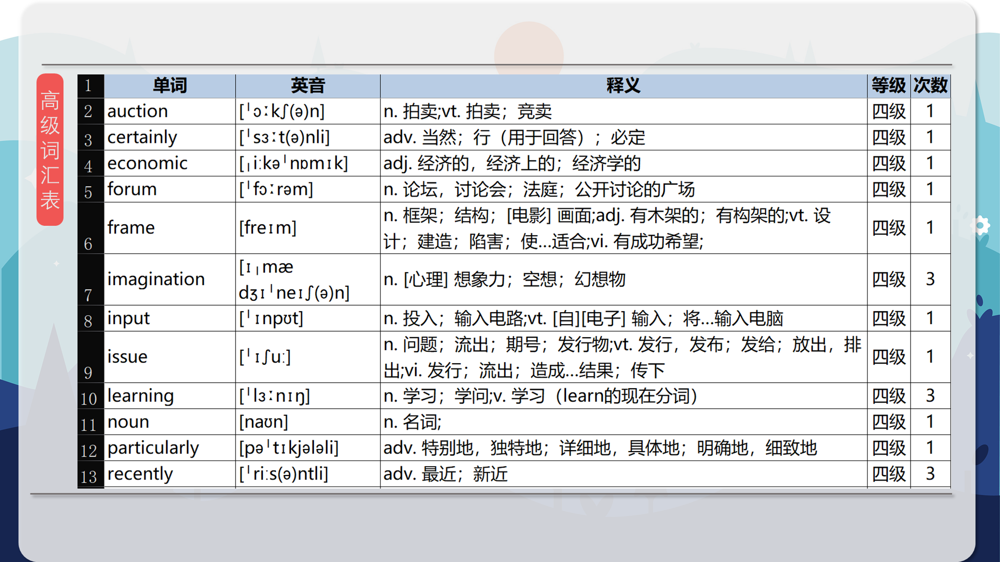
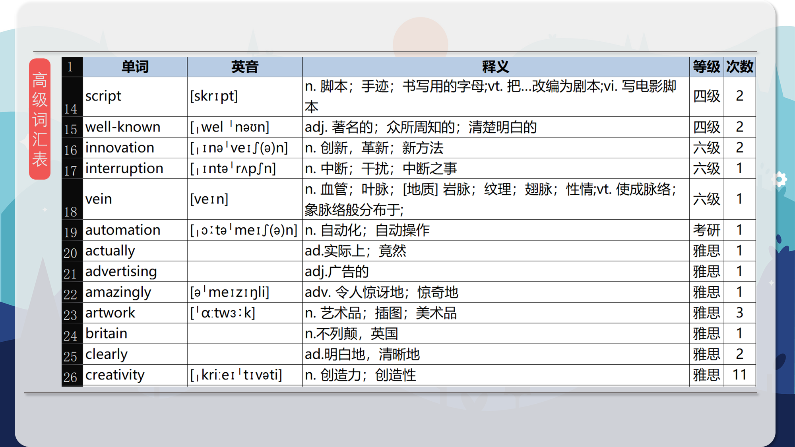
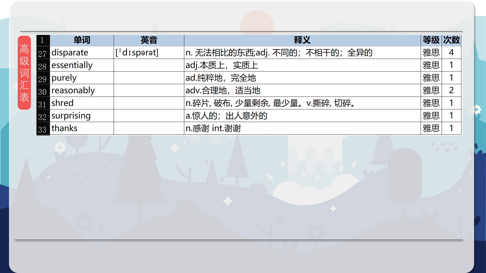

### 【核心词汇】
#### legitimately
describes doing something fairly and reasonably
合法地
指公平合理地做事
The company legitimately claimed the patent.
该公司合法地申请了专利。
#### think outside the box
find new ways of doing things
跳出思维定势
寻找新的做事方法
To solve this problem, we need to think outside the box and explore unconventional solutions.
为了解决这个问题，我们需要跳出思维定势，探索非常规的解决方案。
#### redress the balance
to make things fairer and more equal
纠正失衡
使事情更公平、更平等
The government introduced policies to redress the balance between rich and poor.
政府出台了政策以纠正贫富之间的差距。
#### lifeblood
the most important thing to make something a success
命脉
使某事成功的最重要因素
Innovation is the lifeblood of any successful business.
创新是任何成功企业的命脉。
#### disparate
very different and unrelated
迥然不同的
非常不同且无关的
The two cultures were so disparate that communication was difficult.
这两种文化如此不同，以至于沟通都很困难。
#### headspace
when your mind is in a good state and you can think clearly
心境
当你的头脑处于良好状态，并且能够清晰地思考时
I need some headspace to make important decisions.
我需要一些空间来做出重要的决定。

在公众号里输入6位数字，获取【对话音频、英文文本、中文翻译、核心词汇和高级词汇表】电子档，6位数字【暗号】在文章的最后一张图片，如【220728】，表示22年7月28日这一期。公众号没有的文章说明还没有制作相关资料。年度合集在B站【六分钟英语】工房获取，每年共计300+文档，感谢支持！