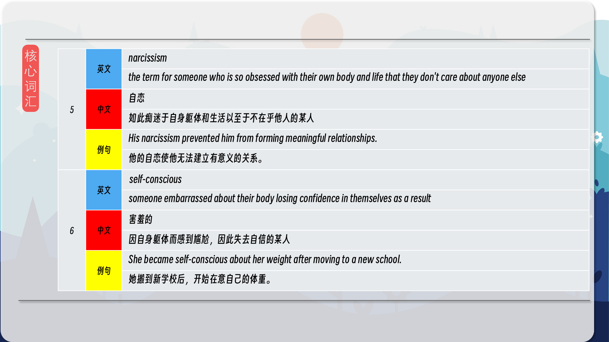

### 【英文脚本】
Neil
Hello and welcome to 6 Minute English, I'm Neil.

Sam
And I'm Sam.

Neil
And in this programme we're looking at the word objectification.

Sam
Objectification is when we reduce people to objects.

Neil
An example of this is advertising and the media and in particular the way women have been shown. Impossibly attractive and implausibly perfect models in adverts and in movies and on TV you are much more likely to see naked or half-naked women than men.

Sam
Objectification can lead to issues in society such as inequality and discrimination. Objectification of women is a problem but what about the objectification of men?

Neil
Before we hear more, it's time for a question. Today's question is: on British TV in which decade was a completely naked man first seen? Was it… a) the 1940s; b) the 1950s c) the 1960s What do you think Sam?

Sam
I'm going for the 60s.

Neil
I'll give the answer later in the programme. Now Sam, do you know the TV programme Love Island?

Sam
Yes, it's a kind of a dating show and all the contestants - men and women - spend a lot of time in their swimming costumes and they've all got perfect bodies.

Neil
Yes, that's right. It's a programme that seems equally to objectify men and women equally. But is that a bad thing? Dr Peter Lucas is Senior Lecturer in Philosophy at the University of Central Lancashire. He spoke on this topic on the BBC's Woman's Hour programme. What does he suggest might be the advantage of featuring men with 'perfect' bodies?

Dr Peter Lucas
If you look at the impact of TV series like Love Island for instance, the producers of that programme present that as, have described that as being aspirational for their audience. It's presenting role models, its presenting models that people are supposed to aspire to. Now many women, thinking about the male bodies that are on display there might think well, if it means that more men get off to the gym, look after themselves physically, surely that's a good thing.

Neil
So what might be an advantage of these highly fit athletic bodies on show?

Sam
Dr Lucas suggests that seeing those bodies might encourage men to go to the gym and work hard to improve their fitness and health and that could be a good thing.

Neil
Yes, the people in the programme are described as role models. A role model is someone whose behaviour is seen as a good example for others to copy.

Sam
I'm not sure the behaviour of the people in Love Island makes them good role models, but perhaps from the point of view of their physical fitness they give us something to aspire to. If you aspire to something, it's something you can aim for, something you want to achieve. Dr Lucas also used a related word, aspirational. The TV series Love Island was described as being aspirational. It shows a lifestyle that people would like to have, something they might aim to achieve.

Neil
But there are also dangers to encouraging people to get to the gym. Here's Dr Lucas again.

Dr Peter Lucas
But also it's likely to generate higher levels of narcissism, self-consciousness, becoming obsessive about your appearance. It's not particularly an attractive feature either in men or in women and I suspect that's impacting on men's behaviour in a way which is detrimental in the same sort of way that's been detrimental for women really, for decades.

Neil
He talks about behaviour that is detrimental, this means behaviour that has a negative impact. What behaviours does he say are detrimental?

Sam
If people become obsessed by their appearance it could lead to narcissism. This is a condition where you spend so much time focussing on yourself, your own looks, your own body that you stop caring about anyone else.

Neil
And because it's very very hard to get that kind of body it can also lead to people being very self-conscious. They might become embarrassed about their bodies and lose confidence in themselves as a result.

Right. It's almost time to review this week's vocabulary, but before that let's have the
answer to the quiz. In what decade was the first naked man seen on British TV? Was it… a) the 1940s; b) the 1950s c) the 1960s What did you say, Sam?

Sam
I said c) the 60s.

Neil
I'm afraid the revolution had come earlier than that. The correct answer is the 1950s. It was a 1957 documentary called Out of Step, part of which was filmed at a nudist colony. Now, time for our vocabulary.

Sam
Our first word was objectification. This is the noun for when we reduce a human being to an object. We don't think of them as a real person anymore. The verb is to objectify.

Neil
Someone whose behaviour is a good example that others want to copy is a role model.

Sam
When it comes to presenting 6 Minute English, you are my role model, Neil.

Neil
You're too kind, and I aspire to your level of professionalism, Sam. To aspire to - to aim to be, to hope to achieve.

Sam
That is related to the next word, aspirational. This adjective is used to describe the desire to improve parts of you life - for example, getting a better job or a better body.

Aspirational TV programmes or adverts show lifestyles that people might want to be
theirs.

Neil
Our next word is an adjective for something that is bad for you, something that has a negative effect. The adjective is detrimental.

Sam
We heard that aspiring to the perfect body can be detrimental because it might lead to narcissism. Narcissism is the term for someone who is so obsessed with their own body and life that they don't care about anyone else.

Neil
Achieving that perfect body is incredibly hard and impossible for most real people and not achieving it can make people overly self-conscious - which in this situation means that they can lose confidence in themselves.

Sam
That's all we have time for today. Do join us next time and remember you can find us on the website bbclearningenglish.com. Bye bye.

Neil
Bye!

### 【中英文双语脚本】
Neil(尼尔)
Hello and welcome to 6 Minute English, I'm Neil.
大家好，欢迎来到六分钟 English，我是 Neil。

Sam(山姆)
And I'm Sam.
我是 Sam。

Neil(尼尔)
And in this programme we're looking at the word objectification.
在这个节目中，我们关注的是物化这个词。

Sam(山姆)
Objectification is when we reduce people to objects.
物化是指我们将人简化为对象。

Neil(尼尔)
An example of this is advertising and the media and in particular the way women have been shown. Impossibly attractive and implausibly perfect models in adverts and in movies and on TV you are much more likely to see naked or half-naked women than men.
这方面的一个例子是广告和媒体，尤其是女性的展示方式。在广告、电影和电视中，你看到裸体或半裸女性的可能性要比男性高得多。

Sam(山姆)
Objectification can lead to issues in society such as inequality and discrimination. Objectification of women is a problem but what about the objectification of men?
物化会导致社会问题，例如不平等和歧视。物化女性是一个问题，但物化男性呢？

Neil(尼尔)
Before we hear more, it's time for a question. Today's question is: on British TV in which decade was a completely naked man first seen? Was it… a) the 1940s; b) the 1950s c) the 1960s What do you think Sam?
在我们听到更多之前，是时候提出一个问题了。今天的问题是：在英国电视上，第一次看到一个全裸的男人是在哪个十年里？是不是......a） 1940 年代；b） 1950 年代 c） 1960 年代 你怎么看 Sam？

Sam(山姆)
I'm going for the 60s.
我要去 60 年代。

Neil(尼尔)
I'll give the answer later in the programme. Now Sam, do you know the TV programme Love Island?
我将在节目的后面给出答案。现在山姆，你知道电视节目《爱情岛》吗？

Sam(山姆)
Yes, it's a kind of a dating show and all the contestants - men and women - spend a lot of time in their swimming costumes and they've all got perfect bodies.
是的，这是一种约会节目，所有的参赛者 - 男人和女人 - 都花了很多时间穿着泳衣，他们都有完美的身材。

Neil(尼尔)
Yes, that's right. It's a programme that seems equally to objectify men and women equally. But is that a bad thing? Dr Peter Lucas is Senior Lecturer in Philosophy at the University of Central Lancashire. He spoke on this topic on the BBC's Woman's Hour programme. What does he suggest might be the advantage of featuring men with 'perfect' bodies?
是的，没错。这个节目似乎平等地物化了男性和女性。但这是一件坏事吗？Peter Lucas 博士是中央兰开夏大学哲学高级讲师。他在 BBC 的 Woman's Hour 节目中谈到了这个话题。他认为拥有“完美”身材的男性可能有什么优势？

Dr Peter Lucas(Peter Lucas 博士)
If you look at the impact of TV series like Love Island for instance, the producers of that programme present that as, have described that as being aspirational for their audience. It's presenting role models, its presenting models that people are supposed to aspire to. Now many women, thinking about the male bodies that are on display there might think well, if it means that more men get off to the gym, look after themselves physically, surely that's a good thing.
例如，如果你看一下像《爱情岛》这样的电视剧的影响，该节目的制片人将其描述为对他们的观众来说是令人向往的。它展示了榜样，它展示了人们应该向往的榜样。现在，许多女性，想到那里展示的男性身体，可能会想得很好，如果这意味着更多的男性去健身房，照顾好自己的身体，这肯定是一件好事。

Neil(尼尔)
So what might be an advantage of these highly fit athletic bodies on show?
那么，这些高度健康的运动身体可能有什么优势呢？

Sam(山姆)
Dr Lucas suggests that seeing those bodies might encourage men to go to the gym and work hard to improve their fitness and health and that could be a good thing.
卢卡斯博士建议，看到这些身体可能会鼓励男性去健身房并努力改善他们的健康和健康，这可能是一件好事。

Neil(尼尔)
Yes, the people in the programme are described as role models. A role model is someone whose behaviour is seen as a good example for others to copy.
是的，该计划中的人被描述为榜样。榜样是其行为被视为他人效仿的好榜样的人。

Sam(山姆)
I'm not sure the behaviour of the people in Love Island makes them good role models, but perhaps from the point of view of their physical fitness they give us something to aspire to. If you aspire to something, it's something you can aim for, something you want to achieve. Dr Lucas also used a related word, aspirational. The TV series Love Island was described as being aspirational. It shows a lifestyle that people would like to have, something they might aim to achieve.
我不确定《爱情岛》中人们的行为是否使他们成为很好的榜样，但也许从他们的身体健康的角度来看，他们给了我们一些值得向往的东西。如果你渴望某事，那就是你可以瞄准的，你想要实现的。卢卡斯博士还使用了一个相关的词，即 aspirational。电视连续剧《爱情岛》被描述为令人向往。它展示了人们想要拥有的生活方式，他们可能旨在实现的生活方式。

Neil(尼尔)
But there are also dangers to encouraging people to get to the gym. Here's Dr Lucas again.
但是，鼓励人们去健身房也有危险。又是 Lucas 博士。

Dr Peter Lucas(Peter Lucas 博士)
But also it's likely to generate higher levels of narcissism, self-consciousness, becoming obsessive about your appearance. It's not particularly an attractive feature either in men or in women and I suspect that's impacting on men's behaviour in a way which is detrimental in the same sort of way that's been detrimental for women really, for decades.
但它也可能会产生更高水平的自恋、自我意识、对自己的外表产生强迫症。无论是在男性还是女性中，这都不是一个特别有吸引力的特征，我怀疑它正在以一种有害的方式影响男性的行为，就像几十年来对女性有害一样。

Neil(尼尔)
He talks about behaviour that is detrimental, this means behaviour that has a negative impact. What behaviours does he say are detrimental?
他谈到了有害的行为，这意味着具有负面影响的行为。他说哪些行为是有害的？

Sam(山姆)
If people become obsessed by their appearance it could lead to narcissism. This is a condition where you spend so much time focussing on yourself, your own looks, your own body that you stop caring about anyone else.
如果人们沉迷于自己的外表，可能会导致自恋。在这种情况下，你花了很多时间专注于自己、自己的外表、自己的身体，以至于你不再关心其他人。

Neil(尼尔)
And because it's very very hard to get that kind of body it can also lead to people being very self-conscious. They might become embarrassed about their bodies and lose confidence in themselves as a result.
因为要获得这样的身体非常非常困难，它也会导致人们非常自我意识。他们可能会对自己的身体感到尴尬，并因此对自己失去信心。

Right. It's almost time to review this week's vocabulary, but before that let's have the(好的。现在差不多该复习本周的词汇了，但在此之前，让我们先了解)
answer to the quiz. In what decade was the first naked man seen on British TV? Was it… a) the 1940s; b) the 1950s c) the 1960s What did you say, Sam?
回答测验。英国电视上的第一个裸体男人是在哪个十年里？是不是......a） 1940 年代；b） 1950 年代 c） 1960 年代 山姆，你说什么？

Sam(山姆)
I said c) the 60s.
我说 c） 60 年代。

Neil(尼尔)
I'm afraid the revolution had come earlier than that. The correct answer is the 1950s. It was a 1957 documentary called Out of Step, part of which was filmed at a nudist colony. Now, time for our vocabulary.
恐怕革命来得比那更早。正确答案是 1950 年代。这是一部 1957 年的纪录片，名为 Out of Step，其中一部分是在裸体主义者聚居地拍摄的。现在，是时候使用我们的词汇了。

Sam(山姆)
Our first word was objectification. This is the noun for when we reduce a human being to an object. We don't think of them as a real person anymore. The verb is to objectify.
我们的第一个词是物化。这是当我们把一个人简化为一个物体时的名词。我们不再将他们视为真实的人。动词是 to objectify。

Neil(尼尔)
Someone whose behaviour is a good example that others want to copy is a role model.
如果一个人的行为是别人想要效仿的好榜样，那么他就是一个榜样。

Sam(山姆)
When it comes to presenting 6 Minute English, you are my role model, Neil.
在展示六分钟英语时，您是我的榜样，Neil。

Neil(尼尔)
You're too kind, and I aspire to your level of professionalism, Sam. To aspire to - to aim to be, to hope to achieve.
你太善良了，我渴望达到你的专业水平，山姆。渴望 - 以成为为目标，希望实现。

Sam(山姆)
That is related to the next word, aspirational. This adjective is used to describe the desire to improve parts of you life - for example, getting a better job or a better body.
这与下一个词 aspirational 有关。这个形容词用于描述改善生活某些部分的愿望 - 例如，获得更好的工作或更好的身体。

Aspirational TV programmes or adverts show lifestyles that people might want to be(令人向往的电视节目或广告展示了人们可能想要的生活方式)
theirs.
他们。

Neil(尼尔)
Our next word is an adjective for something that is bad for you, something that has a negative effect. The adjective is detrimental.
我们的下一个词是一个形容词，表示对你有害的事物，对你有负面影响的事物。这个形容词是有害的。

Sam(山姆)
We heard that aspiring to the perfect body can be detrimental because it might lead to narcissism. Narcissism is the term for someone who is so obsessed with their own body and life that they don't care about anyone else.
我们听说追求完美的身材可能是有害的，因为它可能会导致自恋。自恋是指那些如此痴迷于自己的身体和生活以至于不关心其他人的人。

Neil(尼尔)
Achieving that perfect body is incredibly hard and impossible for most real people and not achieving it can make people overly self-conscious - which in this situation means that they can lose confidence in themselves.
对于大多数真实的人来说，实现完美的身体是非常困难和不可能的，不达到它会使人们过度自我意识 —— 在这种情况下，这意味着他们会对自己失去信心。

Sam(山姆)
That's all we have time for today. Do join us next time and remember you can find us on the website bbclearningenglish.com. Bye bye.
这就是我们今天的全部时间。下次加入我们，请记住您可以在 bbclearningenglish.com 的网站上找到我们。再见。

Neil(尼尔)
Bye!
再见！

### 【核心词汇】
#### objectification
the noun for when we reduce a human being to an object, we don't think of them as a real person anymore
物化
将人降格为物，不再将其视为真实的人
The objectification of women in advertising is a serious issue.
广告中对女性的物化是一个严重的问题。
#### role model
someone whose behaviour is a good example that others want to copy
榜样
行为是他人想要效仿的良好榜样的某人
She is a role model for many young people.
她是许多年轻人的榜样。
#### aspire to
aim to be, hope to achieve
渴望
力求成为，希望实现
He aspires to a career in medicine.
他渴望从事医学事业。
#### detrimental
an adjective for something that is bad for you, something that has a negative effect
有害的
对你有害的，有负面影响的某事物
Smoking is detrimental to your health.
吸烟有害健康。
#### narcissism
the term for someone who is so obsessed with their own body and life that they don't care about anyone else
自恋
如此痴迷于自身躯体和生活以至于不在乎他人的某人
His narcissism prevented him from forming meaningful relationships.
他的自恋使他无法建立有意义的关系。
#### self-conscious
someone embarrassed about their body losing confidence in themselves as a result
害羞的
因自身躯体而感到尴尬，因此失去自信的某人
She became self-conscious about her weight after moving to a new school.
她搬到新学校后，开始在意自己的体重。

在公众号里输入6位数字，获取【对话音频、英文文本、中文翻译、核心词汇和高级词汇表】电子档，6位数字【暗号】在文章的最后一张图片，如【220728】，表示22年7月28日这一期。公众号没有的文章说明还没有制作相关资料。年度合集在B站【六分钟英语】工房获取，每年共计300+文档，感谢支持！