### 【英文脚本】
Neil
Hello. Welcome to 6 Minute English, I'm Neil.

Sam
And I'm Sam.

Neil
And we are sitting here in New Broadcasting House, in the middle of London. Would you say, Sam, that this is an isolated place?

Sam
Oh no, not at all. Isolated means far away from other places and people.

Neil
Does that mean then, do you think, that you can't be lonely here, with all these people around and all these things to do?

Sam
Ah, good question. Can you be lonely in a crowd? Yes, of course, I think you can be because being lonely isn't about physical isolation. I think you can be lonely anywhere if you feel that you are disconnected from the world around you, if you feel that no one understands you. If you are living happily in isolation in The Scottish Highlands, for example, I'm sure you could feel lonely if you came here to London.

Neil
Well, loneliness is today's topic. The BBC has just completed a big survey about it which we will learn more about shortly. But first, of course, a question: Where is the most isolated inhabited place on the planet - by which I mean the place furthest away from anywhere else with the fewest people living there. Is it: a) McMurdo Station in Antarctica; b) Siwa Oasis in Egypt's Western Desert, or is it c) the island of Tristan da Cunha in the South Atlantic What do you think, Sam?

Sam
I've got absolutely no idea, so this is just a guess - I think it's the one in Antarctica. I'm going to go with that.

Neil
Well, we'll have the answer later on in the programme. Loneliness is seen as a big problem for the mental health of the population, so much so that the British government has a minister for loneliness. But which age group suffers most from loneliness. Here is a BBC report about the research.

James Gallagher, BBC Health and science correspondent
There is a common stereotype that loneliness affects only the old and the isolated. It does, but what this experiment also shows is that loneliness is felt throughout life. People aged between 16 and 24 experience loneliness more often and more intensely than any other age group.

Neil
So according to the research, Sam, which section of society is most affected by loneliness?

Sam
This might be a surprise, but it's 16 to 24 year olds.

Neil
I was surprised by that because like many, I would've guessed that it was older people.

Sam
The reporter did say that that was a stereotype. A stereotype is nothing to do with stereo music, but it's the noun we use to describe a very simple and basic judgement of someone and their character and personality based on their age, nationality, profession and so on. So a stereotype of British people is that we can't cook, we have bad teeth, we are very reserved and never say what we mean.

Neil
I don't know what you mean, my cooking is wonderful, Sam. And the stereotype is that old people get lonely.

Sam
Much like the stereotypes of British people, this may be true in some cases - I've eaten some of your home-cooked meals remember, Neil - but it's not true for the majority. It is young people who feel lonely more often and more intensely. Intensely here means strongly. The feeling of loneliness is stronger in young people than older people.

Neil
The reporter goes on to give some explanation for why young people might be more lonely.

James Gallagher, BBC Health and science correspondent
Researchers from the University of Manchester who analysed the data, suggested feeling lonely may plague the young because it's a time of identity change. Figuring out your place in the world and of learning to regulate emotions.

Neil
He says that feeling lonely may plague young people, what does he mean there?

Sam
If you are plagued by something, it means that it troubles you, it bothers you and not just once, it's something that happens continually or repeatedly.

Neil
And he says this may be because at that age we are still figuring out our place in the world. We are trying to understand the world and what we are supposed to do with our lives.

Sam
He also suggests that younger people have not yet learned how to regulate their emotions, which is another way of saying to control their emotions.

Neil
Right. Time to review this week's vocabulary, but before that let's have the answer to the quiz. I asked: Where is the most isolated inhabited place on the planet? Is it: a) McMurdo Station in Antarctica; b) Siwa Oasis in Egypt's Western Desert or c) the island of Tristan da Cunha in the South Atlantic What did you say, Sam?

Sam
I said a). Neil Well, I'm afraid to say the answer is actually c) the island of Tristan da Cunha in the South Atlantic. It has a population of fewer than 300 and it's only accessible by a 6-day voyage by ship from South Africa.

Sam
So not a popular place for a weekend break!

Neil
Indeed not. Now it's time for a recap of our vocabulary. The first word was isolated which Tristan da Cunha certainly is. It means far away from other place and people.

Sam
Then there was stereotype the noun for a simplistic view of person or group based on their nationality, age, profession and the like.

Neil
Intensely means strongly.

Sam
Being plagued by something means it causes you problems and difficulties.

Neil
If you are trying to figure something out, you are trying to understand it.

Sam
And to regulate something means to control it.

Neil
Well, sadly, that's the end of the programme. Hopefully you won't feel too lonely without us, remember we are always here on Instagram, Facebook, Twitter, YouTube, our App and of course the website bbclearningenglish.com. See you soon. Goodbye.

Sam
Bye!

### 【中英文双语脚本】
Neil(尼尔)
Hello. Welcome to 6 Minute English, I'm Neil.
你好。欢迎来到六分钟 English，我是 Neil。

Sam(山姆)
And I'm Sam.
我是 Sam。

Neil(尼尔)
And we are sitting here in New Broadcasting House, in the middle of London. Would you say, Sam, that this is an isolated place?
我们现在坐在伦敦市中心的新广播大楼。山姆，你会说这是一个偏僻的地方吗？

Sam(山姆)
Oh no, not at all. Isolated means far away from other places and people.
哦，不，一点也不。孤立意味着远离其他地方和人。

Neil(尼尔)
Does that mean then, do you think, that you can't be lonely here, with all these people around and all these things to do?
那么，你认为这是否意味着，你在这里不会孤独，周围有这么多人，有这么多事情要做？

Sam(山姆)
Ah, good question. Can you be lonely in a crowd? Yes, of course, I think you can be because being lonely isn't about physical isolation. I think you can be lonely anywhere if you feel that you are disconnected from the world around you, if you feel that no one understands you. If you are living happily in isolation in The Scottish Highlands, for example, I'm sure you could feel lonely if you came here to London.
啊，好问题。你会在人群中感到孤独吗？是的，当然，我认为你可以，因为孤独不是身体上的孤立。我认为，如果你觉得自己与周围的世界脱节，如果你觉得没有人理解你，那么你在任何地方都会感到孤独。例如，如果你在苏格兰高地快乐地与世隔绝地生活，我相信如果你来到伦敦，你会感到孤独。

Neil(尼尔)
Well, loneliness is today's topic. The BBC has just completed a big survey about it which we will learn more about shortly. But first, of course, a question: Where is the most isolated inhabited place on the planet - by which I mean the place furthest away from anywhere else with the fewest people living there. Is it: a) McMurdo Station in Antarctica; b) Siwa Oasis in Egypt's Western Desert, or is it c) the island of Tristan da Cunha in the South Atlantic What do you think, Sam?
嗯，孤独是今天的话题。BBC 刚刚完成了一项关于它的大型调查，我们很快就会了解更多信息。但首先，当然，一个问题：地球上最孤立的有人居住的地方在哪里 —— 我指的是离其他任何地方最远、居住在那里的人最少的地方。是：a） 南极洲的麦克默多站；b） 埃及西部沙漠的锡瓦绿洲，还是 c） 南大西洋的特里斯坦达库尼亚岛 山姆，你怎么看？

Sam(山姆)
I've got absolutely no idea, so this is just a guess - I think it's the one in Antarctica. I'm going to go with that.
我完全不知道，所以这只是一个猜测 - 我认为它是南极洲的那个。我要接受这个。

Neil(尼尔)
Well, we'll have the answer later on in the programme. Loneliness is seen as a big problem for the mental health of the population, so much so that the British government has a minister for loneliness. But which age group suffers most from loneliness. Here is a BBC report about the research.
好吧，我们稍后会在节目中给出答案。孤独被视为人们心理健康的一个大问题，以至于英国政府设立了一位孤独大臣。但是哪个年龄段的人最容易受到孤独的影响。这是 BBC 关于这项研究的报道。

James Gallagher, BBC Health and science correspondent(詹姆斯·加拉格尔，BBC 健康与科学记者)
There is a common stereotype that loneliness affects only the old and the isolated. It does, but what this experiment also shows is that loneliness is felt throughout life. People aged between 16 and 24 experience loneliness more often and more intensely than any other age group.
有一个普遍的刻板印象，即孤独只影响老年人和孤立的人。确实如此，但这个实验还表明，孤独贯穿一生。16 至 24 岁的人比任何其他年龄段的人都更频繁、更强烈地感到孤独。

Neil(尼尔)
So according to the research, Sam, which section of society is most affected by loneliness?
那么根据研究，山姆，社会上哪个阶层受孤独的影响最大呢？

Sam(山姆)
This might be a surprise, but it's 16 to 24 year olds.
这可能是一个惊喜，但这是 16 到 24 岁的年轻人。

Neil(尼尔)
I was surprised by that because like many, I would've guessed that it was older people.
我对此感到惊讶，因为和许多人一样，我会猜到是老年人。

Sam(山姆)
The reporter did say that that was a stereotype. A stereotype is nothing to do with stereo music, but it's the noun we use to describe a very simple and basic judgement of someone and their character and personality based on their age, nationality, profession and so on. So a stereotype of British people is that we can't cook, we have bad teeth, we are very reserved and never say what we mean.
记者确实说这是一种刻板印象。刻板印象与立体声音乐无关，但它是我们用来描述根据年龄、国籍、职业等对某人及其性格和个性的非常简单和基本的判断的名词。所以对英国人的刻板印象是，我们不会做饭，我们的牙齿不好，我们非常内向，从不说我们的意思。

Neil(尼尔)
I don't know what you mean, my cooking is wonderful, Sam. And the stereotype is that old people get lonely.
我不知道你的意思，我的厨艺真棒，山姆。刻板印象是老年人会感到孤独。

Sam(山姆)
Much like the stereotypes of British people, this may be true in some cases - I've eaten some of your home-cooked meals remember, Neil - but it's not true for the majority. It is young people who feel lonely more often and more intensely. Intensely here means strongly. The feeling of loneliness is stronger in young people than older people.
就像英国人的刻板印象一样，在某些情况下可能是真的 —— 记住，尼尔，我吃过你的一些家常菜 —— 但对大多数人来说并非如此。年轻人感到孤独的频率更高、更强烈。这里的 intensely 意思是强烈。年轻人的孤独感比老年人更强烈。

Neil(尼尔)
The reporter goes on to give some explanation for why young people might be more lonely.
记者继续解释了为什么年轻人可能更孤独。

James Gallagher, BBC Health and science correspondent(詹姆斯·加拉格尔，BBC 健康与科学记者)
Researchers from the University of Manchester who analysed the data, suggested feeling lonely may plague the young because it's a time of identity change. Figuring out your place in the world and of learning to regulate emotions.
曼彻斯特大学的研究人员分析了这些数据，他们认为孤独感可能会困扰年轻人，因为这是一个身份改变的时期。弄清楚你在世界上的位置并学习调节情绪。

Neil(尼尔)
He says that feeling lonely may plague young people, what does he mean there?
他说，孤独感可能会困扰年轻人，他这句话是什么意思？

Sam(山姆)
If you are plagued by something, it means that it troubles you, it bothers you and not just once, it's something that happens continually or repeatedly.
如果你被某件事所困扰，这意味着它困扰着你，它困扰着你，而且不仅仅是一次，它是持续或反复发生的事情。

Neil(尼尔)
And he says this may be because at that age we are still figuring out our place in the world. We are trying to understand the world and what we are supposed to do with our lives.
他说这可能是因为在那个年龄，我们仍在弄清楚自己在世界上的位置。我们试图理解世界以及我们应该如何对待我们的生活。

Sam(山姆)
He also suggests that younger people have not yet learned how to regulate their emotions, which is another way of saying to control their emotions.
他还建议，年轻人还没有学会如何调节自己的情绪，这是控制自己情绪的另一种说法。

Neil(尼尔)
Right. Time to review this week's vocabulary, but before that let's have the answer to the quiz. I asked: Where is the most isolated inhabited place on the planet? Is it: a) McMurdo Station in Antarctica; b) Siwa Oasis in Egypt's Western Desert or c) the island of Tristan da Cunha in the South Atlantic What did you say, Sam?
好的。是时候回顾一下本周的词汇了，但在此之前，让我们先了解一下测验的答案。我问道：地球上最偏僻的有人居住的地方在哪里？是：a） 南极洲的麦克默多站；b） 埃及西部沙漠的锡瓦绿洲 或 c） 南大西洋的特里斯坦达库尼亚岛 山姆，你说什么？

Sam(山姆)
I said a). Neil Well, I'm afraid to say the answer is actually c) the island of Tristan da Cunha in the South Atlantic. It has a population of fewer than 300 and it's only accessible by a 6-day voyage by ship from South Africa.
我说 a）。Neil：嗯，我不敢说答案实际上是 c） 南大西洋的 Tristan da Cunha 岛。它的人口不到 300 人，只能从南非乘船 6 天才能到达。

Sam(山姆)
So not a popular place for a weekend break!
所以不是周末度假的热门地方！

Neil(尼尔)
Indeed not. Now it's time for a recap of our vocabulary. The first word was isolated which Tristan da Cunha certainly is. It means far away from other place and people.
确实不是。现在是时候回顾一下我们的词汇了。第一个词是孤立的，Tristan da Cunha 肯定是。它的意思是远离其他地方和人。

Sam(山姆)
Then there was stereotype the noun for a simplistic view of person or group based on their nationality, age, profession and the like.
然后是刻板印象，即根据国籍、年龄、职业等对个人或群体的简单化看法。

Neil(尼尔)
Intensely means strongly.
强烈意味着强烈。

Sam(山姆)
Being plagued by something means it causes you problems and difficulties.
被某事困扰意味着它会给你带来麻烦和困难。

Neil(尼尔)
If you are trying to figure something out, you are trying to understand it.
如果你试图弄清楚某件事，你就在试图理解它。

Sam(山姆)
And to regulate something means to control it.
而 to regulation something 的意思是控制它。

Neil(尼尔)
Well, sadly, that's the end of the programme. Hopefully you won't feel too lonely without us, remember we are always here on Instagram, Facebook, Twitter, YouTube, our App and of course the website bbclearningenglish.com. See you soon. Goodbye.
好吧，遗憾的是，该计划到此结束。希望没有我们，您不会感到太孤独，请记住，我们一直在 Instagram、Facebook、Twitter、YouTube、我们的应用节目，当然还有 bbclearningenglish.com 的网站。一会见。再见。

Sam(山姆)
Bye!
再见！

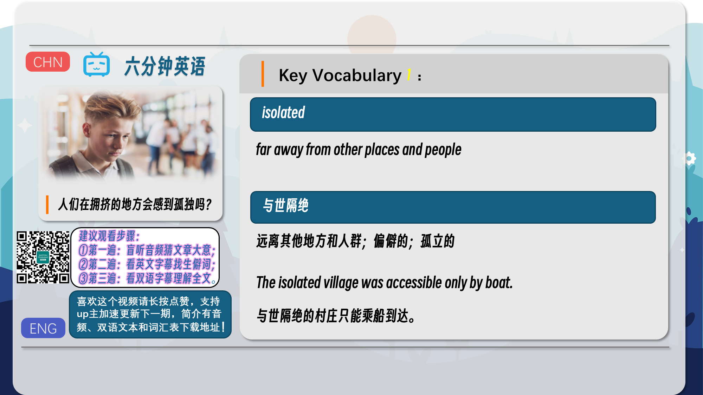
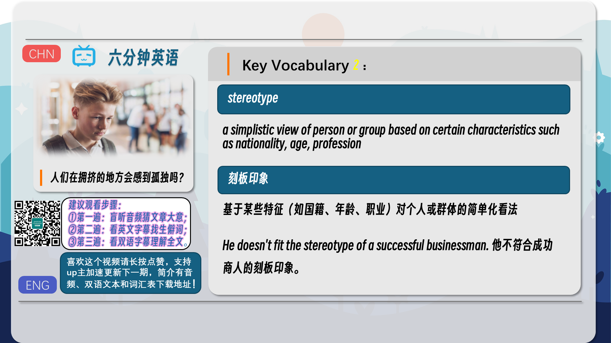
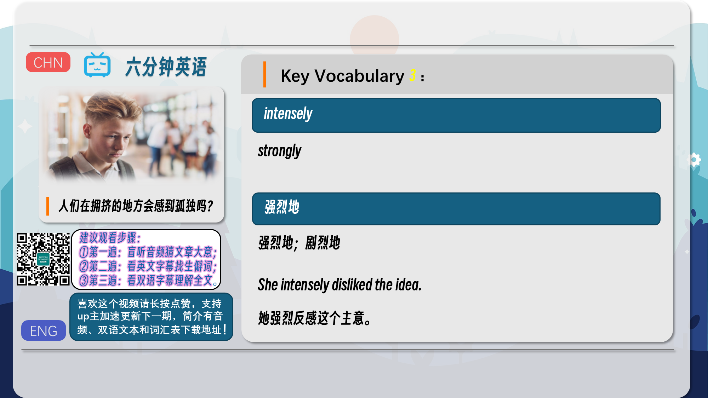
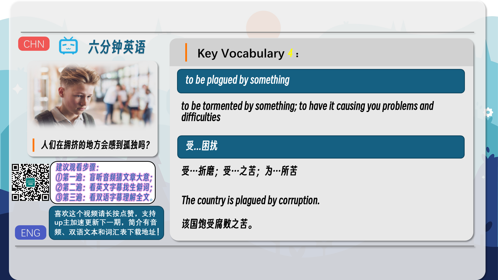
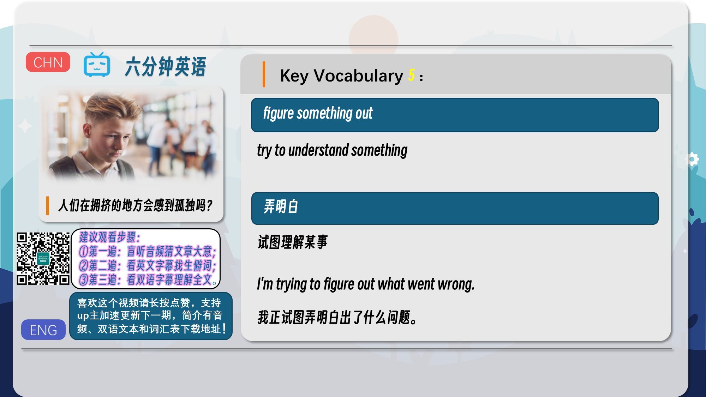

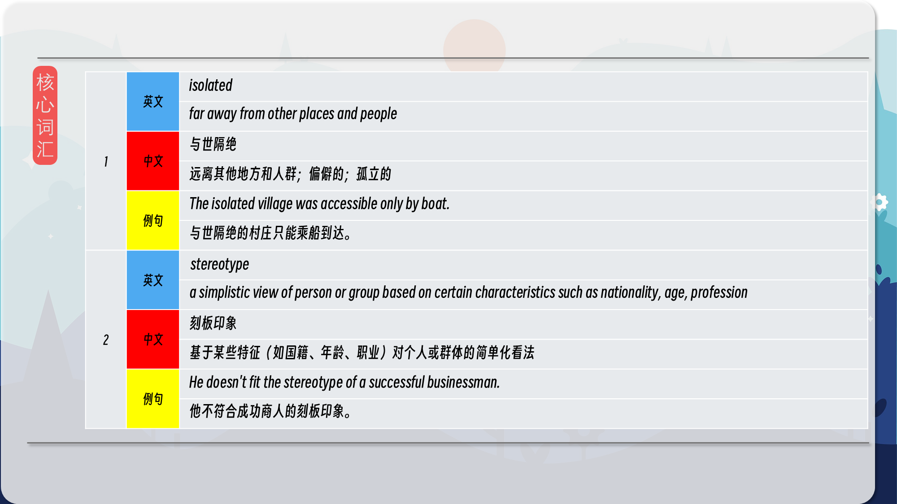
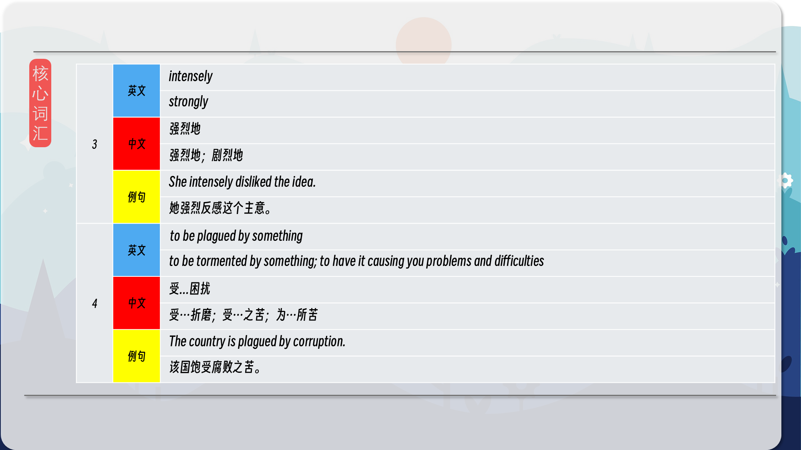
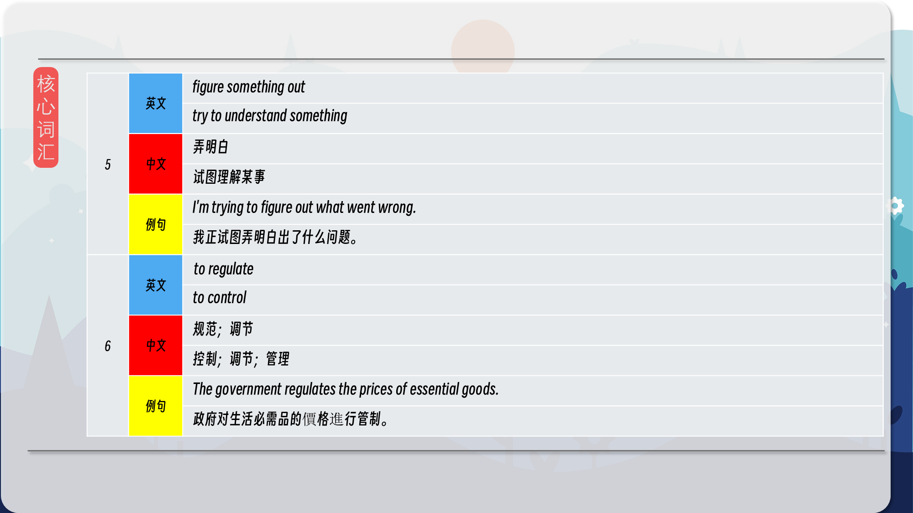
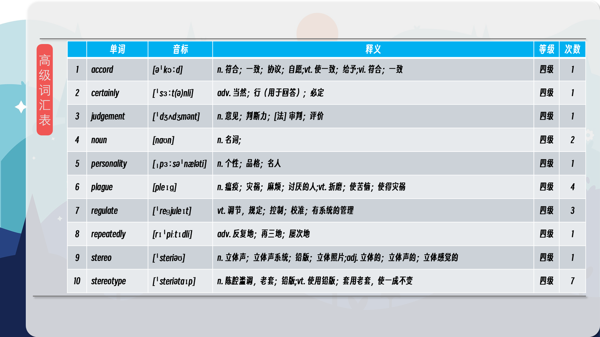
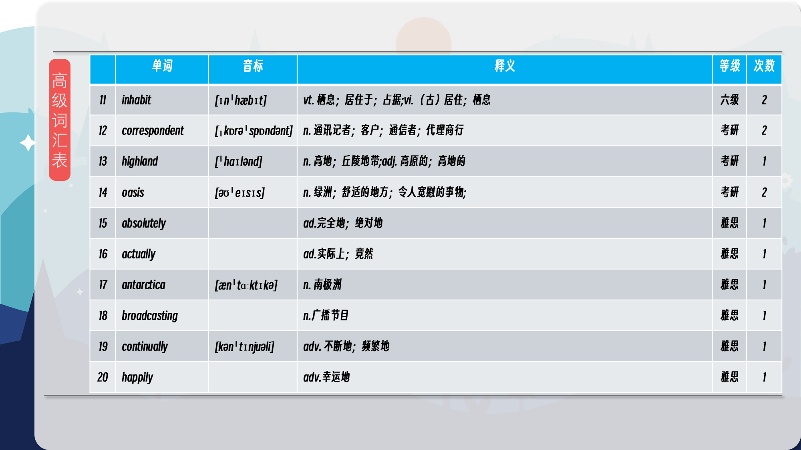
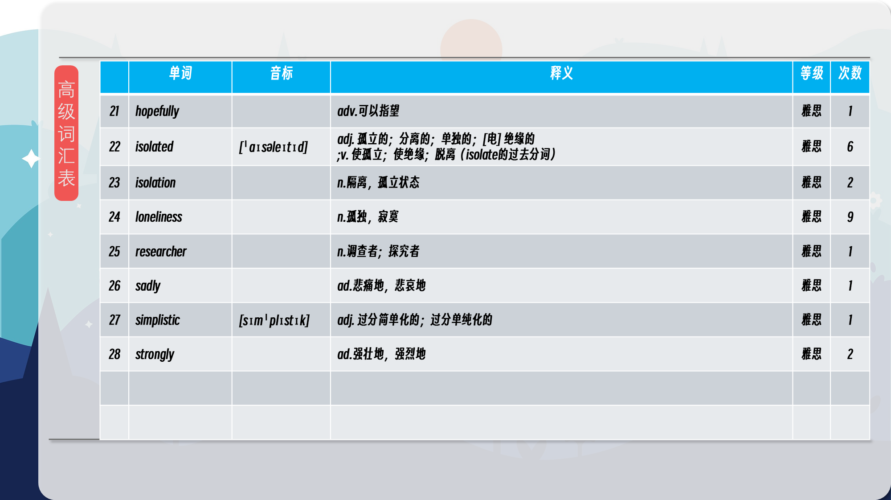

### 【核心词汇】
#### isolated
far away from other places and people
与世隔绝
远离其他地方和人群；偏僻的；孤立的
The isolated village was accessible only by boat.
与世隔绝的村庄只能乘船到达。
#### stereotype
a simplistic view of person or group based on certain characteristics such as nationality, age, profession
刻板印象
基于某些特征（如国籍、年龄、职业）对个人或群体的简单化看法
He doesn't fit the stereotype of a successful businessman.
他不符合成功商人的刻板印象。
#### intensely
strongly
强烈地
强烈地；剧烈地
She intensely disliked the idea.
她强烈反感这个主意。
#### to be plagued by something
to be tormented by something; to have it causing you problems and difficulties
受...困扰
受…折磨；受…之苦；为…所苦
The country is plagued by corruption.
该国饱受腐败之苦。
#### figure something out
try to understand something
弄明白
试图理解某事
I'm trying to figure out what went wrong.
我正试图弄明白出了什么问题。
#### to regulate
to control
规范；调节
控制；调节；管理
The government regulates the prices of essential goods.
政府对生活必需品的價格進行管制。

在公众号里输入6位数字，获取【对话音频、英文文本、中文翻译、核心词汇和高级词汇表】电子档，6位数字【暗号】在文章的最后一张图片，如【220728】，表示22年7月28日这一期。公众号没有的文章说明还没有制作相关资料。年度合集在B站【六分钟英语】工房获取，每年共计300+文档，感谢支持！