### 【英文脚本】
Neil
Hello and welcome to 6 Minute English, I'm Neil.

Catherine
And I'm Catherine.

Neil
Catherine, what's the connection between hierarchies, managers and chickens?

Catherine
Well, I don't know Neil, but I'm, sure you're going to tell me.

Neil
First of all, could you explain for our listeners what a hierarchy is?

Catherine
Of course! A hierarchy is a way of organising people. For example, in a company, where there are people working at different levels. You've got bosses, managers and workers. The workers do the work and the managers have meetings that stop the workers doing the work!

Neil
But where do the chickens come in? We'll find out shortly, but first here is today's question and it is – surprise, surprise – about chickens. What is the record number of eggs laid by one chicken in a year? Is it: a: 253 b: 371 c: 426 What do you think Catherine?

Catherine
Well, I think most chickens lay an egg once a day, so I think it's 371.

Neil
Well, we will have an answer later in the programme. Now, for hierarchies and chickens. In the radio programme The Joy of 9 to 5, produced by Somethin' Else for the BBC, entrepreneur Margaret Heffernan described an experiment. In this experiment, researchers compared the egg production of a group of average chickens to a group of super-chickens. That's chickens with an above average egg production. Which was the most successful? Here's Margaret Heffernan, and by the way, the noun for a group of chickens is a flock.

Margaret Heffernan
He compares the two flocks over six generations. The average flock just gets better and better and better. Egg production increases dramatically. The super-flock of super-chickens, at the end of six generations, all but three are dead, because the other three have killed the rest. They've achieved their individual productivity by suppressing the productivity of the rest. And that's what we do at work.

Neil
Which flock was most successful?

Catherine
Well, the super-flock actually killed each other, so it turned out that the average flock laid more eggs in total and was more successful.

Neil
Yes, but why was that?

Catherine
Well, the super-chickens must have seen their other flock members not as colleagues, but as competitors. Now to understand this, we have to start with the word productivity. This noun refers to the amount of work that's done. So, on an individual level, the super- chickens achieved productivity because they suppressed the productivity of their flock members. Suppressed here means they 'stopped the other chickens from being productive' by killing them.

Neil
So, what do we learn from this experiment?

Catherine
Well, Margaret Heffernan suggests that we see this kind of behaviour in the human workplace. When everyone is equal, productivity is high, but as soon as there's a hierarchy - as soon as there are managers - things can go wrong because not all managers see their role as making life easier for the workers. They demonstrate their productivity as managers, by interfering with the productivity of the workers.

Neil
But there are other experiments which show that chickens are productive in a hierarchy. How are those hierarchies different though? Here's Margaret Heffernan again.

Margaret Heffernan
So chickens have an inbuilt or, if you like, an inherited hierarchy - that's where we get the term pecking order from. But it's one that they create among themselves, rather than one that's imposed upon them.

Neil
So, which hierarchy works, at least for chickens?

Catherine
Well, the best hierarchy is one that isn't imposed. That means a good hierarchy isn't forced on the chickens. They do well when they create the hierarchy themselves, naturally. They work out the pecking order themselves.

Neil
Pecking order is a great phrase. We use it to describe levels of importance in an organisation. The more important you are, the higher in the pecking order you are. Where does this phrase originate?

Catherine
Well, pecking describes what chickens do with their beaks. They hit or bite other chickens with them. And the most important or dominant chickens, peck all the others. The top chicken does all the pecking, middle-level chickens get pecked and do some pecking themselves, and some chickens are only pecked by other chickens. So, there is a definite pecking order in chickens.

Neil
Right, time to review this week's vocabulary, but before that let's have the answer to the quiz. I asked what the record number of eggs laid by a single chicken in a year was. The options were: a: 253 b: 371 c: 426 What did you say, Catherine?

Catherine
I said 371.

Neil
Well, lucky you! You're definitely top of the pecking order, aren't you? Because you are right!

Catherine
That's a lot of eggs!

Neil
Indeed. Now, the vocabulary. We are talking about hierarchies - a way to organise a society or workplace with different levels of importance.

Catherine
An expression with a similar meaning is pecking order, which relates to how important someone, or a chicken, is, within a hierarchy.

Neil
A group of chickens is a flock. It's also the general collective noun for birds as well, not just chickens.

Catherine
Another of our words was the noun productivity, which refers to the amount of work that is done.

Neil
And if you suppress someone's productivity, you stop them from being as productive as they could be.

Catherine
And finally, there was the verb to impose. If you impose something, you force it on people. For example, the government imposed new taxes on fuel.

Neil
Well that is the end of the programme. For more from us though, check out Instagram, Facebook, Twitter, YouTube, and of course, our App! Don't forget the website as well - bbclearningenglish.com. See you soon, bye.

Catherine
Bye!

### 【中英文双语脚本】
Neil(尼尔)
Hello and welcome to 6 Minute English, I'm Neil.
大家好，欢迎来到六分钟 English，我是 Neil。

Catherine(凯瑟 琳)
And I'm Catherine.
我是 Catherine。

Neil(尼尔)
Catherine, what's the connection between hierarchies, managers and chickens?
Catherine，等级制度、管理者和鸡之间有什么联系？

Catherine(凯瑟 琳)
Well, I don't know Neil, but I'm, sure you're going to tell me.
嗯，我不认识 Neil，但我确信你会告诉我的。

Neil(尼尔)
First of all, could you explain for our listeners what a hierarchy is?
首先，您能为我们的听众解释一下什么是层次结构吗？

Catherine(凯瑟 琳)
Of course! A hierarchy is a way of organising people. For example, in a company, where there are people working at different levels. You've got bosses, managers and workers. The workers do the work and the managers have meetings that stop the workers doing the work!
答案是肯定的！等级制度是一种组织人员的方式。例如，在一家公司中，有不同级别的人。你有老板、经理和工人。工人做工作，经理开会阻止工人做工作！

Neil(尼尔)
But where do the chickens come in? We'll find out shortly, but first here is today's question and it is – surprise, surprise – about chickens. What is the record number of eggs laid by one chicken in a year? Is it: a: 253 b: 371 c: 426 What do you think Catherine?
但是鸡从哪里来呢？我们很快就会知道，但首先是今天的问题，它是 —— 惊喜，惊喜 —— 关于鸡。一只鸡一年产下的创纪录的鸡蛋数量是多少？是： a： 253 b： 371 c： 426 你怎么看 凯瑟琳？

Catherine(凯瑟 琳)
Well, I think most chickens lay an egg once a day, so I think it's 371.
嗯，我认为大多数鸡每天下一次蛋，所以我认为是 371。

Neil(尼尔)
Well, we will have an answer later in the programme. Now, for hierarchies and chickens. In the radio programme The Joy of 9 to 5, produced by Somethin' Else for the BBC, entrepreneur Margaret Heffernan described an experiment. In this experiment, researchers compared the egg production of a group of average chickens to a group of super-chickens. That's chickens with an above average egg production. Which was the most successful? Here's Margaret Heffernan, and by the way, the noun for a group of chickens is a flock.
好吧，我们将在节目的后面给出答案。现在，对于层次结构和鸡。在 Somethin' Else 为 BBC 制作的广播节目 The Joy of 9 to 5 中，企业家 Margaret Heffernan 描述了一项实验。在这个实验中，研究人员比较了一组普通鸡和一组超级鸡的产蛋量。那是产蛋量高于平均水平的鸡。哪个最成功？这是 Margaret Heffernan，顺便说一句，一群鸡的名词是一群鸡。

Margaret Heffernan(玛格丽特·赫弗南)
He compares the two flocks over six generations. The average flock just gets better and better and better. Egg production increases dramatically. The super-flock of super-chickens, at the end of six generations, all but three are dead, because the other three have killed the rest. They've achieved their individual productivity by suppressing the productivity of the rest. And that's what we do at work.
他将这两个羊群进行了六代的比较。普通的羊群变得越来越好。产蛋量急剧增加。超级鸡的超级群，在六代结束时，除了三个之外，其他都死了，因为其他三个已经杀死了其余的。他们通过压制其他人的生产力来实现自己的个人生产力。这就是我们在工作中所做的。

Neil(尼尔)
Which flock was most successful?
哪个鸡群最成功？

Catherine(凯瑟 琳)
Well, the super-flock actually killed each other, so it turned out that the average flock laid more eggs in total and was more successful.
嗯，超级鸡群实际上是互相残杀的，所以事实证明，普通鸡群总共产下更多的蛋，而且更成功。

Neil(尼尔)
Yes, but why was that?
是的，但为什么呢？

Catherine(凯瑟 琳)
Well, the super-chickens must have seen their other flock members not as colleagues, but as competitors. Now to understand this, we have to start with the word productivity. This noun refers to the amount of work that's done. So, on an individual level, the super- chickens achieved productivity because they suppressed the productivity of their flock members. Suppressed here means they 'stopped the other chickens from being productive' by killing them.
好吧，超级鸡一定把他们的其他鸡群成员看作不是同事，而是竞争对手。现在要理解这一点，我们必须从生产力这个词开始。这个名词指的是完成的工作量。因此，在个体层面上，超级鸡之所以能提高生产力，是因为它们抑制了鸡群成员的生产力。这里的 suppressed 意味着他们通过杀死其他鸡来“阻止其他鸡生产”。

Neil(尼尔)
So, what do we learn from this experiment?
那么，我们从这个实验中学到了什么呢？

Catherine(凯瑟 琳)
Well, Margaret Heffernan suggests that we see this kind of behaviour in the human workplace. When everyone is equal, productivity is high, but as soon as there's a hierarchy - as soon as there are managers - things can go wrong because not all managers see their role as making life easier for the workers. They demonstrate their productivity as managers, by interfering with the productivity of the workers.
Margaret Heffernan 认为，我们在人类工作场所看到了这种行为。当每个人都平等时，生产力会很高，但是一旦有等级制度 —— 只要有经理 —— 事情就会出错，因为并非所有经理都认为他们的角色是让员工的生活更轻松。他们通过干扰工人的生产力来展示他们作为管理者的生产力。

Neil(尼尔)
But there are other experiments which show that chickens are productive in a hierarchy. How are those hierarchies different though? Here's Margaret Heffernan again.
但还有其他实验表明，鸡在等级制度中是有生产力的。不过，这些层次结构有何不同？玛格丽特·赫弗南 又来了。

Margaret Heffernan(玛格丽特·赫弗南)
So chickens have an inbuilt or, if you like, an inherited hierarchy - that's where we get the term pecking order from. But it's one that they create among themselves, rather than one that's imposed upon them.
所以鸡有一个内置的，或者如果你愿意的话，有一个继承的层次结构 - 这就是我们得到术语 啄食顺序 的地方。但这是他们自己创造的，而不是强加给他们的。

Neil(尼尔)
So, which hierarchy works, at least for chickens?
那么，至少对鸡来说，哪种层次结构是有效的呢？

Catherine(凯瑟 琳)
Well, the best hierarchy is one that isn't imposed. That means a good hierarchy isn't forced on the chickens. They do well when they create the hierarchy themselves, naturally. They work out the pecking order themselves.
嗯，最好的等级制度是没有强加的等级制度。这意味着良好的等级制度不会强加给鸡。自然，当他们自己创建层次结构时，他们会做得很好。他们自己制定啄食顺序。

Neil(尼尔)
Pecking order is a great phrase. We use it to describe levels of importance in an organisation. The more important you are, the higher in the pecking order you are. Where does this phrase originate?
啄食顺序是一个很棒的短语。我们用它来描述组织中的重要性级别。你越重要，你的啄食顺序就越高。这句话从何而来？

Catherine(凯瑟 琳)
Well, pecking describes what chickens do with their beaks. They hit or bite other chickens with them. And the most important or dominant chickens, peck all the others. The top chicken does all the pecking, middle-level chickens get pecked and do some pecking themselves, and some chickens are only pecked by other chickens. So, there is a definite pecking order in chickens.
嗯，啄是指鸡用喙做什么。他们用它们打或咬其他鸡。而最重要或占主导地位的鸡，啄所有其他鸡。最上面的鸡会啄所有的东西，中等等级的鸡会被啄食并自己做一些啄食，有些鸡只被其他鸡啄食。所以，鸡的啄食顺序是明确的。

Neil(尼尔)
Right, time to review this week's vocabulary, but before that let's have the answer to the quiz. I asked what the record number of eggs laid by a single chicken in a year was. The options were: a: 253 b: 371 c: 426 What did you say, Catherine?
好了，是时候复习本周的词汇了，但在此之前，让我们先了解一下测验的答案。我问一只鸡一年产蛋的记录数量是多少。选项是： a： 253 b： 371 c： 426 你说什么，凯瑟琳？

Catherine(凯瑟 琳)
I said 371.
我说 371。

Neil(尼尔)
Well, lucky you! You're definitely top of the pecking order, aren't you? Because you are right!
好吧，你很幸运！你绝对是排名靠前的，不是吗？因为你是对的！

Catherine(凯瑟 琳)
That's a lot of eggs!
好多鸡蛋啊！

Neil(尼尔)
Indeed. Now, the vocabulary. We are talking about hierarchies - a way to organise a society or workplace with different levels of importance.
事实上。现在，词汇。我们谈论的是等级制度 - 一种组织具有不同重要性的社会或工作场所的方式。

Catherine(凯瑟 琳)
An expression with a similar meaning is pecking order, which relates to how important someone, or a chicken, is, within a hierarchy.
具有相似含义的表达是 peking order，它与某人或一只鸡在层次结构中的重要性有关。

Neil(尼尔)
A group of chickens is a flock. It's also the general collective noun for birds as well, not just chickens.
一群鸡是一群鸡。它也是 birds 的通用集体名词，而不仅仅是 chickens。

Catherine(凯瑟 琳)
Another of our words was the noun productivity, which refers to the amount of work that is done.
我们的另一个词是名词 productivity，它指的是完成的工作量。

Neil(尼尔)
And if you suppress someone's productivity, you stop them from being as productive as they could be.
如果你压制某人的生产力，你就会阻止他们尽可能地提高他们的生产力。

Catherine(凯瑟 琳)
And finally, there was the verb to impose. If you impose something, you force it on people. For example, the government imposed new taxes on fuel.
最后，还有动词 to impose。如果你强加了什么，你就把它强加给人们。例如，政府对燃料征收新的税。

Neil(尼尔)
Well that is the end of the programme. For more from us though, check out Instagram, Facebook, Twitter, YouTube, and of course, our App! Don't forget the website as well - bbclearningenglish.com. See you soon, bye.
好了，节目就到此为止。有关我们的更多信息，请查看 Instagram、Facebook、Twitter、YouTube，当然还有我们的应用节目！也不要忘记网站 - bbclearningenglish.com。再见。

Catherine(凯瑟 琳)
Bye!
再见！

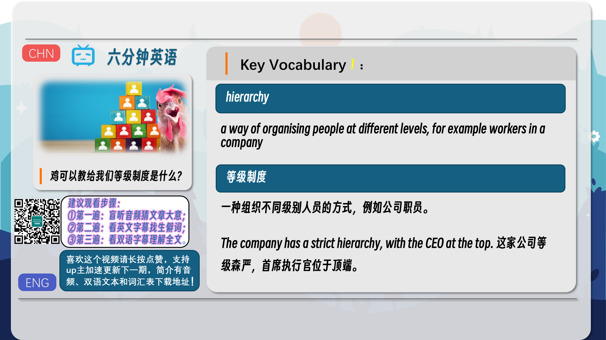
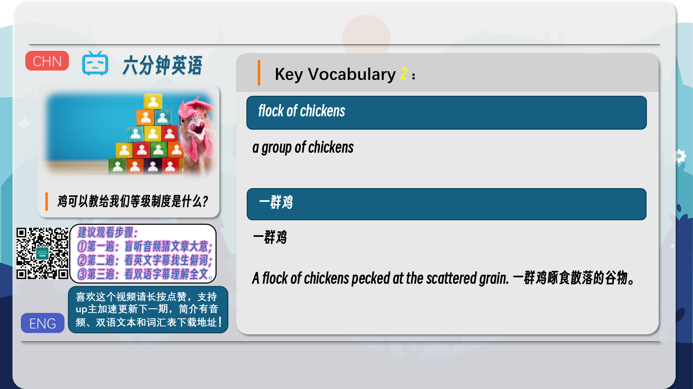
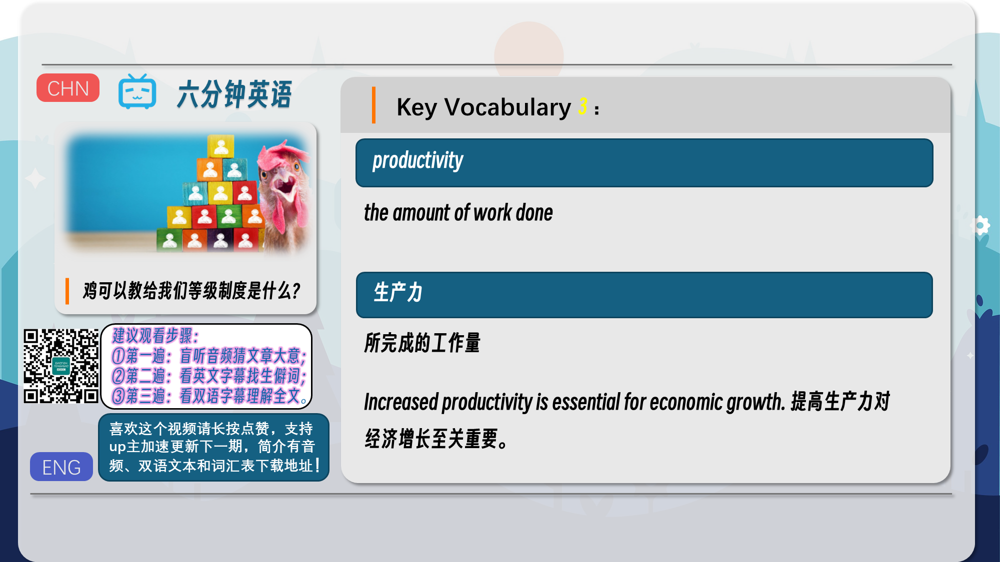
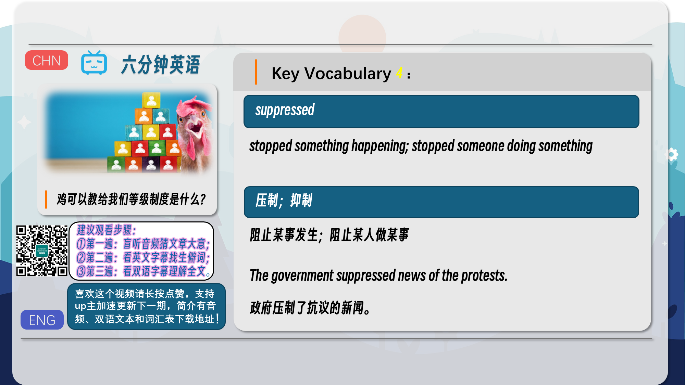
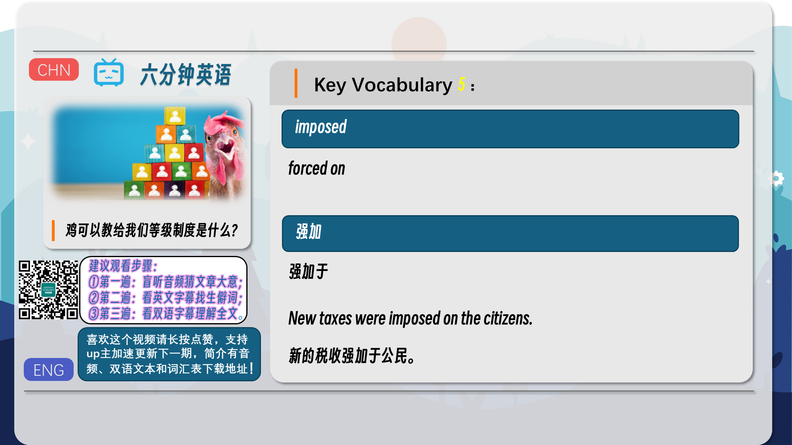
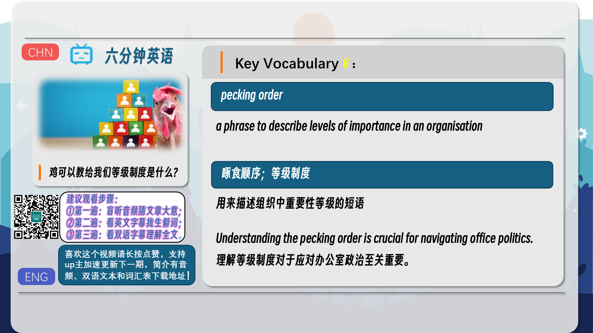
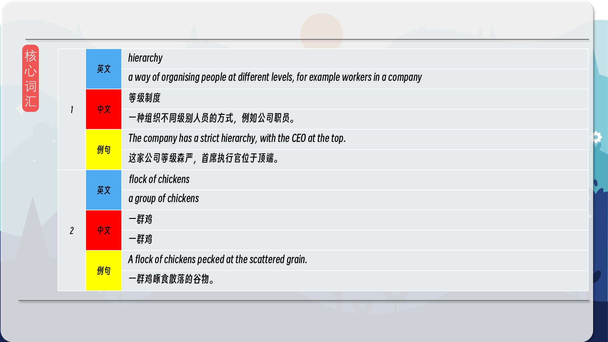
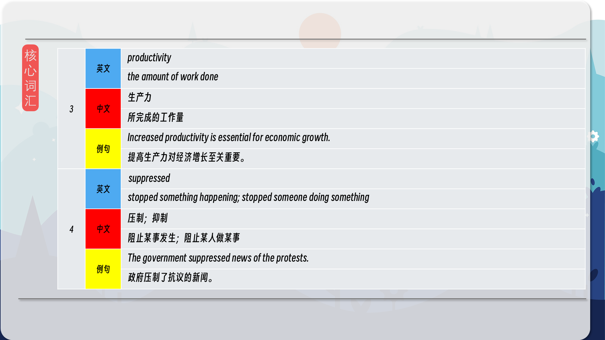
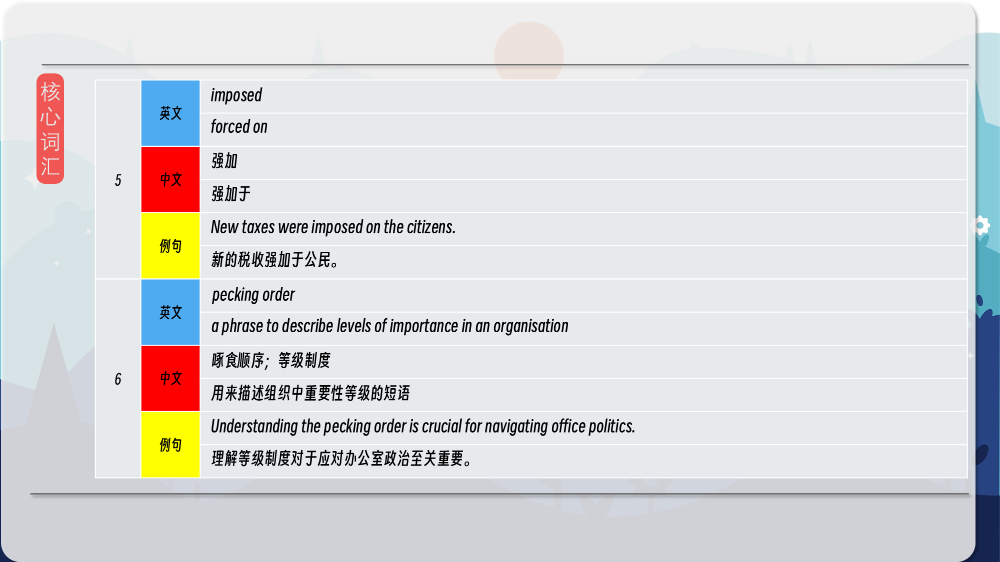
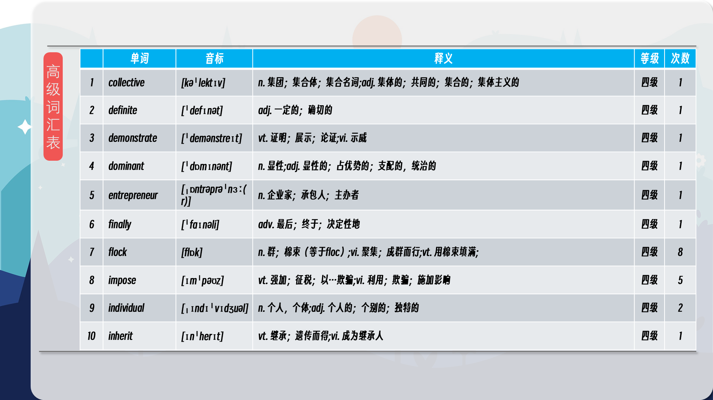
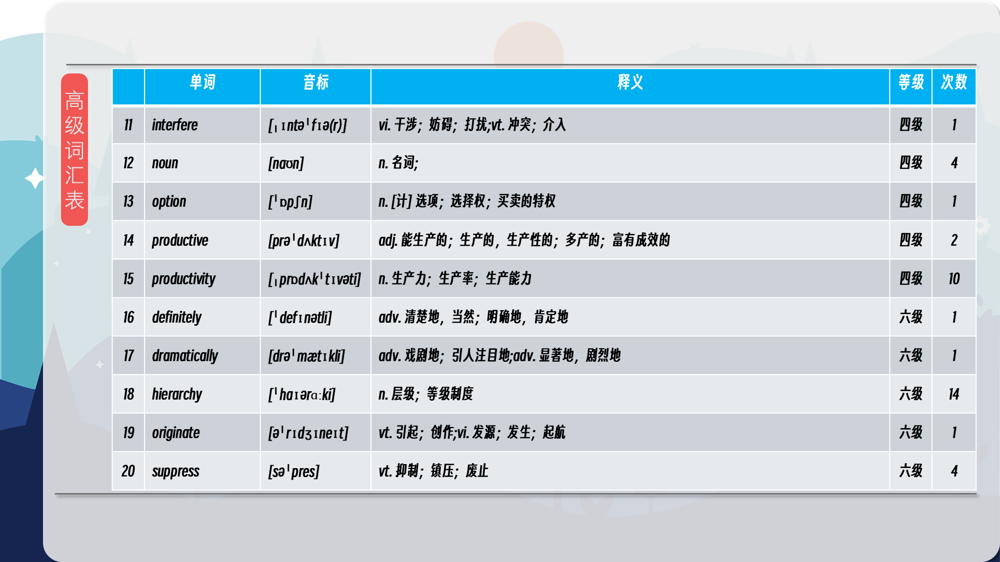
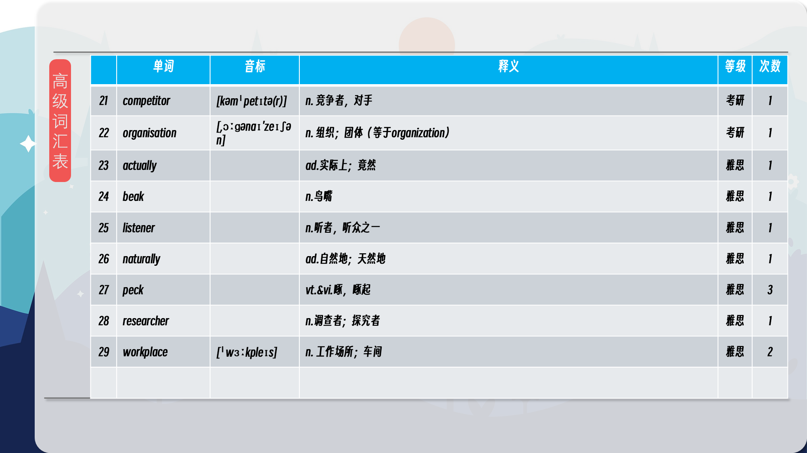

### 【核心词汇】
#### hierarchy
a way of organising people at different levels, for example workers in a company
等级制度
一种组织不同级别人员的方式，例如公司职员。
The company has a strict hierarchy, with the CEO at the top.
这家公司等级森严，首席执行官位于顶端。
#### flock of chickens
a group of chickens
一群鸡
一群鸡
A flock of chickens pecked at the scattered grain.
一群鸡啄食散落的谷物。
#### productivity
the amount of work done
生产力
所完成的工作量
Increased productivity is essential for economic growth.
提高生产力对经济增长至关重要。
#### suppressed
stopped something happening; stopped someone doing something
压制；抑制
阻止某事发生；阻止某人做某事
The government suppressed news of the protests.
政府压制了抗议的新闻。
#### imposed
forced on
强加
强加于
New taxes were imposed on the citizens.
新的税收强加于公民。
#### pecking order
a phrase to describe levels of importance in an organisation
啄食顺序；等级制度
用来描述组织中重要性等级的短语
Understanding the pecking order is crucial for navigating office politics.
理解等级制度对于应对办公室政治至关重要。

在公众号里输入6位数字，获取【对话音频、英文文本、中文翻译、核心词汇和高级词汇表】电子档，6位数字【暗号】在文章的最后一张图片，如【220728】，表示22年7月28日这一期。公众号没有的文章说明还没有制作相关资料。年度合集在B站【六分钟英语】工房获取，每年共计300+文档，感谢支持！