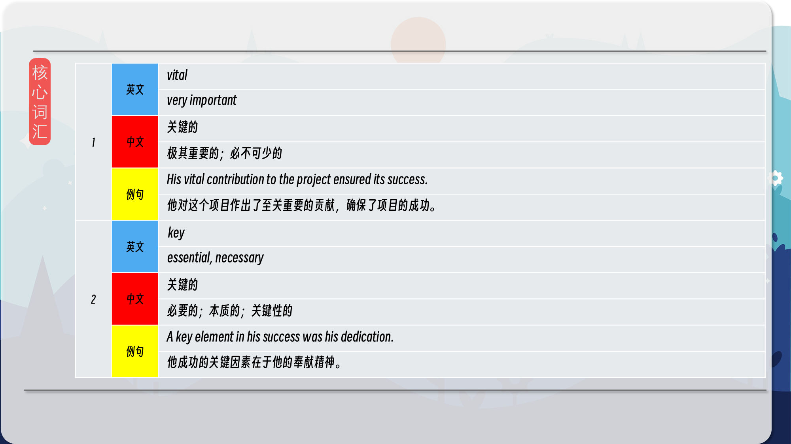
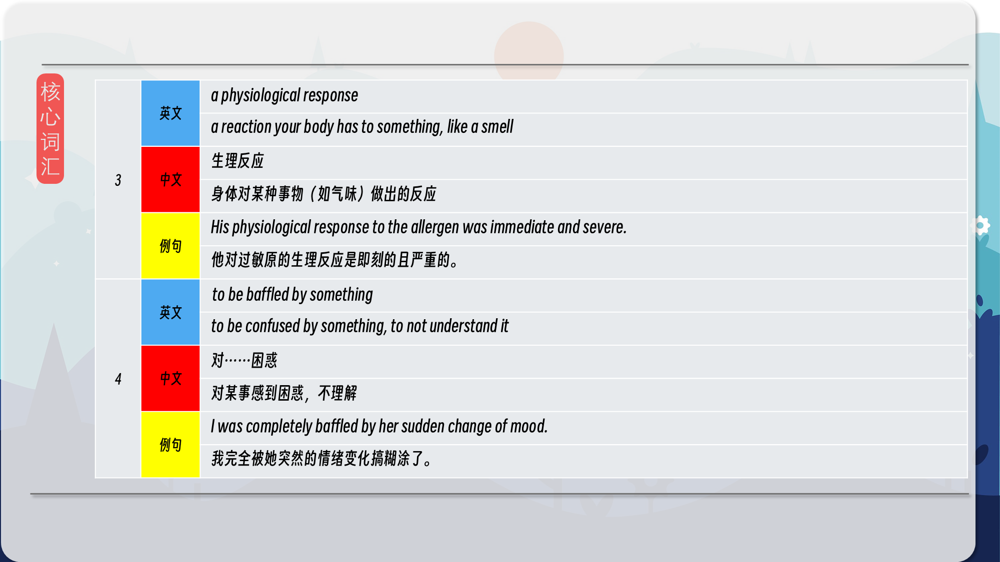
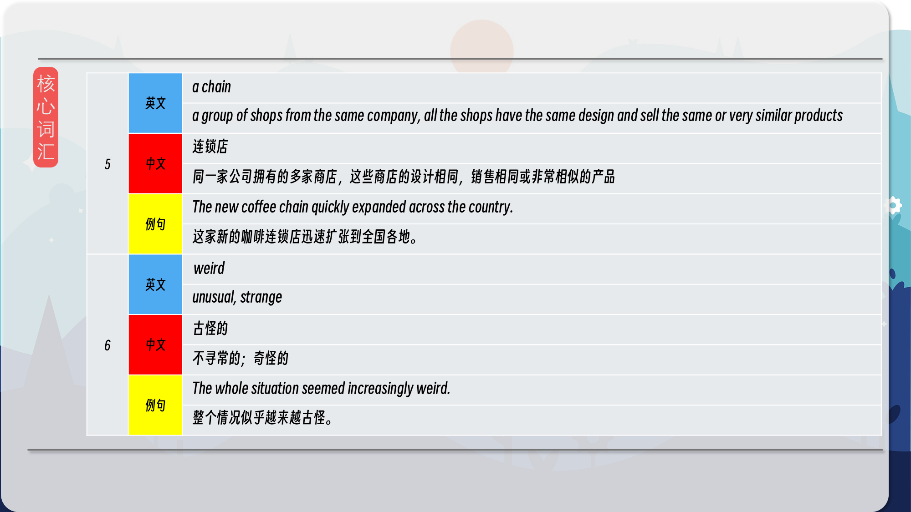
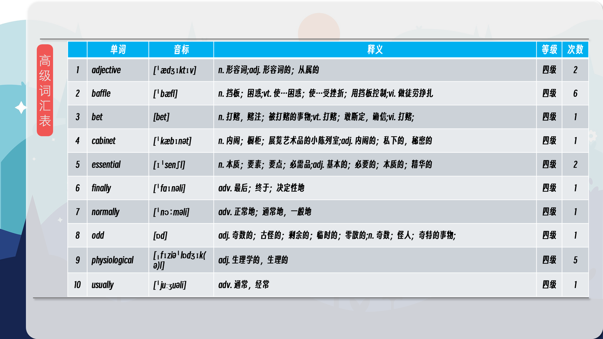
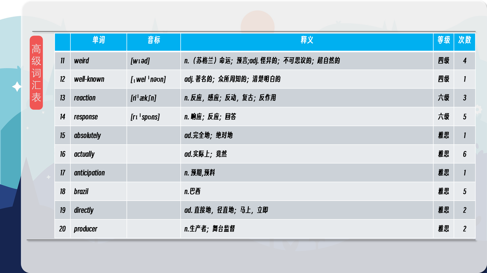

### 【英文脚本】
Neil
Hello. Welcome to 6 Minute English, I'm Neil.
 
Catherine
And I'm Catherine.
 
Neil
Catherine, I'm going to start this programme with a quick test, just for you.
 
Catherine
Ooo, I love tests!
 
Neil
Complete this phrase: Wake up and smell the...
 
Catherine
Coffee Neil! It's coffee. I have to say, I love coffee, it's great.
 
Neil
OK, so do you drink much?
 
Catherine
Well, just a couple of cups, you know.
 
Neil
Every day?
 
Catherine
No, every hour! I love coffee, don't you like coffee, Neil?
 
Neil
I do but maybe not as much as you! What's the best thing about it?
 
Catherine
It's the smell. It's got to be the smell. You know, when you open the packet, it's great isn't it?
 
Neil
Yes, but it never quite tastes as good as it smells, does it?
 
Catherine
Well no, not really. It's always a little disappointing. I live in hope, another cup, I think it will be better. I might change brands actually and try a different one.
 
Neil
OK, you've had quite a lot of coffee today, haven't you?
 
Catherine
Just the usual six cups.
 
Neil
Well, our topic today is the smell of coffee and coffee is also the subject of today's question. The world's biggest producer of coffee is...
 
Catherine
Brazil! Brazil!
 
Neil
Yes, yes, but that's not the question. The question is, Brazil is the biggest coffee producer, which is the second largest coffee producing country? Is it: a: Colombia b: Vietnam c: Ethiopia
 
Catherine
Right, so it's not Brazil but I bet it's another South American country, so I'm going to go for Columbia. Columbia, is that right?
 
Neil
OK, we'll have the answer later in the programme by which time, maybe the caffeine will have left your body Catherine. Tim Hayward is a coffee shop owner. He appeared in the BBC Radio 4 programme The Kitchen Cabinet. How important does he say the smell of coffee is?
 
Tim Hayward, Coffee shop owner
It's absolutely vital, it's the key thing. And when you walk in to the coffee shop in the morning and that smell hits you, you're getting physiological responses.
 
Neil
So how important is it?
 
Catherine
I'm feeling a bit calmer now. Tim Hayward says the smell of coffee is vital. That means it's very important, it's perhaps the most important thing. And he backs this up by saying that it's the key thing. Something that's key is something that is essential, it's really important.
 
Neil
And he says that when you experience the smell, when the smell hits you, you get a physiological response. This phrase means your body has a reaction to the smell of coffee. Perhaps your mouth begins to water in anticipation. Catherine, when you get a coffee, do you normally have it there or take it away?
 
Catherine
Well, I usually take it away, although if I'm feeling really in need of a coffee hit, I might have one there and then get another one and take with me.
 
Neil
Can you describe the container you are given when you have a coffee to go?
 
Catherine
Yes, it's in a tall paper cup with a lid. And the lid has a hole in it so that I can drink that lovely coffee.
 
Neil
Don't you think that's a problem? I mean, we know how important the smell is, so what is the effect of the lid on that experience?
 
Catherine
The effect of the lid?
 
Neil
Yes. Well here's Tim Hayward again talking about coffee being served with lids.
 
Tim Hayward
What baffles me is that how many of the large coffee chains actually sell a product in a cup that removes the smell. So you walk into the coffee shop, you get the smell, but when you actually take the drink out you are drinking it from something that is designed to deliver the hot liquid directly past your tongue but stop any smell coming up to your nose. That's just weird.
 
Neil
So what is he describing there?
 
Catherine
I see now, yes, He's talking about the big coffee chains. A chain is a company that has lots of its stores in towns and cities sometimes around the world. I think we can all think of a few well-known coffee chains. He says that by putting a lid on take away cups, you're actually blocking the smell - that smell that is really important to the coffee experience.
 
Neil
Yes, and he says that he finds that weird, which is a way of saying he finds it unusual, thinks it's strange, odd. So much so that he says it baffles him. If you are baffled by something, you find it confusing, you can't really understand it. Here's Tim Hayward again.
 
Tim Hayward
What baffles me is that how many of the large coffee chains actually sell a product in a cup that removes the smell. So you walk into the coffee shop, you get the smell, but when you actually take the drink out you are drinking it from something that is designed to deliver the hot liquid directly past your tongue but stop any smell coming up to your nose. That's just weird.
 
Neil
That was coffee shop owner Tim Hayward. Right before we have another cup of this week's vocabulary, let's get the answer to the question. After Brazil, which country produces most coffee? Is it: a: Colombia b: Vietnam c: Ethiopia Catherine, you said?
 
Catherine
I said it was a: Colombia.
 
Neil
Ah, sorry, no extra coffee for you today! The answer is Vietnam. And now on to the vocabulary we looked at. Take it away Catherine.
 
Catherine
So the first word was vital, which is an adjective that means very important. And another word with a very similar meaning was key, meaning essential.
 
Neil
Next we had the phrase physiological responses. Physiological refers to what our bodies do and a response is a reaction. So a physiological response is a reaction your body has to something, like the smell of coffee.
 
Catherine
Something that baffles you, confuses you, you don't understand it.
 
Neil
You might find something that baffles you to be weird. This adjective means unusual or strange.
 
Catherine
And finally, a chain is a group of shops from the same company with the same name.
 
Neil
Well that is the end of our programe. For more from us, check out Instagram, Facebook, Twitter, YouTube and our App and of course the website bbclearningenglish.com. See you soon, bye.
 
Catherine
Bye! Fancy a coffee?
 
Neil
I think you've had too much!
 

### 【中英文双语脚本】
Neil(尼尔)
Hello. Welcome to 6 Minute English, I'm Neil.
你好。欢迎来到六分钟 English，我是 Neil。

Catherine(凯瑟琳)
And I'm Catherine.
我是 Catherine。

Neil(尼尔)
Catherine, I'm going to start this programme with a quick test, just for you.
Catherine，我将通过一个快速测试来开始这个计划，只为你。

Catherine(凯瑟琳)
Ooo, I love tests!
噢，我喜欢测试！

Neil(尼尔)
Complete this phrase: Wake up and smell the...
完成这句话：醒来闻到...

Catherine(凯瑟琳)
Coffee Neil! It's coffee. I have to say, I love coffee, it's great.
咖啡尼尔！这是咖啡。我不得不说，我喜欢咖啡，这太棒了。

Neil(尼尔)
OK, so do you drink much?
好的，你喝很多吗？

Catherine(凯瑟琳)
Well, just a couple of cups, you know.
嗯，就几杯，你知道的。

Neil(尼尔)
Every day?
每天？

Catherine(凯瑟琳)
No, every hour! I love coffee, don't you like coffee, Neil?
不，每小时一次！我喜欢咖啡，你不喜欢咖啡吗，尼尔？

Neil(尼尔)
I do but maybe not as much as you! What's the best thing about it?
我有，但可能没有你那么多！它最好的地方是什么？

Catherine(凯瑟琳)
It's the smell. It's got to be the smell. You know, when you open the packet, it's great isn't it?
是气味。一定是气味。你知道，当你打开数据包时，它很棒，不是吗？

Neil(尼尔)
Yes, but it never quite tastes as good as it smells, does it?
是的，但它的味道从来没有像闻起来那么好，不是吗？

Catherine(凯瑟琳)
Well no, not really. It's always a little disappointing. I live in hope, another cup, I think it will be better. I might change brands actually and try a different one.
嗯，不，不是真的。这总是有点令人失望。我活在希望中，再来一杯，我觉得会更好。我实际上可能会更换品牌并尝试不同的品牌。

Neil(尼尔)
OK, you've had quite a lot of coffee today, haven't you?
好了，你今天喝了不少咖啡，不是吗？

Catherine(凯瑟琳)
Just the usual six cups.
只是通常的六杯。

Neil(尼尔)
Well, our topic today is the smell of coffee and coffee is also the subject of today's question. The world's biggest producer of coffee is...
嗯，我们今天的话题是咖啡的味道，咖啡也是今天问题的主题。世界上最大的咖啡生产商是......

Catherine(凯瑟琳)
Brazil! Brazil!
巴西！巴西！

Neil(尼尔)
Yes, yes, but that's not the question. The question is, Brazil is the biggest coffee producer, which is the second largest coffee producing country? Is it: a: Colombia b: Vietnam c: Ethiopia
是的，是的，但这不是问题。问题是，巴西是最大的咖啡生产国，而巴西是第二大咖啡生产国？是： a： 哥伦比亚 b： 越南 c： 埃塞俄比亚

Catherine(凯瑟琳)
Right, so it's not Brazil but I bet it's another South American country, so I'm going to go for Columbia. Columbia, is that right?
是的，这不是巴西，但我敢打赌这是另一个南美国家，所以我会去哥伦比亚。哥伦比亚，对吗？

Neil(尼尔)
OK, we'll have the answer later in the programme by which time, maybe the caffeine will have left your body Catherine. Tim Hayward is a coffee shop owner. He appeared in the BBC Radio 4 programme The Kitchen Cabinet. How important does he say the smell of coffee is?
好的，我们将在节目的后面有答案，到那时，也许咖啡因已经离开了你的身体，凯瑟琳。蒂姆·海沃德 （Tim Hayward） 是一位咖啡店老板。他出现在 BBC Radio 4 节目 The Kitchen Cabinet 中。他说咖啡的味道有多重要？

Tim Hayward, Coffee shop owner(TimHayward，咖啡店老板)
It's absolutely vital, it's the key thing. And when you walk in to the coffee shop in the morning and that smell hits you, you're getting physiological responses.
这绝对至关重要，这是关键。当你早上走进咖啡店时，那股气味袭来，你就会产生生理反应。

Neil(尼尔)
So how important is it?
那么它有多重要呢？

Catherine(凯瑟琳)
I'm feeling a bit calmer now. Tim Hayward says the smell of coffee is vital. That means it's very important, it's perhaps the most important thing. And he backs this up by saying that it's the key thing. Something that's key is something that is essential, it's really important.
我现在感觉平静了一些。蒂姆·海沃德 （Tim Hayward） 说，咖啡的气味至关重要。这意味着它非常重要，也许是最重要的事情。他支持这一点，说这是关键。关键是必不可少的东西，它真的很重要。

Neil(尼尔)
And he says that when you experience the smell, when the smell hits you, you get a physiological response. This phrase means your body has a reaction to the smell of coffee. Perhaps your mouth begins to water in anticipation. Catherine, when you get a coffee, do you normally have it there or take it away?
他说，当你体验到这种气味时，当气味袭来时，你会得到一种生理反应。这句话的意思是你的身体对咖啡的气味有反应。也许你的嘴巴开始在期待中流口水。Catherine，当你喝咖啡时，你通常会把它放在那儿还是带走？

Catherine(凯瑟琳)
Well, I usually take it away, although if I'm feeling really in need of a coffee hit, I might have one there and then get another one and take with me.
嗯，我通常会把它带走，但如果我真的觉得需要一杯咖啡，我可能会在那里喝一杯，然后再买一杯带走。

Neil(尼尔)
Can you describe the container you are given when you have a coffee to go?
您能描述一下当您喝咖啡外带时给您的容器吗？

Catherine(凯瑟琳)
Yes, it's in a tall paper cup with a lid. And the lid has a hole in it so that I can drink that lovely coffee.
是的，它装在一个带盖的高纸杯里。盖子上有一个洞，这样我就可以喝那杯可爱的咖啡了。

Neil(尼尔)
Don't you think that's a problem? I mean, we know how important the smell is, so what is the effect of the lid on that experience?
你不觉得这是个问题吗？我的意思是，我们知道气味有多重要，那么盖子对这种体验有什么影响呢？

Catherine(凯瑟琳)
The effect of the lid?
盖子的效果？

Neil(尼尔)
Yes. Well here's Tim Hayward again talking about coffee being served with lids.
是的。好吧，这是 Tim Hayward 再次谈论带盖咖啡。

Tim Hayward(蒂姆·海沃德)
What baffles me is that how many of the large coffee chains actually sell a product in a cup that removes the smell. So you walk into the coffee shop, you get the smell, but when you actually take the drink out you are drinking it from something that is designed to deliver the hot liquid directly past your tongue but stop any smell coming up to your nose. That's just weird.
让我感到困惑的是，有多少大型咖啡连锁店实际上销售的是带有去除气味的杯子产品。所以你走进咖啡店，你会闻到气味，但当你真正把饮料拿出来时，你是在用一种旨在将热液体直接通过你的舌头，但阻止任何气味进入你的鼻子的东西喝它。这太奇怪了。

Neil(尼尔)
So what is he describing there?
那么他在那里描述了什么呢？

Catherine(凯瑟琳)
I see now, yes, He's talking about the big coffee chains. A chain is a company that has lots of its stores in towns and cities sometimes around the world. I think we can all think of a few well-known coffee chains. He says that by putting a lid on take away cups, you're actually blocking the smell - that smell that is really important to the coffee experience.
我现在明白了，是的，他说的是大型咖啡连锁店。连锁店是一家在城镇和城市拥有大量门店的公司，有时遍布世界各地。我想我们都能想到几家知名的咖啡连锁店。他说，通过在外卖杯上盖上盖子，你实际上是在阻挡气味 —— 这种气味对咖啡体验非常重要。

Neil(尼尔)
Yes, and he says that he finds that weird, which is a way of saying he finds it unusual, thinks it's strange, odd. So much so that he says it baffles him. If you are baffled by something, you find it confusing, you can't really understand it. Here's Tim Hayward again.
是的，他说他觉得这很奇怪，这是他觉得不寻常的一种方式，认为这很奇怪，很奇怪。以至于他说这让他感到困惑。如果你对某件事感到困惑，你会觉得它很困惑，你无法真正理解它。蒂姆·海沃德 （Tim Hayward） 又来了。

Tim Hayward(蒂姆·海沃德)
What baffles me is that how many of the large coffee chains actually sell a product in a cup that removes the smell. So you walk into the coffee shop, you get the smell, but when you actually take the drink out you are drinking it from something that is designed to deliver the hot liquid directly past your tongue but stop any smell coming up to your nose. That's just weird.
让我感到困惑的是，有多少大型咖啡连锁店实际上销售的是带有去除气味的杯子产品。所以你走进咖啡店，你会闻到气味，但当你真正把饮料拿出来时，你是在用一种旨在将热液体直接通过你的舌头，但阻止任何气味进入你的鼻子的东西喝它。这太奇怪了。

Neil(尼尔)
That was coffee shop owner Tim Hayward. Right before we have another cup of this week's vocabulary, let's get the answer to the question. After Brazil, which country produces most coffee? Is it: a: Colombia b: Vietnam c: Ethiopia Catherine, you said?
那是咖啡店老板蒂姆·海沃德（Tim Hayward）。在我们又来了解本周的词汇之前，让我们来了解一下这个问题的答案。在巴西之后，哪个国家的咖啡产量最多？是： a： 哥伦比亚 b： 越南 c： 埃塞俄比亚 凯瑟琳，你说的？

Catherine(凯瑟琳)
I said it was a: Colombia.
我说是：哥伦比亚。

Neil(尼尔)
Ah, sorry, no extra coffee for you today! The answer is Vietnam. And now on to the vocabulary we looked at. Take it away Catherine.
啊，对不起，今天没有额外的咖啡给你！答案是越南。现在我们来看一下词汇。把它带走凯瑟琳。

Catherine(凯瑟琳)
So the first word was vital, which is an adjective that means very important. And another word with a very similar meaning was key, meaning essential.
所以第一个词是 vital，这是一个形容词，意思是非常重要。另一个含义非常相似的词是 key，意思是必不可少的。

Neil(尼尔)
Next we had the phrase physiological responses. Physiological refers to what our bodies do and a response is a reaction. So a physiological response is a reaction your body has to something, like the smell of coffee.
接下来，我们有 physiological responses 这个短语。生理是指我们的身体所做的事情，而反应是一种反应。因此，生理反应是您的身体对某物的反应，例如咖啡的气味。

Catherine(凯瑟琳)
Something that baffles you, confuses you, you don't understand it.
让你困惑、困惑、你不理解的东西。

Neil(尼尔)
You might find something that baffles you to be weird. This adjective means unusual or strange.
你可能会发现一些让你感到困惑的事情很奇怪。这个形容词的意思是不寻常或奇怪。

Catherine(凯瑟琳)
And finally, a chain is a group of shops from the same company with the same name.
最后，连锁店是来自同一家公司、同名的一组商店。

Neil(尼尔)
Well that is the end of our programe. For more from us, check out Instagram, Facebook, Twitter, YouTube and our App and of course the website bbclearningenglish.com. See you soon, bye.
好了，我们的计划到此结束。有关我们的更多信息，请查看 Instagram、Facebook、Twitter、YouTube 和我们的应用程序，当然还有 bbclearningenglish.com 的网站。再见。

Catherine(凯瑟琳)
Bye! Fancy a coffee?
再见！想喝杯咖啡？

Neil(尼尔)
I think you've had too much!
我觉得你吃得太多了！

### 【核心词汇】
#### vital
very important
关键的
极其重要的；必不可少的
His vital contribution to the project ensured its success.
他对这个项目作出了至关重要的贡献，确保了项目的成功。
#### key
essential, necessary
关键的
必要的；本质的；关键性的
A key element in his success was his dedication.
他成功的关键因素在于他的奉献精神。
#### a physiological response
a reaction your body has to something, like a smell
生理反应
身体对某种事物（如气味）做出的反应
His physiological response to the allergen was immediate and severe.
他对过敏原的生理反应是即刻的且严重的。
#### to be baffled by something
to be confused by something, to not understand it
对……困惑
对某事感到困惑，不理解
I was completely baffled by her sudden change of mood.
我完全被她突然的情绪变化搞糊涂了。
#### a chain
a group of shops from the same company, all the shops have the same design and sell the same or very similar products
连锁店
同一家公司拥有的多家商店，这些商店的设计相同，销售相同或非常相似的产品
The new coffee chain quickly expanded across the country.
这家新的咖啡连锁店迅速扩张到全国各地。
#### weird
unusual, strange
古怪的
不寻常的；奇怪的
The whole situation seemed increasingly weird.
整个情况似乎越来越古怪。

在公众号里输入6位数字，获取【对话音频、英文文本、中文翻译、核心词汇和高级词汇表】电子档，6位数字【暗号】在文章的最后一张图片，如【220728】，表示22年7月28日这一期。公众号没有的文章说明还没有制作相关资料。年度合集在B站【六分钟英语】工房获取，每年共计300+文档，感谢支持！