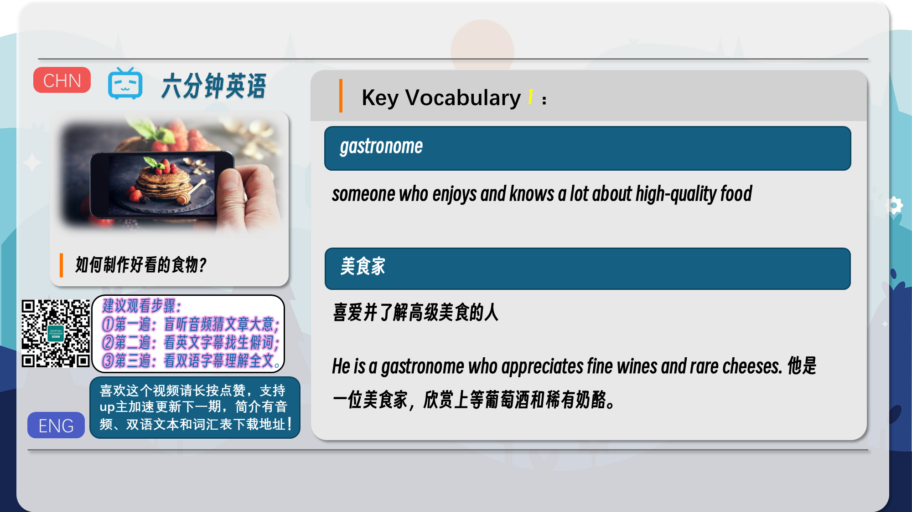
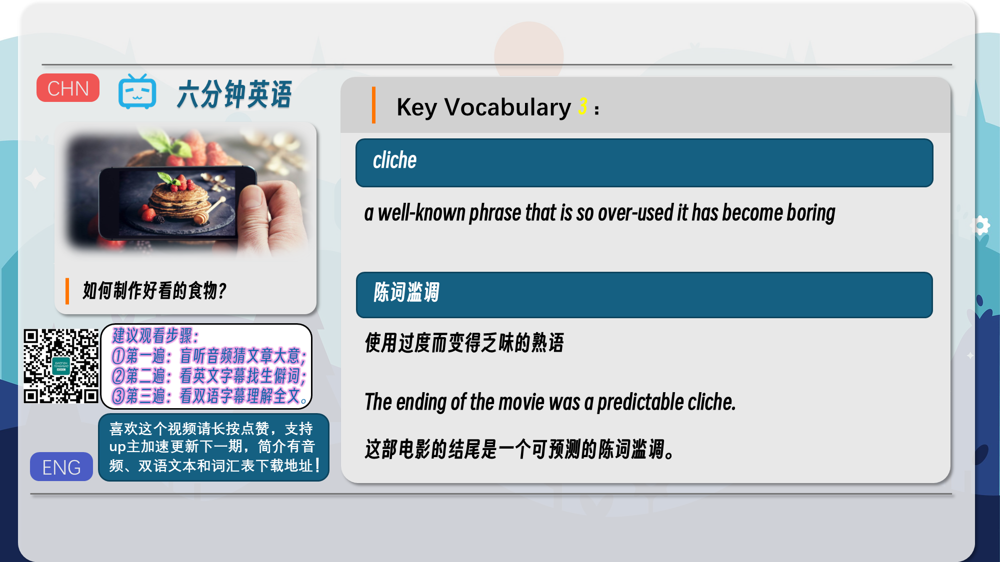
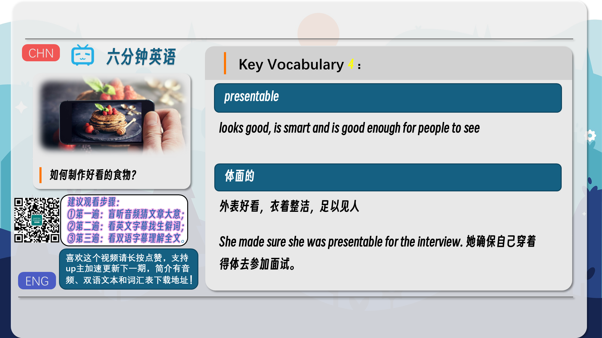
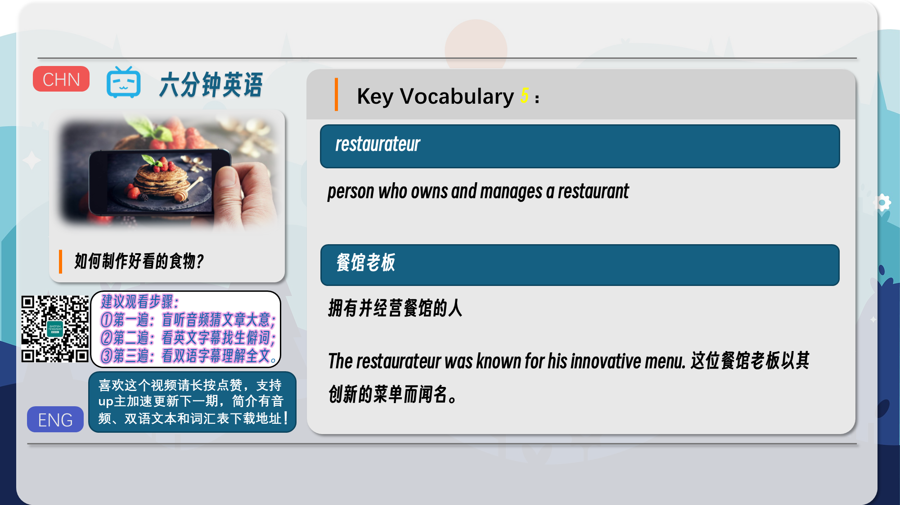
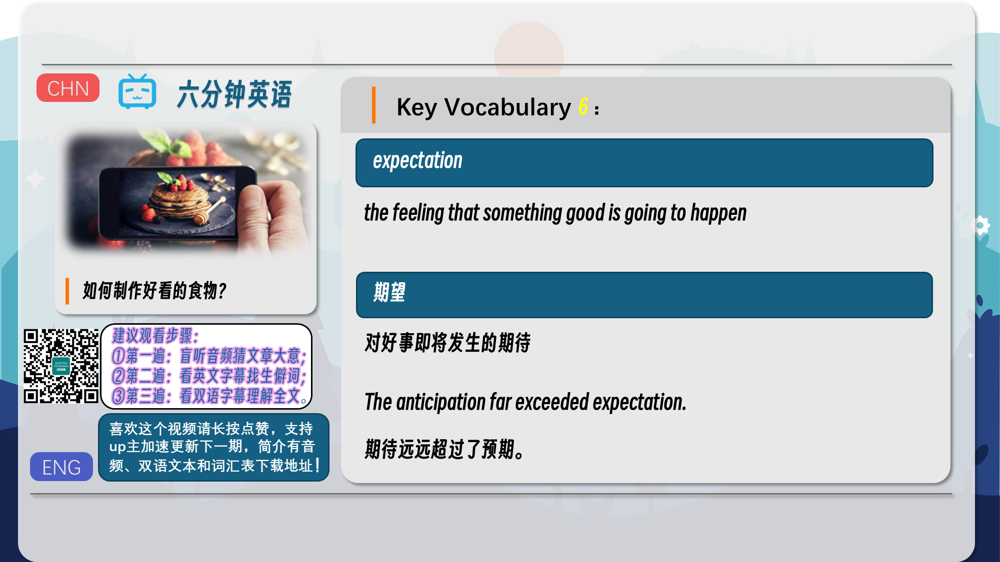
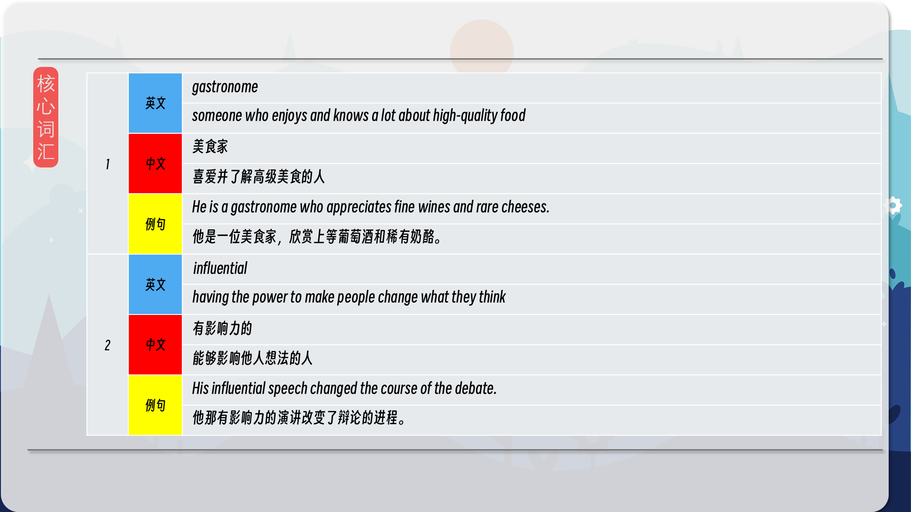
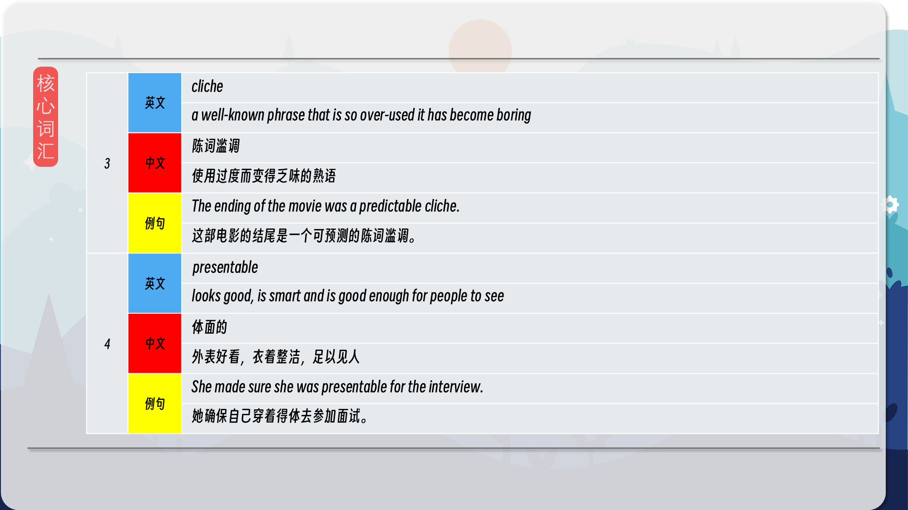
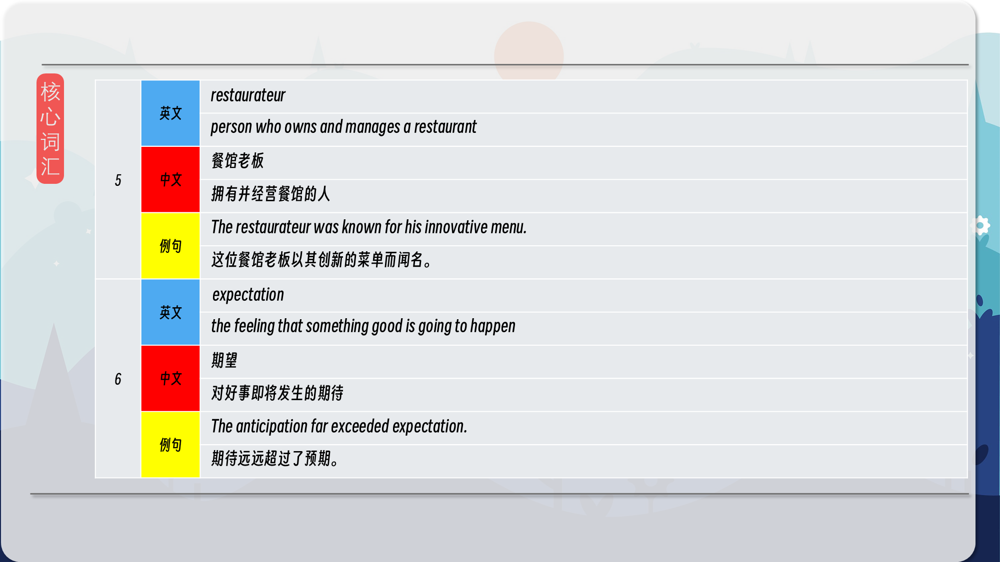

### 【英文脚本】
Neil
Hello and welcome to 6 Minute English, I'm Neil.
 
Rob
And I'm Rob.
 
Neil
And in this programme we're discussing food.
 
Rob
Food glorious food! There's only one thing better than talking about food and that's eating it.
 
Neil
Well I know you are a bit of a gastronome – someone who enjoys and knows a lot about high-quality food – but today we're talking about photographing food, not eating it.
 
Rob
That is a shame because I am on a see-food diet – if I see food, I have to eat it. Get it?!
 
Neil
Yes Rob, very very funny. But in the social media-addicted world, just seeing food not eating it is big business as I will explain shortly. But shall we feast on a question first Rob?
 
Rob
Yes, if it tastes good!
 
Neil
It does. So, do you know the name for the person who's usually second in charge in a restaurant kitchen after the head chef and has lots of responsibility for running it? Is it the… a) Pastry chef b) Commis chef c) Sous chef
 
Rob
Hmm, I'm not a chef expert but I'll say c) a Sous Chef – it sounds important!
 
Neil
Well I'll give the answer later in the programme. Now let me explain more about food and photos. These days, how well a dish – that's a noun for food prepared for eating – is photographed can matter more than how it actually tastes.
 
Rob
And I suppose social media platforms are the best way for sharing food photos on, aren't they? And I have been guilty of taking a picture of my food on my smartphone – but only when eating some amazing food at a posh restaurant.
 
Neil
Which isn't very often I suppose! But by sharing images across social media, people see them and think the food looks delicious, I must go to that restaurant and eat it!
 
Rob
You could argue it's about style over substance, meaning the look of something is better that the content or product.
 
Neil
Maybe, Rob – although I'm sure sometimes the food tastes just as good as it looks. Anyway, the BBC Radio 4 programme, You and Yours, has been looking into this. They spoke to several influential Instagrammers and bloggers – influential means having the power to make people change what they think. Here's one of them – Rebecca Milford, who edits a website called Bar Chick. What does she think about this new trend?
 
Rebecca Milford, Editor, Bar Chick
It sounds very cliche that a picture speaks a thousand words but it really does and I've got friends now that instead of doing what you used to do and going on to the website of a restaurant to see what they were serving, then you'd go onto their Instagram account and check out their images, and choose what you want to eat literally based on what you're seeing. So it has to be presentable I suppose.
 
Neil
Rebecca used a well-known and well-used phrase there – one that is used so much it has become boring – what we call a cliche. The phrase is a picture speaks a thousand words.
 
Rob
Yes – and even if it is a cliche – it is so true. You describe a fantastic meal in a long blog but you can quickly see how it looks from a picture and then create an idea in your mind of how it tastes. So when you're promoting food, a photo is everything.
 
Neil
And that's why some restaurants pay PR companies, lots of money to take stylish photos that can be shared on social media. It's like a fashion photoshoot for food.
 
Rob
Yes and Rebecca said the food has to be presentable – that's looking good enough for people to see – because people are making choices on what they see. I've also heard that some chefs and restaurateurs have adjusted their menus to produce meals that look good on a smartphone camera. A restaurateur, by the way, is the name of a person who owns and manages a restaurant.
 
Neil
Now, while there is a risk that good-looking food on social media accounts, such as Instagram, might not match how it tastes, there is a theory your brain might trick you in to thinking it does tastes good. The You and Yours programme also heard from Professor Charles Spence, an Experimental Psychologist from Oxford University, about how this happens…
 
Charles Spence, Experimental Psychologist, University of Oxford
We see the food first, or the drink in the glass, and our brain's already imagining what it's going to taste like. And the more beautifully it's presented, the more artistically, that sets better expectations and they kind of carry over and anchor the tasting experience.
 
Neil
Right so a great photo of food can possibly make us think it tastes better too. We create an idea in our head of how it will taste which influences our expectations when we actually eat the food.
 
Rob
And expectation means the feeling that something good is going to happen.
 
Neil
Right Rob, I'm sure you're expecting the answer to the question I set you earlier. I asked, if you knew the name for the person who's usually second in charge in a restaurant kitchen after the Head Chef and has lots of responsibility for running it? Is it the… a)  Pastry chef b)  Commis chef c)  Sous chef What did you say, Rob?
 
Rob
I said c) a Sous chef. Am I right?
 
Neil
You are Rob! Give that man a job, here maybe in the BBC canteen!
 
Rob
Come on Neil, I think I could do better than that! But before I do let's remind ourselves of some of the vocabulary we've discussed today. Starting with gastronome – that's someone who enjoys and knows a lot about high-quality food – someone like me!
 
Neil
Maybe, Rob. We also discussed the word influential, meaning having the power to make people change what they think.
 
Rob
We also mentioned cliche – a well-known phrase that is so over-used it has become boring. Like for example 'a picture speaks a thousand words.' You never use cliches do you, Neil?
 
Neil
Absolutely never. Let's move on to presentable – that describes something that looks good, is smart and is good enough for people to see. A bit like me in my smart new jumper. Do you like it?
 
Rob
Very nice! Well a presenter has to be presentable, Neil! Our next word was expectation, a word that describes the feeling that something good is going to happen. I have an expectation that people will love this programme!
 
Neil
Well let's hope so!
 
Rob
Yes and that brings us to the end of this programme. Don't forget to check out our social media platforms. See you soon, bye.
 
Neil
Bye!
 

### 【中英文双语脚本】
Neil(尼尔)
Hello and welcome to 6 Minute English, I'm Neil.
大家好，欢迎来到六分钟 English，我是 Neil。

Rob(罗伯)
And I'm Rob.
我是 罗伯。

Neil(尼尔)
And in this programme we're discussing food.
在这个节目中，我们讨论的是食物。

Rob(罗伯)
Food glorious food! There's only one thing better than talking about food and that's eating it.
美食光彩夺目！只有一件事比谈论食物更好，那就是吃它。

Neil(尼尔)
Well I know you are a bit of a gastronome – someone who enjoys and knows a lot about high-quality food – but today we're talking about photographing food, not eating it.
嗯，我知道你有点像个美食家 - 一个喜欢并了解高品质食物的人 - 但今天我们谈论的是拍摄食物，而不是吃它。

Rob(罗伯)
That is a shame because I am on a see-food diet – if I see food, I have to eat it. Get it?!
这很遗憾，因为我正在吃东西 – 如果我看到食物，我就必须吃它。明白了吗？！

Neil(尼尔)
Yes Rob, very very funny. But in the social media-addicted world, just seeing food not eating it is big business as I will explain shortly. But shall we feast on a question first Rob?
是的，罗伯，非常非常有趣。但是在社交媒体上瘾的世界里，仅仅看到食物不吃它是一件大事，我稍后会解释。但是，我们先吃一个问题好吗，罗伯？

Rob(罗伯)
Yes, if it tastes good!
是的，如果味道好的话！

Neil(尼尔)
It does. So, do you know the name for the person who's usually second in charge in a restaurant kitchen after the head chef and has lots of responsibility for running it? Is it the… a) Pastry chef b) Commis chef c) Sous chef
确实如此。那么，您知道通常在餐厅厨房中仅次于主厨并承担很多经营责任的人的名字吗？是......a） 糕点师 b） 助理厨师 c） 副厨师长

Rob(罗伯)
Hmm, I'm not a chef expert but I'll say c) a Sous Chef – it sounds important!
嗯，我不是厨师专家，但我会说 c） 副厨师长 – 听起来很重要！

Neil(尼尔)
Well I'll give the answer later in the programme. Now let me explain more about food and photos. These days, how well a dish – that's a noun for food prepared for eating – is photographed can matter more than how it actually tastes.
好吧，我将在节目的后面给出答案。现在让我更多地解释一下食物和照片。如今，一道菜（即准备食用的食物的名词）被拍摄得有多好，比它的实际味道更重要。

Rob(罗伯)
And I suppose social media platforms are the best way for sharing food photos on, aren't they? And I have been guilty of taking a picture of my food on my smartphone – but only when eating some amazing food at a posh restaurant.
我想社交媒体平台是分享美食照片的最佳方式，不是吗？我一直在用智能手机拍下我的食物照片而感到内疚 —— 但仅限于在一家豪华餐厅吃一些美味的食物时。

Neil(尼尔)
Which isn't very often I suppose! But by sharing images across social media, people see them and think the food looks delicious, I must go to that restaurant and eat it!
我想这并不常见！但是通过在社交媒体上分享图片，人们看到它们并认为食物看起来很美味，我必须去那家餐厅吃！

Rob(罗伯)
You could argue it's about style over substance, meaning the look of something is better that the content or product.
你可以说这是关于风格而不是内容，这意味着某物的外观比内容或产品更好。

Neil(尼尔)
Maybe, Rob – although I'm sure sometimes the food tastes just as good as it looks. Anyway, the BBC Radio 4 programme, You and Yours, has been looking into this. They spoke to several influential Instagrammers and bloggers – influential means having the power to make people change what they think. Here's one of them – Rebecca Milford, who edits a website called Bar Chick. What does she think about this new trend?
也许吧，罗伯 – 尽管我敢肯定有时食物的味道和看起来一样好。无论如何，BBC Radio 4 节目 You and Yours 一直在调查这个问题。他们与几位有影响力的 Instagram 用户和博主进行了交谈 —— 有影响力意味着有能力让人们改变他们的想法。这是其中之一 – Rebecca Milford，她编辑了一个名为 Bar Chick 的网站。她如何看待这一新趋势？

Rebecca Milford, Editor, Bar Chick(RebeccaMilford，BarChick编辑)
It sounds very cliche that a picture speaks a thousand words but it really does and I've got friends now that instead of doing what you used to do and going on to the website of a restaurant to see what they were serving, then you'd go onto their Instagram account and check out their images, and choose what you want to eat literally based on what you're seeing. So it has to be presentable I suppose.
一张图片胜过千言万语听起来很陈词滥调，但确实如此，我现在有朋友了，而不是像以前那样去餐厅的网站看看他们提供什么，然后你会去他们的 Instagram 帐户查看他们的图片， 然后根据你所看到的从字面上选择你想吃的东西。所以我想它必须像样。

Neil(尼尔)
Rebecca used a well-known and well-used phrase there – one that is used so much it has become boring – what we call a cliche. The phrase is a picture speaks a thousand words.
Rebecca 在那里使用了一句广为人知且使用广为人知的短语 —— 这个短语被使用得如此之多，以至于变得无聊 —— 我们称之为陈词滥调。这句话是一张图片胜过千言万语。

Rob(罗伯)
Yes – and even if it is a cliche – it is so true. You describe a fantastic meal in a long blog but you can quickly see how it looks from a picture and then create an idea in your mind of how it tastes. So when you're promoting food, a photo is everything.
是的 – 即使这是陈词滥调 – 它确实如此。您在一篇长博客中描述了一顿美妙的饭菜，但您可以从图片中快速看到它的外观，然后在脑海中创造一个关于它的味道的想法。因此，当您推广美食时，照片就是一切。

Neil(尼尔)
And that's why some restaurants pay PR companies, lots of money to take stylish photos that can be shared on social media. It's like a fashion photoshoot for food.
这就是为什么一些餐馆向公关公司支付大量资金来拍摄可以在社交媒体上分享的时尚照片。这就像是一次美食的时尚摄影。

Rob(罗伯)
Yes and Rebecca said the food has to be presentable – that's looking good enough for people to see – because people are making choices on what they see. I've also heard that some chefs and restaurateurs have adjusted their menus to produce meals that look good on a smartphone camera. A restaurateur, by the way, is the name of a person who owns and manages a restaurant.
是的，Rebecca 说食物必须像样 —— 看起来足够好，让人们看到 —— 因为人们会根据他们看到的东西做出选择。我还听说一些厨师和餐馆老板已经调整了他们的菜单，制作出在智能手机相机上看起来不错的饭菜。顺便说一句，餐馆老板是拥有和管理餐厅的人的名字。

Neil(尼尔)
Now, while there is a risk that good-looking food on social media accounts, such as Instagram, might not match how it tastes, there is a theory your brain might trick you in to thinking it does tastes good. The You and Yours programme also heard from Professor Charles Spence, an Experimental Psychologist from Oxford University, about how this happens…
现在，虽然社交媒体账户（如 Instagram）上的好看食物可能与它的味道不匹配，但有一种理论可能会欺骗你，让你认为它确实很好吃。You and Yours 节目还听取了牛津大学实验心理学家 Charles Spence 教授关于这一切是如何发生的......

Charles Spence, Experimental Psychologist, University of Oxford(CharlesSpence，牛津大学实验心理学家)
We see the food first, or the drink in the glass, and our brain's already imagining what it's going to taste like. And the more beautifully it's presented, the more artistically, that sets better expectations and they kind of carry over and anchor the tasting experience.
我们首先看到食物，或者玻璃杯中的饮料，我们的大脑已经在想象它的味道会是什么样子。它呈现得越精美，就越具有艺术性，这设定了更好的期望，它们在某种程度上延续并锚定了品尝体验。

Neil(尼尔)
Right so a great photo of food can possibly make us think it tastes better too. We create an idea in our head of how it will taste which influences our expectations when we actually eat the food.
是的，一张很棒的食物照片可能会让我们觉得它的味道更好。我们在脑海中创造了一个关于食物味道的想法，这会影响我们实际食用食物时的期望。

Rob(罗伯)
And expectation means the feeling that something good is going to happen.
而期望意味着感觉好事将要发生。

Neil(尼尔)
Right Rob, I'm sure you're expecting the answer to the question I set you earlier. I asked, if you knew the name for the person who's usually second in charge in a restaurant kitchen after the Head Chef and has lots of responsibility for running it? Is it the… a) Pastry chef b) Commis chef c) Sous chef What did you say, Rob?
好的，罗伯，我相信你期待我之前给你的问题的答案。我问道，你是否知道通常在餐厅厨房中仅次于主厨并承担很多经营责任的人的名字？是......a） 糕点师 b） 助理厨师 c） 副厨师长 罗伯，你说什么？

Rob(罗伯)
I said c) a Sous chef. Am I right?
我说 c） 副厨师长。我说得对吗？

Neil(尼尔)
You are Rob! Give that man a job, here maybe in the BBC canteen!
你是 罗伯！给那个人一份工作，也许在 BBC 食堂！

Rob(罗伯)
Come on Neil, I think I could do better than that! But before I do let's remind ourselves of some of the vocabulary we've discussed today. Starting with gastronome – that's someone who enjoys and knows a lot about high-quality food – someone like me!
来吧，尼尔，我想我可以做得更好！但在我这样做之前，让我们提醒自己我们今天讨论的一些词汇。从 gastronome 开始 - 那是一个喜欢并且对高品质食物非常了解的人 - 像我这样的人！

Neil(尼尔)
Maybe, Rob. We also discussed the word influential, meaning having the power to make people change what they think.
也许吧，罗伯。我们还讨论了 influential 这个词，意思是有能力让人们改变他们的想法。

Rob(罗伯)
We also mentioned cliche – a well-known phrase that is so over-used it has become boring. Like for example 'a picture speaks a thousand words.' You never use cliches do you, Neil?
我们还提到了陈词滥调 —— 一个众所周知的短语，它被过度使用以至于变得无聊。例如，“一张图片胜过千言万语”。你从来不用陈词滥调，对吧，尼尔？

Neil(尼尔)
Absolutely never. Let's move on to presentable – that describes something that looks good, is smart and is good enough for people to see. A bit like me in my smart new jumper. Do you like it?
绝对不会。让我们继续讨论 Presentable – 它描述了看起来不错、很聪明并且足够让人们看到的东西。有点像我穿着我漂亮的新毛衣。喜欢吗？

Rob(罗伯)
Very nice! Well a presenter has to be presentable, Neil! Our next word was expectation, a word that describes the feeling that something good is going to happen. I have an expectation that people will love this programme!
很好！嗯，主持人必须得体，Neil！我们的下一个词是 expectation，这个词描述了好事即将发生的感觉。我期望人们会喜欢这个项目！

Neil(尼尔)
Well let's hope so!
好吧，让我们希望如此！

Rob(罗伯)
Yes and that brings us to the end of this programme. Don't forget to check out our social media platforms. See you soon, bye.
是的，这就是这个节目的结尾。不要忘记查看我们的社交媒体平台。再见。

Neil(尼尔)
Bye!
再见！

### 【核心词汇】
#### gastronome
someone who enjoys and knows a lot about high-quality food
美食家
喜爱并了解高级美食的人
He is a gastronome who appreciates fine wines and rare cheeses.
他是一位美食家，欣赏上等葡萄酒和稀有奶酪。
#### influential
having the power to make people change what they think
有影响力的
能够影响他人想法的人
His influential speech changed the course of the debate.
他那有影响力的演讲改变了辩论的进程。
#### cliche
a well-known phrase that is so over-used it has become boring
陈词滥调
使用过度而变得乏味的熟语
The ending of the movie was a predictable cliche.
这部电影的结尾是一个可预测的陈词滥调。
#### presentable
looks good, is smart and is good enough for people to see
体面的
外表好看，衣着整洁，足以见人
She made sure she was presentable for the interview.
她确保自己穿着得体去参加面试。
#### restaurateur
person who owns and manages a restaurant
餐馆老板
拥有并经营餐馆的人
The restaurateur was known for his innovative menu.
这位餐馆老板以其创新的菜单而闻名。
#### expectation
the feeling that something good is going to happen
期望
对好事即将发生的期待
The anticipation far exceeded expectation.
期待远远超过了预期。

在公众号里输入6位数字，获取【对话音频、英文文本、中文翻译、核心词汇和高级词汇表】电子档，6位数字【暗号】在文章的最后一张图片，如【220728】，表示22年7月28日这一期。公众号没有的文章说明还没有制作相关资料。年度合集在B站【六分钟英语】工房获取，每年共计300+文档，感谢支持！