### 【英文脚本】
Neil
Hello. Welcome to 6 Minute English, I'm Neil.
 
Rob
And I'm Rob.
 
Neil
We're going to be looking at a letter from the English alphabet. It’s a letter which has a particular meaning when used at the end of a piece of informal writing such as letters, emails, texts and messages.
 
Rob
I’m very EXcited.
 
Neil
Ha ha, very good, very good Rob!
 
Rob
My EXpectations are really high.
 
Neil
Yep, that's another good one.
 
Rob
Is it an EXtraordinary letter?
 
Neil
OK, thank you Rob, that’s enough of your jokes. I’m getting EXasperated! Oh, now you’ve got me at it! Well, no prizes for guessing what letter we’re focussing on today?
 
Rob

Why?
 
Neil
No, it’s not Y.
 
Rob

No, no. I didn’t mean the letter ‘y’, I meant the word ‘why’, as in - why are there no prizes?
 
Neil
Because of all the not so subtle clues you’ve been giving. The letter is X.
 
Rob
Yes. Exactly.
 
Neil
Alright, I think we get the idea! Before we go much further, let’s have a question. English has 26 letters. Which language has 74 letters? a) Khmer (Cambodian) b) Hindi or c) Armenian? Any ideas Rob?
 
Rob

An excellent question but quite obscure, I’m going to say b) Hindi.
 
Neil
Well, I'll have the answer later on. Now, Rob, what does the letter X all by itself at the end of a message mean?
 
Rob
Well, it means a kiss. The more kisses, the more affection you are showing.
 
Neil
Where does this concept of putting an X to mean a kiss come from? Dr Laura Wright is from the Faculty of English at Cambridge University and she appeared on the BBC Radio 4 programme Word of Mouth. When does she say this practice started and where does it come from?
 
Dr Laura Wright, Faculty of English, University of Cambridge

Well, we’ve been adding Xs for kisses at the bottom of letters since at least 1763. The very first one we know of had seven Xs. I have to say I haven’t gone to seven ever. We get X from the Roman alphabet which got it from the Greek alphabet, pronounced /ks/ and the Romans...
 
Presenter:
That’s nearly a kiss, isn’t it? Yes it is, isn’t it? I think a penny’s just dropped there.
 
Presenter:
It has, clunk.
 
Neil

What do we learn about the origins of the X for kisses?
 
Rob
Well, it’s been used since at least 1763 and it comes from the Roman alphabet and they got it from the Greeks.
 
Neil
And why did this come to mean a kiss?
 
Rob
Well, Dr Wright suggests it’s because of the original pronunciation - /ks/.
 
Neil
And at the point the presenter made the connection, didn’t he?
 
Rob
Yes, he did. And Dr Wright used a phrase for when someone suddenly understands something, particularly something that is obvious to others. She said the penny has just dropped.
 
Neil
And this has got nothing to do with a penny, which is small coin, actually dropping anywhere. But the presenter makes a joke by using a word we use for the noise of something falling, clunk.
 
Rob
Although, to be honest, a penny would never really clunk. That’s more like the noise two heavy, metal objects would make - the clunk of a car door, for example.
 
Neil
Let’s listen to that exchange again.
 
Dr Laura Wright, Faculty of English, University of Cambridge

Well we’ve been adding Xs for kisses at the bottom of letters since at least 1763. The very first one we know of had seven Xs. I have to say I haven’t gone to seven ever. We get X from the Roman alphabet which got it from the Greek alphabet, pronounced /ks/ and the Romans...
 
Presenter:
That’s nearly a kiss, isn’t it? Yes it is, isn’t it? I think a penny’s just dropped there.
 
Presenter:
It has, clunk.
 
Neil
One thing to note about putting an X at the end of a communication is that it is not something you do for everyone. It’s usually only to friends and family members, people you might kiss in real life. Professor Nils Langer from the University of Bristol told a story about a colleague of his who wasn’t too familiar with this convention. What was her mistake?
 
Professor Nils Langer, University of Bristol
A colleague of mine from Bristol, who when she came over from Germany thought that X was just the normal way of closing a letter in England and so she would finish any letter with Xs, even a letter to the Inland Revenue. We never really heard how the Inland Revenue responded to these letters with these Xs.
 
Presenter:
They docked her another 20 quid, I think!
 
Neil
What was her mistake, Rob?
 
Rob
She didn’t realise that you don’t put an X on every communication. So she even put it on business letter including one to the Inland Revenue, which is the government department in the UK that deals with tax.
 
Neil
We don’t know how the tax people felt about the letter with kisses. But the presenter joked about what their response would have been.
 
Rob
Yes, he joked that they probably docked her another 20 quid. To dock money is to cut the amount of money you are expecting to receive and a quid is a slang word for a British pound.
 
Neil

Time now for the answer to our question. English has 26 letters. Which language has 74 letters? Is it… a) Khmer (Cambodian) b) Hindi or c) Armenian?
 
Rob
I guessed b) Hindi.
 
Neil
Well, I suppose it was a one in three chance, but not correct this time. The answer is a) Khmer. Very well done if you knew that. Now on to the vocabulary we looked at in this programme.
 
Rob
We started with penny. A penny is an English coin. A hundred pennies makes one pound sterling.
 
Neil
The phrase, the penny has dropped, means that someone has suddenly understood something
 
Rob

A clunk is the noise of two heavy objects hitting each other.
 
Neil
The Inland Revenue is the UK’s tax authority.
 
Rob
If you dock money from someone, you reduce the amount of money you pay them. For example, as an employee in the UK your tax is automatically docked from your salary.
 
Neil
And finally, a quid, which is a slang term for one pound sterling. Right, before they start docking our pay for being late, it’s time to say goodbye. Find us on Instagram, Facebook, Twitter, YouTube our App and of course the website bbclearningenglish.com. See you soon, goodbye.

 
Rob

Bye bye!
 

### 【中英文双语脚本】
Neil(尼尔)
Hello. Welcome to 6 Minute English, I'm Neil.
你好。欢迎来到六分钟 English，我是 Neil。

Rob(罗伯)
And I'm Rob.
我是 罗伯。

Neil(尼尔)
We're going to be looking at a letter from the English alphabet. It’s a letter which has a particular meaning when used at the end of a piece of informal writing such as letters, emails, texts and messages.
我们将查看英文字母表中的一个字母。这是一封在非正式写作（如信件、电子邮件、文本和消息）的末尾使用时具有特殊含义的字母。

Rob(罗伯)
I’m very EXcited.
我非常兴奋。

Neil(尼尔)
Ha ha, very good, very good Rob!
哈哈，非常好，非常好 罗伯！

Rob(罗伯)
My EXpectations are really high.
我的兴奋度真的很高。

Neil(尼尔)
Yep, that's another good one.
是的，这又是一个很好的。

Rob(罗伯)
Is it an EXtraordinary letter?
这是一封 EXTRAORDINARY 信件吗？

Neil(尼尔)
OK, thank you Rob, that’s enough of your jokes. I’m getting EXasperated! Oh, now you’ve got me at it! Well, no prizes for guessing what letter we’re focussing on today?
好的，谢谢你，罗伯，你的笑话就够了。我快生气了！哦，现在你明白我了！好吧，猜我们今天关注的是什么字母没有奖品吗？

Rob
(罗伯
)
Why?
为什么？

Neil(尼尔)
No, it’s not Y.
不，它不是 Y。

Rob
(罗伯
)
No, no. I didn’t mean the letter ‘y’, I meant the word ‘why’, as in - why are there no prizes?
不 不。我指的不是字母“y”，而是“为什么”这个词，比如 - 为什么没有奖品？

Neil(尼尔)
Because of all the not so subtle clues you’ve been giving. The letter is X.
因为你一直在提供所有不那么微妙的线索。字母是 X。

Rob(罗伯)
Yes. Exactly.
是的。完全。

Neil(尼尔)
Alright, I think we get the idea! Before we go much further, let’s have a question. English has 26 letters. Which language has 74 letters? a) Khmer (Cambodian) b) Hindi or c) Armenian? Any ideas Rob?
好吧，我想我们明白了！在我们进一步讨论之前，让我们有一个问题。英语有 26 个字母。哪种语言有 74 个字母？a） 高棉语（柬埔寨语） b） 印地语或 c） 亚美尼亚语？有什么想法吗 罗伯？

Rob
(罗伯
)
An excellent question but quite obscure, I’m going to say b) Hindi.
一个很好的问题，但相当晦涩难懂，我要说 b） 印地语。

Neil(尼尔)
Well, I'll have the answer later on. Now, Rob, what does the letter X all by itself at the end of a message mean?
好吧，我稍后会给出答案。现在，罗伯，消息末尾的字母 X 本身是什么意思？

Rob(罗伯)
Well, it means a kiss. The more kisses, the more affection you are showing.
嗯，意思是一个吻。亲吻越多，你表现出的爱意就越多。

Neil(尼尔)
Where does this concept of putting an X to mean a kiss come from? Dr Laura Wright is from the Faculty of English at Cambridge University and she appeared on the BBC Radio 4 programme Word of Mouth. When does she say this practice started and where does it come from?
用 X 表示亲吻的概念从何而来？Laura Wright 博士来自剑桥大学英语学院，她出现在 BBC Radio 4 节目 Word of Mouth 中。她说这种做法是什么时候开始的，它来自哪里？

Dr Laura Wright, Faculty of English, University of Cambridge
(LauraWright博士，剑桥大学英语学院
)
Well, we’ve been adding Xs for kisses at the bottom of letters since at least 1763. The very first one we know of had seven Xs. I have to say I haven’t gone to seven ever. We get X from the Roman alphabet which got it from the Greek alphabet, pronounced /ks/ and the Romans...
嗯，至少从 1763 年开始，我们就一直在字母底部添加 X 来表示亲吻。我们所知道的第一个有 7 个 X。我不得不说我从来没有去过 7 岁。我们从罗马字母表中得到 X，而罗马字母表又从希腊字母表中得到 X，发音为 /ks/ 和罗马字母......

Presenter:(主持人：)
That’s nearly a kiss, isn’t it? Yes it is, isn’t it? I think a penny’s just dropped there.
这几乎是一个吻，不是吗？是的，不是吗？我想那里只是掉了一分钱。

Presenter:(主持人：)
It has, clunk.
它有，笨拙。

Neil
(尼尔
)
What do we learn about the origins of the X for kisses?
关于亲吻 X 的起源，我们了解了什么？

Rob(罗伯)
Well, it’s been used since at least 1763 and it comes from the Roman alphabet and they got it from the Greeks.
嗯，它至少从 1763 年开始就被使用，它来自罗马字母，他们从希腊人那里得到它。

Neil(尼尔)
And why did this come to mean a kiss?
为什么这变成了一个吻呢？

Rob(罗伯)
Well, Dr Wright suggests it’s because of the original pronunciation - /ks/.
嗯，Wright博士认为这是因为原来的发音--/ks/。

Neil(尼尔)
And at the point the presenter made the connection, didn’t he?
在主持人建立联系的那一刻，他不是吗？

Rob(罗伯)
Yes, he did. And Dr Wright used a phrase for when someone suddenly understands something, particularly something that is obvious to others. She said the penny has just dropped.
是的，他做到了。Wright博士用了一个短语来形容某人突然理解了某件事，特别是对其他人来说很明显的事情。她说，一分钱刚刚掉了。

Neil(尼尔)
And this has got nothing to do with a penny, which is small coin, actually dropping anywhere. But the presenter makes a joke by using a word we use for the noise of something falling, clunk.
这与一分钱无关，一分钱是小硬币，实际上会掉到任何地方。但是主持人用了一个词来开玩笑，我们用它来表示东西掉落的声音，咔嚓咔嚓。

Rob(罗伯)
Although, to be honest, a penny would never really clunk. That’s more like the noise two heavy, metal objects would make - the clunk of a car door, for example.
虽然，老实说，一分钱永远不会真正叮当作响。这更像是两个沉重的金属物体发出的噪音 - 例如，车门的叮当声。

Neil(尼尔)
Let’s listen to that exchange again.
让我们再听一遍那次交流。

Dr Laura Wright, Faculty of English, University of Cambridge
(LauraWright博士，剑桥大学英语学院
)
Well we’ve been adding Xs for kisses at the bottom of letters since at least 1763. The very first one we know of had seven Xs. I have to say I haven’t gone to seven ever. We get X from the Roman alphabet which got it from the Greek alphabet, pronounced /ks/ and the Romans...
嗯，至少从 1763 年开始，我们就一直在字母底部添加 X 来表示亲吻。我们所知道的第一个有 7 个 X。我不得不说我从来没有去过 7 岁。我们从罗马字母表中得到 X，而罗马字母表又从希腊字母表中得到 X，发音为 /ks/ 和罗马字母......

Presenter:(主持人：)
That’s nearly a kiss, isn’t it? Yes it is, isn’t it? I think a penny’s just dropped there.
这几乎是一个吻，不是吗？是的，不是吗？我想那里只是掉了一分钱。

Presenter:(主持人：)
It has, clunk.
它有，笨拙。

Neil(尼尔)
One thing to note about putting an X at the end of a communication is that it is not something you do for everyone. It’s usually only to friends and family members, people you might kiss in real life. Professor Nils Langer from the University of Bristol told a story about a colleague of his who wasn’t too familiar with this convention. What was her mistake?
在通信末尾放置 X 需要注意的一点是，它不是你为所有人做的事情。它通常只对朋友和家人，你在现实生活中可能会亲吻的人。布里斯托大学的 Nils Langer 教授讲述了一个关于他的一位同事的故事，这位同事对这个惯例不太熟悉。她犯了什么错误？

Professor Nils Langer, University of Bristol(NilsLanger教授，布里斯托大学)
A colleague of mine from Bristol, who when she came over from Germany thought that X was just the normal way of closing a letter in England and so she would finish any letter with Xs, even a letter to the Inland Revenue. We never really heard how the Inland Revenue responded to these letters with these Xs.
我一个来自布里斯托尔的同事，当她从德国过来时，她认为 X 只是在英国结束一封信的正常方式，因此她会用 X 结束任何一封信，甚至是一封给税务局的信。我们从未真正听说过税务局如何用这些 X 来回应这些信件。

Presenter:(主持人：)
They docked her another 20 quid, I think!
我想，他们又给她停了 20 英镑！

Neil(尼尔)
What was her mistake, Rob?
她犯了什么错误，罗伯？

Rob(罗伯)
She didn’t realise that you don’t put an X on every communication. So she even put it on business letter including one to the Inland Revenue, which is the government department in the UK that deals with tax.
她没有意识到你不会在每一次通信上都打 X。因此，她甚至将其写在商业信函上，包括一封给英国税务局的政府部门。

Neil(尼尔)
We don’t know how the tax people felt about the letter with kisses. But the presenter joked about what their response would have been.
我们不知道税务人员对这封带有亲吻的信有何感想。但主持人开玩笑说他们的反应会是什么。

Rob(罗伯)
Yes, he joked that they probably docked her another 20 quid. To dock money is to cut the amount of money you are expecting to receive and a quid is a slang word for a British pound.
是的，他开玩笑说他们可能又给她停了 20 英镑。To dock money 是减少您期望收到的金额，而 quid 是英镑的俚语。

Neil
(尼尔
)
Time now for the answer to our question. English has 26 letters. Which language has 74 letters? Is it… a) Khmer (Cambodian) b) Hindi or c) Armenian?
现在是我们问题的答案了。英语有 26 个字母。哪种语言有 74 个字母？是吗。。。a） 高棉语（柬埔寨语） b） 印地语或 c） 亚美尼亚语？

Rob(罗伯)
I guessed b) Hindi.
我猜 b） 印地语。

Neil(尼尔)
Well, I suppose it was a one in three chance, but not correct this time. The answer is a) Khmer. Very well done if you knew that. Now on to the vocabulary we looked at in this programme.
嗯，我想这是三分之一的机会，但这次不是正确的。答案是 a） 高棉语。如果你知道这一点，那就太好了。现在让我们来看看这个节目中我们看的词汇。

Rob(罗伯)
We started with penny. A penny is an English coin. A hundred pennies makes one pound sterling.
我们从 penny 开始。一便士是一枚英国硬币。一百便士等于一英镑。

Neil(尼尔)
The phrase, the penny has dropped, means that someone has suddenly understood something
短语 the penny has dropped，意思是某人突然明白了某事

Rob
(罗伯
)
A clunk is the noise of two heavy objects hitting each other.
咔嚓声是两个重物相互撞击的声音。

Neil(尼尔)
The Inland Revenue is the UK’s tax authority.
Inland Revenue 是英国的税务机关。

Rob(罗伯)
If you dock money from someone, you reduce the amount of money you pay them. For example, as an employee in the UK your tax is automatically docked from your salary.
如果您从某人那里收取资金，则会减少您支付给他们的金额。例如，作为英国的员工，您的税款会自动从您的工资中扣除。

Neil(尼尔)
And finally, a quid, which is a slang term for one pound sterling. Right, before they start docking our pay for being late, it’s time to say goodbye. Find us on Instagram, Facebook, Twitter, YouTube our App and of course the website bbclearningenglish.com. See you soon, goodbye.

最后是 quid，这是一英镑的俚语。好了，在他们开始扣我们迟到的工资之前，是时候说再见了。在 Instagram、Facebook、Twitter、YouTube 上找到我们，我们的应用程序，当然还有 bbclearningenglish.com 的网站。再见，再见。


Rob
(罗伯
)
Bye bye!
再见！

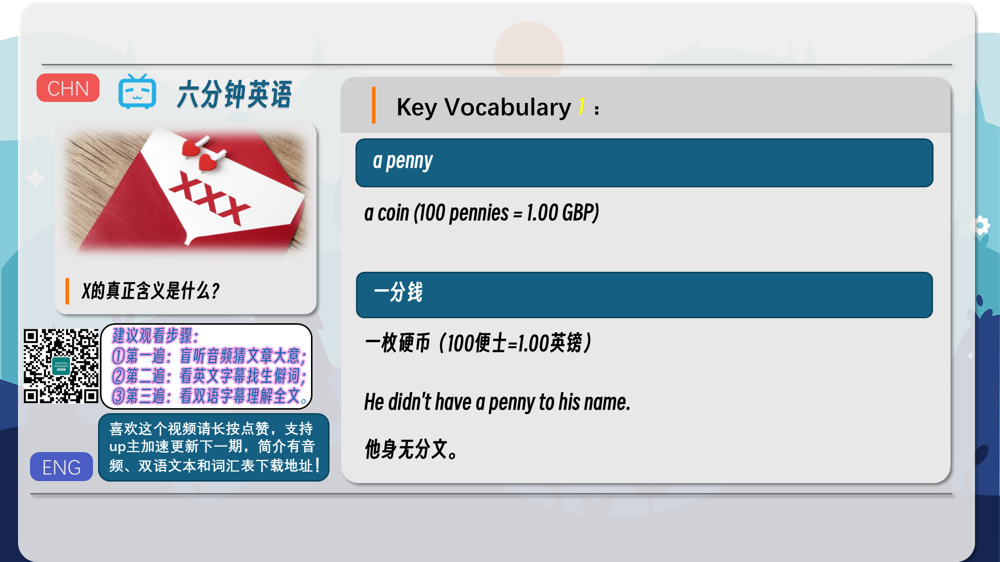
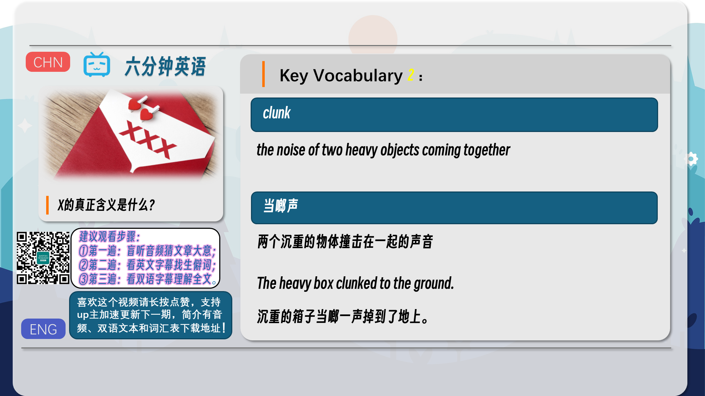
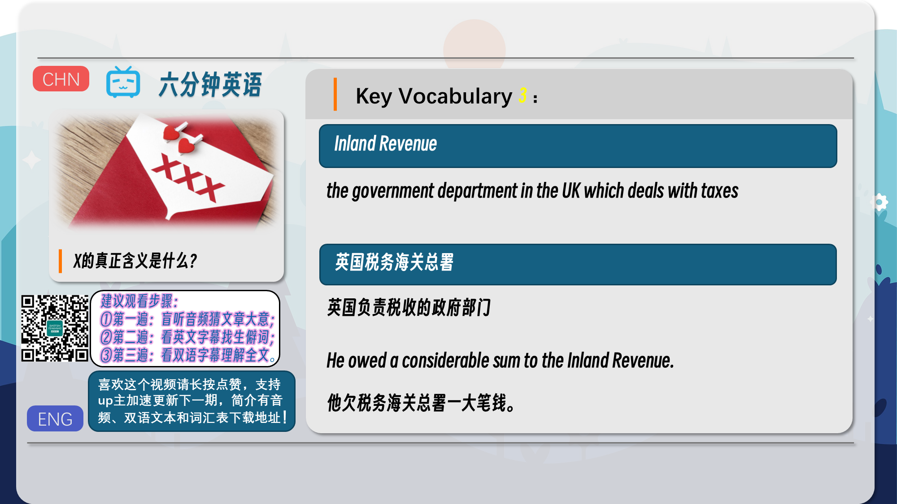
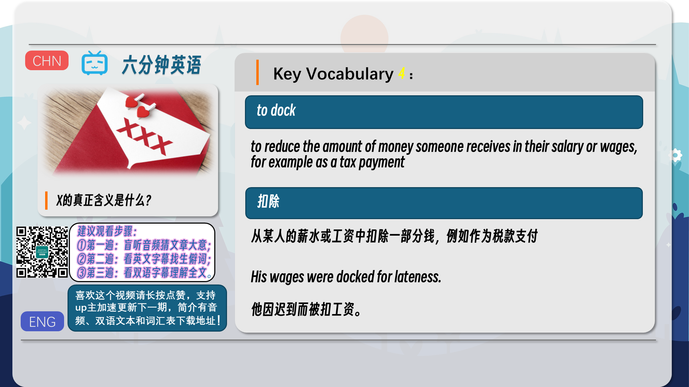
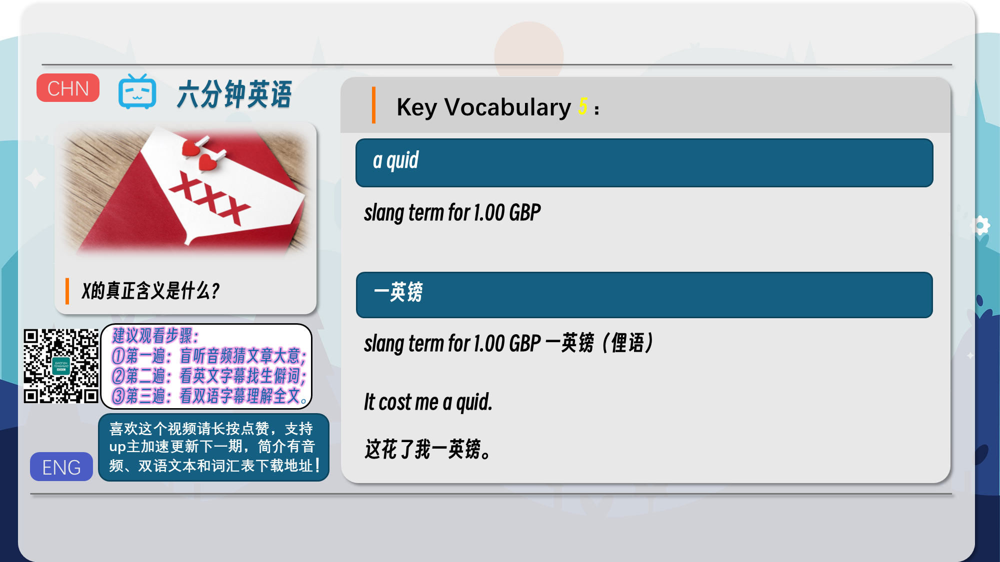
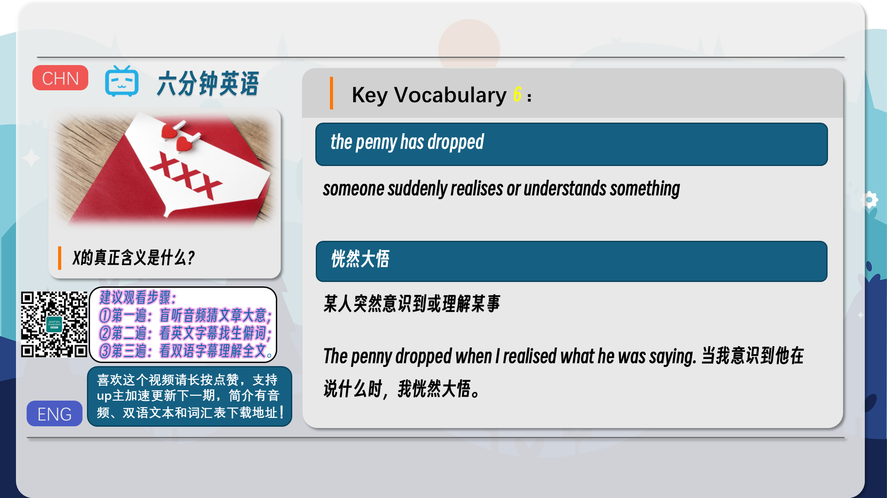
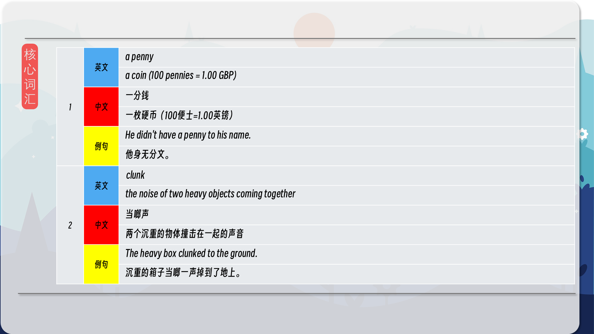
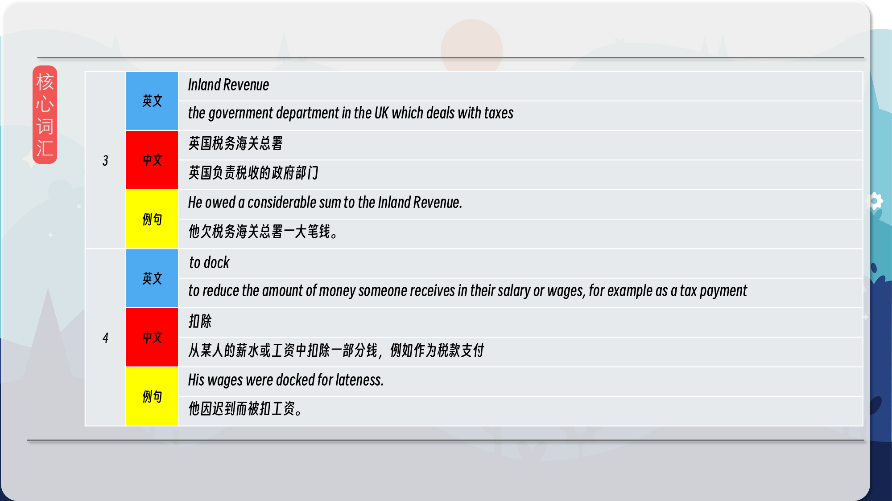
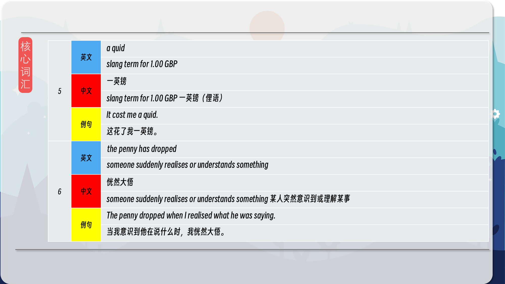
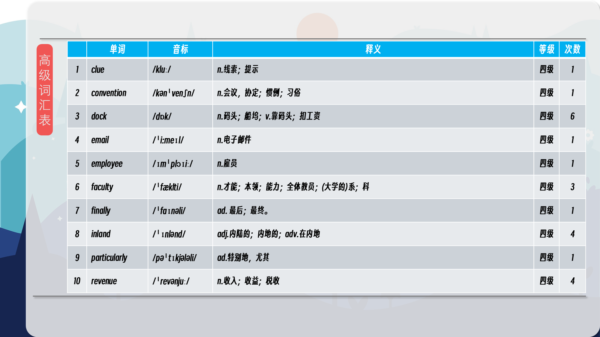

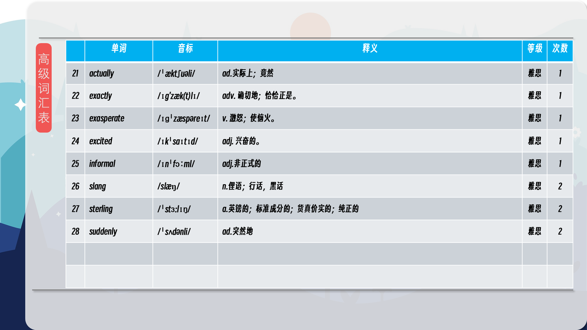

### 【核心词汇】
#### a penny
a coin (100 pennies = 1.00 GBP)
一分钱
a coin (100 pennies = 1.00 GBP) 一枚硬币（100便士=1.00英镑）
He didn't have a penny to his name.
他身无分文。
#### clunk
the noise of two heavy objects coming together
当啷声
the noise of two heavy objects coming together 两个沉重的物体撞击在一起的声音
The heavy box clunked to the ground.
沉重的箱子当啷一声掉到了地上。
#### Inland Revenue
the government department in the UK which deals with taxes
英国税务海关总署
the government department in the UK which deals with taxes 英国负责税收的政府部门
He owed a considerable sum to the Inland Revenue.
他欠税务海关总署一大笔钱。
#### to dock
to reduce the amount of money someone receives in their salary or wages, for example as a tax payment
扣除
to reduce the amount of money someone receives in their salary or wages, for example as a tax payment 从某人的薪水或工资中扣除一部分钱，例如作为税款支付
His wages were docked for lateness.
他因迟到而被扣工资。
#### a quid
slang term for 1.00 GBP
一英镑
slang term for 1.00 GBP 一英镑（俚语）
It cost me a quid.
这花了我一英镑。
#### the penny has dropped
someone suddenly realises or understands something
恍然大悟
someone suddenly realises or understands something 某人突然意识到或理解某事
The penny dropped when I realised what he was saying.
当我意识到他在说什么时，我恍然大悟。

在公众号里输入6位数字，获取【对话音频、英文文本、中文翻译、核心词汇和高级词汇表】电子档，6位数字【暗号】在文章的最后一张图片，如【220728】，表示22年7月28日这一期。公众号没有的文章说明还没有制作相关资料。年度合集在B站【六分钟英语】工房获取，每年共计300+文档，感谢支持！