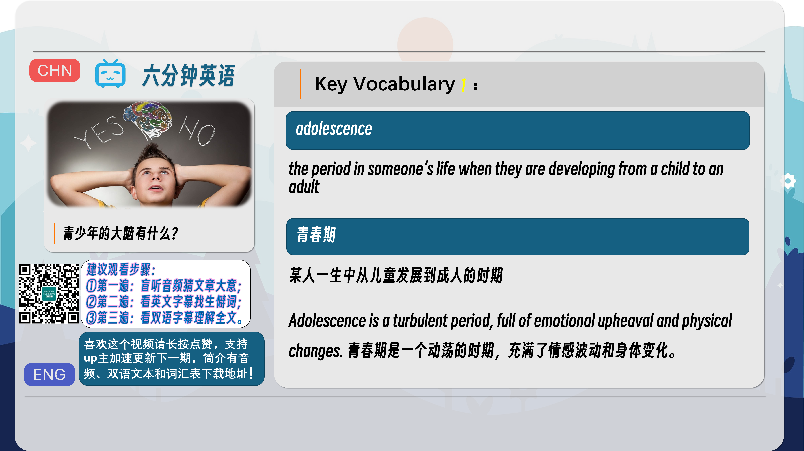
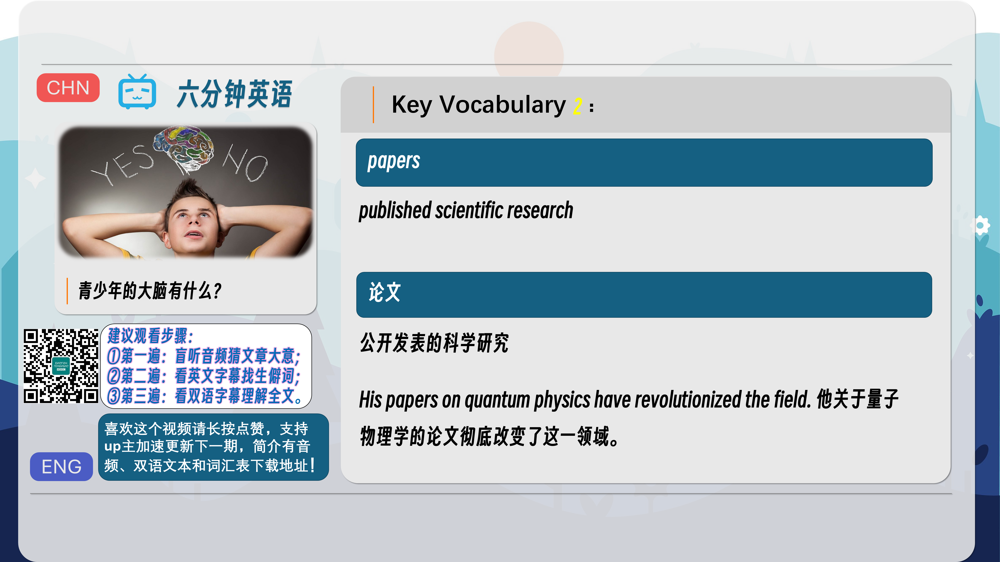
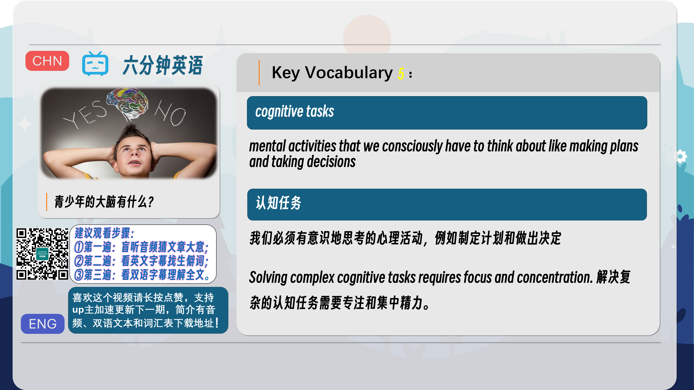
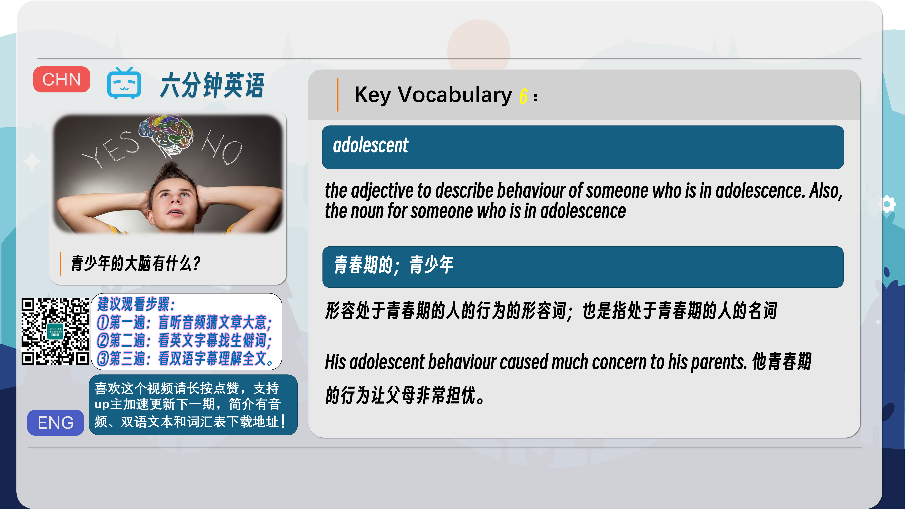
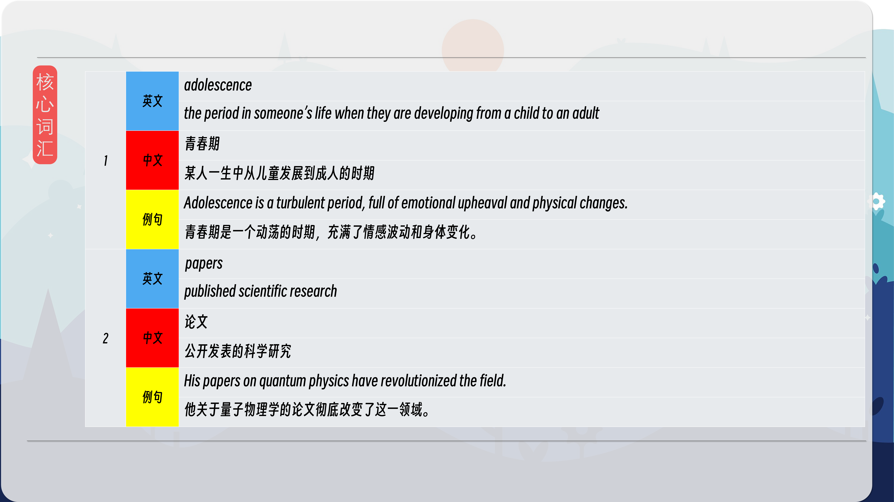
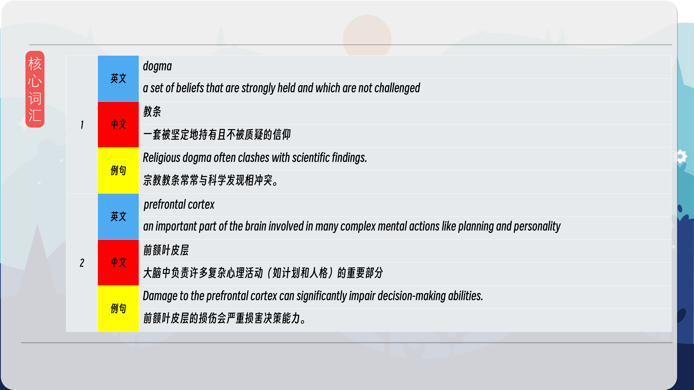
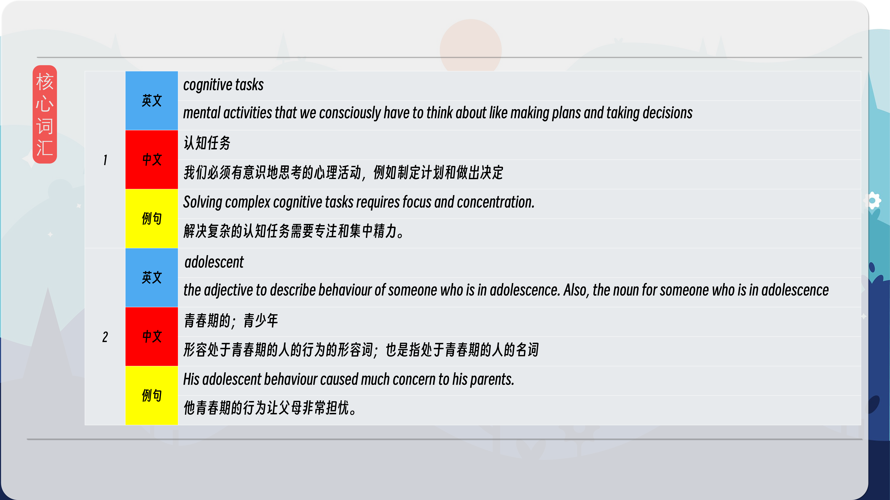
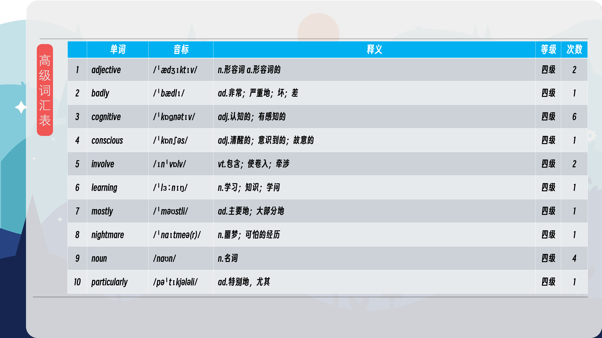
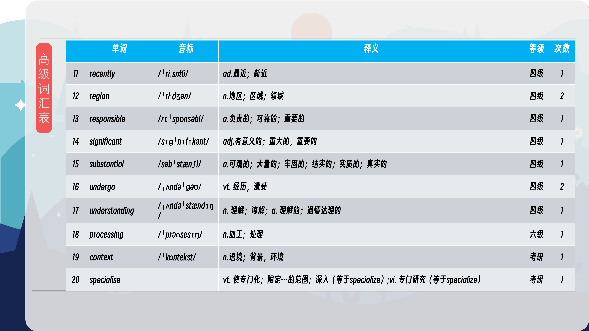
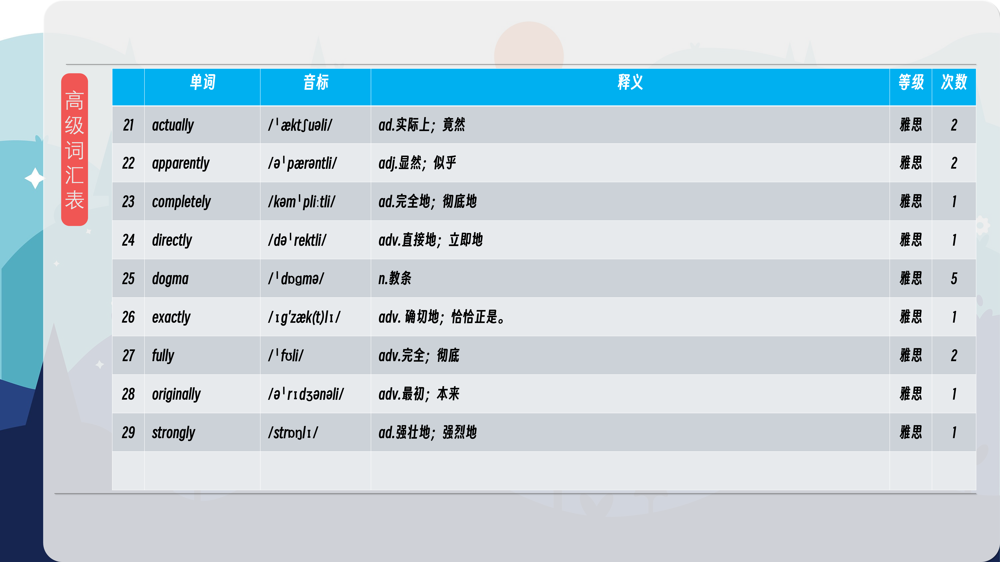

### 【英文脚本】
Neil
Hello. This is 6 Minute English, I'm Neil.
 
Rob
And I'm Rob.
 
Neil
What do you remember of your teenage years?
 
Rob
Oh, I was a nightmare. I was rude to my parents, always stayed out late, never did my homework, hung out with the wrong people and made lots of bad decisions. How about you, Neil?
 
Neil
Well, much the same really. People always say that about teenagers, don’t they? That they go through a period where they are out of control and behave badly. But apparently, it’s not their fault. At least not directly.
 
Rob
So whose fault is it?
 
Neil
Our brains’, apparently. Teenagers’ brains are still developing in areas that control behaviour, which could mean that you can’t blame them for acting the way they do. Before we find out more, let’s have our question. There have always been teenagers, but when was the word ‘teenager’ first used to refer to the 13 – 19 age group? Was it: a) the 1920s b) the 1930s c) the 1950s Any ideas, Rob?
 
Rob

Well, I think it came along around the time of rock and roll, so that would have made it the 1950s. That’s my guess.
 
Neil
I'll have the answer later in the programme. Sarah-Jayne Blakemore from University College London specialises in the workings of the brain, particularly the teenage brain. Recently she was a guest on the BBC Radio programme, The Life Scientific. She explained that the understanding that the brain is still developing during the teenage years is quite new. When does she say the first research came out?
 
Professor Sarah-Jayne Blakemore
The first study showing that the human brain undergoes this very substantial and significant development throughout adolescence and into the twenties; the first papers were published in the late 90s. Before that, and for example when I was at university, the dogma in the text books was that the vast majority of brain development goes on in the first few years of life and nothing much changes after mid-childhood. That dogma is completely false.
 
Neil

So when did the research into the teenage brain come out?
 
Rob
Surprisingly, it wasn’t until the late 1990s. This was when she said that the first papers on this subject were published. Papers in this context means the results of scientific research which are published.
 
Neil
And she didn’t actually talk about teenagers, did she?
 
Rob
No, that’s right. She talked about the period of adolescence. This noun, adolescence, is the period when someone is developing from a child into an adult and it more or less is the same as the teenage years.
 
Neil
What I found interesting was that before the 1990s people believed something different about the way our brains develop.
 
Rob
Yes, Professor Blakemore said that the dogma had been that our brains are mostly fully developed in early childhood, long before adolescence. Dogma is a word used to describe a strong belief that people are expected to accept as true.
 
Neil
So our brains are still developing much later than was originally thought. What does this tell us about teenage behaviour? Of particular interest is an important part of the brain called the prefrontal cortex. Here is Professor Blakemore again. What excuse can she give for teenagers who don’t get their homework done in time?
 
Professor Sarah-Jayne Blakemore
The prefrontal cortex is the part of the brain right at the front, just behind the forehead and it’s involved in a whole range of very high-level cognitive tasks such as decision making and planning - we know that this region is undergoing very very large amounts of development during the adolescent years. And so in terms of the expectations that we place on teenagers to, for example, plan their homework, it might be too much given that we know that the region of the brain that critically involved in planning is not developed yet.
 
Neil
So the prefrontal cortex is important in cognitive tasks. What are those, Rob?
 
Rob
A cognitive task is one that requires conscious thinking and processing, such as making decisions and planning. It doesn’t happen automatically, you have to think about it. So in the adolescent years this part of the brain is not fully developed. Note the adjective form here of the noun we had earlier adolescence.
 
Neil
So this gives a good excuse for not doing your homework!
 
Rob
Ha, ha, I wish I’d known that. I used to say that I’d left my homework on the bus or that the dog had eaten it. Now I could say, "Sorry sir, my brain isn’t developed enough for the cognitive task of planning my homework".
 
Neil
Yes, I’m sure that would work! Before we wrap up, time to get the answer to this week’s question. I asked when was the word ‘teenager’ first used to refer to the 13 – 19 age group? Was it: a) the 1920s b) the 1930s c) the 1950s Rob, you said?
 
Rob
I guessed c) 1950s
 
Neil
The answer is actually b) the 1930s. Very well done if you knew that. Now a quick review of today’s vocabulary.
 
Rob
Adolescence is the noun for the period of change from child to adult and the adjective is adolescent – this same word is also the noun for someone who is in that teenage period.
 
Neil
So an adolescent might be responsible for adolescent behaviour in his or her adolescence.
 
Rob

Exactly.
 
Neil
Papers is the word for published scientific research.
 
Rob
Dogma is strongly held beliefs that are not challenged.
 
Neil
The prefrontal cortex is an important part of the brain which deals with cognitive tasks.
 
Rob
And cognitive tasks are mental processes that require active thought and consideration, such as planning and making decisions.
 
Neil
Well my decision making skills tell me that it’s time to finish.
 
Rob
Well, your skills are working well Neil. We may be going now but you don't need to – you can listen or watch us again and find lots more learning English materials on our social media platforms. You can also visit our website at bbclearningenglish.com.
 
Neil
See you soon, goodbye.

 
Rob

Bye!
 

### 【中英文双语脚本】
Neil(尼尔)
Hello. This is 6 Minute English, I'm Neil.
你好。这里是六分钟英语，我是 Neil。

Rob(罗伯)
And I'm Rob.
我是 罗伯。

Neil(尼尔)
What do you remember of your teenage years?
你还记得你的青少年时代吗？

Rob(罗伯)
Oh, I was a nightmare. I was rude to my parents, always stayed out late, never did my homework, hung out with the wrong people and made lots of bad decisions. How about you, Neil?
哦，我简直是一场噩梦。我对父母很粗鲁，总是在外面呆到很晚，从不做作业，和错误的人一起出去玩，做了很多错误的决定。你呢，尼尔？

Neil(尼尔)
Well, much the same really. People always say that about teenagers, don’t they? That they go through a period where they are out of control and behave badly. But apparently, it’s not their fault. At least not directly.
嗯，真的差不多。人们总是这样说青少年，不是吗？他们经历了一段失控和行为不端的时期。但显然，这不是他们的错。至少不是直接的。

Rob(罗伯)
So whose fault is it?
那么是谁的错呢？

Neil(尼尔)
Our brains’, apparently. Teenagers’ brains are still developing in areas that control behaviour, which could mean that you can’t blame them for acting the way they do. Before we find out more, let’s have our question. There have always been teenagers, but when was the word ‘teenager’ first used to refer to the 13 – 19 age group? Was it: a) the 1920s b) the 1930s c) the 1950s Any ideas, Rob?
显然是我们的大脑。青少年的大脑仍在控制行为的区域发育，这可能意味着你不能责怪他们的行为方式。在我们了解更多信息之前，让我们先提出我们的问题。一直都有青少年，但“青少年”这个词是什么时候第一次用来指代 13 至 19 岁年龄段的呢？是： a） 1920 年代 b） 1930 年代 c） 1950 年代 有什么想法吗，罗伯？

Rob
(罗伯
)
Well, I think it came along around the time of rock and roll, so that would have made it the 1950s. That’s my guess.
嗯，我认为它大约出现在摇滚乐时代，所以那应该是 1950 年代。这是我的猜测。

Neil(尼尔)
I'll have the answer later in the programme. Sarah-Jayne Blakemore from University College London specialises in the workings of the brain, particularly the teenage brain. Recently she was a guest on the BBC Radio programme, The Life Scientific. She explained that the understanding that the brain is still developing during the teenage years is quite new. When does she say the first research came out?
我将在稍后的节目中提供答案。来自伦敦大学学院的 Sarah-Jayne Blakemore 专门研究大脑的运作，尤其是青少年的大脑。最近，她是 BBC 广播节目 The Life Scientific 的嘉宾。她解释说，关于大脑在青少年时期仍在发育的理解是相当新的。她说第一项研究是什么时候出来的？

Professor Sarah-Jayne Blakemore(Sarah-JayneBlakemore教授)
The first study showing that the human brain undergoes this very substantial and significant development throughout adolescence and into the twenties; the first papers were published in the late 90s. Before that, and for example when I was at university, the dogma in the text books was that the vast majority of brain development goes on in the first few years of life and nothing much changes after mid-childhood. That dogma is completely false.
第一项研究表明，人脑在整个青春期和 20 多岁都经历了这种非常实质性和显着的发展；第一批论文发表于 90 年代后期。在此之前，例如当我上大学时，教科书中的教条是，绝大多数大脑发育发生在生命的最初几年，童年中期之后就没有什么太大的变化了。这个教条是完全错误的。

Neil
(尼尔
)
So when did the research into the teenage brain come out?
那么，对青少年大脑的研究是什么时候出来的呢？

Rob(罗伯)
Surprisingly, it wasn’t until the late 1990s. This was when she said that the first papers on this subject were published. Papers in this context means the results of scientific research which are published.
令人惊讶的是，直到 1990 年代后期才出现。就在这时，她说关于这个主题的第一批论文发表了。在这种情况下，论文是指已发表的科学研究成果。

Neil(尼尔)
And she didn’t actually talk about teenagers, did she?
她实际上并没有谈论青少年，对吧？

Rob(罗伯)
No, that’s right. She talked about the period of adolescence. This noun, adolescence, is the period when someone is developing from a child into an adult and it more or less is the same as the teenage years.
不，没错。她谈到了青春期。这个名词，青春期，是一个人从儿童发展成成人的时期，它或多或少与青少年时期相同。

Neil(尼尔)
What I found interesting was that before the 1990s people believed something different about the way our brains develop.
我发现有趣的是，在 1990 年代之前，人们认为我们的大脑发育方式有所不同。

Rob(罗伯)
Yes, Professor Blakemore said that the dogma had been that our brains are mostly fully developed in early childhood, long before adolescence. Dogma is a word used to describe a strong belief that people are expected to accept as true.
是的，布莱克莫尔教授说，当时的教条是，我们的大脑大多在儿童早期就已经完全发育，早在青春期之前。教条是一个词，用于描述人们被期望接受为真理的强烈信念。

Neil(尼尔)
So our brains are still developing much later than was originally thought. What does this tell us about teenage behaviour? Of particular interest is an important part of the brain called the prefrontal cortex. Here is Professor Blakemore again. What excuse can she give for teenagers who don’t get their homework done in time?
因此，我们的大脑发育仍然比最初认为的要晚得多。这告诉我们关于青少年行为的什么信息？特别令人感兴趣的是大脑的一个重要部分，称为前额叶皮层。布莱克莫尔教授又来了。她能给那些没有按时完成作业的青少年找什么借口呢？

Professor Sarah-Jayne Blakemore(Sarah-JayneBlakemore教授)
The prefrontal cortex is the part of the brain right at the front, just behind the forehead and it’s involved in a whole range of very high-level cognitive tasks such as decision making and planning - we know that this region is undergoing very very large amounts of development during the adolescent years. And so in terms of the expectations that we place on teenagers to, for example, plan their homework, it might be too much given that we know that the region of the brain that critically involved in planning is not developed yet.
前额叶皮层是大脑中位于前额正后方的部分，它参与了一系列非常高级的认知任务，例如决策和规划 —— 我们知道这个区域在青少年时期正在经历非常非常大量的发育。因此，就我们对青少年的期望而言，例如，计划他们的家庭作业，考虑到我们知道大脑中关键参与计划的区域还没有发育，这可能太高了。

Neil(尼尔)
So the prefrontal cortex is important in cognitive tasks. What are those, Rob?
所以前额叶皮层在认知任务中很重要。那些是什么，罗伯？

Rob(罗伯)
A cognitive task is one that requires conscious thinking and processing, such as making decisions and planning. It doesn’t happen automatically, you have to think about it. So in the adolescent years this part of the brain is not fully developed. Note the adjective form here of the noun we had earlier adolescence.
认知任务是需要有意识地思考和处理的任务，例如做出决策和规划。它不会自动发生，您必须考虑它。所以在青少年时期，大脑的这一部分还没有完全发育。请注意我们早期青春期的名词的形容词形式。

Neil(尼尔)
So this gives a good excuse for not doing your homework!
所以这给了你不做功课的好借口！

Rob(罗伯)
Ha, ha, I wish I’d known that. I used to say that I’d left my homework on the bus or that the dog had eaten it. Now I could say, "Sorry sir, my brain isn’t developed enough for the cognitive task of planning my homework".
哈，哈，我真希望我早就知道了。我曾经说我把作业忘在了公共汽车上，或者狗吃了它。现在我可以说，'对不起，先生，我的大脑还不够发达，无法完成计划家庭作业的认知任务'。

Neil(尼尔)
Yes, I’m sure that would work! Before we wrap up, time to get the answer to this week’s question. I asked when was the word ‘teenager’ first used to refer to the 13 – 19 age group? Was it: a) the 1920s b) the 1930s c) the 1950s Rob, you said?
是的，我确定那会奏效！在我们结束之前，是时候获得本周问题的答案了。我问“青少年”这个词是什么时候第一次用来指代 13 至 19 岁年龄段的人？你说是：a） 1920 年代 b） 1930 年代 c） 1950 年代 罗伯？

Rob(罗伯)
I guessed c) 1950s
我猜 c） 1950 年代

Neil(尼尔)
The answer is actually b) the 1930s. Very well done if you knew that. Now a quick review of today’s vocabulary.
答案实际上是 b） 1930 年代。如果你知道这一点，那就太好了。现在快速回顾一下今天的词汇。

Rob(罗伯)
Adolescence is the noun for the period of change from child to adult and the adjective is adolescent – this same word is also the noun for someone who is in that teenage period.
青春期是从儿童到成人变化时期的名词，形容词是青少年 —— 同一个词也是处于那个青少年时期的人的名词。

Neil(尼尔)
So an adolescent might be responsible for adolescent behaviour in his or her adolescence.
因此，青少年可能要对他或她的青春期行为负责。

Rob
(罗伯
)
Exactly.
完全。

Neil(尼尔)
Papers is the word for published scientific research.
Papers 是已发表的科学研究的词。

Rob(罗伯)
Dogma is strongly held beliefs that are not challenged.
教条是坚定不移的信念，不受挑战。

Neil(尼尔)
The prefrontal cortex is an important part of the brain which deals with cognitive tasks.
前额叶皮层是大脑中处理认知任务的重要组成部分。

Rob(罗伯)
And cognitive tasks are mental processes that require active thought and consideration, such as planning and making decisions.
认知任务是需要积极思考和考虑的心理过程，例如计划和做出决定。

Neil(尼尔)
Well my decision making skills tell me that it’s time to finish.
好吧，我的决策能力告诉我，是时候完成了。

Rob(罗伯)
Well, your skills are working well Neil. We may be going now but you don't need to – you can listen or watch us again and find lots more learning English materials on our social media platforms. You can also visit our website at bbclearningenglish.com.
嗯，你的技能运作得很好，尼尔。我们现在可能要去，但您不需要 - 您可以收听或再次观看我们，并在我们的社交媒体平台上找到更多学习英语的材料。您也可以访问我们的网站 bbclearningenglish.com。

Neil(尼尔)
See you soon, goodbye.

再见，再见。


Rob
(罗伯
)
Bye!
再见！

### 【核心词汇】
#### adolescence
the period in someone’s life when they are developing from a child to an adult
青春期
某人一生中从儿童发育到成人的时期
The turbulence of adolescence can be challenging for both the adolescent and their parents.
青春期的动荡对青少年及其父母来说都可能是一项挑战。
#### papers
published scientific research
论文
发表的科学研究
His papers on quantum physics are groundbreaking.
他关于量子物理学的论文具有开创性意义。
#### dogma
a set of beliefs that are strongly held and which are not challenged
教条
一套被坚定地持有且不受质疑的信仰
Religious dogma can be a powerful influence on people's lives.
宗教教条会对人们的生活产生强大的影响。
#### prefrontal cortex
an important part of the brain involved in many complex mental actions like planning and personality
前额叶皮层
大脑中参与许多复杂心理活动（如计划和人格）的重要部分
Damage to the prefrontal cortex can lead to significant changes in personality and behaviour.
前额叶皮层的损伤会导致人格和行为的重大变化。
#### cognitive tasks
mental activities that we consciously have to think about like making plans and taking decisions
认知任务
我们必须有意识地思考的心理活动，例如制定计划和做出决定
Performing complex cognitive tasks requires significant mental effort.
执行复杂的认知任务需要付出巨大的脑力。
#### adolescent
the adjective to describe behaviour of someone who is in adolescence. Also, the noun for someone who is in adolescence
青春期的；青少年
描述处于青春期的人的行为的形容词；指处于青春期的人的名词
The adolescent's rebellious behaviour worried his parents.
青少年的叛逆行为让父母担忧。

在公众号里输入6位数字，获取【对话音频、英文文本、中文翻译、核心词汇和高级词汇表】电子档，6位数字【暗号】在文章的最后一张图片，如【220728】，表示22年7月28日这一期。公众号没有的文章说明还没有制作相关资料。年度合集在B站【六分钟英语】工房获取，每年共计300+文档，感谢支持！