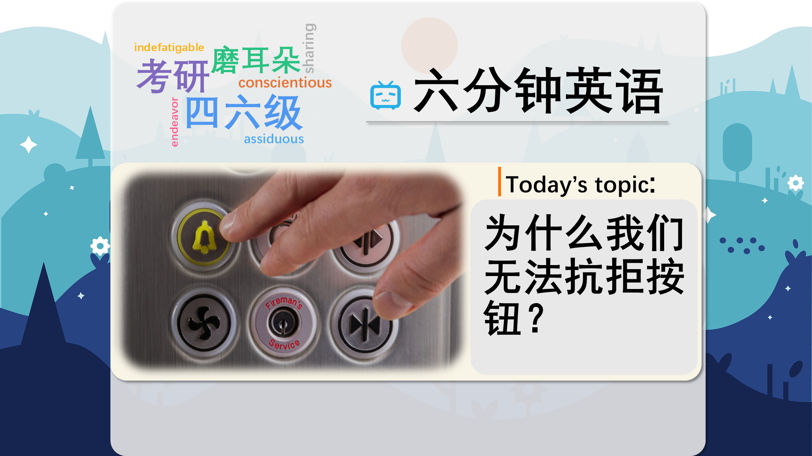

### 【英文脚本】
Rob
Hello. This is 6 Minute English and I'm Rob.
 
Neil
And I'm Neil.
 
Rob
Today we’re talking about buttons.
 
Neil
Yes, buttons. Buttons are what we have on our clothes to fasten them but the word is also used for things that we push to make things happen.
 
Rob
Things like your bedside alarm, radio, toaster, kettle. We press hundreds of buttons every week without thinking about it. Not everyone likes buttons though, particularly the ones we have on our clothes. It’s a recognised phobia. What is this fear called? Is it A: buttonophobia, B: koumpounophobia, or, C: coulrophobia, Any ideas Neil?
 
Neil

Er – I think I’ve got a fear of pronouncing these words! No idea what the answer is, I think buttonophobia is much too obvious – so it’s one of the others – or is it? It’s a hard one.
 
Rob
Well, I'll have the answer later in the programme. Thinking Allowed is a BBC Radio 4 programme which covers a range of interesting topics. Recently, they featured a discussion about buttons and how important they are to everyday life. Steven Connor, Professor of English at the University of Cambridge, was on the programme and he talked about the appeal of buttons. What does say about children and buttons?
 
Professor Steven Connor
We do love buttons and I think the pleasure and the temptation of buttons… this temptation and everyone feels it, which is why buttons have to be very convenient. On the other hand they have to be kept away from children, so they've got to be put high up on the wall, and buttons that really matter have to be made quite hard to push – like put behind glass or something.
 
Rob

OK. What does he say about children and buttons?
 
Neil
That they have to be kept away from them! As I said before, I loved pressing buttons as a child. I would press any that I saw, so important ones did have to be out of my reach.
 
Rob
Yes, he said buttons are a temptation. A temptation is something that makes you want to do something and it’s often used when it’s something you shouldn’t really do. So buttons that lead to potentially dangerous or serious consequences, like a fire alarm, need to be protected, maybe behind glass, so temptation doesn’t get the better of us.
 
Neil
But many buttons have a useful, practical purpose in everyday life, like calling a lift - so these buttons have to be easy to use without difficulty. The adjective for this is convenient. These everyday buttons have to be convenient.
 
Rob
Professor Connor goes on to say a bit more about why buttons are so appealing. What’s his opinion?
 
Professor Steven Connor
You know what I think? I think it's down to the fidgeting instinct of very digital or manual creatures. I think we want to fidget with things and adjust them, we want to make them slightly better… I guess it's the grooming instinct in apes.
 
Rob
So then, why can’t we resist buttons?
 
Neil
Because as humans we have a fidgeting instinct. We can’t stay still for very long, we need to move around a lot because we are very digital creatures.
 
Rob
The use of digital though, is nothing to do with modern online technology, is it?
 
Neil
No, a digit is a finger or toe. So we are digital creatures – we have fingers and we like to use them.
 
Rob
And one thing other digital creatures do, creatures like apes, is grooming. That is they use their hands to clean the body hair of other apes. They look through the hair for insects and bugs and pull them out and eat them. But we can also use the word grooming for humans, someone who is well-groomed for example is neat and tidy, clean and well presented. Here’s Professor Connor again.
 
Professor Steven Connor
You know what I think? I think it's down to the fidgeting instinct of very digital or manual creatures. I think we want to fidget with things and adjust them, we want to make them slightly better… I guess it's the grooming instinct in apes.
 
Rob

Before we wrap up, time to get the answer to this week’s question. Some people have a fear of buttons, it’s a recognised phobia, but what’s it called? Is it A: buttonophobia, B: koumpounophobia, or, C: coulrophobia, And Neil, you said?
 
Neil
I didn’t, but I don’t think it can be ‘buttonophobia’, that’d be too easy. And I think coulrophobia is a fear of clowns, so I’m going for the other one - koumpounophobia.
 
Rob
That it right. Buttonophobia is a made up word, and as you said, coulrophobia is a fear of clowns. Right, now let’s review today’s vocabulary.
 
Neil
We’ve been talking about buttons. These can be small round things we use to fasten our clothes, or the things that we push to make something happen.
 
Rob
Buttons can be a temptation. We see one, we want to push it. So a temptation is something that makes us want to do something we know we shouldn’t.
 
Neil

And then we had the adjective convenient. Something that is convenient is easy to use without difficulty. For example the buttons to call a lift are at a very convenient height, they can be reached easily.
 
Rob
Professor Connor went on to talk about our fidgeting instinct. As humans we love to fidget, we like to keep moving around, we can’t stay still for very long and we love to do stuff with our hands.
 
Neil
The professor talked about us being digital creatures, which means creatures with fingers – a digit is another word for a finger or toe.
 
Rob
And finally we had grooming.
 
Neil
This is the habit of making ourselves look nice by cleaning, washing and doing our hair. It’s something some animals, such as apes, do for each other.
 
Rob
Well the button here in the studio is flashing, which tells me it’s time to wrap up for today. Do join us next time and if you can’t wait, you can always find us on Instagram, Facebook, Twitter, YouTube our App and of course on our website bbclearningenglish.com. Bye for now.

 
Neil

Bye! Can I just press that button?
 
Rob
Oh go on then, if you like!
 

### 【中英文双语脚本】
Rob(罗伯)
Hello. This is 6 Minute English and I'm Rob.
你好。这里是六分钟英语，我是 罗伯。

Neil(尼尔)
And I'm Neil.
我是 Neil。

Rob(罗伯)
Today we’re talking about buttons.
今天我们讨论的是按钮。

Neil(尼尔)
Yes, buttons. Buttons are what we have on our clothes to fasten them but the word is also used for things that we push to make things happen.
是的，按钮。纽扣是我们衣服上用来固定它们的东西，但这个词也用于我们推动以使事情发生的事情。

Rob(罗伯)
Things like your bedside alarm, radio, toaster, kettle. We press hundreds of buttons every week without thinking about it. Not everyone likes buttons though, particularly the ones we have on our clothes. It’s a recognised phobia. What is this fear called? Is it A: buttonophobia, B: koumpounophobia, or, C: coulrophobia, Any ideas Neil?
比如你的床头闹钟、收音机、烤面包机、水壶。我们每周都会不假思索地按下数百个按钮。不过，并不是每个人都喜欢纽扣，尤其是我们衣服上的纽扣。这是一种公认的恐惧症。这种恐惧叫什么？是 A：按钮恐惧症，B：koumpounophobia，还是 C：coulrophobia，有什么想法吗，尼尔？

Neil
(尼尔
)
Er – I think I’ve got a fear of pronouncing these words! No idea what the answer is, I think buttonophobia is much too obvious – so it’s one of the others – or is it? It’s a hard one.
呃 – 我想我害怕发音这些词！不知道答案是什么，我认为纽扣恐惧症太明显了 —— 所以它是其他问题之一 —— 或者是吗？这是一个艰难的问题。

Rob(罗伯)
Well, I'll have the answer later in the programme. Thinking Allowed is a BBC Radio 4 programme which covers a range of interesting topics. Recently, they featured a discussion about buttons and how important they are to everyday life. Steven Connor, Professor of English at the University of Cambridge, was on the programme and he talked about the appeal of buttons. What does say about children and buttons?
好吧，我将在稍后的节目中提供答案。Thinking Allowed 是 BBC Radio 4 的一档节目，涵盖了一系列有趣的话题。最近，他们讨论了纽扣以及它们对日常生活的重要性。剑桥大学英语教授 Steven Connor 参加了该节目，他谈到了纽扣的吸引力。关于子项和按钮，怎么说？

Professor Steven Connor(StevenConnor教授)
We do love buttons and I think the pleasure and the temptation of buttons… this temptation and everyone feels it, which is why buttons have to be very convenient. On the other hand they have to be kept away from children, so they've got to be put high up on the wall, and buttons that really matter have to be made quite hard to push – like put behind glass or something.
我们确实喜欢纽扣，我认为纽扣的乐趣和诱惑......这种诱惑，每个人都能感受到，这就是为什么按钮必须非常方便。另一方面，它们必须远离儿童，所以它们必须放在墙上的高处，真正重要的按钮必须非常难以按下 —— 比如放在玻璃后面或其他东西。

Rob
(罗伯
)
OK. What does he say about children and buttons?
还行。他对孩子和纽扣有什么看法？

Neil(尼尔)
That they have to be kept away from them! As I said before, I loved pressing buttons as a child. I would press any that I saw, so important ones did have to be out of my reach.
他们必须远离他们！正如我之前所说，我小时候就喜欢按下按钮。我会按我看到的任何东西，所以重要的肯定是我够不着的。

Rob(罗伯)
Yes, he said buttons are a temptation. A temptation is something that makes you want to do something and it’s often used when it’s something you shouldn’t really do. So buttons that lead to potentially dangerous or serious consequences, like a fire alarm, need to be protected, maybe behind glass, so temptation doesn’t get the better of us.
是的，他说纽扣是一种诱惑。诱惑是让你想做某事的东西，它经常被用来做你真的不应该做的事情。因此，导致潜在危险或严重后果的按钮（如火灾警报器）需要受到保护，也许是在玻璃后面，这样诱惑就不会战胜我们。

Neil(尼尔)
But many buttons have a useful, practical purpose in everyday life, like calling a lift - so these buttons have to be easy to use without difficulty. The adjective for this is convenient. These everyday buttons have to be convenient.
但是许多按钮在日常生活中都有有用的实用用途，例如呼叫电梯 - 因此这些按钮必须易于使用且没有困难。这个形容词很方便。这些日常按钮必须方便。

Rob(罗伯)
Professor Connor goes on to say a bit more about why buttons are so appealing. What’s his opinion?
Connor 教授继续详细介绍了纽扣为何如此吸引人。他怎么看？

Professor Steven Connor(StevenConnor教授)
You know what I think? I think it's down to the fidgeting instinct of very digital or manual creatures. I think we want to fidget with things and adjust them, we want to make them slightly better… I guess it's the grooming instinct in apes.
你知道我在想什么吗？我认为这要归功于非常数字化或手动生物的坐立不安的本能。我认为我们想摆弄事物并调整它们，我们想让它们稍微好一点......我猜这是猿类的梳理本能。

Rob(罗伯)
So then, why can’t we resist buttons?
那么，为什么我们不能抗拒纽扣呢？

Neil(尼尔)
Because as humans we have a fidgeting instinct. We can’t stay still for very long, we need to move around a lot because we are very digital creatures.
因为作为人类，我们有一种坐立不安的本能。我们不能长时间静止不动，我们需要经常四处走动，因为我们是非常数字化的生物。

Rob(罗伯)
The use of digital though, is nothing to do with modern online technology, is it?
不过，数字的使用与现代在线技术无关，不是吗？

Neil(尼尔)
No, a digit is a finger or toe. So we are digital creatures – we have fingers and we like to use them.
不，手指是手指或脚趾。所以我们是数字生物 – 我们有手指，我们喜欢使用它们。

Rob(罗伯)
And one thing other digital creatures do, creatures like apes, is grooming. That is they use their hands to clean the body hair of other apes. They look through the hair for insects and bugs and pull them out and eat them. But we can also use the word grooming for humans, someone who is well-groomed for example is neat and tidy, clean and well presented. Here’s Professor Connor again.
其他数字生物（如猿类）所做的一件事是梳理毛发。也就是说，他们用手清洁其他猿类的体毛。他们通过毛发寻找昆虫和虫子，然后把它们拉出来吃掉。但我们也可以用 grooming 这个词来形容人类，例如，一个整洁、干净、得体的人。又是康纳教授。

Professor Steven Connor(StevenConnor教授)
You know what I think? I think it's down to the fidgeting instinct of very digital or manual creatures. I think we want to fidget with things and adjust them, we want to make them slightly better… I guess it's the grooming instinct in apes.
你知道我在想什么吗？我认为这要归功于非常数字化或手动生物的坐立不安的本能。我认为我们想摆弄事物并调整它们，我们想让它们稍微好一点......我猜这是猿类的梳理本能。

Rob
(罗伯
)
Before we wrap up, time to get the answer to this week’s question. Some people have a fear of buttons, it’s a recognised phobia, but what’s it called? Is it A: buttonophobia, B: koumpounophobia, or, C: coulrophobia, And Neil, you said?
在我们结束之前，是时候获得本周问题的答案了。有些人害怕纽扣，这是一种公认的恐惧症，但它叫什么？是 A：按钮恐惧症，B：koumpounophobia，还是 C：coulrophobia，还有 Neil，你说的？

Neil(尼尔)
I didn’t, but I don’t think it can be ‘buttonophobia’, that’d be too easy. And I think coulrophobia is a fear of clowns, so I’m going for the other one - koumpounophobia.
我没有，但我不认为这可能是 “纽扣恐惧症”，那太容易了。我认为 coulrophobia 是对小丑的恐惧，所以我选择了另一个 - koumpounophobia。

Rob(罗伯)
That it right. Buttonophobia is a made up word, and as you said, coulrophobia is a fear of clowns. Right, now let’s review today’s vocabulary.
没错。Buttonophobia 是一个虚构的词，正如你所说，coulrophobia 是对小丑的恐惧。好，现在让我们回顾一下今天的词汇。

Neil(尼尔)
We’ve been talking about buttons. These can be small round things we use to fasten our clothes, or the things that we push to make something happen.
我们一直在谈论按钮。这些可以是我们用来固定衣服的小圆件，也可以是我们推动某事发生的事情。

Rob(罗伯)
Buttons can be a temptation. We see one, we want to push it. So a temptation is something that makes us want to do something we know we shouldn’t.
按钮可能是一种诱惑。我们看到一个，我们想推动它。所以诱惑是让我们想要做一些我们知道不应该做的事情。

Neil
(尼尔
)
And then we had the adjective convenient. Something that is convenient is easy to use without difficulty. For example the buttons to call a lift are at a very convenient height, they can be reached easily.
然后我们有了形容词 方便。方便的东西很容易使用。例如，呼叫电梯的按钮位于非常方便的高度，可以很容易地触及。

Rob(罗伯)
Professor Connor went on to talk about our fidgeting instinct. As humans we love to fidget, we like to keep moving around, we can’t stay still for very long and we love to do stuff with our hands.
康纳教授接着谈到了我们坐立不安的本能。作为人类，我们喜欢坐立不安，我们喜欢四处走动，我们不能长时间保持静止，我们喜欢用手做事。

Neil(尼尔)
The professor talked about us being digital creatures, which means creatures with fingers – a digit is another word for a finger or toe.
教授谈到我们是数字生物，这意味着有手指的生物 —— 数字是手指或脚趾的另一种说法。

Rob(罗伯)
And finally we had grooming.
最后我们进行了梳理。

Neil(尼尔)
This is the habit of making ourselves look nice by cleaning, washing and doing our hair. It’s something some animals, such as apes, do for each other.
这是通过清洁、洗头和做头发来让自己看起来漂亮的习惯。这是一些动物（例如猿类）为彼此做的事情。

Rob(罗伯)
Well the button here in the studio is flashing, which tells me it’s time to wrap up for today. Do join us next time and if you can’t wait, you can always find us on Instagram, Facebook, Twitter, YouTube our App and of course on our website bbclearningenglish.com. Bye for now.

嗯，工作室里的按钮在闪烁，这告诉我今天该收尾了。下次加入我们，如果您迫不及待，您可以随时在 Instagram、Facebook、Twitter、YouTube 我们的应用程序，当然还有我们的网站 bbclearningenglish.com 上找到我们。再见。


Neil
(尼尔
)
Bye! Can I just press that button?
再见！我可以按那个按钮吗？

Rob(罗伯)
Oh go on then, if you like!
哦，如果你愿意，那就继续吧！

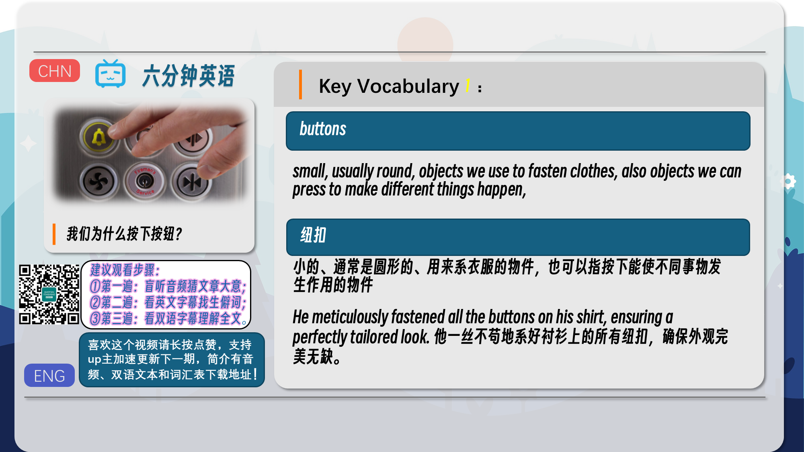
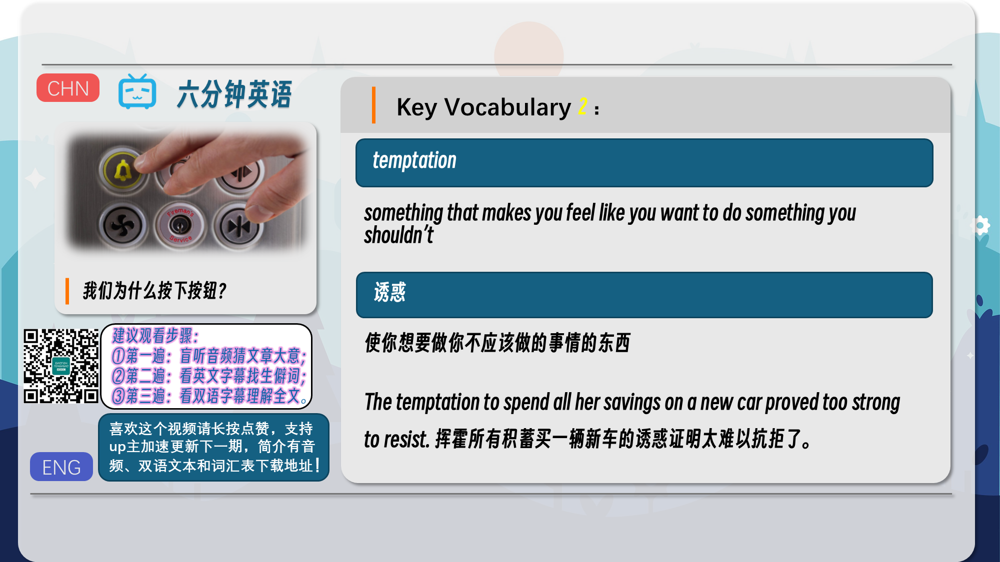
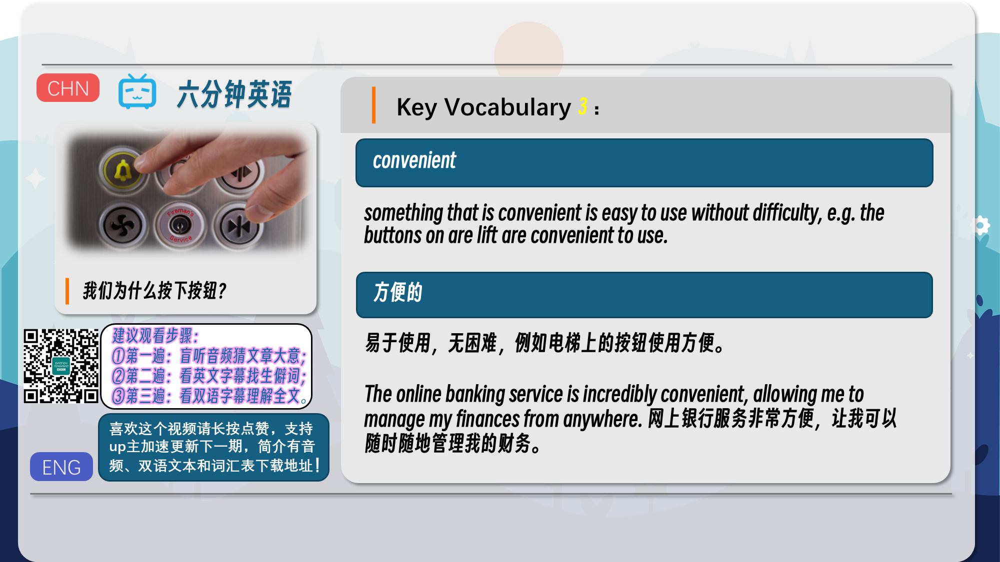

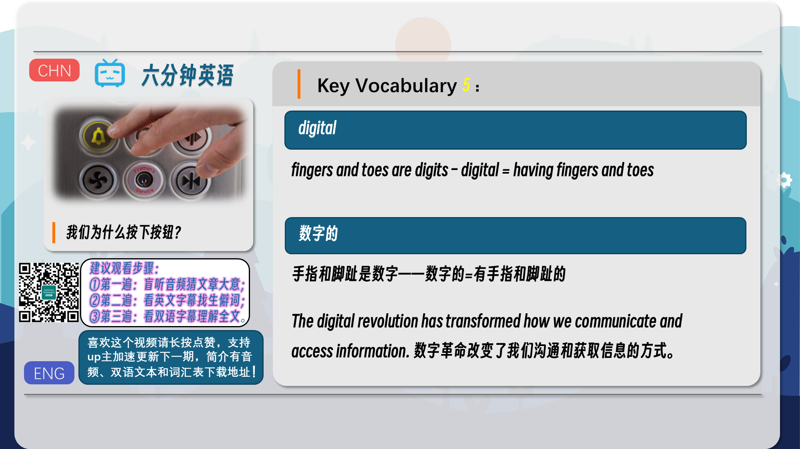
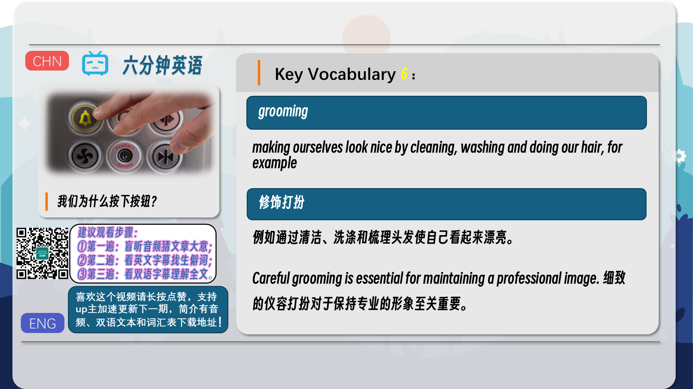
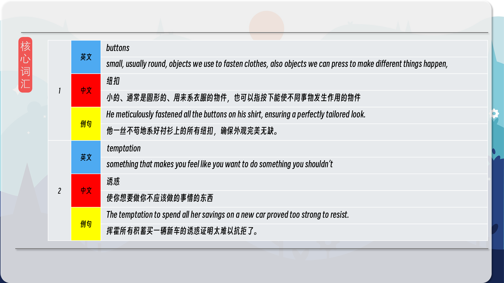
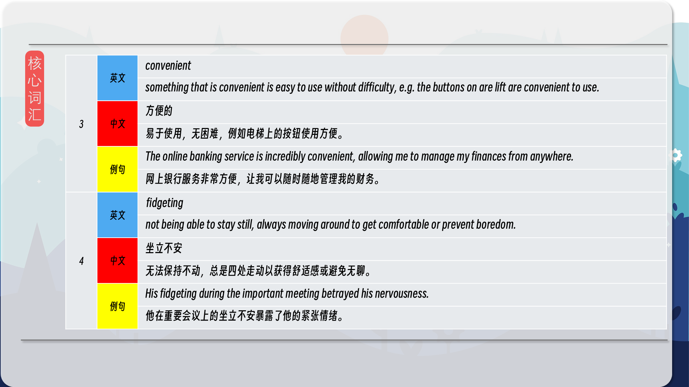
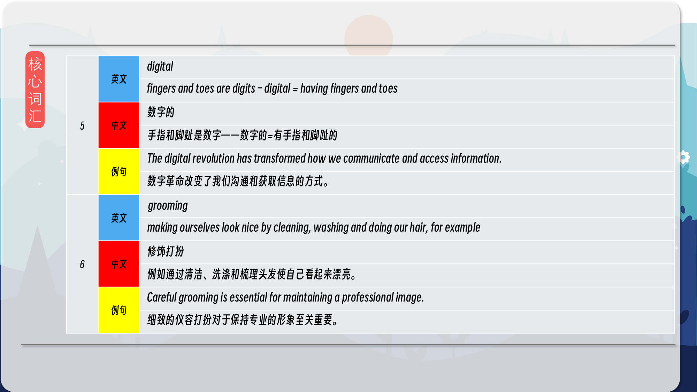
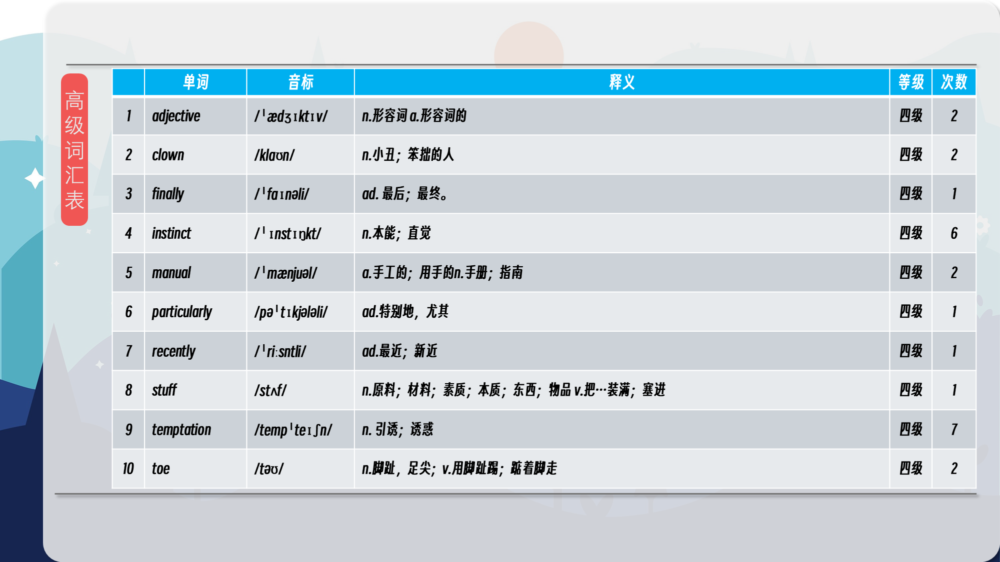
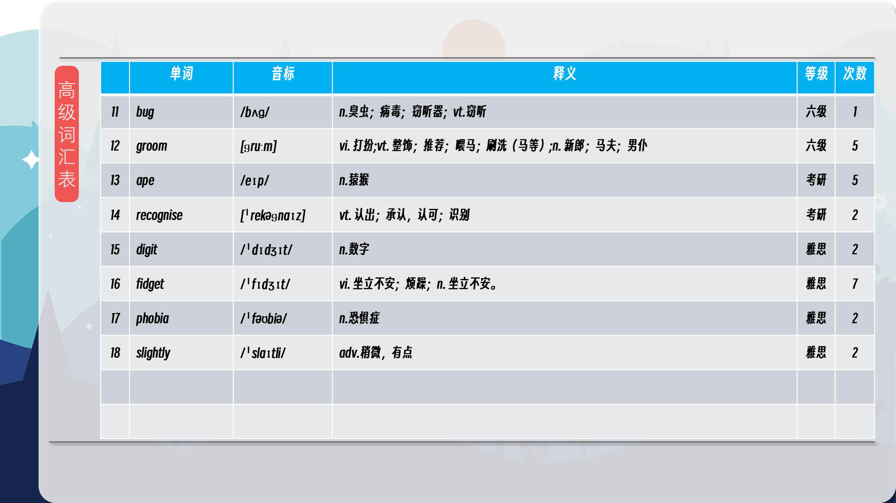
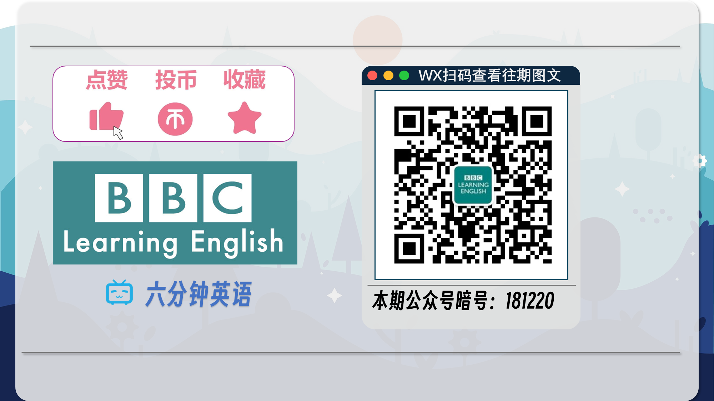

### 【核心词汇】
#### buttons
small, usually round, objects we use to fasten clothes, also objects we can press to make different things happen,
纽扣
小的、通常是圆形的、用来系衣服的物件，也可以指按下能使不同事物发生作用的物件
He meticulously fastened all the buttons on his shirt, ensuring a perfectly tailored look.
他一丝不苟地系好衬衫上的所有纽扣，确保外观完美无缺。
#### temptation
something that makes you feel like you want to do something you shouldn’t
诱惑
使你想要做你不应该做的事情的东西
The temptation to spend all her savings on a new car proved too strong to resist.
挥霍所有积蓄买一辆新车的诱惑证明太难以抗拒了。
#### convenient
something that is convenient is easy to use without difficulty, e.g. the buttons on are lift are convenient to use.
方便的
易于使用，无困难，例如电梯上的按钮使用方便。
The online banking service is incredibly convenient, allowing me to manage my finances from anywhere.
网上银行服务非常方便，让我可以随时随地管理我的财务。
#### fidgeting
not being able to stay still, always moving around to get comfortable or prevent boredom.
坐立不安
无法保持不动，总是四处走动以获得舒适感或避免无聊。
His fidgeting during the important meeting betrayed his nervousness.
他在重要会议上的坐立不安暴露了他的紧张情绪。
#### digital
fingers and toes are digits – digital = having fingers and toes
数字的
手指和脚趾是数字——数字的=有手指和脚趾的
The digital revolution has transformed how we communicate and access information.
数字革命改变了我们沟通和获取信息的方式。
#### grooming
making ourselves look nice by cleaning, washing and doing our hair, for example
修饰打扮
例如通过清洁、洗涤和梳理头发使自己看起来漂亮。
Careful grooming is essential for maintaining a professional image.
细致的仪容打扮对于保持专业的形象至关重要。

在公众号里输入6位数字，获取【对话音频、英文文本、中文翻译、核心词汇和高级词汇表】电子档，6位数字【暗号】在文章的最后一张图片，如【220728】，表示22年7月28日这一期。公众号没有的文章说明还没有制作相关资料。年度合集在B站【六分钟英语】工房获取，每年共计300+文档，感谢支持！