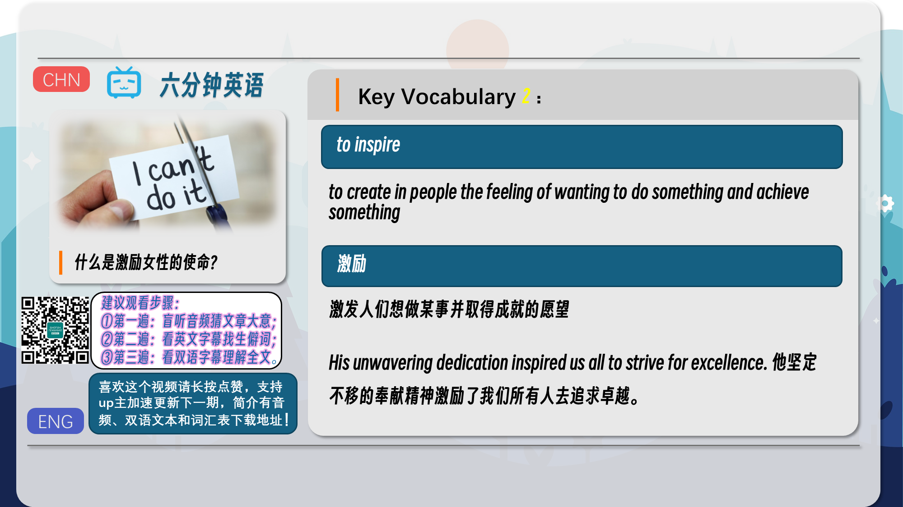
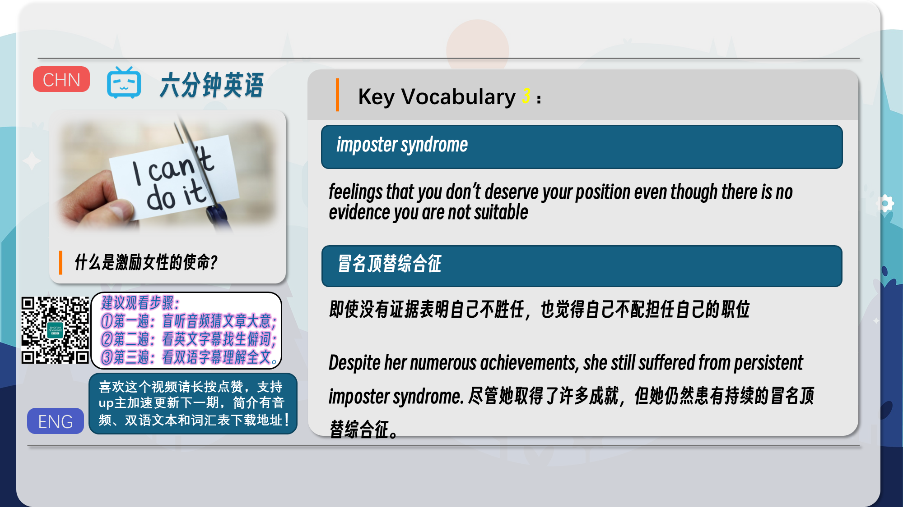
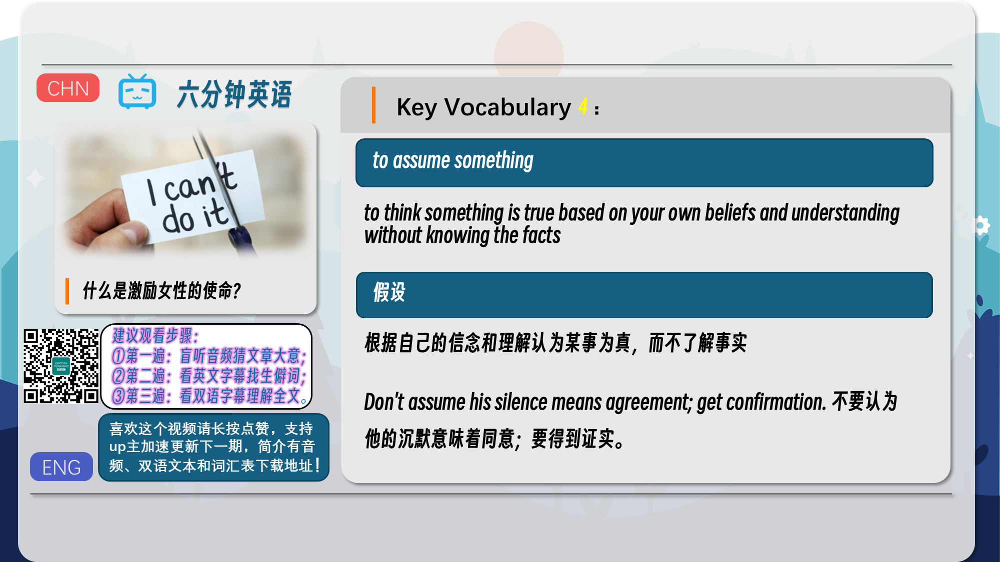
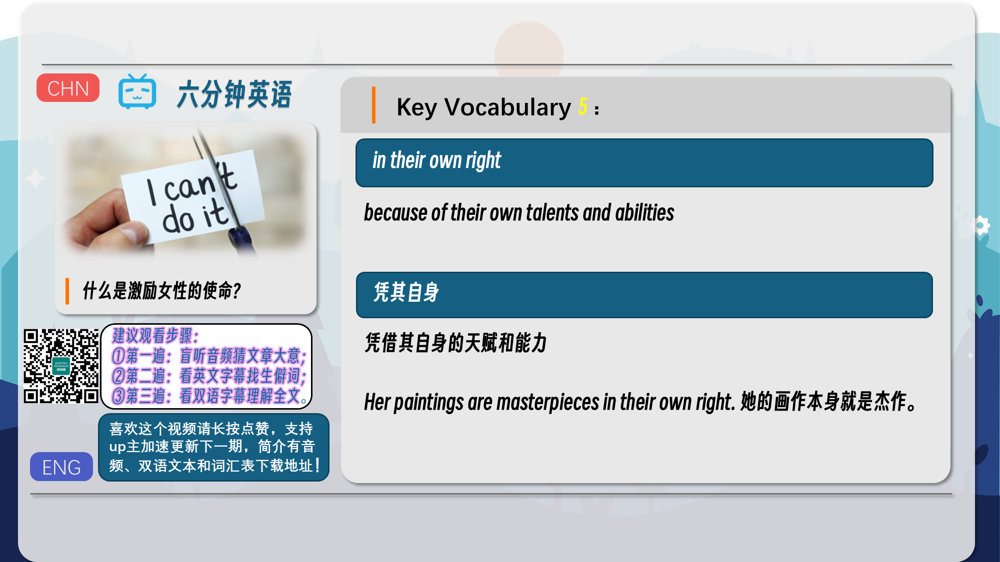
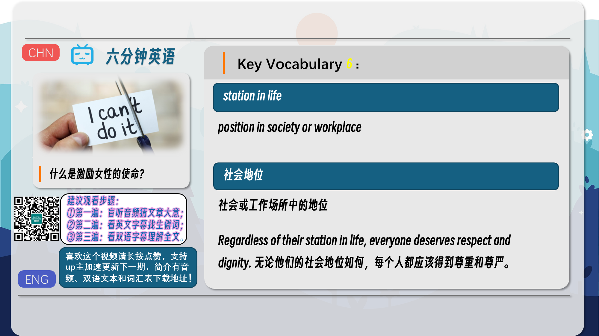
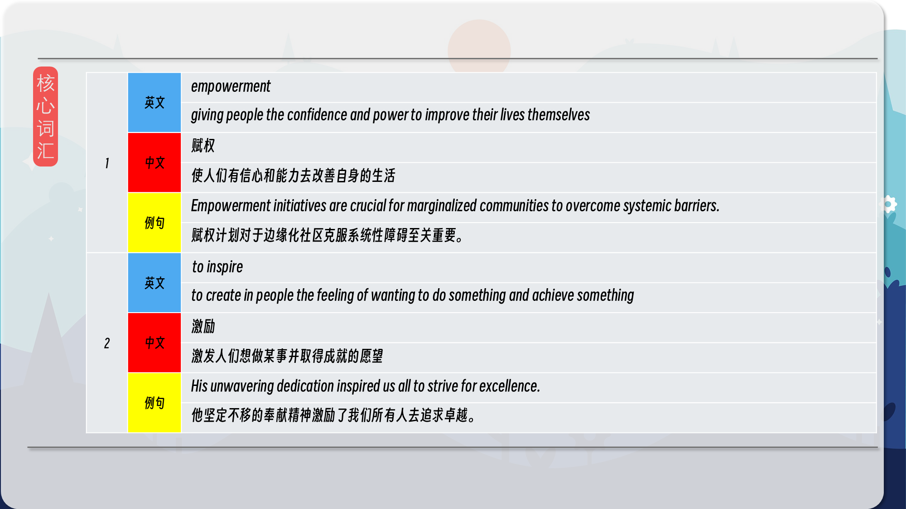
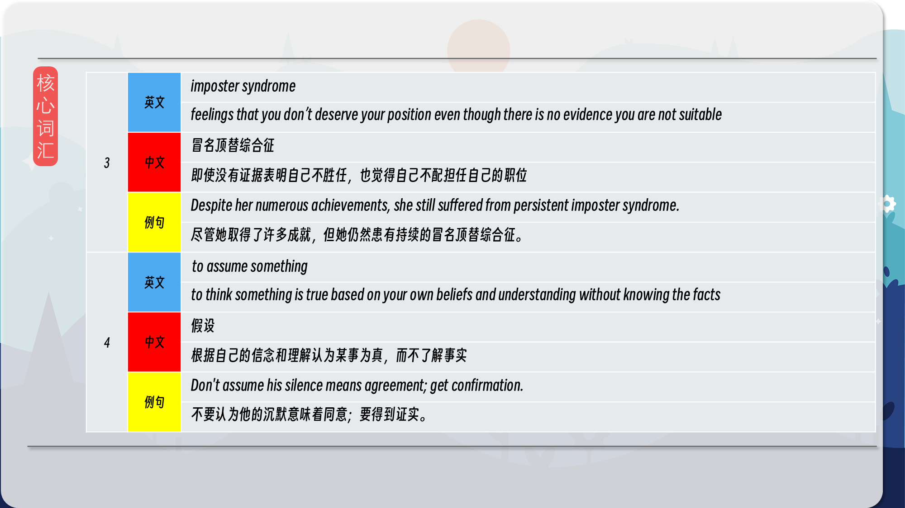
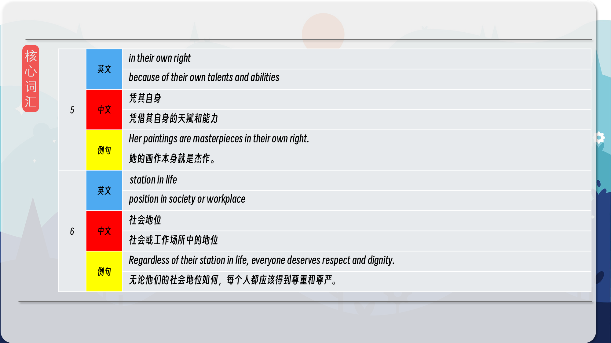
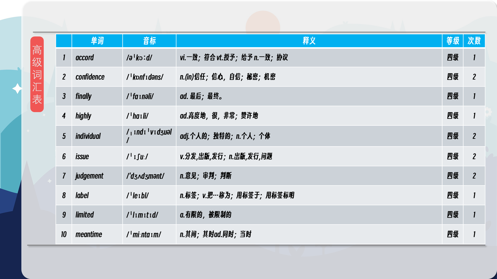
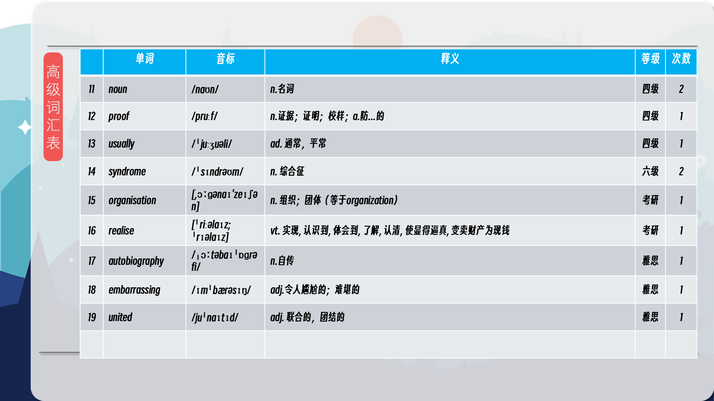

### 【英文脚本】
Rob
Hello. This is 6 Minute English and I'm Rob.
 
Dan
And I'm Dan.
 
Rob
Now, do you know who Michelle Obama is?
 
Dan
Er, yes. Maybe the most famous woman in the world? Former First Lady, which means she was the wife of the President of the United States of America.
 
Rob
That is correct. She's just published her autobiography and has been talking in the UK about her life. Before we find out more, here is this week’s question. When did the title 'First Lady' first become used for the wife of the US president? Was it in the: a) 18th Century, b) 19th Century or, c) 20th Century, Any ideas Dan?
 
Dan

th This could be a trick question. The first US presidents were in the 18 Century, and they had wives, but I think the actual term may only have been introduced much later – so I'm th going to take a wild guess and say the 20 Century.
 
Rob
OK. Well, I'll have the answer later in the programme. Michelle Obama’s visit to the UK was covered on BBC News. According to this report, where did she visit that she had visited before?
 
BBC News Report
The former First Lady spoke openly about a number of issues and one of her main messages was about empowerment. Earlier in the day Mrs Obama revisited a school in north London, a place where she says she was first inspired to focus on education during her time as the First Lady.
 
Rob

So, where did she revisit on this trip?
 
Dan
She went to a school in north London. She said it was at this school that she was first inspired to focus on education. If you are inspired to do something, you get a strong feeling that you want to do something, you feel a strong motivation to achieve something particular, often because of something someone else has said or achieved.
 
Rob
The report also mentioned that she spoke openly about a number of issues. To speak openly about something is when you discuss a subject, often a difficult subject, without trying to hide the facts or your feelings. It’s a phrase that is used when people talk about things in their life that they find difficult or embarrassing.
 
Dan
One of the things she spoke openly about was her own feeling that she didn’t really belong, that she really have the skills or talent to be doing what she was doing and that she didn’t deserve her position.
 
Rob
There is a name for that. It’s called imposter syndrome – that feeling where you think one day everyone will realise that you're really not very good at what you do.
 
Dan
I get that feeling all the time!
 
Rob
I wonder why? Because the thing with this imposter syndrome is that it isn’t justified. It’s more a lack of confidence or a result of the way society labels us.
 
Dan
Well, anyway, back to the report. Michelle Obama was also keen to talk about the topic of empowerment. That's giving people the strength, confidence and power to achieve what they want in life by themselves.
 
Rob
Let’s hear from Michelle Obama herself now talking about how we sometimes judge people based on their class rather than their individual abilities.
 
Michelle Obama
That’s often the mistake that we make, we assume that working-class folks are not highly gifted in their own right when a lot of times your station in life is limited by the circumstances that you find yourself in.
 
Rob
She says here that we assume things about people based on their social status or station in life. To assume means 'to make a judgement which is not based on the facts but on what we think is true'.
 
Dan
She uses the phrase in their own right. When you say that someone is talented in their own right, it means that their talent comes from their own skills and abilities and not because of any connection with any organisation, individual or class that they happen to be associated with.
 
Rob

Before we wrap up, time to get the answer to this week’s question. When did the title 'First Lady' first become used for the wife of the US president? Was it in the: a) 18th Century, b) 19th Century or, c) 20th Century, And Dan, you said?
 
Dan
I thought it was the 20th Century.
 
Rob
Well, you were right.
 
Dan
Yay!
 
Rob
th But let me finish. You were right in that it was later than the 18 Century, which was when th the first US presidents held their positions, but it wasn’t as late as the 20 Century. It was th the second half of the 19 Century when the title First Lady began to be used. Now let’s review today’s vocabulary.
 
Dan
We started with the phrase to talk openly about something. This means to discuss something, usually a difficult subject, without hiding your feelings, emotions or facts about that subject.
 
Rob
Then there was the noun empowerment. This is the process of giving people the feeling that they are in control of their lives, making people more confident in their rights and abilities.
 
Dan

The verb inspire was next. If you inspire people, you give them the feeling that they want to and can do something, something difficult or creative. If you have that feeling yourself, you are inspired.
 
Rob
Next there was the verb to assume something. To assume means 'to make a judgement about someone or something not based on proof, but on things you think or believe to be true'.
 
Dan
The next phrase was in their own right. If someone is successful in their own right, for example, it means their success is because of their own skills and abilities, and not because of who they work for, or work with or which social group they come from.
 
Rob
And finally there was the noun phrase station in life.
 
Dan
Your station in life is your position in society – your social status.
 
Rob
And that brings us to the end of this week’s programme. We’ll be back soon and in the meantime you can find us on Instagram, Facebook, Twitter, YouTube our app and of course the website bbclearningenglish.com. Bye bye for now.

 
Dan
Bye!
 

### 【中英文双语脚本】
Rob(罗伯)
Hello. This is 6 Minute English and I'm Rob.
你好。这里是六分钟英语，我是 罗伯。

Dan(担)
And I'm Dan.
我是 Dan。

Rob(罗伯)
Now, do you know who Michelle Obama is?
现在，你知道米歇尔·奥巴马是谁吗？

Dan(担)
Er, yes. Maybe the most famous woman in the world? Former First Lady, which means she was the wife of the President of the United States of America.
呃，是的。也许是世界上最著名的女性？前第一夫人，这意味着她是美利坚合众国总统的妻子。

Rob(罗伯)
That is correct. She's just published her autobiography and has been talking in the UK about her life. Before we find out more, here is this week’s question. When did the title 'First Lady' first become used for the wife of the US president? Was it in the: a) 18th Century, b) 19th Century or, c) 20th Century, Any ideas Dan?
这是正确的。她刚刚出版了自己的自传，并一直在英国谈论她的生活。在我们了解更多信息之前，以下是本周的问题。“第一夫人”这个头衔是什么时候第一次被用来称呼美国总统的夫人的？是在：a） 18 世纪，b） 19 世纪还是，c） 20 世纪，有什么想法吗？

Dan
(担
)
th This could be a trick question. The first US presidents were in the 18 Century, and they had wives, but I think the actual term may only have been introduced much later – so I'm th going to take a wild guess and say the 20 Century.
th 这可能是一个棘手的问题。第一任美国总统是在 18 世纪，他们有妻子，但我认为实际的术语可能只是在很久以后才引入的 —— 所以我要大胆猜测一下，说 20 世纪。

Rob(罗伯)
OK. Well, I'll have the answer later in the programme. Michelle Obama’s visit to the UK was covered on BBC News. According to this report, where did she visit that she had visited before?
还行。好吧，我将在稍后的节目中提供答案。米歇尔·奥巴马 （Michelle Obama） 对英国的访问进行了 BBC 新闻报道。根据这份报告，她去过哪里，而她以前去过哪里？

BBC News Report(BBC新闻报道)
The former First Lady spoke openly about a number of issues and one of her main messages was about empowerment. Earlier in the day Mrs Obama revisited a school in north London, a place where she says she was first inspired to focus on education during her time as the First Lady.
这位前第一夫人公开谈论了许多问题，她的主要信息之一是关于赋权。当天早些时候，奥巴马夫人再次访问了伦敦北部的一所学校，她说，她在担任第一夫人期间第一次受到启发，开始专注于教育。

Rob
(罗伯
)
So, where did she revisit on this trip?
那么，她这次旅行重访了哪里呢？

Dan(担)
She went to a school in north London. She said it was at this school that she was first inspired to focus on education. If you are inspired to do something, you get a strong feeling that you want to do something, you feel a strong motivation to achieve something particular, often because of something someone else has said or achieved.
她在伦敦北部的一所学校上学。她说，正是在这所学校，她第一次受到启发，开始专注于教育。如果你受到启发去做某事，你会有一种强烈的感觉，你想做某事，你会有一种强烈的动力去实现某件事，通常是因为别人说过或取得了成就。

Rob(罗伯)
The report also mentioned that she spoke openly about a number of issues. To speak openly about something is when you discuss a subject, often a difficult subject, without trying to hide the facts or your feelings. It’s a phrase that is used when people talk about things in their life that they find difficult or embarrassing.
该报告还提到，她公开谈论了一些问题。公开谈论某事是指您讨论一个话题，通常是一个困难的话题，而不试图隐藏事实或您的感受。当人们谈论生活中他们觉得困难或尴尬的事情时，会用到这个短语。

Dan(担)
One of the things she spoke openly about was her own feeling that she didn’t really belong, that she really have the skills or talent to be doing what she was doing and that she didn’t deserve her position.
她公开谈论的一件事是她自己觉得自己并不真正属于这里，她真的有技能或才能来做她正在做的事情，她不配得到这个职位。

Rob(罗伯)
There is a name for that. It’s called imposter syndrome – that feeling where you think one day everyone will realise that you're really not very good at what you do.
它有一个名字。这被称为冒名顶替者综合症 —— 那种感觉，你认为有一天每个人都会意识到你真的不太擅长你所做的事情。

Dan(担)
I get that feeling all the time!
我一直都有这种感觉！

Rob(罗伯)
I wonder why? Because the thing with this imposter syndrome is that it isn’t justified. It’s more a lack of confidence or a result of the way society labels us.
我想知道为什么？因为这种冒名顶替者综合症的问题在于它没有道理。这更多的是缺乏自信或社会给我们贴标签的结果。

Dan(担)
Well, anyway, back to the report. Michelle Obama was also keen to talk about the topic of empowerment. That's giving people the strength, confidence and power to achieve what they want in life by themselves.
好吧，无论如何，回到报告。米歇尔·奥巴马 （Michelle Obama） 也热衷于谈论赋权的话题。这给了人们力量、信心和力量，让他们靠自己实现他们想要的生活。

Rob(罗伯)
Let’s hear from Michelle Obama herself now talking about how we sometimes judge people based on their class rather than their individual abilities.
现在让我们听听米歇尔·奥巴马本人如何谈论我们有时如何根据他们的阶级而不是他们的个人能力来评判他们。

Michelle Obama(米歇尔·奥巴马)
That’s often the mistake that we make, we assume that working-class folks are not highly gifted in their own right when a lot of times your station in life is limited by the circumstances that you find yourself in.
这通常是我们犯的错误，我们假设工人阶级本身并不具有很高的天赋，而很多时候你的生活地位受到你所处环境的限制。

Rob(罗伯)
She says here that we assume things about people based on their social status or station in life. To assume means 'to make a judgement which is not based on the facts but on what we think is true'.
她在这里说，我们根据人们的社会地位或生活中的地位来假设他们的事情。假设的意思是“做出的判断不是基于事实，而是基于我们认为是真实的”。

Dan(担)
She uses the phrase in their own right. When you say that someone is talented in their own right, it means that their talent comes from their own skills and abilities and not because of any connection with any organisation, individual or class that they happen to be associated with.
她自己使用了这个短语。当你说某人本身就有才华时，这意味着他们的才华来自他们自己的技能和能力，而不是因为他们碰巧与之相关的任何组织、个人或阶级有任何联系。

Rob
(罗伯
)
Before we wrap up, time to get the answer to this week’s question. When did the title 'First Lady' first become used for the wife of the US president? Was it in the: a) 18th Century, b) 19th Century or, c) 20th Century, And Dan, you said?
在我们结束之前，是时候获得本周问题的答案了。“第一夫人”这个头衔是什么时候第一次被用来称呼美国总统的夫人的？是在：a） 18 世纪，b） 19 世纪，还是 c） 20 世纪，还有丹，你说？

Dan(担)
I thought it was the 20th Century.
我以为是 20 世纪。

Rob(罗伯)
Well, you were right.
嗯，你是对的。

Dan(担)
Yay!
耶！

Rob(罗伯)
th But let me finish. You were right in that it was later than the 18 Century, which was when th the first US presidents held their positions, but it wasn’t as late as the 20 Century. It was th the second half of the 19 Century when the title First Lady began to be used. Now let’s review today’s vocabulary.
但让我说完。你是对的，那时晚于 18 世纪，而 18 世纪是第一任美国总统任职的时候，但还没有到 20 世纪。19 世纪下半叶，第一夫人的头衔开始使用。现在让我们回顾一下今天的词汇。

Dan(担)
We started with the phrase to talk openly about something. This means to discuss something, usually a difficult subject, without hiding your feelings, emotions or facts about that subject.
我们从 to open ly talk about something 这句话开始。这意味着讨论某事，通常是一个困难的话题，而不隐藏您对该主题的感受、情绪或事实。

Rob(罗伯)
Then there was the noun empowerment. This is the process of giving people the feeling that they are in control of their lives, making people more confident in their rights and abilities.
然后是名词 empowerment。这是给人一种他们掌控自己生活的感觉的过程，使人们对自己的权利和能力更有信心。

Dan
(担
)
The verb inspire was next. If you inspire people, you give them the feeling that they want to and can do something, something difficult or creative. If you have that feeling yourself, you are inspired.
接下来是动词 inspire。如果你激励人们，你就会给他们一种感觉，他们想做一些事情，并且可以做一些困难的事情或有创意的事情。如果你自己也有这种感觉，你就会受到启发。

Rob(罗伯)
Next there was the verb to assume something. To assume means 'to make a judgement about someone or something not based on proof, but on things you think or believe to be true'.
接下来是动词 to assume something。To assume 的意思是“不是根据证据，而是根据你认为或相信是真实的事物来判断某人或某事”。

Dan(担)
The next phrase was in their own right. If someone is successful in their own right, for example, it means their success is because of their own skills and abilities, and not because of who they work for, or work with or which social group they come from.
下一句话本身就是他们自己的。例如，如果某人本身就成功了，这意味着他们的成功是因为他们自己的技能和能力，而不是因为他们为谁工作、与谁一起工作或他们来自哪个社会群体。

Rob(罗伯)
And finally there was the noun phrase station in life.
最后是名词短语 station in life。

Dan(担)
Your station in life is your position in society – your social status.
你的人生地位就是你在社会中的地位 —— 你的社会地位。

Rob(罗伯)
And that brings us to the end of this week’s programme. We’ll be back soon and in the meantime you can find us on Instagram, Facebook, Twitter, YouTube our app and of course the website bbclearningenglish.com. Bye bye for now.

本周的节目到此结束。我们很快就会回来，在此期间，您可以在 Instagram、Facebook、Twitter、YouTube、我们的应用程序，当然还有 bbclearningenglish.com 的网站上找到我们。再见。


Dan(担)
Bye!
再见！

### 【核心词汇】
#### empowerment
giving people the confidence and power to improve their lives themselves
赋权
使人们有信心和能力去改善自身的生活
Empowerment initiatives are crucial for marginalized communities to overcome systemic barriers.
赋权计划对于边缘化社区克服系统性障碍至关重要。
#### to inspire
to create in people the feeling of wanting to do something and achieve something
激励
激发人们想做某事并取得成就的愿望
His unwavering dedication inspired us all to strive for excellence.
他坚定不移的奉献精神激励了我们所有人去追求卓越。
#### imposter syndrome
feelings that you don’t deserve your position even though there is no evidence you are not suitable
冒名顶替综合征
即使没有证据表明自己不胜任，也觉得自己不配担任自己的职位
Despite her numerous achievements, she still suffered from persistent imposter syndrome.
尽管她取得了许多成就，但她仍然患有持续的冒名顶替综合征。
#### to assume something
to think something is true based on your own beliefs and understanding without knowing the facts
假设
根据自己的信念和理解认为某事为真，而不了解事实
Don't assume his silence means agreement; get confirmation.
不要认为他的沉默意味着同意；要得到证实。
#### in their own right
because of their own talents and abilities
凭其自身
凭借其自身的天赋和能力
Her paintings are masterpieces in their own right.
她的画作本身就是杰作。
#### station in life
position in society or workplace
社会地位
社会或工作场所中的地位
Regardless of their station in life, everyone deserves respect and dignity.
无论他们的社会地位如何，每个人都应该得到尊重和尊严。

在公众号里输入6位数字，获取【对话音频、英文文本、中文翻译、核心词汇和高级词汇表】电子档，6位数字【暗号】在文章的最后一张图片，如【220728】，表示22年7月28日这一期。公众号没有的文章说明还没有制作相关资料。年度合集在B站【六分钟英语】工房获取，每年共计300+文档，感谢支持！