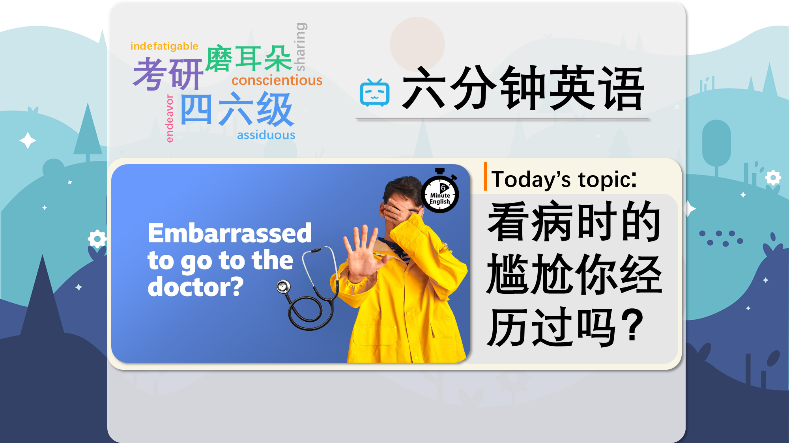

### 【英文脚本】
Neil
Hello. This is 6 Minute English from BBC Learning English. I'm Neil.

Beth
And I'm Beth.

Neil
Lots of things can make us feel embarrassed – that self-conscious, uncomfortable feeling when your face blushes red and you wish you could just disappear.

Beth
Have you had any embarrassing moments, Neil?

Neil
Yes, many. Once I met my parents in a car park and I saw them arriving in their car and I waved my hands around in a very silly way. But unfortunately, I soon discovered that it wasn't my parents. It was another couple.

Beth
Oh no, that's really embarrassing. I remember answering the phone, I thought it was my best friend and I said 'hello' in a very silly voice, and then they asked to speak to my dad, and it wasn't my friend.

Neil
What was the voice?

Beth
Hello?

Neil
Oh dear. But embarrassment is more than just shyness and blushing. When it comes to our health, there's no end of things to be embarrassed about.

Beth
Yes, and some people feel so embarrassed that they don’t go to see a doctor when they should, sometimes with serious consequences.

Neil
In this programme we'll be discussing the issue of medical embarrassment, and as usual, we'll be learning some useful new words and phrases.

Beth
So, I have a question. Neil, according to the UK's Nursing Times newspaper, what percentage of people surveyed said they had delayed visiting their doctor out of embarrassment, and then later been diagnosed with a health condition? Was it: a) 21% ? b) 41% ? or, c) 61% ?

Neil
So I think it's probably a lot. So c) 61%.

Beth
OK. We will find out if that's correct at the end of the programme.

As humans we get embarrassed if we feel different from others, especially if the
difference is physical. But how does feeling embarrassed about a medical condition impact our relationship with the doctor? Here's Dr Vanessa Apea, consultant in sexual health at Barts Hospital in London, explaining more to BBC Radio 4 programme, Inside Health:

Dr Vanessa Apea
So they'll delay accessing the clinic, and also seeking treatment, and so then you'll often see people that could have been diagnosed with what's happening much earlier, and could have had earlier intervention, but it's delayed quite significantly. And so I then feel that we see a lot of people kind of suffering in silence really.

Neil
Many people delay going to the doctor – they postpone going or put it off until a later time. As a result, their problem isn’t diagnosed. To diagnose means to identify a disease or health problem through medical examination.

Beth
For some, feelings of embarrassment are so strong they prefer to suffer in silence – to struggle with pain without seeking help - rather than visit the doctor. But fortunately, there are things you can do to help. Writing your problem down, going with a friend, and visiting a doctor you trust are some ideas Dr Apea recommends.

Neil
There are ways that doctors can help as well, as Dr Vanessa Apea explains here to James Gallagher, presenter of BBC Radio 4 programme, Inside Health:

James Gallagher
Can you tell us what techniques you use to put people at ease?

Dr Vanessa Apea
I bring transparency to the conversation, and own it, and say that I'm going to be asking you some quite personal questions, and there may be also intimate examination… I want to assure you that this is confidential, that this is a safe, non- judgmental space… So really, I often name the words to create that space as well. Also in my manner, I would hope, and in my non-verbal cues.

Beth
James asks what doctors can do to put people at ease – to make them feel calm and relaxed - and Dr Apea describes her ideal conversation: it’s a safe space, it’s non-judgmental and what is said is confidential, kept private and not shared with anyone.

Neil
As well as discussing embarrassing problems sensitively, Dr Apea also uses non- verbal cues - the expression on her face, her hand movements, and the tone of her voice, rather than words, to communicate and relax the patient. Embarrassment is normal, and with support hopefully more of us will feel safe to visit the doctor despite it. OK, Beth, isn't it time to reveal the answer to your question?

Beth
It is. I asked you: What percentage of people said they had delayed visiting the doctor because they were embarrassed, but then had later been diagnosed with a health condition? Do you remember what you said, Neil?

Neil
Yes, I think I said c) 61%.

Beth
I'm afraid that is not the correct answer. It was, in fact a) 21% or just over a fifth. OK, let’s recap the new vocabulary we've used, starting with delay, to postpone or put off until a later time.

Neil
To diagnose a disease or medical condition means to identify it by recognising the symptoms and examining the patient.

Beth
If you suffer in silence, you endure and struggle with painful feelings without asking someone for help.

Neil
The phrasal verb put someone at ease means to make someone feel calm and relaxed.

Beth
The adjective confidential means kept private and secret and describes information which is not shared with anyone else.

Neil
And finally, non-verbal cues are types of communication using facial expressions, hand gestures or tone of voice, rather than speech, to show your feelings. Once again, our six minutes are up, but why not built your vocabulary and listening skills even more with the quiz and worksheet related to this programme? They’re both available now on our website, bbclearningenglish.com. See you there!

Beth
Bye!

### 【中英文双语脚本】
Neil(尼尔)
I'm Neil.
你好。这是来自 BBC Learning English 的六分钟英语。我是 Neil。

Beth(贝丝)
And I'm Beth.
我是 Beth。

Neil(尼尔)
Lots of things can make us feel embarrassed – that self-conscious, uncomfortable feeling when your face blushes red and you wish you could just disappear.
很多事情都会让我们感到尴尬 —— 当你的脸涨红，你希望自己能消失时，那种自我意识、不舒服的感觉。

Beth(贝丝)
Have you had any embarrassing moments, Neil?
你有没有经历过尴尬的时刻，尼尔？

Neil(尼尔)
Yes, many. Once I met my parents in a car park and I saw them arriving in their car and I waved my hands around in a very silly way. But unfortunately, I soon discovered that it wasn't my parents. It was another couple.
是的，很多。有一次我在停车场遇到了我的父母，我看到他们开着他们的车来了，我以一种非常愚蠢的方式挥了挥手。但不幸的是，我很快发现那不是我的父母。那是另一对。

Beth(贝丝)
Oh no, that's really embarrassing. I remember answering the phone, I thought it was my best friend and I said 'hello' in a very silly voice, and then they asked to speak to my dad, and it wasn't my friend.
哦，不，这真的很尴尬。我记得接电话时，我以为是我最好的朋友，我用非常愚蠢的声音说了一声“你好”，然后他们要求和我爸爸说话，但那不是我的朋友。

Neil(尼尔)
What was the voice?
声音是什么？

Beth(贝丝)
Hello?
你好？

Neil(尼尔)
Oh dear. But embarrassment is more than just shyness and blushing. When it comes to our health, there's no end of things to be embarrassed about.
哦，天哪。但尴尬不仅仅是害羞和脸红。当谈到我们的健康时，有无穷无尽的事情值得尴尬。

Beth(贝丝)
Yes, and some people feel so embarrassed that they don’t go to see a doctor when they should, sometimes with serious consequences.
是的，有些人感到非常尴尬，以至于他们没有在应该去看医生的时候去看医生，有时会带来严重的后果。

Neil(尼尔)
In this programme we'll be discussing the issue of medical embarrassment, and as usual, we'll be learning some useful new words and phrases.
在这个节目中，我们将讨论医疗尴尬的问题，像往常一样，我们将学习一些有用的新单词和短语。

Beth(贝丝)
So, I have a question. Neil, according to the UK's Nursing Times newspaper, what percentage of people surveyed said they had delayed visiting their doctor out of embarrassment, and then later been diagnosed with a health condition? Was it: a) 21% ? b) 41% ? or, c) 61% ?
所以，我有一个问题。Neil，据英国《护理时报》报道，有多少百分比的受访者表示他们因尴尬而推迟了去看医生，后来又被诊断出患有健康状况？是：a） 21% ？b） 41% ？或者，c） 61% ？

Neil(尼尔)
So I think it's probably a lot. So c) 61%.
所以我认为这可能很多。所以 c） 61%。

Beth(贝丝)
OK. We will find out if that's correct at the end of the programme.
还行。我们将在节目结束时找出这是否正确。

As humans we get embarrassed if we feel different from others, especially if the(作为人类，如果我们觉得自己与他人不同，我们会感到尴尬，尤其是当)
difference is physical. But how does feeling embarrassed about a medical condition impact our relationship with the doctor? Here's Dr Vanessa Apea, consultant in sexual health at Barts Hospital in London, explaining more to BBC Radio 4 programme, Inside Health:
差异是物理的。但是，对医疗状况感到尴尬如何影响我们与医生的关系呢？以下是伦敦巴茨医院性健康顾问 Vanessa Apea 博士对 BBC Radio 4 节目 Inside Health 的更多解释：

Dr Vanessa Apea(Vanessa Apea 医师)
So they'll delay accessing the clinic, and also seeking treatment, and so then you'll often see people that could have been diagnosed with what's happening much earlier, and could have had earlier intervention, but it's delayed quite significantly. And so I then feel that we see a lot of people kind of suffering in silence really.
因此，他们会延迟进入诊所和寻求治疗，因此你经常会看到一些人，他们本来可以更早地被诊断出患有正在发生的事情，并且可能更早地接受了干预，但延迟了相当多。所以我觉得我们看到很多人真的在默默地忍受痛苦。

Neil(尼尔)
Many people delay going to the doctor – they postpone going or put it off until a later time. As a result, their problem isn’t diagnosed. To diagnose means to identify a disease or health problem through medical examination.
许多人延迟去看医生 —— 他们推迟去看医生或推迟到以后。因此，他们的问题没有得到诊断。To diagnose 是指通过医学检查来识别疾病或健康问题。

Beth(贝丝)
For some, feelings of embarrassment are so strong they prefer to suffer in silence – to struggle with pain without seeking help - rather than visit the doctor. But fortunately, there are things you can do to help. Writing your problem down, going with a friend, and visiting a doctor you trust are some ideas Dr Apea recommends.
对一些人来说，尴尬的感觉是如此强烈，他们宁愿默默忍受 —— 在不寻求帮助的情况下与痛苦作斗争 —— 也不愿去看医生。但幸运的是，您可以做一些事情来提供帮助。写下你的问题，和朋友一起去，去看你信任的医生是 Apea 医生推荐的一些想法。

Neil(尼尔)
There are ways that doctors can help as well, as Dr Vanessa Apea explains here to James Gallagher, presenter of BBC Radio 4 programme, Inside Health:
医生也可以通过多种方式提供帮助，正如 Vanessa Apea 博士在这里向 BBC Radio 4 节目 Inside Health 的主持人 James Gallagher 解释的那样：

James Gallagher(詹姆斯·加拉格尔)
Can you tell us what techniques you use to put people at ease?
您能告诉我们您用了什么技巧来让人们放心吗？

Dr Vanessa Apea(Vanessa Apea 医师)
I bring transparency to the conversation, and own it, and say that I'm going to be asking you some quite personal questions, and there may be also intimate examination… I want to assure you that this is confidential, that this is a safe, non- judgmental space… So really, I often name the words to create that space as well. Also in my manner, I would hope, and in my non-verbal cues.
我为对话带来透明度，并拥有它，并说我将问你一些非常私人的问题，也可能有亲密的检查......我想向你保证，这是保密的，这是一个安全、不带评判的空间......所以说真的，我也经常说出创造那个空间的词。我希望，也要以我的方式，以及我的非语言暗示。

Beth(贝丝)
James asks what doctors can do to put people at ease – to make them feel calm and relaxed - and Dr Apea describes her ideal conversation: it’s a safe space, it’s non-judgmental and what is said is confidential, kept private and not shared with anyone.
詹姆斯问医生可以做些什么来让人们放松 —— 让他们感到平静和放松 —— Apea 医生描述了她理想的对话：这是一个安全的空间，不带评判，所说的是保密的，保密的，不与任何人分享。

Neil(尼尔)
As well as discussing embarrassing problems sensitively, Dr Apea also uses non- verbal cues - the expression on her face, her hand movements, and the tone of her voice, rather than words, to communicate and relax the patient. Embarrassment is normal, and with support hopefully more of us will feel safe to visit the doctor despite it. OK, Beth, isn't it time to reveal the answer to your question?
除了敏感地讨论令人尴尬的问题外，Apea 医生还使用非语言暗示 - 她脸上的表情、她的手部动作和她的语气，而不是语言，来与患者交流和放松。尴尬是正常的，在支持下，希望我们中的更多人会感到放心去看医生。好的，贝丝，现在是不是该透露你问题的答案了？

Beth(贝丝)
It is. I asked you: What percentage of people said they had delayed visiting the doctor because they were embarrassed, but then had later been diagnosed with a health condition? Do you remember what you said, Neil?
是的。我问你：有多少百分比的人说他们因为尴尬而推迟去看医生，但后来被诊断出患有健康状况？你还记得你说过的话吗，尼尔？

Neil(尼尔)
Yes, I think I said c) 61%.
是的，我想我说的是 c） 61%。

Beth(贝丝)
I'm afraid that is not the correct answer. It was, in fact a) 21% or just over a fifth. OK, let’s recap the new vocabulary we've used, starting with delay, to postpone or put off until a later time.
恐怕这不是正确的答案。事实上，它是 a） 21% 或略高于五分之一。好，让我们回顾一下我们使用的新词汇，从 delay 开始，推迟或推迟到以后。

Neil(尼尔)
To diagnose a disease or medical condition means to identify it by recognising the symptoms and examining the patient.
To diagnose a disease or medical condition 的意思是通过识别症状和检查患者来识别它。

Beth(贝丝)
If you suffer in silence, you endure and struggle with painful feelings without asking someone for help.
如果你默默忍受，你会忍受痛苦的感觉，并在不寻求帮助的情况下与痛苦的感受作斗争。

Neil(尼尔)
The phrasal verb put someone at ease means to make someone feel calm and relaxed.
短语动词 put someone at ease 的意思是让某人感到平静和放松。

Beth(贝丝)
The adjective confidential means kept private and secret and describes information which is not shared with anyone else.
形容词 confidential 的意思是保密和秘密，并描述不与其他任何人共享的信息。

Neil(尼尔)
And finally, non-verbal cues are types of communication using facial expressions, hand gestures or tone of voice, rather than speech, to show your feelings. Once again, our six minutes are up, but why not built your vocabulary and listening skills even more with the quiz and worksheet related to this programme? They’re both available now on our website, bbclearningenglish.com. See you there!
最后，非语言提示是使用面部表情、手势或语气而不是语言来表达您的感受的交流类型。我们的六分钟又一次结束了，但为什么不通过与此计划相关的测验和工作表来进一步培养您的词汇量和听力技巧呢？它们现在都可以在我们的网站上找到，bbclearningenglish.com。到时见！

Beth(贝丝)
Bye!
再见！

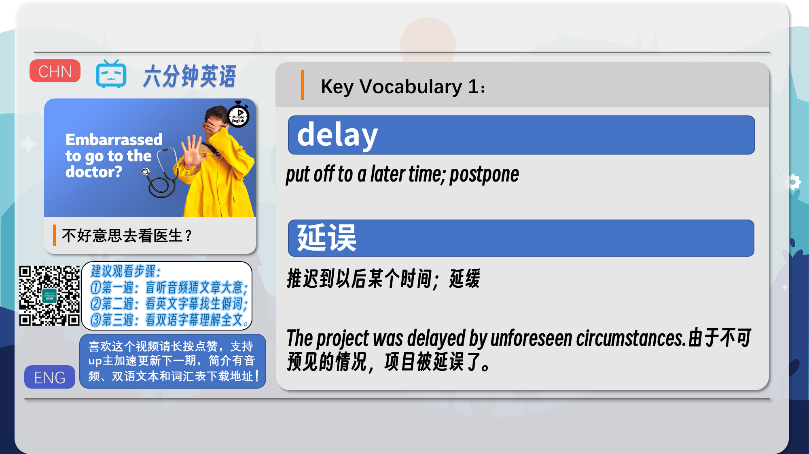
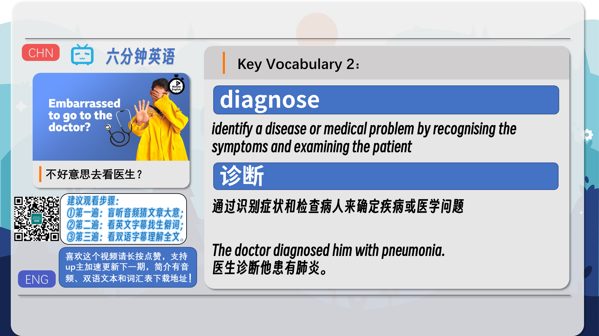
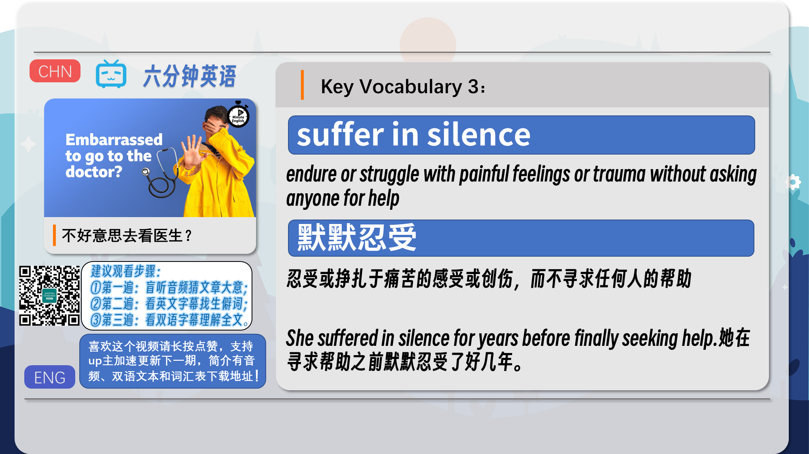
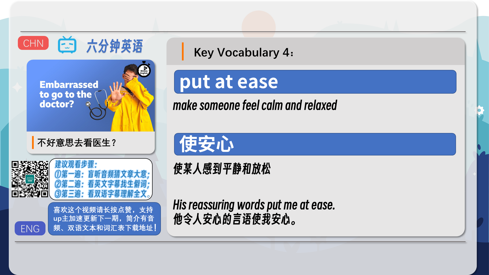
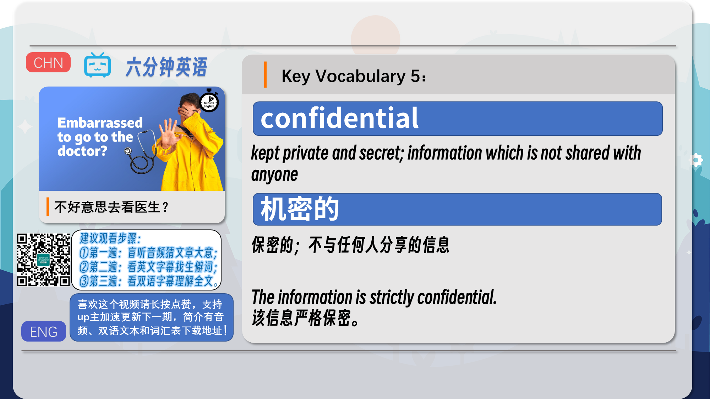
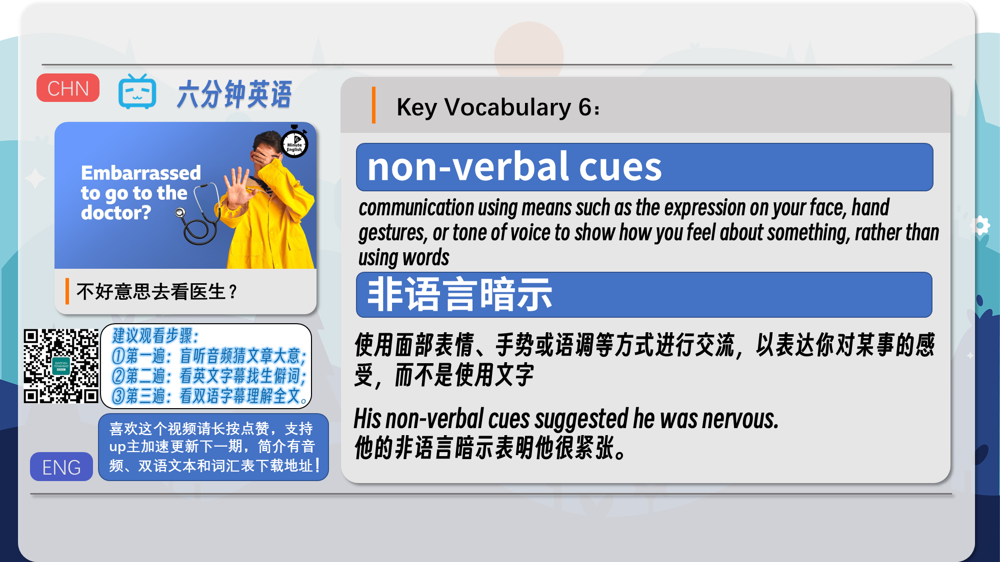
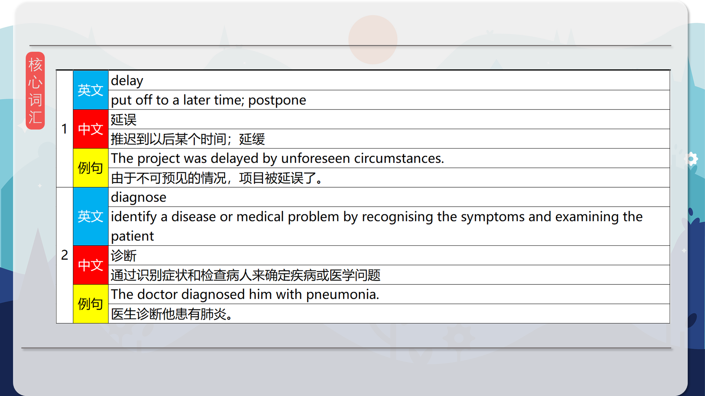
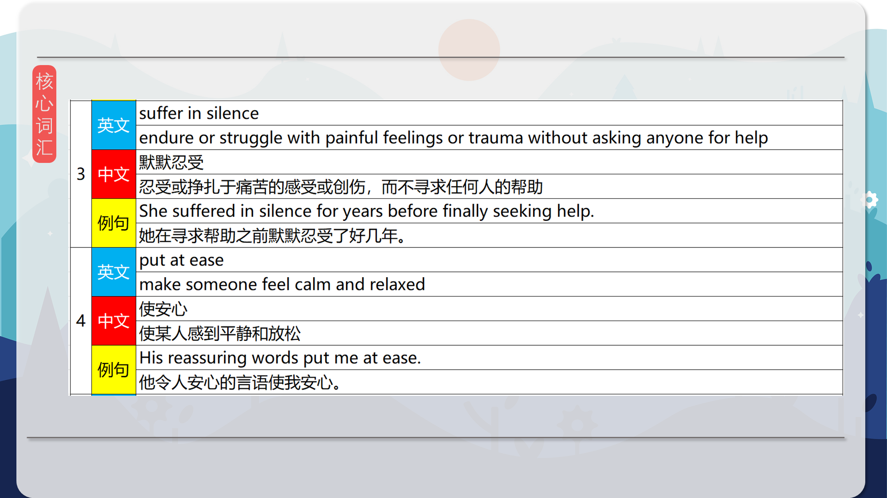
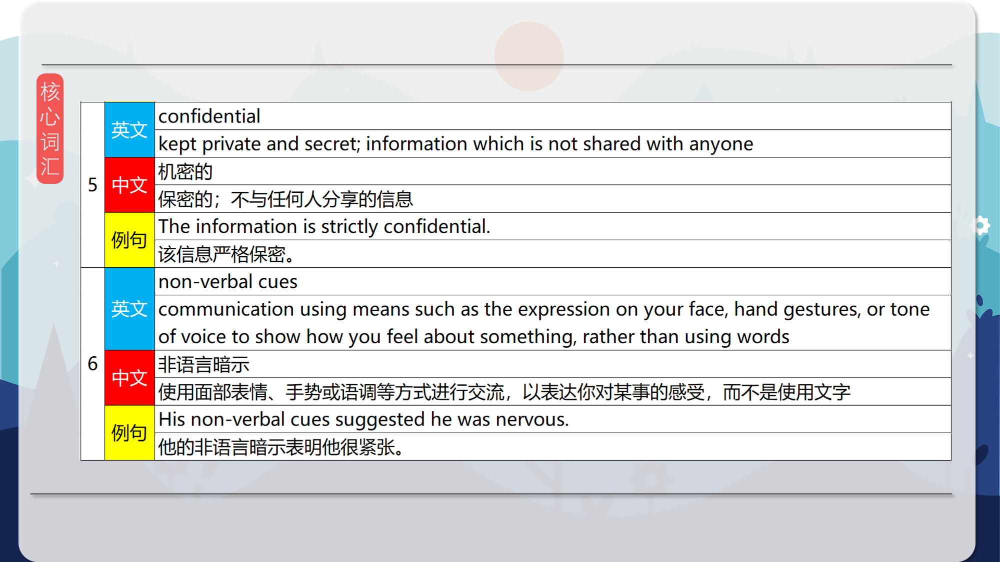
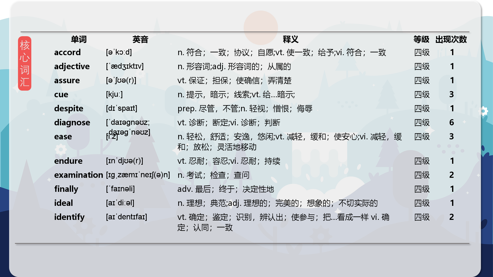
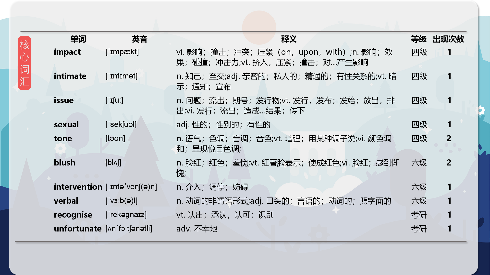
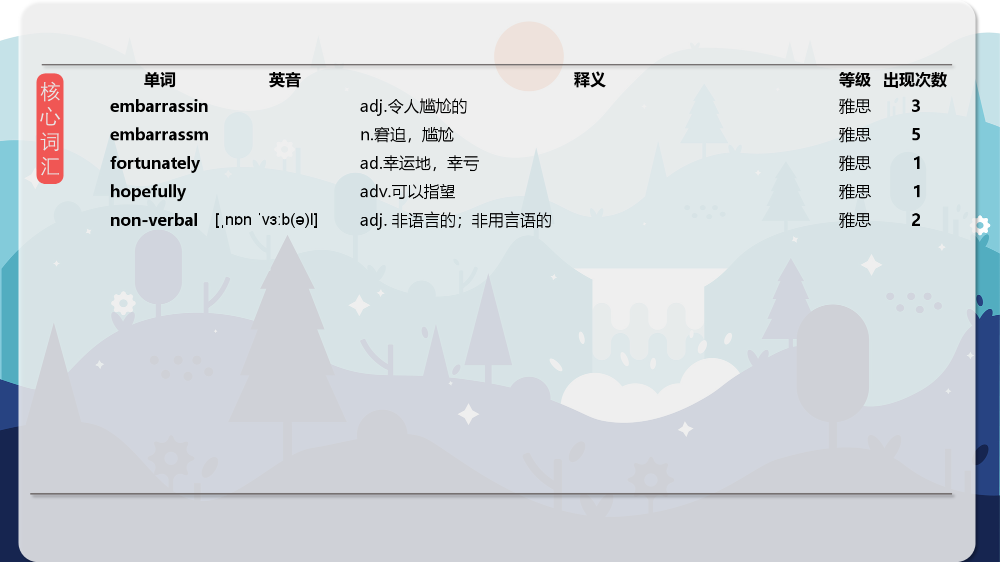

### 【核心词汇】
#### delay
put off to a later time; postpone
延误
推迟到以后某个时间；延缓
The project was delayed by unforeseen circumstances.
由于不可预见的情况，项目被延误了。
#### diagnose
identify a disease or medical problem by recognising the symptoms and examining the patient
诊断
通过识别症状和检查病人来确定疾病或医学问题
The doctor diagnosed him with pneumonia.
医生诊断他患有肺炎。
#### suffer in silence
endure or struggle with painful feelings or trauma without asking anyone for help
默默忍受
忍受或挣扎于痛苦的感受或创伤，而不寻求任何人的帮助
She suffered in silence for years before finally seeking help.
她在寻求帮助之前默默忍受了好几年。
#### put at ease
make someone feel calm and relaxed
使安心
使某人感到平静和放松
His reassuring words put me at ease.
他令人安心的言语使我安心。
#### confidential
kept private and secret; information which is not shared with anyone
机密的
保密的；不与任何人分享的信息
The information is strictly confidential.
该信息严格保密。
#### non-verbal cues
communication using means such as the expression on your face, hand gestures, or tone of voice to show how you feel about something, rather than using words
非语言暗示
使用面部表情、手势或语调等方式进行交流，以表达你对某事的感受，而不是使用文字
His non-verbal cues suggested he was nervous.
他的非语言暗示表明他很紧张。

在公众号里输入6位数字，获取【对话音频、英文文本、中文翻译、核心词汇和高级词汇表】电子档，6位数字【暗号】在文章的最后一张图片，如【220728】，表示22年7月28日这一期。公众号没有的文章说明还没有制作相关资料。年度合集在B站【六分钟英语】工房获取，每年共计300+文档，感谢支持！