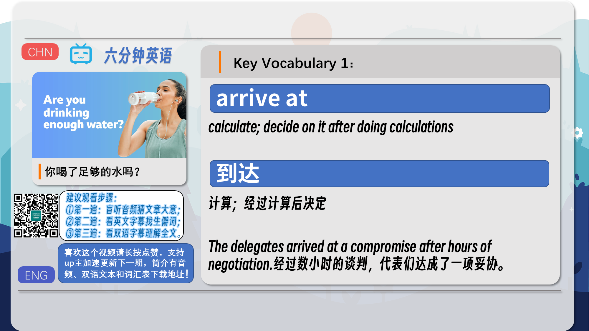
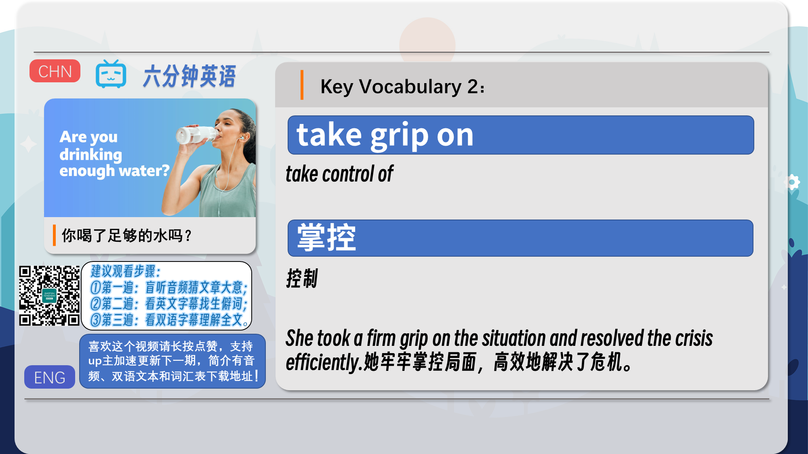
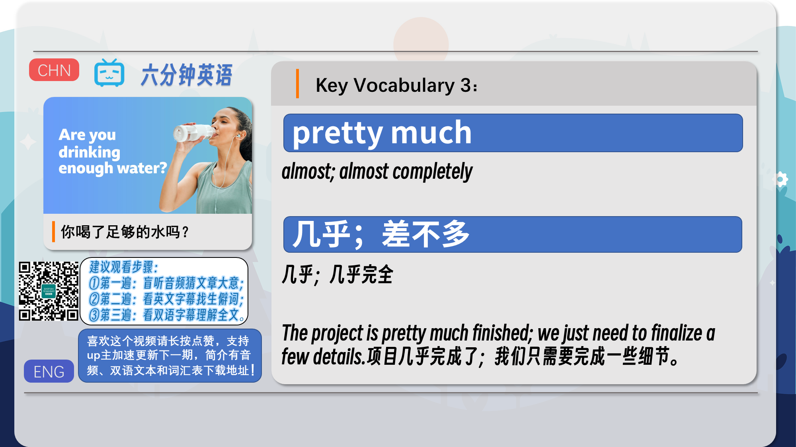
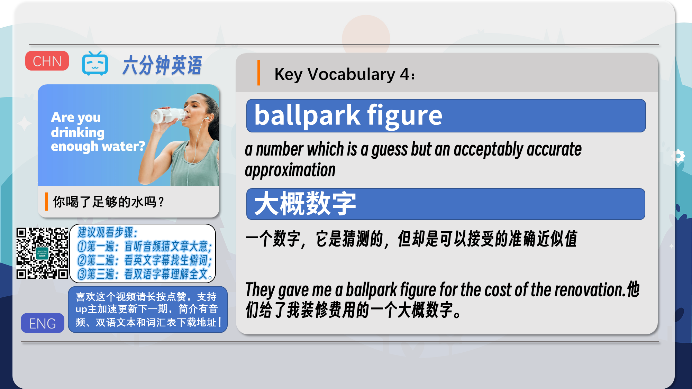
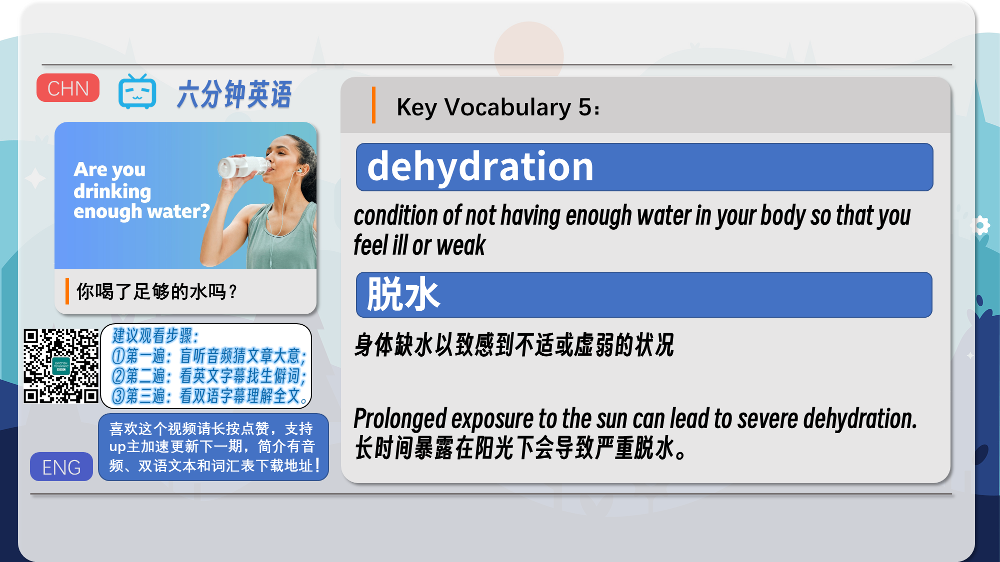
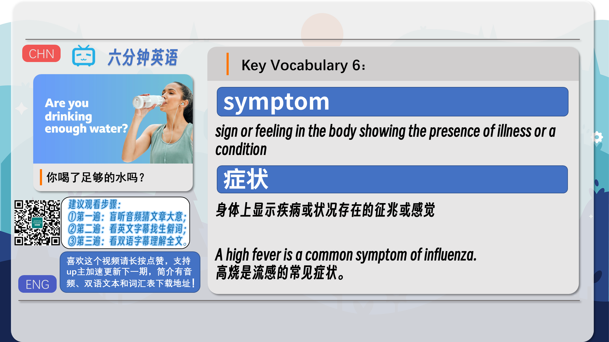
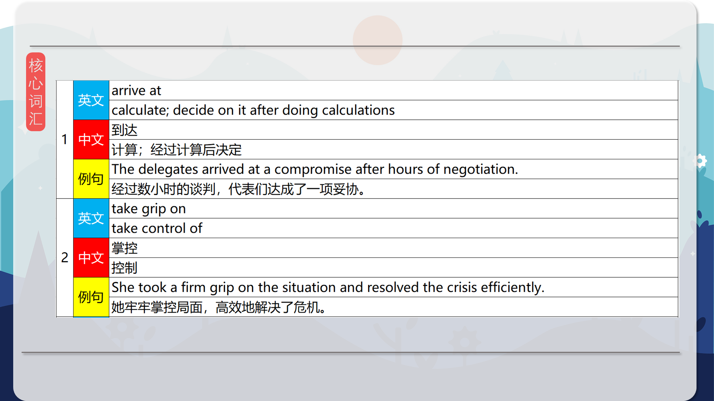
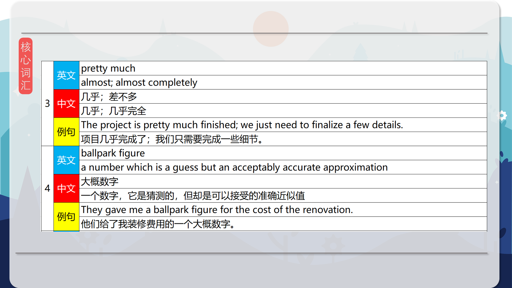
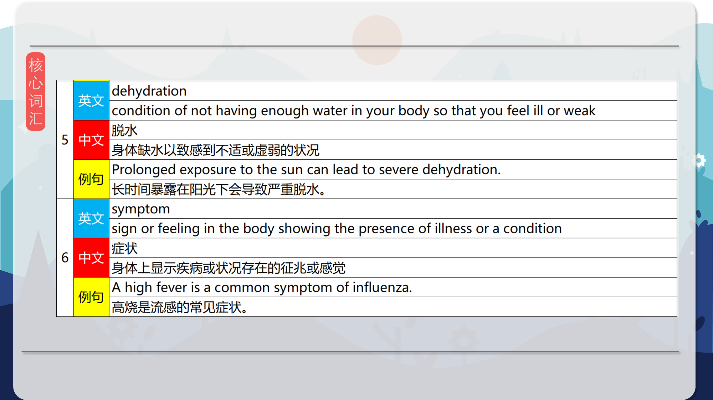
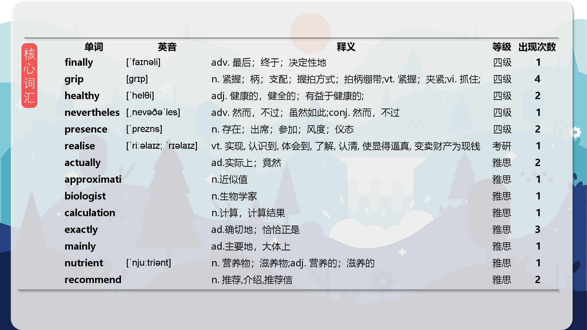

### 【英文脚本】
Phil
Hello. This is 6 Minute English from BBC Learning English. I'm Phil.

Beth
And I'm Beth. Nowadays, I often see people carrying water bottles with them to make sure they drink enough. How much water do you drink a day, Phil?

Phil
Oh, I don't know. Maybe about a litre?

Beth
OK. And do you know how much water you should drink a day?

Phil
I think it's probably about two litres.

Beth
Ah, well, the number many people have heard is two litres a day. Of course, everyone needs to drink some water - over half the human body is made up of it. But exactly how much water do we need to stay healthy? That's what we'll be discussing in this programme, along with some useful new vocabulary as well.

Phil
And speaking of vocabulary, remember you can download all the new words and phrases from this programme, plus worksheet exercises to help you learn them, on our website, bbclearningenglish.com.

Beth
Great! But first I have a question for you, Phil. I mentioned that over half the human body consists of water, but there's an even higher percentage of water in our blood. But how much? Is our blood: a) around 80% water? b) around 90% water? or, c) 100% water?

Phil
I think it's around 80% water.

Beth
OK, I will reveal the correct answer later in the programme. Our blood needs water so it can carry nutrients to the body's cells and organs. The amount recommended is often given as two litres a day. But why? Here to discuss this with BBC World Service programme, The Food Chain, is biologist, Professor John Speakman:

Professor John Speakman
So, I'm not sure how it was arrived at but it seems to be a number that has taken grip on a very large number of countries. So, if you look at government recommendations around the world, they're pretty much all the same. They pretty much all say everybody's got to be drinking two litres of water.

Phil
Professor Speakman doesn't know how the number of two litres a day was arrived at – how it was decided or calculated. Nevertheless, the idea of drinking two litres a day has taken grip on many governments around the world. When you say an idea has taken grip on something, you mean it's taken control of it.

Beth
Yes, Professor Speakman says that pretty much all governments are giving pretty much the same recommendation. He uses the phrase, pretty much, to mean almost. For example, 'pretty much all governments advise drinking two litres a day' means 'almost all governments advise it'.

Phil
What Professor Speakman doesn't have, however, is any scientific evidence for this advice. The number of exactly two litres isn't based on scientific fact, it's more of a ballpark figure – a number which is a guess, but which you still believe is approximately correct.

Beth
Actually, the amount of water in our bodies is changing all the time. Like your bank balance, which goes down when you spend money, your body loses water all the time, when you breathe, sweat, or go to the toilet. Exactly how much you need to drink depends on how much water your body needs to replace, and that mainly depends on your size.

Phil
But what happens when we drink less than we should? Here's hydration expert, Dr Nidia Rodriguez-Sanchez, describing the effects of dehydration to BBC World Service's, The Food Chain.

Dr Nidia Rodriguez-Sanchez
And also, many times we start getting dehydrated and we don't realise we are dehydrated. So it's very common that we feel tired, or we feel, like, with a bit of a headache, or even we think we're hungry, and we go and get some food. And actually what is happening is that we are thirsty, that we are dehydrated, we are starting to show some signs or some symptoms of dehydration.

Phil
Dr Sanchez describes the effects of dehydration, the condition of not having enough water in your body so that you feel ill or weak. She mentions feeling tired, having a headache or a dry mouth as symptoms of dehydration. Symptoms are signs or feelings in the body showing the presence of some illness or condition.

Beth
So, whether you drink a little more, or a little less, it seems that around two litres of water a day is a good way to keep your blood and body healthy. Speaking of which, Phil, it's time to reveal the answer to my question, what percentage of our blood is water? You said 80%, and the answer is 90%. Our blood consists of around 90% water. OK, let's recap the vocabulary we've used, starting with the phrase to arrive at a number, meaning to decide it by doing calculations.

Phil
If an idea takes grip on something, it takes control of it.

Beth
The phrase pretty much means almost; for example, pretty much everyone likes chocolate, which means almost everyone likes chocolate.

Phil
A ballpark figure is a phrase meaning a number which is an acceptably accurate approximation.

Beth
Dehydration is the condition of not having enough water in your body so that you feel ill or weak.

Phil
And finally, a symptom is a sign or feeling in the body showing the presence of an illness or condition. Once again, our six minutes are up. Why not join me now and head over to our website, bbclearningenglish.com, download the worksheet for this programme, and test yourself to see how much you remember? See you there soon!

Beth
Bye!

### 【中英文双语脚本】
Phil(菲尔)
I'm Phil.
你好。这是来自 BBC Learning English 的六分钟英语。我是 Phil。

Beth(贝丝)
And I'm Beth. Nowadays, I often see people carrying water bottles with them to make sure they drink enough. How much water do you drink a day, Phil?
我是 Beth。如今，我经常看到人们随身携带水瓶以确保他们喝得足够。你每天喝多少水，Phil？

Phil(菲尔)
Oh, I don't know. Maybe about a litre?
哦，我不知道。也许大约一升？

Beth(贝丝)
OK. And do you know how much water you should drink a day?
还行。你知道你每天应该喝多少水吗？

Phil(菲尔)
I think it's probably about two litres.
我想大概是两升。

Beth(贝丝)
Ah, well, the number many people have heard is two litres a day. Of course, everyone needs to drink some water - over half the human body is made up of it. But exactly how much water do we need to stay healthy? That's what we'll be discussing in this programme, along with some useful new vocabulary as well.
啊，嗯，很多人听说的数字是每天两升。当然，每个人都需要喝一些水 —— 人体的一半以上是由水组成的。但是，我们究竟需要多少水才能保持健康呢？这就是我们将在本节目中讨论的内容，以及一些有用的新词汇。

Phil(菲尔)
And speaking of vocabulary, remember you can download all the new words and phrases from this programme, plus worksheet exercises to help you learn them, on our website, bbclearningenglish.com.
说到词汇，请记住，您可以在我们的网站上下载该节目中的所有新单词和短语，以及帮助您学习它们的工作表练习，bbclearningenglish.com。

Beth(贝丝)
Great! But first I have a question for you, Phil. I mentioned that over half the human body consists of water, but there's an even higher percentage of water in our blood. But how much? Is our blood: a) around 80% water? b) around 90% water? or, c) 100% water?
太好了！但首先我有一个问题要问你，Phil。我提到过，人体的一半以上由水组成，但我们血液中的水比例甚至更高。但多少呢？我们的血液是否：a） 大约 80% 是水？b） 大约 90% 的水？或者，c） 100% 水？

Phil(菲尔)
I think it's around 80% water.
我认为大约 80% 是水。

Beth(贝丝)
OK, I will reveal the correct answer later in the programme. Our blood needs water so it can carry nutrients to the body's cells and organs. The amount recommended is often given as two litres a day. But why? Here to discuss this with BBC World Service programme, The Food Chain, is biologist, Professor John Speakman:
好的，我将在稍后的节目中透露正确答案。我们的血液需要水，这样才能将营养物质输送到身体的细胞和器官。建议的量通常为每天 2 升。但是为什么？在这里与 BBC 世界服务节目《食物链》讨论这个问题的是生物学家约翰·斯皮克曼教授：

Professor John Speakman(John Speakman 教授)
So, I'm not sure how it was arrived at but it seems to be a number that has taken grip on a very large number of countries. So, if you look at government recommendations around the world, they're pretty much all the same. They pretty much all say everybody's got to be drinking two litres of water.
所以，我不确定它是如何得出的，但这个数字似乎已经控制了非常多的国家。所以，如果你看一下世界各地的政府建议，它们几乎都是一样的。他们几乎都说每个人都必须喝两升水。

Phil(菲尔)
Professor Speakman doesn't know how the number of two litres a day was arrived at – how it was decided or calculated. Nevertheless, the idea of drinking two litres a day has taken grip on many governments around the world. When you say an idea has taken grip on something, you mean it's taken control of it.
Speakman 教授不知道每天 2 升的水数是如何得出的 —— 它是如何决定或计算的。尽管如此，每天喝两升的想法已经影响了世界各地的许多政府。当你说一个想法已经抓住了某件事时，你的意思是它已经控制了它。

Beth(贝丝)
Yes, Professor Speakman says that pretty much all governments are giving pretty much the same recommendation. He uses the phrase, pretty much, to mean almost. For example, 'pretty much all governments advise drinking two litres a day' means 'almost all governments advise it'.
是的，斯皮克曼教授说，几乎所有政府都给出了几乎相同的建议。他用这个词，几乎是，意思几乎。例如，“几乎所有政府都建议每天喝两升”的意思是“几乎所有政府都建议这样做”。

Phil(菲尔)
What Professor Speakman doesn't have, however, is any scientific evidence for this advice. The number of exactly two litres isn't based on scientific fact, it's more of a ballpark figure – a number which is a guess, but which you still believe is approximately correct.
然而，斯皮克曼教授没有为这个建议提供任何科学证据。正好 2 升的数字不是基于科学事实，它更像是一个大概的数字 —— 一个猜测的数字，但你仍然相信它大致正确。

Beth(贝丝)
Actually, the amount of water in our bodies is changing all the time. Like your bank balance, which goes down when you spend money, your body loses water all the time, when you breathe, sweat, or go to the toilet. Exactly how much you need to drink depends on how much water your body needs to replace, and that mainly depends on your size.
实际上，我们体内的水量一直在变化。就像你花钱时银行余额会下降一样，当你呼吸、出汗或上厕所时，你的身体会一直流失水分。你到底需要喝多少水取决于你的身体需要补充多少水，而这主要取决于你的体型。

Phil(菲尔)
But what happens when we drink less than we should? Here's hydration expert, Dr Nidia Rodriguez-Sanchez, describing the effects of dehydration to BBC World Service's, The Food Chain.
但是，当我们喝得少于我们应该喝的少时会发生什么呢？这是补水专家 Nidia Rodriguez-Sanchez 博士向 BBC 国际频道的 The Food Chain 描述脱水的影响。

Dr Nidia Rodriguez-Sanchez(Nidia Rodriguez-Sanchez 医师)
And also, many times we start getting dehydrated and we don't realise we are dehydrated. So it's very common that we feel tired, or we feel, like, with a bit of a headache, or even we think we're hungry, and we go and get some food. And actually what is happening is that we are thirsty, that we are dehydrated, we are starting to show some signs or some symptoms of dehydration.
而且，很多时候我们开始脱水，但我们没有意识到我们脱水了。因此，我们感到疲倦，或者我们感到有点头痛，甚至我们认为我们饿了，然后我们去吃点东西，这是很常见的。实际上，我们正在发生的事情是我们口渴，我们脱水，我们开始出现一些脱水的迹象或症状。

Phil(菲尔)
Dr Sanchez describes the effects of dehydration, the condition of not having enough water in your body so that you feel ill or weak. She mentions feeling tired, having a headache or a dry mouth as symptoms of dehydration. Symptoms are signs or feelings in the body showing the presence of some illness or condition.
Sanchez 博士描述了脱水的影响，脱水是指体内水分不足，以至于您感到不适或虚弱的情况。她提到感到疲倦、头痛或口干是脱水的症状。症状是体内显示存在某种疾病或病症的迹象或感觉。

Beth(贝丝)
So, whether you drink a little more, or a little less, it seems that around two litres of water a day is a good way to keep your blood and body healthy. Speaking of which, Phil, it's time to reveal the answer to my question, what percentage of our blood is water? You said 80%, and the answer is 90%. Our blood consists of around 90% water. OK, let's recap the vocabulary we've used, starting with the phrase to arrive at a number, meaning to decide it by doing calculations.
因此，无论您多喝一点还是少喝一点，每天喝两升左右的水似乎都是保持血液和身体健康的好方法。说到这里，Phil，是时候揭示我问题的答案了，我们血液中有多少百分比是水？你说 80%，答案是 90%。我们的血液由大约 90% 的水组成。好，让我们回顾一下我们使用的词汇，从短语开始得出一个数字，意思是通过计算来决定它。

Phil(菲尔)
If an idea takes grip on something, it takes control of it.
如果一个想法抓住了某件事，它就会控制它。

Beth(贝丝)
The phrase pretty much means almost; for example, pretty much everyone likes chocolate, which means almost everyone likes chocolate.
这个短语的意思是几乎；例如，几乎每个人都喜欢巧克力，这意味着几乎每个人都喜欢巧克力。

Phil(菲尔)
A ballpark figure is a phrase meaning a number which is an acceptably accurate approximation.
一个大概的数字是一个短语，意思是一个数字，这是一个可以接受的准确近似值。

Beth(贝丝)
Dehydration is the condition of not having enough water in your body so that you feel ill or weak.
脱水是指体内没有足够的水分，以至于您感到不适或虚弱的情况。

Phil(菲尔)
And finally, a symptom is a sign or feeling in the body showing the presence of an illness or condition. Once again, our six minutes are up. Why not join me now and head over to our website, bbclearningenglish.com, download the worksheet for this programme, and test yourself to see how much you remember? See you there soon!
最后，症状是体内表明存在疾病或病症的迹象或感觉。我们的六分钟又结束了。为什么不现在就加入我，前往我们的网站，bbclearningenglish.com，下载此计划的工作表，并测试自己，看看您记得多少呢？期待很快与您相见！

Beth(贝丝)
Bye!
再见！

### 【核心词汇】
#### arrive at
calculate; decide on it after doing calculations
到达
计算；经过计算后决定
The delegates arrived at a compromise after hours of negotiation.
经过数小时的谈判，代表们达成了一项妥协。
#### take grip on
take control of
掌控
控制
She took a firm grip on the situation and resolved the crisis efficiently.
她牢牢掌控局面，高效地解决了危机。
#### pretty much
almost; almost completely
几乎；差不多
几乎；几乎完全
The project is pretty much finished; we just need to finalize a few details.
项目几乎完成了；我们只需要完成一些细节。
#### ballpark figure
a number which is a guess but an acceptably accurate approximation
大概数字
一个数字，它是猜测的，但却是可以接受的准确近似值
They gave me a ballpark figure for the cost of the renovation.
他们给了我装修费用的一个大概数字。
#### dehydration
condition of not having enough water in your body so that you feel ill or weak
脱水
身体缺水以致感到不适或虚弱的状况
Prolonged exposure to the sun can lead to severe dehydration.
长时间暴露在阳光下会导致严重脱水。
#### symptom
sign or feeling in the body showing the presence of illness or a condition
症状
身体上显示疾病或状况存在的征兆或感觉
A high fever is a common symptom of influenza.
高烧是流感的常见症状。

在公众号里输入6位数字，获取【对话音频、英文文本、中文翻译、核心词汇和高级词汇表】电子档，6位数字【暗号】在文章的最后一张图片，如【220728】，表示22年7月28日这一期。公众号没有的文章说明还没有制作相关资料。年度合集在B站【六分钟英语】工房获取，每年共计300+文档，感谢支持！