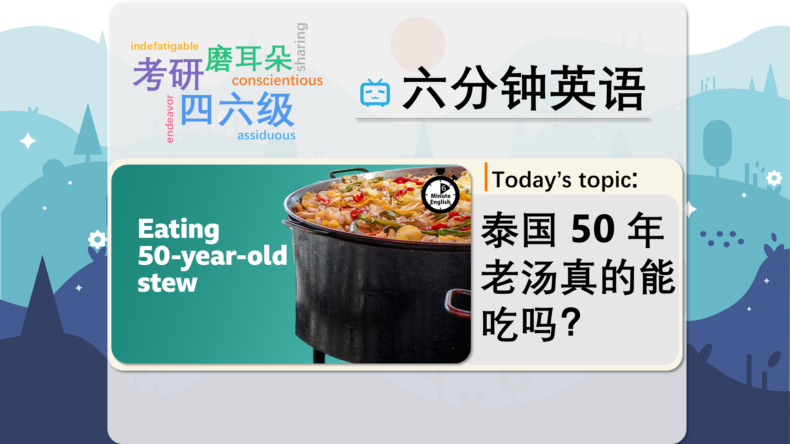

### 【英文脚本】
Phil
Hello. This is 6 Minute English from BBC Learning English. I'm Phil.

Beth
And I'm Beth.

Phil
Most people have eaten some unusual food at least once in their life. What's the most unusual thing you've ever eaten, Beth?

Beth
Oh, I ate camel in Australia, and I really didn't like it, to be honest. What about you?

Phil
I ate caiman in Northern Argentina, and it was delicious!

Beth
Oh, OK. Good!

Phil
Well, in this programme we'll be discussing some very unusual food known as 'forever food' – dishes, like stews and soups, which can be kept going day after day, year after year. We'll also be learning some useful new vocabulary, all of which you can download, along with a worksheet for this programme, at our website, bbclearningenglish.com.

Beth
But let's get back to forever food, and a Bangkok restaurant called, Wattana Panich, that's famous for a soup which has been cooking for over 50 years! Here's radio listener, David Shirley, who called BBC World Service programme, The Food Chain, after tasting the soup himself:

David Shirley
I had never heard of a perpetual stew before, but the first time I'd ever heard about it was when I was in Bangkok. I found a stew that had been simmering for fifty years.

Phil
David tasted perpetual stew, a pot into which ingredients are placed and cooked continuously. The pot is never completely emptied. Instead, new ingredients and water are added when necessary and left simmering – cooking at a temperature just below boiling so that the food bubbles gently.

Beth
A 50-year-old soup might not be to everyone's taste, but forever foods are surprisingly common. And, Phil, I have a question for you about Wattana Panich's 50-year-old soup. What do you think is the main ingredient? Is it: a) beef? b) chicken? or, c) vegetables?

Phil
Oh, I think vegetables. I think that's probably safer.

Beth
OK. Well, we'll find out the correct answer later in the programme. It's not just Bangkok where people cook forever foods. Fuchsia Dunlop is a writer and cook specialising in Chinese food. Here, she tells BBC World Service programme, 'The Food Chain', about a Chinese stew that is rumoured to be 100 years old:

Fuchsia Dunlop
In China they sometimes, you know, professionals talk about having a bǎinián laolu which means, like, a 100-year-old-broth. So, I don't know if this is strictly true, but theoretically as long as you have a good practice of hygiene - which is to say that you always skim it, and boil it every day, and also replenish it as needed with more water, more salt, more spices, and you know, you keep tasting - then it just gets richer and richer.

Phil
Cooks need to replenish a forever stew, to fill it up again with fresh ingredients before it's completely eaten. By being regularly replenished, some dishes are rumoured to last 100 years.

Beth
Wow, that is a long time! Fuchsia doesn't know if it's strictly true, or completely true, that the same stew has really lasted 100 years, but she thinks it's possible in theory, as long as it's kept safe and hygienic through boiling.

Phil
Professor Martha Carlin is a historian with a special interest in medieval cookery. Here, she explains to BBC World Service programme, 'The Food Chain', why long- lasting foods could have been familiar to people in the Middle Ages:

Prof Martha Carlin
In theory, it would make sense to think that people who didn't have matches or fire starters, for whom starting a fire from scratch was quite a cumbersome process, would naturally want to keep a stew pot bubbling if they had the means to do that, and to avoid the labour of constantly restarting the fire, and also to make sure that they had a hot meal waiting at any time.

Beth
Having hot food bubbling away on the fire means there is always something ready to eat, and avoids having to start a fire from scratch. When you do something, like cook food or make a fire, from scratch, you do it from the beginning, without the help of anything that has already been made.

Phil
Starting a fire is also cumbersome, an adjective meaning difficult to do, taking time and effort. But Professor Carlin says only rich families were able to afford enough wood to keep a fire going all day. Anyway, all this talk of food has made me hungry, Beth, so what was the answer to your question?

Beth
Ah, I asked you what the main ingredient is in the Bangkok stew, and you said vegetables. And I'm afraid that's wrong. It was, in fact, beef. OK, let's recap the vocabulary we've learned in this programme about forever foods such as perpetual stew, a pot of stew into which new ingredients are regularly added, allowing the dish to be eaten over a long time.

Phil
When food is simmering, it's cooking at a temperature slightly below boiling so that it bubbles gently.

Beth
The verb replenish means to fill something up again.

Phil
If something is not strictly true, it's not completely or entirely true.

Beth
When you do an activity such as cooking, from scratch, you do it from the beginning, without using anything that has already been made.

Phil
And finally, if an activity is cumbersome, it's difficult to do and takes a lot of time and effort. Once again, our six minutes are up. Remember to visit our website, bbclearningenglish.com, where you'll find a worksheet and a quiz related to this programme, and we'll see you again soon for more trending topics and useful vocabulary, here at 6 Minute English. Goodbye for now!

Beth
Bye!

### 【中英文双语脚本】
Phil(菲尔)
I'm Phil.
你好。这是来自 BBC Learning English 的六分钟英语。我是 Phil。

Beth(贝丝)
And I'm Beth.
我是 Beth。

Phil(菲尔)
Most people have eaten some unusual food at least once in their life. What's the most unusual thing you've ever eaten, Beth?
大多数人一生中至少吃过一次不寻常的食物。贝丝，你吃过的最不寻常的东西是什么？

Beth(贝丝)
Oh, I ate camel in Australia, and I really didn't like it, to be honest. What about you?
哦，我在澳大利亚吃过骆驼，说实话，我真的不喜欢它。你呢？

Phil(菲尔)
I ate caiman in Northern Argentina, and it was delicious!
我在阿根廷北部吃了凯门鳄，很好吃！

Beth(贝丝)
Oh, OK. Good!
哦，好的，很好！

Phil(菲尔)
Well, in this programme we'll be discussing some very unusual food known as 'forever food' – dishes, like stews and soups, which can be kept going day after day, year after year. We'll also be learning some useful new vocabulary, all of which you can download, along with a worksheet for this programme, at our website, bbclearningenglish.com.
好吧，在这个节目中，我们将讨论一些非常不寻常的食物，被称为 “永恒的食物”--像炖菜和汤一样的菜肴，可以日复一日，年复一年地保持下去。我们还将学习一些有用的新词汇，所有这些词汇都可以在我们的网站上下载，以及该节目的工作表，bbclearningenglish.com。

Beth(贝丝)
But let's get back to forever food, and a Bangkok restaurant called, Wattana Panich, that's famous for a soup which has been cooking for over 50 years! Here's radio listener, David Shirley, who called BBC World Service programme, The Food Chain, after tasting the soup himself:
但是让我们回到永恒的食物，一家名为 Wattana Panich 的曼谷餐厅，它以已经烹饪了 50 多年的汤而闻名！这是电台听众大卫·雪莉 在亲自品尝了汤后致电 BBC 世界服务节目 The Food Chain：

David Shirley(大卫·雪莉)
I had never heard of a perpetual stew before, but the first time I'd ever heard about it was when I was in Bangkok. I found a stew that had been simmering for fifty years.
我以前从未听说过永久炖菜，但我第一次听说它是在曼谷的时候。我找到了一个炖了五十年的炖菜。

Phil(菲尔)
David tasted perpetual stew, a pot into which ingredients are placed and cooked continuously. The pot is never completely emptied. Instead, new ingredients and water are added when necessary and left simmering – cooking at a temperature just below boiling so that the food bubbles gently.
大卫尝到了永久炖菜的味道，这是一个将食材放入其中并不断烹饪的锅。这个罐子永远不会完全清空。相反，必要时加入新的成分和水并炖着 —— 在略低于沸腾的温度下烹饪，使食物轻轻冒泡。

Beth(贝丝)
A 50-year-old soup might not be to everyone's taste, but forever foods are surprisingly common. And, Phil, I have a question for you about Wattana Panich's 50-year-old soup. What do you think is the main ingredient? Is it: a) beef? b) chicken? or, c) vegetables?
50 年的汤可能并不符合每个人的口味，但永恒的食物却出奇地普遍。菲尔，我有一个关于 Wattana Panich 的 50 年老汤的问题要问你。您认为主要成分是什么？是：a） 牛肉？b） 鸡肉？或者，c） 蔬菜？

Phil(菲尔)
Oh, I think vegetables. I think that's probably safer.
哦，我想是蔬菜。我认为这可能更安全。

Beth(贝丝)
OK. Well, we'll find out the correct answer later in the programme. It's not just Bangkok where people cook forever foods. Fuchsia Dunlop is a writer and cook specialising in Chinese food. Here, she tells BBC World Service programme, 'The Food Chain', about a Chinese stew that is rumoured to be 100 years old:
还行。好吧，我们将在节目的后面找到正确答案。不仅仅是曼谷，人们永远烹饪食物。Fuchsia Dunlop 是一位作家和厨师，专门研究中餐。在这里，她告诉 BBC 世界服务节目“食物链”，关于一种据传已有 100 年历史的中国炖菜：

Fuchsia Dunlop(紫红色邓禄普)
In China they sometimes, you know, professionals talk about having a bǎinián laolu which means, like, a 100-year-old-broth. So, I don't know if this is strictly true, but theoretically as long as you have a good practice of hygiene - which is to say that you always skim it, and boil it every day, and also replenish it as needed with more water, more salt, more spices, and you know, you keep tasting - then it just gets richer and richer.
在中国，专业人士有时会谈论 bǎinián laolu，意思是，就像 100 年的肉汤一样。所以，我不知道这是否严格来说是正确的，但从理论上讲，只要你有良好的卫生习惯 —— 也就是说，你总是撇去它，每天煮它，并根据需要补充更多的水、更多的盐、更多的香料，你知道，你不断品尝 —— 那么它就会变得越来越丰富。

Phil(菲尔)
Cooks need to replenish a forever stew, to fill it up again with fresh ingredients before it's completely eaten. By being regularly replenished, some dishes are rumoured to last 100 years.
厨师需要补充永远的炖菜，在完全食用之前再次用新鲜食材填满。通过定期补充，有传言称有些菜肴可以使用 100 年。

Beth(贝丝)
Wow, that is a long time! Fuchsia doesn't know if it's strictly true, or completely true, that the same stew has really lasted 100 years, but she thinks it's possible in theory, as long as it's kept safe and hygienic through boiling.
哇，好好长的时间啊！Fuchsia 不知道同样的炖菜真的持续了 100 年是严格正确的还是完全正确的，但她认为理论上是可能的，只要它在煮沸时保持安全和卫生。

Phil(菲尔)
Professor Martha Carlin is a historian with a special interest in medieval cookery. Here, she explains to BBC World Service programme, 'The Food Chain', why long- lasting foods could have been familiar to people in the Middle Ages:
玛莎·卡林 教授是一位历史学家，对中世纪烹饪特别感兴趣。在这里，她向 BBC 世界服务节目“食物链”解释了为什么中世纪的人们会熟悉长效食物：

Prof Martha Carlin(Martha Carlin 教授)
In theory, it would make sense to think that people who didn't have matches or fire starters, for whom starting a fire from scratch was quite a cumbersome process, would naturally want to keep a stew pot bubbling if they had the means to do that, and to avoid the labour of constantly restarting the fire, and also to make sure that they had a hot meal waiting at any time.
从理论上讲，认为没有火柴或点火器的人是有道理的，对他们来说从头开始生火是一个相当繁琐的过程，如果他们有办法的话，自然会希望让炖锅冒泡，并避免不断点火的劳动。 还要确保他们随时都有热饭等着他们。

Beth(贝丝)
Having hot food bubbling away on the fire means there is always something ready to eat, and avoids having to start a fire from scratch. When you do something, like cook food or make a fire, from scratch, you do it from the beginning, without the help of anything that has already been made.
让热食在火上冒泡意味着总有现成的东西可以吃，并且不必从头开始生火。当你从头开始做某事时，比如做饭或生火，你从头开始做，不需要任何已经完成的帮助。

Phil(菲尔)
Starting a fire is also cumbersome, an adjective meaning difficult to do, taking time and effort. But Professor Carlin says only rich families were able to afford enough wood to keep a fire going all day. Anyway, all this talk of food has made me hungry, Beth, so what was the answer to your question?
生火也很麻烦，这个形容词的意思是很难做到，需要时间和精力。但卡林教授说，只有富裕家庭才能买得起足够的木材来维持一整天的火势。不管怎样，所有这些关于食物的讨论都让我饿了，贝丝，那么你的问题的答案是什么？

Beth(贝丝)
Ah, I asked you what the main ingredient is in the Bangkok stew, and you said vegetables. And I'm afraid that's wrong. It was, in fact, beef. OK, let's recap the vocabulary we've learned in this programme about forever foods such as perpetual stew, a pot of stew into which new ingredients are regularly added, allowing the dish to be eaten over a long time.
啊，我问你曼谷炖菜的主要成分是什么，你说蔬菜。恐怕这是错误的。事实上，它是牛肉。好，让我们回顾一下我们在这个节目中学到的关于永恒食物的词汇，比如永久炖菜，一锅炖菜，定期添加新成分，让这道菜可以长时间食用。

Phil(菲尔)
When food is simmering, it's cooking at a temperature slightly below boiling so that it bubbles gently.
当食物炖煮时，它会在略低于沸腾的温度下烹饪，以便轻轻冒泡。

Beth(贝丝)
The verb replenish means to fill something up again.
动词 replenish 的意思是再次填充某物。

Phil(菲尔)
If something is not strictly true, it's not completely or entirely true.
如果某件事不是严格正确的，那么它就不完全或完全正确。

Beth(贝丝)
When you do an activity such as cooking, from scratch, you do it from the beginning, without using anything that has already been made.
当您从头开始进行烹饪等活动时，您可以从头开始进行，而无需使用已经制作的任何产品。

Phil(菲尔)
And finally, if an activity is cumbersome, it's difficult to do and takes a lot of time and effort. Once again, our six minutes are up. Remember to visit our website, bbclearningenglish.com, where you'll find a worksheet and a quiz related to this programme, and we'll see you again soon for more trending topics and useful vocabulary, here at 6 Minute English. Goodbye for now!
最后，如果一项活动很麻烦，那就很难做，并且需要大量的时间和精力。我们的六分钟又结束了。记得访问我们的网站 bbclearningenglish.com，在那里您可以找到与此计划相关的工作表和测验，我们很快就会再次见到您，了解更多热门话题和有用的词汇，请访问 6 Minute English。再见！

Beth(贝丝)
Bye!
再见！

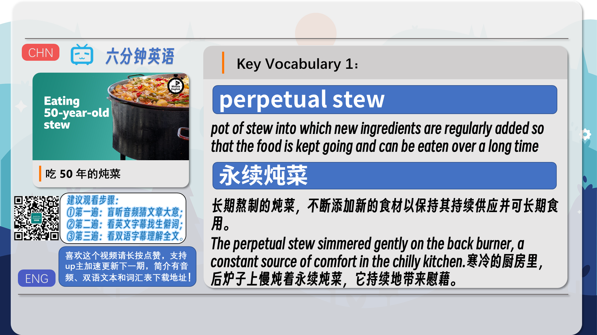
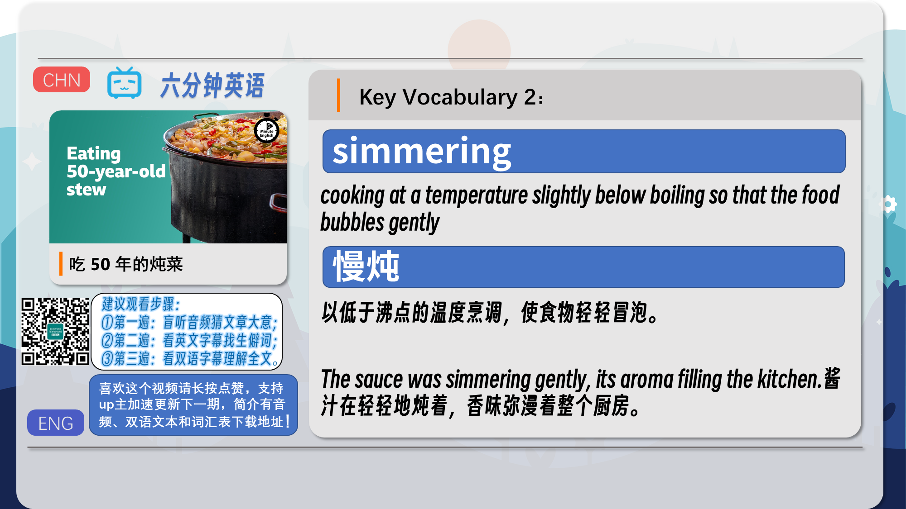
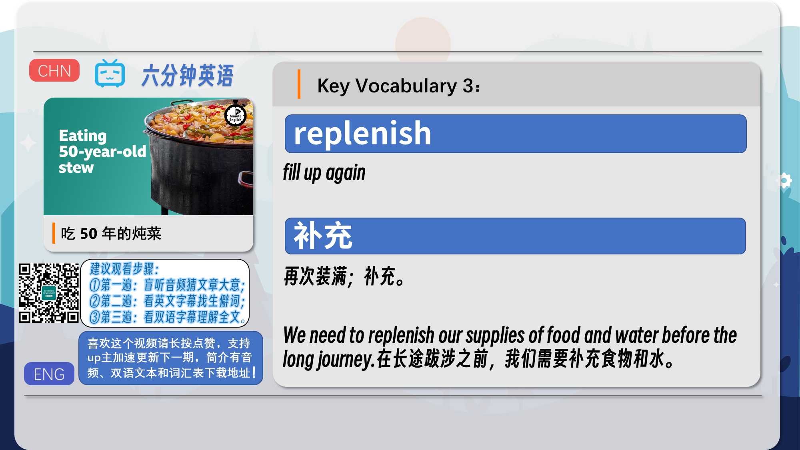
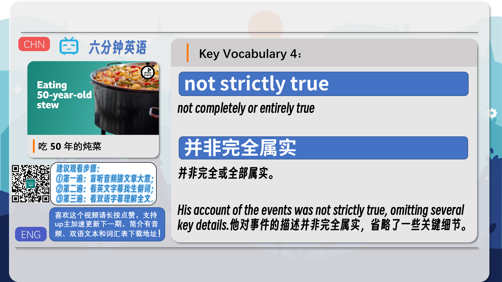
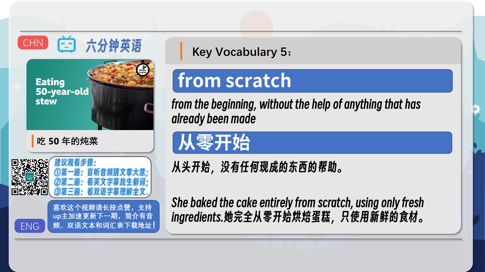
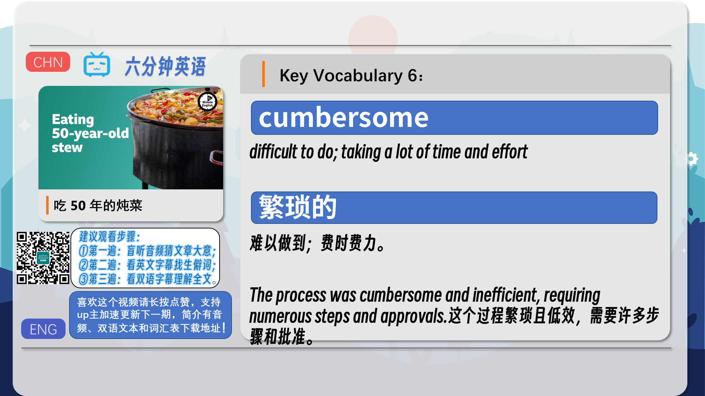
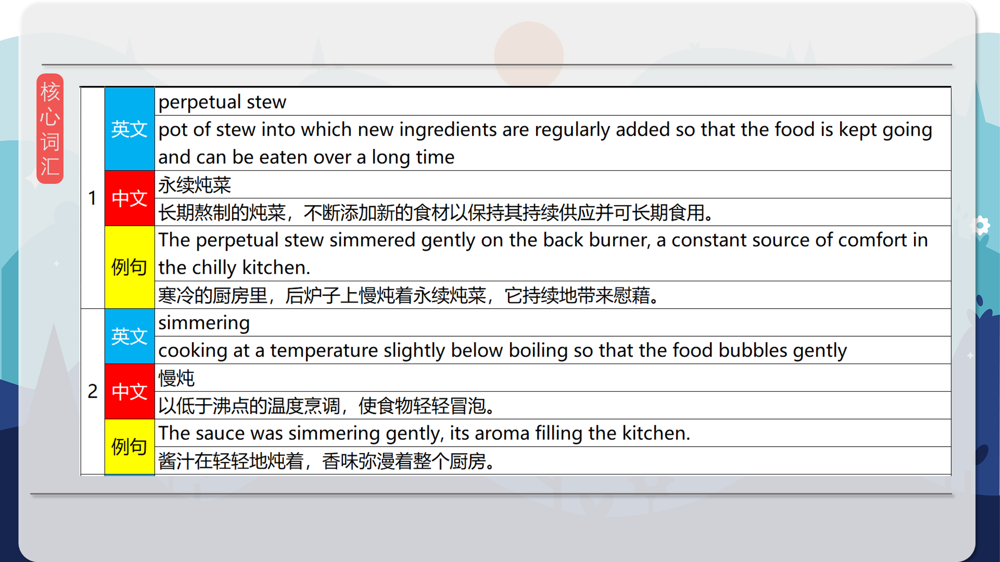
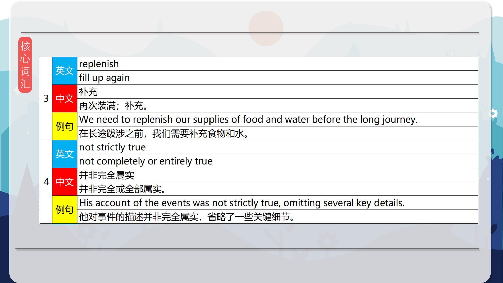
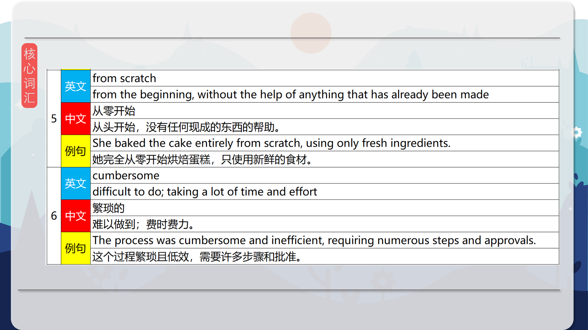
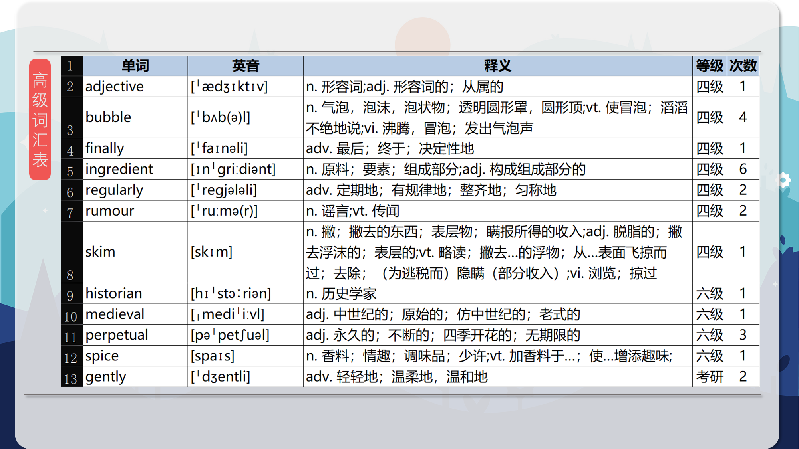
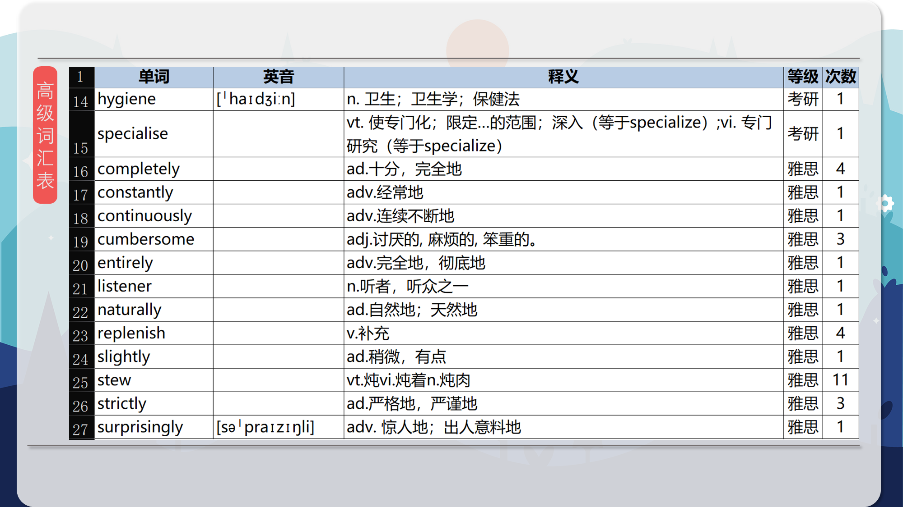

### 【核心词汇】
#### perpetual stew
pot of stew into which new ingredients are regularly added so that the food is kept going and can be eaten over a long time
永续炖菜
长期熬制的炖菜，不断添加新的食材以保持其持续供应并可长期食用。
The perpetual stew simmered gently on the back burner, a constant source of comfort in the chilly kitchen.
寒冷的厨房里，后炉子上慢炖着永续炖菜，它持续地带来慰藉。
#### simmering
cooking at a temperature slightly below boiling so that the food bubbles gently
慢炖
以低于沸点的温度烹调，使食物轻轻冒泡。
The sauce was simmering gently, its aroma filling the kitchen.
酱汁在轻轻地炖着，香味弥漫着整个厨房。
#### replenish
fill up again
补充
再次装满；补充。
We need to replenish our supplies of food and water before the long journey.
在长途跋涉之前，我们需要补充食物和水。
#### not strictly true
not completely or entirely true
并非完全属实
并非完全或全部属实。
His account of the events was not strictly true, omitting several key details.
他对事件的描述并非完全属实，省略了一些关键细节。
#### from scratch
from the beginning, without the help of anything that has already been made
从零开始
从头开始，没有任何现成的东西的帮助。
She baked the cake entirely from scratch, using only fresh ingredients.
她完全从零开始烘焙蛋糕，只使用新鲜的食材。
#### cumbersome
difficult to do; taking a lot of time and effort
繁琐的
难以做到；费时费力。
The process was cumbersome and inefficient, requiring numerous steps and approvals.
这个过程繁琐且低效，需要许多步骤和批准。

在公众号里输入6位数字，获取【对话音频、英文文本、中文翻译、核心词汇和高级词汇表】电子档，6位数字【暗号】在文章的最后一张图片，如【220728】，表示22年7月28日这一期。公众号没有的文章说明还没有制作相关资料。年度合集在B站【六分钟英语】工房获取，每年共计300+文档，感谢支持！