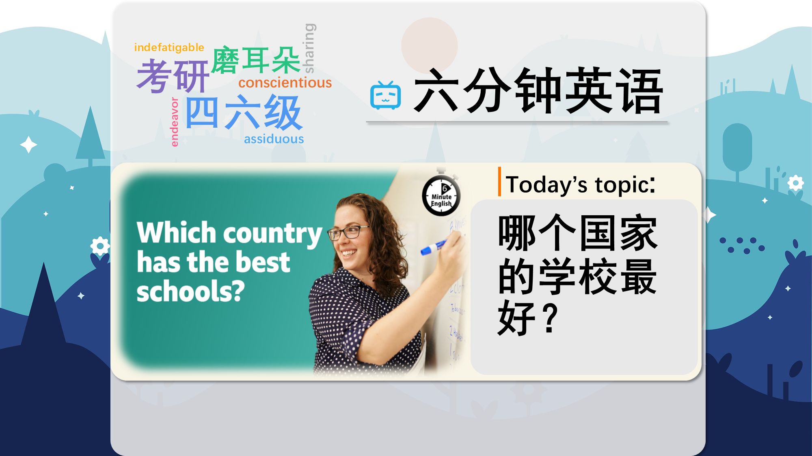

### 【英文脚本】
Phil
Hello. This is 6 Minute English from BBC Learning English. I’m Phil.

Beth
And I’m Beth.

Phil
So, Beth, we're talking about the best education systems in the world today. You went to school here in Britain. What do you think of the British education system? Do you think it could be the best?

Beth
I think it's quite good, there's probably a couple of things that I personally would change about it, but I would say it's quite good, but maybe not the best in the world.

Phil
Well, in this programme, we are going to be talking about the Pisa rankings.

Beth
The rankings are based on tests carried out by the OECD, that's an international organisation, every three years. These tests attempt to show which countries are the most effective at teaching maths, science and reading. But is that really possible to measure? Well, here is former BBC education correspondent Sean Coughlan talking to BBC World Service programme 'The Global Story'.

Sean Coughlan
When they were introduced first of all, that was a very contentious idea, because people said 'how can you possibly compare big countries… how can you compare America to Luxembourg or to, you know, or to parts of China, or whatever?'.

Phil
Sean said that the tests were contentious. If something is contentious, then it is something that people might argue about – it's controversial. So, at first, Pisa tests were contentious because not everyone believed it was fair to compare very different countries.

Beth
Phil, I've got a question for you about them. So, in 2022, Singapore was top of the reading rankings. But which of these countries came second? Was it: a) The USA? b) Ireland? or, c) The UK?

Phil
I think it might be b) Ireland.

Beth
OK. Well, we will find out if that's correct at the end of the programme. A common pattern in the Pisa rankings is that the most successful countries tend to be smaller. Talking to BBC World Service programme 'The Global Story', Sean Coughlan tells us that many large countries from Western Europe don't score that highly in the rankings.

Sean Coughlan
They're being outpaced and outperformed by these fast, upcoming countries – you know, Singapore, or Estonia, or Taiwan, or those sort of places which we don't historically think of as being economic rivals, but I suppose the argument for the PISA tests is, if you want to have a knowledge economy, an economy based on skills, this is how you measure it.

Phil
We heard that many large European countries are being outpaced by smaller nations. If someone outpaces you, they are going faster than you – at a higher pace.

Beth
We use the prefix 'out-' to say that someone or something is better at doing something. We also heard that smaller nations are 'outperforming' larger ones – they are performing better. Singapore, Estonia and Taiwan are described as economic rivals to large European nations – that means that they are competing with them, economically.

Phil
We also heard about a knowledge economy. This is an economy based on service industries that require workers to be highly educated, such as IT, finance or advanced engineering.

Beth
So, what makes countries perform better in these tests? Let's hear again from BBC World Service programme, 'The Global Story'. Sean Coughlan tells us that those countries that prioritise getting everyone to a certain level do well. We also hear from Rando Kuustik, an Estonian school principal.

Sean Coughlan
Countries which make sure that all their pupils get through a certain level of education to a certain standard, regardless of their background, do well.

Rando Kuustik
If you are teaching them by different level or abilities, then you are segregating them and we don't want to segregate any people in the world, why we are doing that in the schools? This one of the main things why Estonia is successful.

Phil
Sean said the most successful systems educate everyone to a particular standard, regardless of their background. If one thing happens regardless of something else, it means that the something else is not important, or not a problem.

Beth
Rando Kuustik said that Estonian schools do not want to segregate students. Segregate means to separate and keep apart.

Phil
So, we've just heard about Estonia, but what about your question, Beth? What about those countries?

Beth
I asked you which out of the USA, Ireland, and the UK came second for reading in the 2022 Pisa rankings. You said Ireland, and that was the correct answer. Well done! OK, let’s recap the vocabulary we’ve learned in this programme about education rankings, starting with contentious - argued about or controversial.

Phil
If you're outpaced by someone, they are going faster than you are.

Beth
Rivals are competitors.

Phil
A knowledge economy is one based on industries that need highly educated workers, such as IT, finance or advanced engineering.

Beth
If something happens regardless of a second thing, the second thing has no impact on it happening.

Phil
And finally, if people are segregated, different groups of people are separated and kept apart. Once again, our six minutes are up. Remember to visit our website, bbclearningenglish.com, where you’ll find a worksheet and quiz related to this programme, and we’ll see you again soon for more trending topics and useful vocabulary, here at 6 Minute English. Goodbye for now!

Beth
Bye!

### 【中英文双语脚本】
Phil(菲尔)
I’m Phil.
你好。这是来自 BBC Learning English 的六分钟英语。我是菲尔。

Beth(贝丝)
And I’m Beth.
我是贝丝。

Phil(菲尔)
So, Beth, we're talking about the best education systems in the world today. You went to school here in Britain. What do you think of the British education system? Do you think it could be the best?
所以，贝丝，我们谈论的是当今世界上最好的教育系统。你在英国上学。您如何看待英国的教育体系？你认为这可能是最好的吗？

Beth(贝丝)
I think it's quite good, there's probably a couple of things that I personally would change about it, but I would say it's quite good, but maybe not the best in the world.
我认为它相当不错，我个人可能会改变它的一些事情，但我想说它相当不错，但可能不是世界上最好的。

Phil(菲尔)
Well, in this programme, we are going to be talking about the Pisa rankings.
好吧，在这个节目中，我们将讨论 Pisa 排名。

Beth(贝丝)
The rankings are based on tests carried out by the OECD, that's an international organisation, every three years. These tests attempt to show which countries are the most effective at teaching maths, science and reading. But is that really possible to measure? Well, here is former BBC education correspondent Sean Coughlan talking to BBC World Service programme 'The Global Story'.
该排名基于经合组织（OECD）每三年进行的一次测试。这些测试试图显示哪些国家在数学、科学和阅读教学方面最有效。但这真的可以衡量吗？嗯，这是前 BBC 教育记者肖恩·考夫兰 （Sean Coughlan） 与 BBC 世界服务节目“全球故事”的对话。

Sean Coughlan(肖恩·考夫兰)
When they were introduced first of all, that was a very contentious idea, because people said 'how can you possibly compare big countries… how can you compare America to Luxembourg or to, you know, or to parts of China, or whatever?'.
当它们第一次被引入时，这是一个非常有争议的想法，因为人们说'你怎么可能比较大国......你怎么能把美国与卢森堡或中国的部分地区，或者其他什么地方进行比较呢？

Phil(菲尔)
Sean said that the tests were contentious. If something is contentious, then it is something that people might argue about – it's controversial. So, at first, Pisa tests were contentious because not everyone believed it was fair to compare very different countries.
肖恩说，这些测试是有争议的。如果某件事是有争议的，那么它就是人们可能会争论的事情 —— 它是有争议的。因此，起初，比萨测试是有争议的，因为不是每个人都认为比较非常不同的国家是公平的。

Beth(贝丝)
Phil, I've got a question for you about them. So, in 2022, Singapore was top of the reading rankings. But which of these countries came second? Was it: a) The USA? b) Ireland? or, c) The UK?
Phil，我有一个关于他们的问题要问你。因此，在 2022 年，新加坡在阅读排名中名列前茅。但这些国家中哪些位居第二呢？是：a） 美国？b） 爱尔兰？或者，c） 英国？

Phil(菲尔)
I think it might be b) Ireland.
我想可能是 b） 爱尔兰。

Beth(贝丝)
OK. Well, we will find out if that's correct at the end of the programme. A common pattern in the Pisa rankings is that the most successful countries tend to be smaller. Talking to BBC World Service programme 'The Global Story', Sean Coughlan tells us that many large countries from Western Europe don't score that highly in the rankings.
还行。好吧，我们将在节目结束时发现这是否正确。比萨排名的一个常见模式是，最成功的国家往往规模较小。肖恩·考夫兰 （Sean Coughlan） 在接受 BBC 国际频道节目“全球故事”采访时告诉我们，许多西欧大国在排名中的得分并不高。

Sean Coughlan(肖恩·考夫兰)
They're being outpaced and outperformed by these fast, upcoming countries – you know, Singapore, or Estonia, or Taiwan, or those sort of places which we don't historically think of as being economic rivals, but I suppose the argument for the PISA tests is, if you want to have a knowledge economy, an economy based on skills, this is how you measure it.
他们被这些快速崛起的国家超越和超越 —— 你知道的，新加坡、爱沙尼亚、台湾，或者那些我们历史上不认为是经济竞争对手的地方，但我想 PISA 测试的论点是，如果你想拥有一种知识经济，一种基于技能的经济，这就是你衡量它的方式。

Phil(菲尔)
We heard that many large European countries are being outpaced by smaller nations. If someone outpaces you, they are going faster than you – at a higher pace.
我们听说许多欧洲大国正在被小国超越。如果有人超过你，他们就会比你走得更快 —— 速度更高。

Beth(贝丝)
We use the prefix 'out-' to say that someone or something is better at doing something. We also heard that smaller nations are 'outperforming' larger ones – they are performing better. Singapore, Estonia and Taiwan are described as economic rivals to large European nations – that means that they are competing with them, economically.
我们使用前缀 'out-' 来表示某人或某事更擅长做某事。我们还听说，小国“跑赢”大国 —— 它们的表现更好。新加坡、爱沙尼亚和台湾被描述为欧洲大国的经济竞争对手 —— 这意味着它们在经济上正在与这些国家竞争。

Phil(菲尔)
We also heard about a knowledge economy. This is an economy based on service industries that require workers to be highly educated, such as IT, finance or advanced engineering.
我们还听说了知识经济。这是一个以服务行业为基础的经济，这些行业要求工人受过高等教育，例如 IT、金融或高级工程。

Beth(贝丝)
So, what makes countries perform better in these tests? Let's hear again from BBC World Service programme, 'The Global Story'. Sean Coughlan tells us that those countries that prioritise getting everyone to a certain level do well. We also hear from Rando Kuustik, an Estonian school principal.
那么，是什么让各国在这些测试中表现得更好呢？让我们再次聆听 BBC 国际服务节目“全球故事”。肖恩·考夫兰 （Sean Coughlan） 告诉我们，那些优先考虑让每个人都达到一定水平的国家做得很好。我们还听取了爱沙尼亚学校校长 Rando Kuustik 的发言。

Sean Coughlan(肖恩·考夫兰)
Countries which make sure that all their pupils get through a certain level of education to a certain standard, regardless of their background, do well.
确保所有学生都能接受一定水平的教育达到一定标准的国家，无论他们的背景如何，都做得很好。

Rando Kuustik(兰多·库斯蒂克)
If you are teaching them by different level or abilities, then you are segregating them and we don't want to segregate any people in the world, why we are doing that in the schools? This one of the main things why Estonia is successful.
如果你用不同的水平或能力来教他们，那么你就是在隔离他们，我们不想把世界上的任何人都隔离开来，为什么我们在学校里这样做呢？这是爱沙尼亚成功的主要原因之一。

Phil(菲尔)
Sean said the most successful systems educate everyone to a particular standard, regardless of their background. If one thing happens regardless of something else, it means that the something else is not important, or not a problem.
Sean 说，最成功的系统将每个人都教育到特定的标准，无论他们的背景如何。如果一件事发生而不考虑其他事情，这意味着其他事情不重要，或者不是问题。

Beth(贝丝)
Rando Kuustik said that Estonian schools do not want to segregate students. Segregate means to separate and keep apart.
兰多·库斯蒂克 （Rando Kuustik） 说，爱沙尼亚的学校不想隔离学生。隔离的意思是分离和保持分离。

Phil(菲尔)
So, we've just heard about Estonia, but what about your question, Beth? What about those countries?
那么，我们刚刚听说了爱沙尼亚，但贝丝，您的问题呢？那些国家呢？

Beth(贝丝)
I asked you which out of the USA, Ireland, and the UK came second for reading in the 2022 Pisa rankings. You said Ireland, and that was the correct answer. Well done! OK, let’s recap the vocabulary we’ve learned in this programme about education rankings, starting with contentious - argued about or controversial.
我问你，在 2022 年 Pisa 排名中，美国、爱尔兰和英国的阅读量排名第二。你说的是爱尔兰，这是正确的答案。干的好！好，让我们回顾一下我们在这个课程中学到的关于教育排名的词汇，从有争议的 - 争论的或有争议的开始。

Phil(菲尔)
If you're outpaced by someone, they are going faster than you are.
如果你被某人超越，他们就会比你走得更快。

Beth(贝丝)
Rivals are competitors.
竞争对手就是竞争对手。

Phil(菲尔)
A knowledge economy is one based on industries that need highly educated workers, such as IT, finance or advanced engineering.
知识经济是一种基于需要受过高等教育的工人的行业，例如 IT、金融或高级工程。

Beth(贝丝)
If something happens regardless of a second thing, the second thing has no impact on it happening.
如果某件事发生，而不考虑第二件事，那么第二件事对它的发生没有影响。

Phil(菲尔)
And finally, if people are segregated, different groups of people are separated and kept apart. Once again, our six minutes are up. Remember to visit our website, bbclearningenglish.com, where you’ll find a worksheet and quiz related to this programme, and we’ll see you again soon for more trending topics and useful vocabulary, here at 6 Minute English. Goodbye for now!
最后，如果人们被隔离，不同的人群就会被分开并保持分开。我们的六分钟又结束了。记得访问我们的网站 bbclearningenglish.com，在那里您可以找到与此计划相关的工作表和测验，我们很快就会再次见到您，了解更多热门话题和有用的词汇，请访问 6 Minute English。再见！

Beth(贝丝)
Bye!
再见！

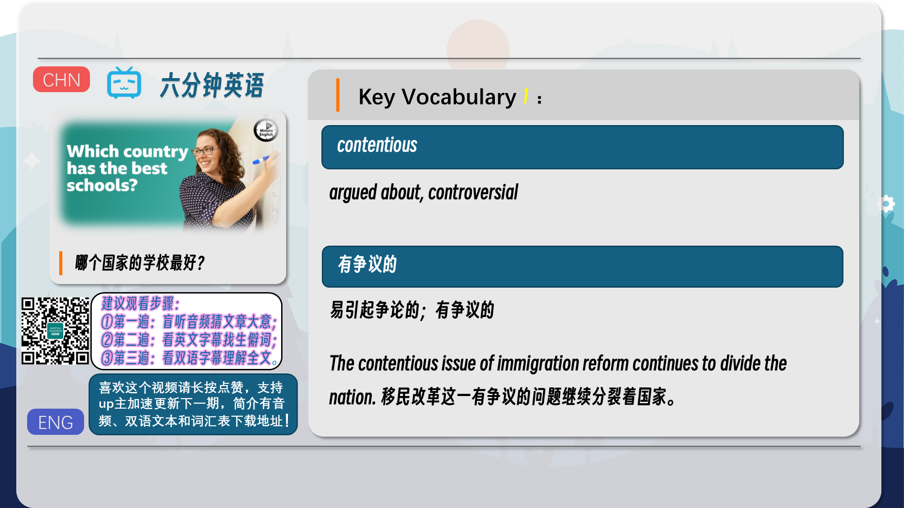
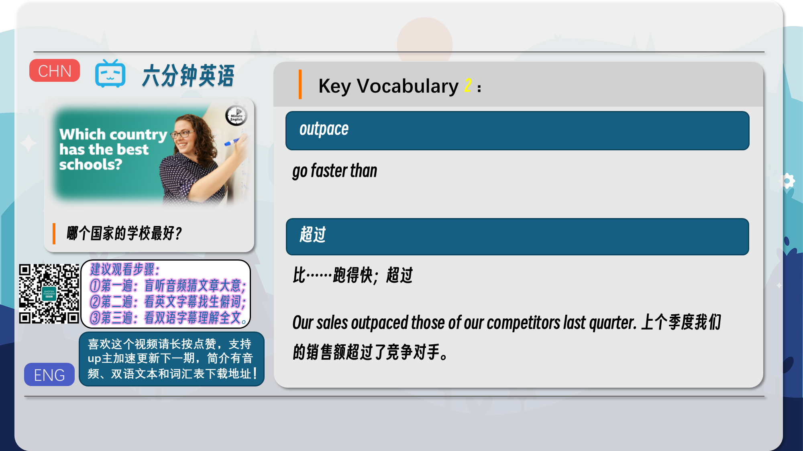
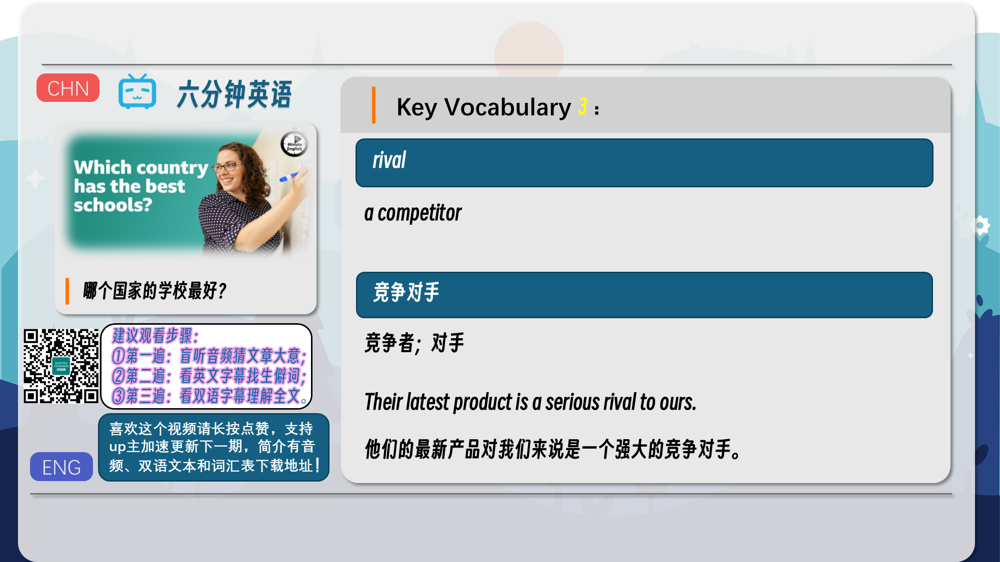
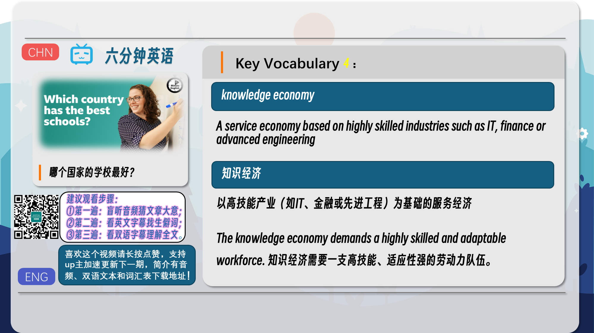

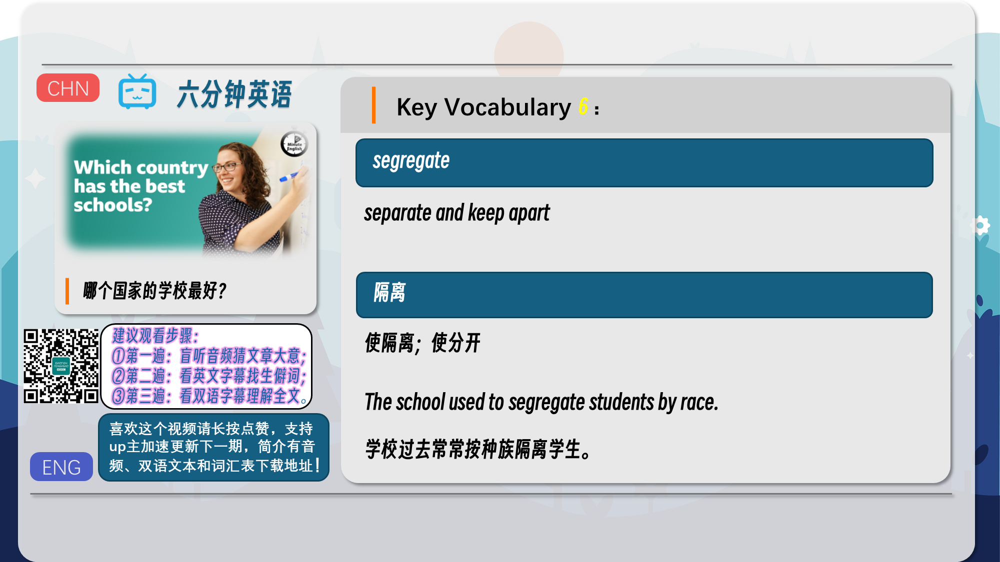
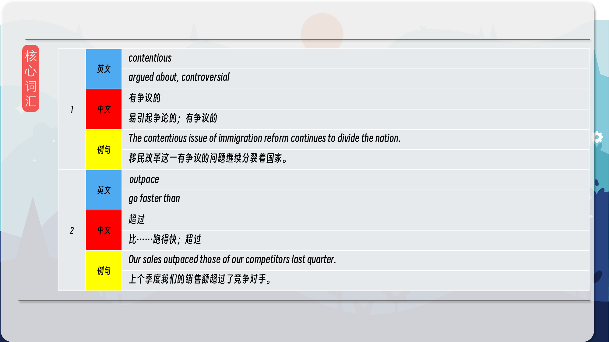
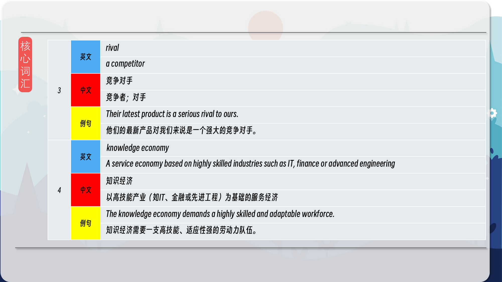
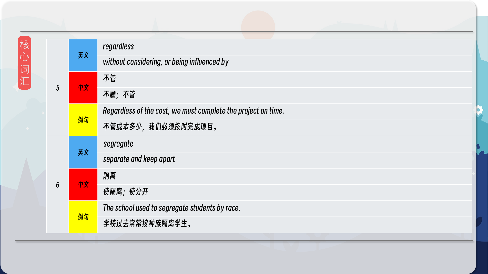
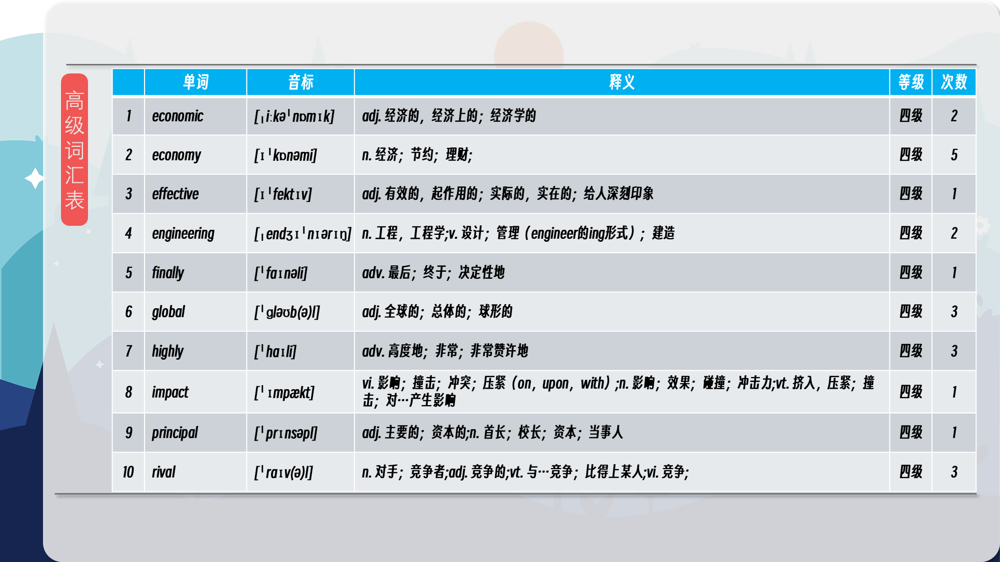
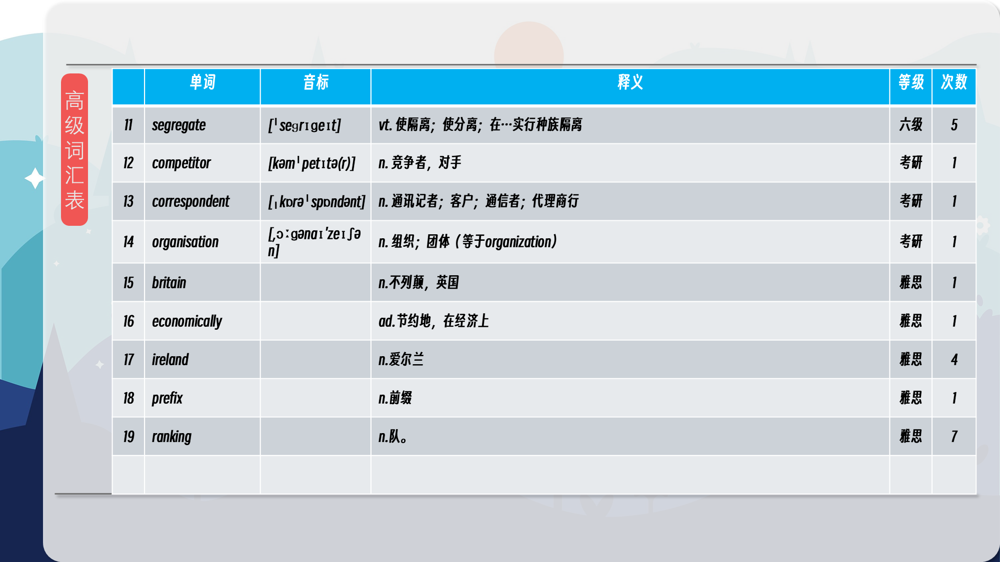

### 【核心词汇】
#### contentious
argued about, controversial
有争议的
易引起争论的；有争议的
The contentious issue of immigration reform continues to divide the nation.
移民改革这一有争议的问题继续分裂着国家。
#### outpace
go faster than
超过
比……跑得快；超过
Our sales outpaced those of our competitors last quarter.
上个季度我们的销售额超过了竞争对手。
#### rival
a competitor
竞争对手
竞争者；对手
Their latest product is a serious rival to ours.
他们的最新产品对我们来说是一个强大的竞争对手。
#### knowledge economy
A service economy based on highly skilled industries such as IT, finance or advanced engineering
知识经济
以高技能产业（如IT、金融或先进工程）为基础的服务经济
The knowledge economy demands a highly skilled and adaptable workforce.
知识经济需要一支高技能、适应性强的劳动力队伍。
#### regardless
without considering, or being influenced by
不管
不顾；不管
Regardless of the cost, we must complete the project on time.
不管成本多少，我们必须按时完成项目。
#### segregate
separate and keep apart
隔离
使隔离；使分开
The school used to segregate students by race.
学校过去常常按种族隔离学生。

在公众号里输入6位数字，获取【对话音频、英文文本、中文翻译、核心词汇和高级词汇表】电子档，6位数字【暗号】在文章的最后一张图片，如【220728】，表示22年7月28日这一期。公众号没有的文章说明还没有制作相关资料。年度合集在B站【六分钟英语】工房获取，每年共计300+文档，感谢支持！