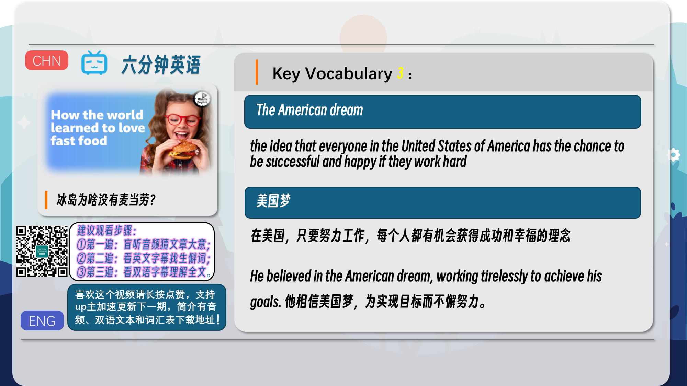
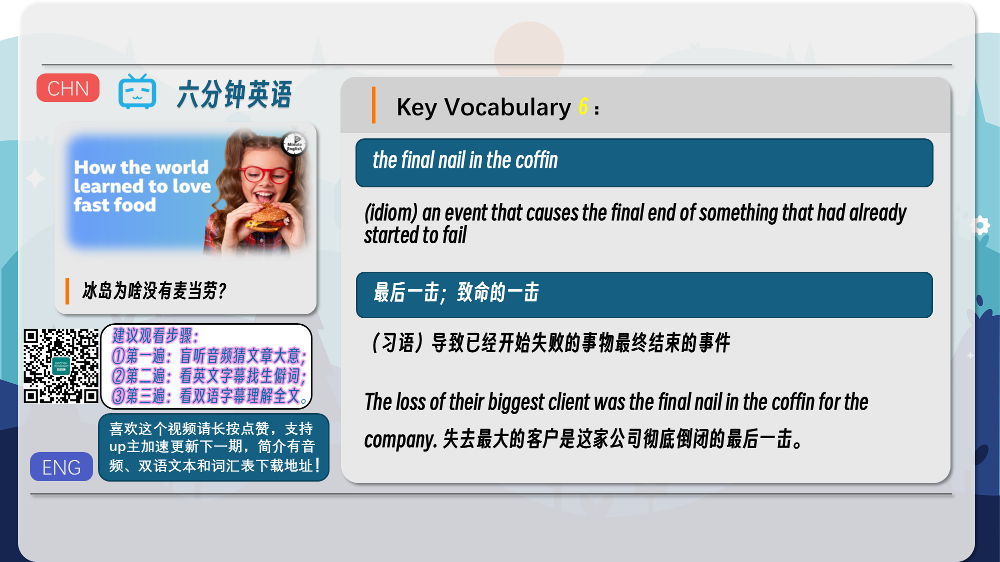
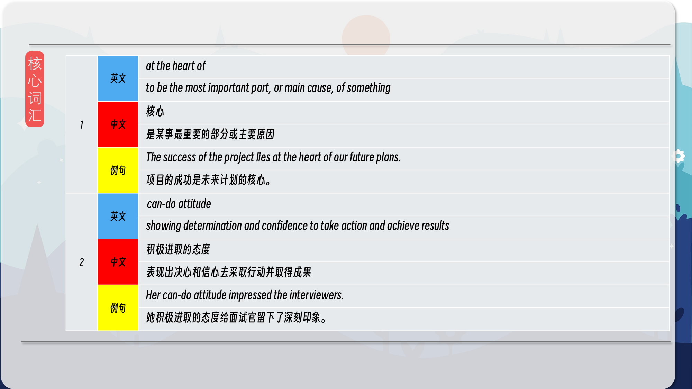
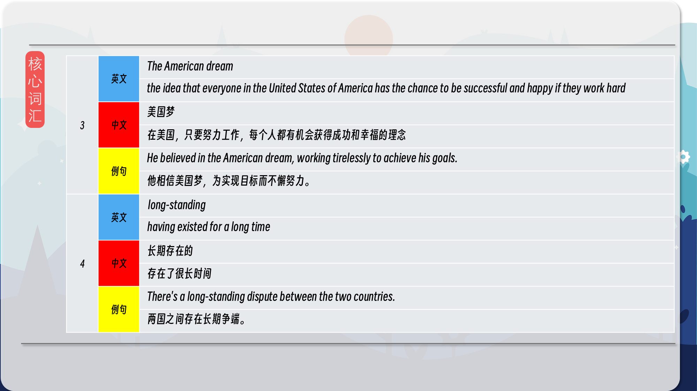
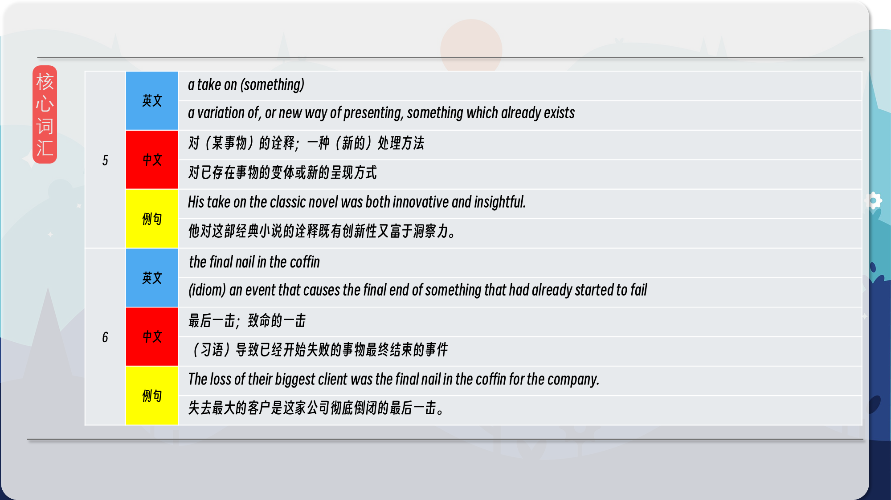
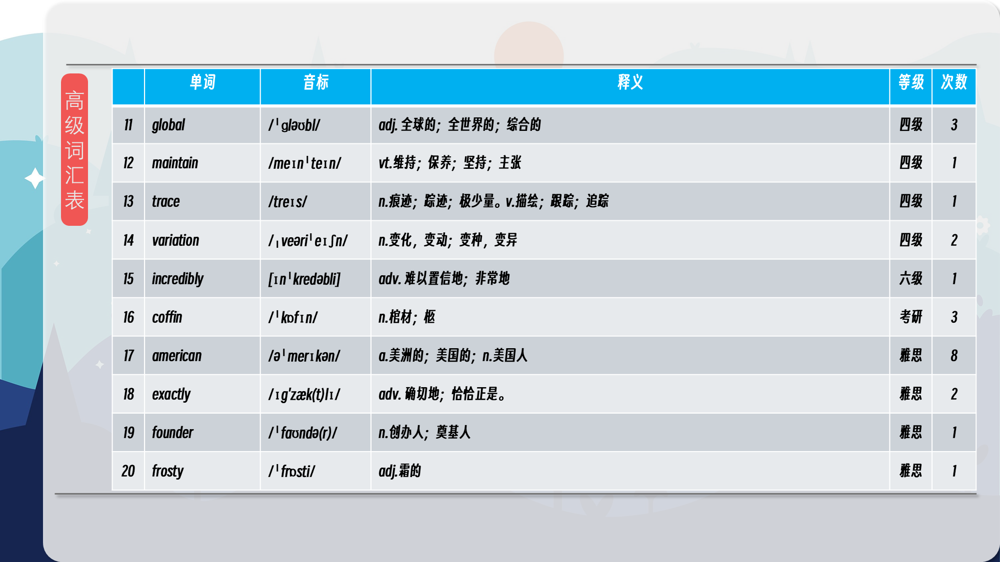

### 【英文脚本】
Phil
Hello. This is 6 Minute English from BBC Learning English. I'm Phil.

Beth
And I'm Beth.

Phil
Love it or hate it, there's no doubt fast food is popular. Are you a fast food fan, Beth?

Beth
Erm, not really, no. I think sometimes it can be quite convenient, obviously because it's quick, but not really.

Phil
Well, whatever you think about them, fast food brands like KFC, Domino's and, of course the big one, McDonald's, are incredibly successful.

Beth
In this programme, we'll be discussing the global spread of fast food from its beginnings in 1950s America. As usual, we'll be learning some useful new words and phrases.

Phil
But first, I have a question for you, Beth. Roughly how many fast food restaurants are there in the UK? Is it: a) 4,000? b) 42,000? or, c) four million?

Beth
I'm going to go for b) 42,000.

Phil
OK, well later on we'll find out the answer. In the United States, cheap and easy food like hamburgers, French fries and milkshakes have been popular since the 1950s. Listen as Adam Chandler, author of the book Drive-Thru Dreams, which traces the history of American fast food, tells BBC World Service programme, The Food Chain, how it all got started:

Adam Chandler
At the heart of the story of fast food is a very 'anyone can do this' sense. A lot of the company founders didn't have a college degree, who didn't have a high school degree in a lot of instances, didn't come from money, were oftentimes just people who were ready to plug themselves into a system that would work for them. And it did. It made opportunity very, very easy in a time when that was a new part of the American experience. So it was the American dream in a very small way, that became the American dream in a very big way.

Beth
The rise of fast food reflected the rise of American economic power after the Second World War. When Adam says that this lies at the heart of the story, he means it's the most important part of the story.

Phil
In the 1950s, when the famous brands we know today were just beginning, anyone with a can-do attitude could sell fast food. A can-do attitude describes someone who is confident and determined to fix problems and achieve results.

Beth
Which is exactly what happened at successful restaurants like Kentucky Fried Chicken and McDonald's. For many, these fast food brands symbolised The American dream - the idea that anyone in the United States can achieve success through hard work and determination.

Phil
The success of KFC, McDonald’s and the rest wasn't limited to America. Nowadays, you can visit two McDonald's on opposite sides of the planet and eat exactly the same meal.

Beth
But not every country opened its arms in welcome – the tiny island of Iceland for one. Andie Sophia Fontaine, who used to work in McDonald's, now edits The Iceland Review. Here, she tells BBC World Service programme, The Food Chain, how McDonald's got a frosty reception when it started selling burgers in Iceland's capital, Reykjavik.

Andie Sophia Fontaine
There's been a long-standing burger culture in Iceland. They have their own take on the hamburger wherein they'll use lettuce, and raw cucumbers, and a type of fry sauce - that's called a shalpuborgari, or a shop burger, and that's been around for ages. Yeah, so McDonald's - they struggled to try to maintain a market. The final nail in the coffin was the global financial crisis in 2008/2009.

Phil
Iceland already had a long-standing tradition of eating burgers – a tradition that had existed for a long time. For example, the shalpuborgari, or shop burger, was a take on – or variation of – the American hamburger.

Beth
McDonald’s weren't as successful in Iceland as they'd been elsewhere. And the global financial crash of 2008 was the final nail in the coffin, an event which caused the failure of something that had already started to go wrong. To this day there are no McDonald's in Iceland, unlike Britain, which reminds me of your question, Phil.

Phil
Yes. I asked you how many fast food restaurants there are in Britain. I asked you if there were 4,000, 42,000 or four million. And of course, the answer is 42,000 so you were right, well done! OK, let's recap the vocabulary we've learned, starting with at the heart of, meaning the most important part, or the cause, of something.

Beth
If you say that someone has a can-do attitude, you mean they are confident to take action, fix problems and deal with new challenges.

Phil
The American dream is the belief that everyone in the USA has the opportunity to be successful and happy if they work hard.

Beth
The adjective, long-standing, means having existed for a long time.

Phil
A take on something means a variation, or new way of presenting it.

Beth
And finally, the idiom, the final nail in the coffin, refers to an event that causes the final end of something that had already started to fail. Once again, our six minutes are up, but why not head over to the BBC Learning English website where you'll find a worksheet and quiz especially for this programme. See you there soon!

Phil
Goodbye!

### 【中英文双语脚本】
Phil(菲尔)
I'm Phil.
你好。这是来自 BBC Learning English 的六分钟英语。我是菲尔。

Beth(贝丝)
And I'm Beth.
我是贝丝。

Phil(菲尔)
Love it or hate it, there's no doubt fast food is popular. Are you a fast food fan, Beth?
不管你喜欢还是讨厌，毫无疑问，快餐很受欢迎。贝丝，你是快餐迷吗？

Beth(贝丝)
Erm, not really, no. I think sometimes it can be quite convenient, obviously because it's quick, but not really.
呃，不是真的，不是。我认为有时它可能非常方便，显然是因为它很快，但并非真的。

Phil(菲尔)
Well, whatever you think about them, fast food brands like KFC, Domino's and, of course the big one, McDonald's, are incredibly successful.
好吧，无论你怎么看它们，像肯德基、达美乐，当然还有大麦当劳这样的快餐品牌，都取得了令人难以置信的成功。

Beth(贝丝)
In this programme, we'll be discussing the global spread of fast food from its beginnings in 1950s America. As usual, we'll be learning some useful new words and phrases.
在本节目中，我们将讨论快餐从 1950 年代美国开始的全球传播。像往常一样，我们将学习一些有用的新单词和短语。

Phil(菲尔)
But first, I have a question for you, Beth. Roughly how many fast food restaurants are there in the UK? Is it: a) 4,000? b) 42,000? or, c) four million?
但首先，我有一个问题要问你，贝丝。英国大约有多少家快餐店？是：a） 4,000 个？b） 42,000 人？或者，c） 四百万？

Beth(贝丝)
I'm going to go for b) 42,000.
我要选 b） 42,000。

Phil(菲尔)
OK, well later on we'll find out the answer. In the United States, cheap and easy food like hamburgers, French fries and milkshakes have been popular since the 1950s. Listen as Adam Chandler, author of the book Drive-Thru Dreams, which traces the history of American fast food, tells BBC World Service programme, The Food Chain, how it all got started:
好的，稍后我们会找出答案。在美国，自 1950 年代以来，汉堡包、炸薯条和奶昔等廉价易行的食物一直很受欢迎。请听亚当·钱德勒 （Adam Chandler） 讲述 BBC 世界服务节目《食物链》（The Food Chain） 的故事，该书追溯了美国快餐的历史，该书的作者 Drive-Thru Dreams 讲述了这一切是如何开始的：

Adam Chandler(亚当·钱德勒)
At the heart of the story of fast food is a very 'anyone can do this' sense. A lot of the company founders didn't have a college degree, who didn't have a high school degree in a lot of instances, didn't come from money, were oftentimes just people who were ready to plug themselves into a system that would work for them. And it did. It made opportunity very, very easy in a time when that was a new part of the American experience. So it was the American dream in a very small way, that became the American dream in a very big way.
快餐故事的核心是一种非常 “任何人都可以做到 ”的感觉。许多公司创始人没有大学学位，在很多情况下没有高中学历，不是靠金钱赚钱的，他们通常只是准备将自己插入一个适合他们的系统的人。它确实做到了。在那个时代，机会变得非常、非常容易，因为这是美国经验的新部分。所以，在很小的方面，美国梦在很大程度上变成了美国梦。

Beth(贝丝)
The rise of fast food reflected the rise of American economic power after the Second World War. When Adam says that this lies at the heart of the story, he means it's the most important part of the story.
快餐的兴起反映了二战后美国经济实力的崛起。当 Adam 说这是故事的核心时，他的意思是这是故事中最重要的部分。

Phil(菲尔)
In the 1950s, when the famous brands we know today were just beginning, anyone with a can-do attitude could sell fast food. A can-do attitude describes someone who is confident and determined to fix problems and achieve results.
在 1950 年代，当我们今天所知道的著名品牌刚刚起步时，任何具有积极进取的态度的人都可以销售快餐。“我能行”的态度描述了一个有信心并决心解决问题并取得成果的人。

Beth(贝丝)
Which is exactly what happened at successful restaurants like Kentucky Fried Chicken and McDonald's. For many, these fast food brands symbolised The American dream - the idea that anyone in the United States can achieve success through hard work and determination.
这正是 Kentucky Fried Chicken 和 McDonald's 等成功餐厅发生的事情。对许多人来说，这些快餐品牌象征着美国梦 —— 即在美国，任何人都可以通过努力工作和决心取得成功。

Phil(菲尔)
The success of KFC, McDonald’s and the rest wasn't limited to America. Nowadays, you can visit two McDonald's on opposite sides of the planet and eat exactly the same meal.
肯德基、麦当劳和其他公司的成功不仅限于美国。如今，您可以参观地球两侧的两家麦当劳，并吃完全相同的饭菜。

Beth(贝丝)
But not every country opened its arms in welcome – the tiny island of Iceland for one. Andie Sophia Fontaine, who used to work in McDonald's, now edits The Iceland Review. Here, she tells BBC World Service programme, The Food Chain, how McDonald's got a frosty reception when it started selling burgers in Iceland's capital, Reykjavik.
但并不是每个国家都张开怀抱欢迎 —— 冰岛这个小岛就是其中之一。安迪·索菲亚·方丹 （Andie Sophia Fontaine） 曾经在麦当劳工作，现在是《冰岛评论》的编辑。在这里，她告诉 BBC 世界服务节目 The Food Chain，当麦当劳开始在冰岛首都雷克雅未克销售汉堡时，它受到了冷遇。

Andie Sophia Fontaine(安迪·索菲亚·方丹)
There's been a long-standing burger culture in Iceland. They have their own take on the hamburger wherein they'll use lettuce, and raw cucumbers, and a type of fry sauce - that's called a shalpuborgari, or a shop burger, and that's been around for ages. Yeah, so McDonald's - they struggled to try to maintain a market. The final nail in the coffin was the global financial crisis in 2008/2009.
冰岛的汉堡文化由来已久。他们对汉堡包有自己的想法，他们将使用生菜、生黄瓜和一种炸酱 —— 称为 shalpuborgari，或商店汉堡，已经存在了很长时间。是的，所以麦当劳 —— 他们努力维持市场。棺材上的最后一枚钉子是 2008/2009 年的全球金融危机。

Phil(菲尔)
Iceland already had a long-standing tradition of eating burgers – a tradition that had existed for a long time. For example, the shalpuborgari, or shop burger, was a take on – or variation of – the American hamburger.
冰岛已经有吃汉堡的悠久传统 —— 这一传统已经存在了很长时间。例如，shalpuborgari 或商店汉堡是美国汉堡包的变体。

Beth(贝丝)
McDonald’s weren't as successful in Iceland as they'd been elsewhere. And the global financial crash of 2008 was the final nail in the coffin, an event which caused the failure of something that had already started to go wrong. To this day there are no McDonald's in Iceland, unlike Britain, which reminds me of your question, Phil.
麦当劳在冰岛并不像其他地方那样成功。而 2008 年的全球金融危机是棺材上的最后一枚钉子，这一事件导致了已经开始出错的事情的失败。直到今天，冰岛还没有麦当劳，不像英国，这让我想起了你的问题，菲尔。

Phil(菲尔)
Yes. I asked you how many fast food restaurants there are in Britain. I asked you if there were 4,000, 42,000 or four million. And of course, the answer is 42,000 so you were right, well done! OK, let's recap the vocabulary we've learned, starting with at the heart of, meaning the most important part, or the cause, of something.
是的。我问你英国有多少家快餐店。我问你是 4,000 人、42,000 人还是 400 万人。当然，答案是 42,000 个，所以你是对的，干得好！好，让我们回顾一下我们学到的词汇，从核心开始，意思是某事最重要的部分或原因。

Beth(贝丝)
If you say that someone has a can-do attitude, you mean they are confident to take action, fix problems and deal with new challenges.
如果你说某人有“我能行”的态度，你的意思是他们有信心采取行动、解决问题和应对新的挑战。

Phil(菲尔)
The American dream is the belief that everyone in the USA has the opportunity to be successful and happy if they work hard.
美国梦是相信如果努力工作，美国每个人都有机会获得成功和快乐。

Beth(贝丝)
The adjective, long-standing, means having existed for a long time.
这个形容词 long-based 的意思是已经存在了很长时间。

Phil(菲尔)
A take on something means a variation, or new way of presenting it.
对某物的接受意味着一种变体，或一种新的呈现方式。

Beth(贝丝)
And finally, the idiom, the final nail in the coffin, refers to an event that causes the final end of something that had already started to fail. Once again, our six minutes are up, but why not head over to the BBC Learning English website where you'll find a worksheet and quiz especially for this programme. See you there soon!
最后，谚语 the final nail in the coffin，指的是导致已经开始失败的事情最终结束的事件。我们的六分钟又一次结束了，但为什么不前往 BBC Learning English 网站，在那里您可以找到专门针对此计划的工作表和测验。期待很快与您相见！

Phil(菲尔)
Goodbye!
再见！

### 【核心词汇】
#### at the heart of
to be the most important part, or main cause, of something
核心
是某事最重要的部分或主要原因
The success of the project lies at the heart of our future plans.
项目的成功是未来计划的核心。
#### can-do attitude
showing determination and confidence to take action and achieve results
积极进取的态度
表现出决心和信心去采取行动并取得成果
Her can-do attitude impressed the interviewers.
她积极进取的态度给面试官留下了深刻印象。
#### The American dream
the idea that everyone in the United States of America has the chance to be successful and happy if they work hard
美国梦
在美国，只要努力工作，每个人都有机会获得成功和幸福的理念
He believed in the American dream, working tirelessly to achieve his goals.
他相信美国梦，为实现目标而不懈努力。
#### long-standing
having existed for a long time
长期存在的
存在了很长时间
There's a long-standing dispute between the two countries.
两国之间存在长期争端。
#### a take on (something)
a variation of, or new way of presenting, something which already exists
对（某事物）的诠释；一种（新的）处理方法
对已存在事物的变体或新的呈现方式
His take on the classic novel was both innovative and insightful.
他对这部经典小说的诠释既有创新性又富于洞察力。
#### the final nail in the coffin
(idiom) an event that causes the final end of something that had already started to fail
最后一击；致命的一击
（习语）导致已经开始失败的事物最终结束的事件
The loss of their biggest client was the final nail in the coffin for the company.
失去最大的客户是这家公司彻底倒闭的最后一击。

在公众号里输入6位数字，获取【对话音频、英文文本、中文翻译、核心词汇和高级词汇表】电子档，6位数字【暗号】在文章的最后一张图片，如【220728】，表示22年7月28日这一期。公众号没有的文章说明还没有制作相关资料。年度合集在B站【六分钟英语】工房获取，每年共计300+文档，感谢支持！