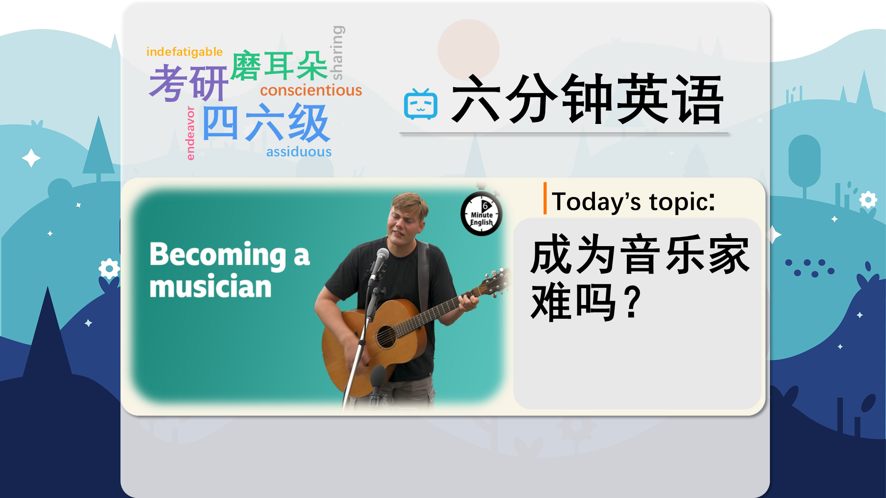

### 【英文脚本】
Pippa
Hello, this is 6 Minute English from BBC Learning English. I’m Pippa.
 
Neil
And I’m Neil.
 
Pippa
Now, Neil, have you ever wanted to be a musician?
 
Neil
Oh yes, Pippa, I still want to be a musician. I've been playing my guitar since I was 14.
 
Pippa
Wow. Well, maybe one day you'll, you'll manage it. Who knows?
 
Neil
What about you?
 
Pippa
I don't think I'd like to be a musician. I think it would be a bit stressful. Especially if you had lots of fans and were really successful.
 
Neil
Yeah. I wonder what life as a musician is actually like? We’ll be finding that out in this programme as we hear from some people around the UK who would like to become successful musicians, and we’ll even listen to some of their music too.
 
Pippa
But first, I have a question for you, Neil. In the UK, we have a weekly chart of the best-selling songs in the country. And the top selling song is called the number one. But which musical artist do you think has had the most UK number one songs? a) The Beatles b) Ed Sheeran c) Elvis Presley
 
Neil
Oh well, I think that's easy. It must be, surely, The Beatles.
 
Pippa
Well, I’ll reveal the answer at the end of the programme. Now, getting a number one song is a dream for many musicians. But if you want to become a musician, where do you start?
 
Bailey Tomkinson
I grew up in a really rich music scene in St Ives. I was going to open mics from the age of about 11.
 
Neil
This is Bailey. She lives in St Ives in Cornwall on the south-west coast of England. She says she was going to open mic nights from a young age. Open mic nights are events where anyone can sing or play music.
 
Pippa
Bailey talked about her life as a musician to BBC Learning English programme My Song, My Home.
 
Bailey Tomkinson
I would go to these songwriters' circles at the Kettle and Wink on, like, a Friday night after school where I'd be, like, the youngest person by, like, 50 years. But I'd sit in a circle with a bunch of old men, and they'd play James Taylor and Carole King and The Eagles and lots of 70s music, and I guess that's influenced me massively. But I guess, you know, everyone kind of took me under their wing growing up.
 
Neil
When she was younger, Bailey went to songwriters' circles. These are meetings for people interested in writing their own music.
 
Pippa
Bailey remembers sitting with a bunch of old men. A bunch is an informal way to talk about a group of people.
 
Neil
The older men in the group would play music from the 1970s, and Bailey says they took her under their wing. If you take somebody under your wing you decide to protect them or guide them.
 
Pippa
Let’s meet another musician, Josh.
 
Josh Robinson
So, I learnt my first proper song on guitar when I was about 13. I literally started busking the moment I could kind of do that.
 
Pippa
Josh lives in London and is a busker. This means that he performs on the street or in public places to earn money.
 
Neil
Busking is a common way for musicians to make money and perform to more people. And as Josh told BBC Learning English programme My Song, My Home, it can help musicians to get new opportunities.
 
Josh Robinson
It's been kind of like my main earner that's kept me going for the last ten or so years. From that, it's then got me various different opportunities. It's got me all my gigs, it's got me all my connections. So I owe a lot to busking.
 
Pippa
Busking is Josh’s main earner, it’s his main source of money.
 
Neil
He says that busking has got him all his gigs and connections. Gigs are musical concerts. It’s an informal, slang word.
 
Pippa
Josh says he owes a lot to busking. If you owe a lot to someone or something, you have success or happiness because of that person or thing. So, would you like to listen to some of Josh’s music, Neil?
 
Neil
Of course I would.
 
Pippa
Well, here’s a bit of his song That Side of the Wall, which he performed for BBC Learning English programme My Song, My Home. Clip from song Can you leave me something Can you leave it by the door So I know there's something Or someone That side of the wall Stop the heat from coming 'Cause I always liked the cold I need some belonging Or someone That side of the wall
 
Neil
Wow. Josh is pretty good, isn't he? I’d love to hear more.
 
Pippa
Well you can find performances by the musicians in the series on our website – bbclearningenglish.com. We’ll also put a link in the notes below this episode!
 
Neil
OK. So, what about your question, Pippa?
 
Pippa
Yes, I asked which artist had the most number one songs in the UK charts? The Beatles, Ed Sheeran or Elvis Presley? And you said The Beatles, Neil. But the answer is actually Elvis Presley. He's had 21 number one songs and The Beatles have had 18.
 
Neil
Really? Well that's OK, I love 'the King' as well.
 
Pippa
OK.
 
Neil
OK, let’s recap the vocabulary we’ve learned in this musical episode, starting with open mic nights, events where anyone can sing or play music.
 
Pippa
Songwriters' circles are meetings for people interested in writing their own music.
 
Neil
A bunch of people is a group of people.
 
Pippa
The expression take someone under your wing means to protect or guide someone.
 
Neil
Busking is performing in a public place for money, and a busker is someone who performs on the street for money.
 
Pippa
Your main earner is your main source of income.
 
Neil
Gigs are musical concerts.
 
Pippa
And the expression to owe a lot to someone or something, means to have success or happiness because of that person or thing.
 
Neil
Once again our six minutes are up, but you can find My Song, My Home on our website – bbclearningenglish.com. Watch the songs and sing along, and learn more about the vocabulary in the lyrics!
 
Pippa
We’ll see you again soon for some more trending topics and useful vocabulary. Bye for now!
 
Neil
Goodbye!
 

### 【中英文双语脚本】
Pippa(皮帕)
Hello, this is 6 Minute English from BBC Learning English. I’m Pippa.
您好，这里是 BBC Learning English 的六分钟英语。我是 Pippa。

Neil(尼尔)
And I’m Neil.
我是 Neil。

Pippa(皮帕)
Now, Neil, have you ever wanted to be a musician?
现在，Neil，你有没有想过成为一名音乐家？

Neil(尼尔)
Oh yes, Pippa, I still want to be a musician. I've been playing my guitar since I was 14.
哦，对了，Pippa，我还是想成为一名音乐家。我从 14 岁起就开始弹吉他。

Pippa(皮帕)
Wow. Well, maybe one day you'll, you'll manage it. Who knows?
哇。好吧，也许有一天你会，你会做到的。谁知道呢？

Neil(尼尔)
What about you?
你呢？

Pippa(皮帕)
I don't think I'd like to be a musician. I think it would be a bit stressful. Especially if you had lots of fans and were really successful.
我认为我不想成为一名音乐家。我觉得这会有点压力。特别是如果你有很多粉丝并且真的很成功。

Neil(尼尔)
Yeah. I wonder what life as a musician is actually like? We’ll be finding that out in this programme as we hear from some people around the UK who would like to become successful musicians, and we’ll even listen to some of their music too.
是的。我想知道音乐家的生活到底是什么样的？我们将在这个节目中发现这一点，因为我们听到英国各地一些想成为成功音乐家的人的声音，我们甚至还会听他们的一些音乐。

Pippa(皮帕)
But first, I have a question for you, Neil. In the UK, we have a weekly chart of the best-selling songs in the country. And the top selling song is called the number one. But which musical artist do you think has had the most UK number one songs? a) The Beatles b) Ed Sheeran c) Elvis Presley
但首先，我有一个问题要问你，Neil。在英国，我们有该国最畅销歌曲的每周排行榜。最畅销的歌曲被称为第一名。但是，您认为哪位音乐艺术家的英国排名第一的歌曲最多？a） 披头士乐队 b） 艾德·希兰 c） 猫王

Neil(尼尔)
Oh well, I think that's easy. It must be, surely, The Beatles.
哦，好吧，我觉得这很容易。肯定是披头士乐队。

Pippa(皮帕)
Well, I’ll reveal the answer at the end of the programme. Now, getting a number one song is a dream for many musicians. But if you want to become a musician, where do you start?
好吧，我会在节目结束时透露答案。现在，获得第一名是许多音乐家的梦想。但是，如果你想成为一名音乐家，你从哪里开始呢？

Bailey Tomkinson(贝利·汤姆金森)
I grew up in a really rich music scene in St Ives. I was going to open mics from the age of about 11.
我在圣艾夫斯一个非常丰富的音乐环境中长大。我从大约 11 岁开始就开始打开麦克风。

Neil(尼尔)
This is Bailey. She lives in St Ives in Cornwall on the south-west coast of England. She says she was going to open mic nights from a young age. Open mic nights are events where anyone can sing or play music.
这是贝利。她住在英格兰西南海岸康沃尔郡的圣艾夫斯。她说她从小就打算参加 Open Mic 之夜。Open Mic 之夜是任何人都可以唱歌或播放音乐的活动。

Pippa(皮帕)
Bailey talked about her life as a musician to BBC Learning English programme My Song, My Home.
Bailey 在 BBC 学习英语节目 My Song， My Home 中谈到了她作为音乐家的生活。

Bailey Tomkinson(贝利·汤姆金森)
I would go to these songwriters' circles at the Kettle and Wink on, like, a Friday night after school where I'd be, like, the youngest person by, like, 50 years. But I'd sit in a circle with a bunch of old men, and they'd play James Taylor and Carole King and The Eagles and lots of 70s music, and I guess that's influenced me massively. But I guess, you know, everyone kind of took me under their wing growing up.
我会去 Kettle 的这些词曲作者圈子，眨眨眼，比如，周五放学后，我会成为最年轻的 50 岁的人。但我会和一群老人围坐在一个圈子里，他们会演奏 James Taylor、Carole King 和 The Eagles 以及很多 70 年代的音乐，我想这对我影响很大。但我想，你知道，每个人都把我放在他们的羽翼下。

Neil(尼尔)
When she was younger, Bailey went to songwriters' circles. These are meetings for people interested in writing their own music.
年轻时，贝利去了词曲作者圈子。这些会议是为有兴趣创作自己的音乐的人准备的。

Pippa(皮帕)
Bailey remembers sitting with a bunch of old men. A bunch is an informal way to talk about a group of people.
Bailey 记得和一群老人坐在一起。A bunch 是谈论一群人的非正式方式。

Neil(尼尔)
The older men in the group would play music from the 1970s, and Bailey says they took her under their wing. If you take somebody under your wing you decide to protect them or guide them.
乐队中的老人们会演奏 1970 年代的音乐，贝利说他们把她放在自己的羽翼下。如果你把某人放在你的羽翼下，你就会决定保护他们或引导他们。

Pippa(皮帕)
Let’s meet another musician, Josh.
让我们来认识另一位音乐家 Josh。

Josh Robinson(乔什·罗宾逊)
So, I learnt my first proper song on guitar when I was about 13. I literally started busking the moment I could kind of do that.
所以，我在大约 13 岁的时候学会了我的第一首正式的吉他歌曲。我真的在我能做到的那一刻就开始表演了。

Pippa(皮帕)
Josh lives in London and is a busker. This means that he performs on the street or in public places to earn money.
Josh 住在伦敦，是一名街头艺人。这意味着他在街上或公共场所表演以赚钱。

Neil(尼尔)
Busking is a common way for musicians to make money and perform to more people. And as Josh told BBC Learning English programme My Song, My Home, it can help musicians to get new opportunities.
街头表演是音乐家赚钱和向更多人表演的常见方式。正如 Josh 在 BBC 学习英语节目 My Song， My Home 中所说的那样，它可以帮助音乐家获得新的机会。

Josh Robinson(乔什·罗宾逊)
It's been kind of like my main earner that's kept me going for the last ten or so years. From that, it's then got me various different opportunities. It's got me all my gigs, it's got me all my connections. So I owe a lot to busking.
这有点像我的主要收入来源，让我在过去十年左右的时间里一直坚持下去。从那时起，它为我带来了各种不同的机会。它有我所有的演出，它有我所有的人脉。所以我欠街头表演很多。

Pippa(皮帕)
Busking is Josh’s main earner, it’s his main source of money.
街头表演是 Josh 的主要收入来源，也是他的主要资金来源。

Neil(尼尔)
He says that busking has got him all his gigs and connections. Gigs are musical concerts. It’s an informal, slang word.
他说，街头表演让他获得了所有的演出和人脉。演出是音乐会。这是一个非正式的俚语。

Pippa(皮帕)
Josh says he owes a lot to busking. If you owe a lot to someone or something, you have success or happiness because of that person or thing. So, would you like to listen to some of Josh’s music, Neil?
Josh 说他欠街头表演很多。如果你欠某人或某事很多，那么你会因为那个人或事而获得成功或幸福。那么，你想听一些 Josh 的音乐吗，Neil？

Neil(尼尔)
Of course I would.
我当然会。

Pippa(皮帕)
Well, here’s a bit of his song That Side of the Wall, which he performed for BBC Learning English programme My Song, My Home. Clip from song Can you leave me something Can you leave it by the door So I know there's something Or someone That side of the wall Stop the heat from coming 'Cause I always liked the cold I need some belonging Or someone That side of the wall
嗯，这是他的歌曲《那边的墙》（That Side of the Wall），他为 BBC 学习英语节目《我的歌，我的家》（My Song， My Home） 演唱了这首歌。歌曲剪辑 你能给我留下点东西吗 你能把它留在门口吗 所以我知道有什么东西或某人 那边的墙 阻止热量来临 因为我总是喜欢寒冷 我需要一些归属感 或者某人 那边的墙

Neil(尼尔)
Wow. Josh is pretty good, isn't he? I’d love to hear more.
哇。乔什还不错，不是吗？我很想听听更多。

Pippa(皮帕)
Well you can find performances by the musicians in the series on our website – bbclearningenglish.com. We’ll also put a link in the notes below this episode!
好吧，您可以在我们的网站上找到该系列音乐家的表演 - bbclearningenglish.com。我们还将在本集下方的注释中放置一个链接！

Neil(尼尔)
OK. So, what about your question, Pippa?
还行。那么，皮帕，你的问题呢？

Pippa(皮帕)
Yes, I asked which artist had the most number one songs in the UK charts? The Beatles, Ed Sheeran or Elvis Presley? And you said The Beatles, Neil. But the answer is actually Elvis Presley. He's had 21 number one songs and The Beatles have had 18.
是的，我问哪位艺术家在英国排行榜上排名第一的歌曲最多？披头士乐队、艾德·希兰 （Ed Sheeran） 还是猫王 （Elvis Presley）？你说的是披头士乐队，尼尔。但答案实际上是猫王。他有 21 首排名第一的歌曲，披头士乐队有 18 首。

Neil(尼尔)
Really? Well that's OK, I love 'the King' as well.
真？好吧，没关系，我也喜欢《国王》。

Pippa(皮帕)
OK.
还行。

Neil(尼尔)
OK, let’s recap the vocabulary we’ve learned in this musical episode, starting with open mic nights, events where anyone can sing or play music.
好，让我们回顾一下我们在这一集音乐剧中学到的词汇，从开放麦克风之夜开始，任何人都可以唱歌或播放音乐的活动。

Pippa(皮帕)
Songwriters' circles are meetings for people interested in writing their own music.
词曲作者圈子是有兴趣创作自己的音乐的人的聚会。

Neil(尼尔)
A bunch of people is a group of people.
一群人就是一群人。

Pippa(皮帕)
The expression take someone under your wing means to protect or guide someone.
这句话 take someone under your wing 的意思是保护或引导某人。

Neil(尼尔)
Busking is performing in a public place for money, and a busker is someone who performs on the street for money.
街头艺人是在公共场所表演赚钱，街头艺人是在街上表演赚钱的人。

Pippa(皮帕)
Your main earner is your main source of income.
您的主要收入来源是您的主要收入来源。

Neil(尼尔)
Gigs are musical concerts.
演出是音乐会。

Pippa(皮帕)
And the expression to owe a lot to someone or something, means to have success or happiness because of that person or thing.
而 to dowe a lot to someone or something 这句话，意思是因为那个人或事物而获得成功或幸福。

Neil(尼尔)
Once again our six minutes are up, but you can find My Song, My Home on our website – bbclearningenglish.com. Watch the songs and sing along, and learn more about the vocabulary in the lyrics!
我们的六分钟又一次结束了，但您可以在我们的网站上找到 My Song， My Home – bbclearningenglish.com。观看歌曲并一起唱歌，并了解有关歌词中词汇的更多信息！

Pippa(皮帕)
We’ll see you again soon for some more trending topics and useful vocabulary. Bye for now!
我们很快就会再次见到您，了解更多热门话题和有用的词汇。再见！

Neil(尼尔)
Goodbye!
再见！

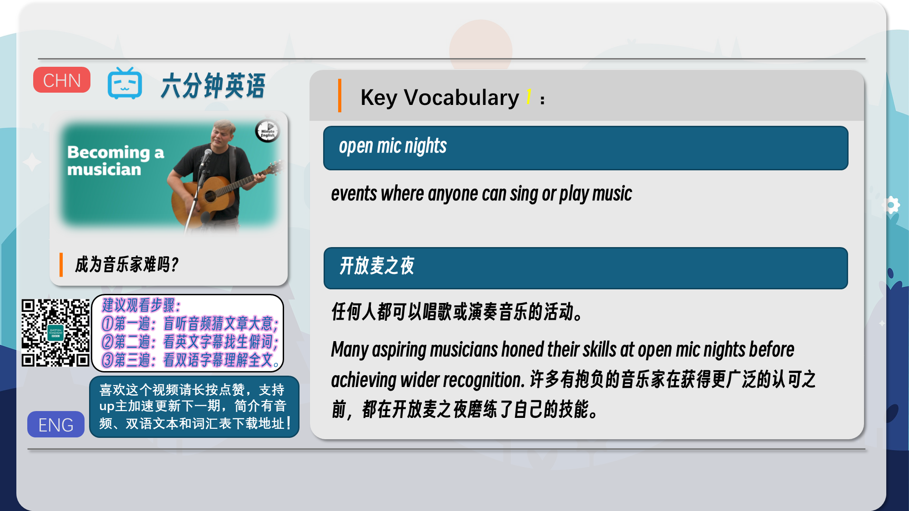
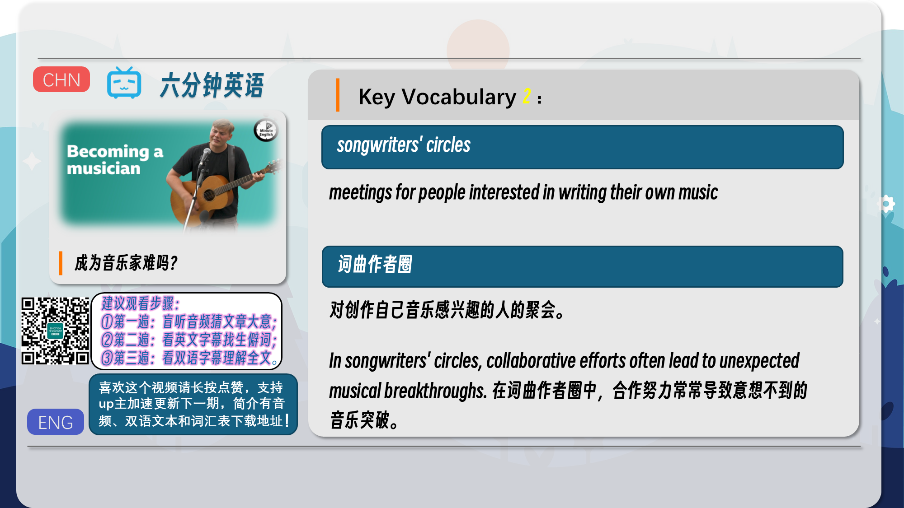
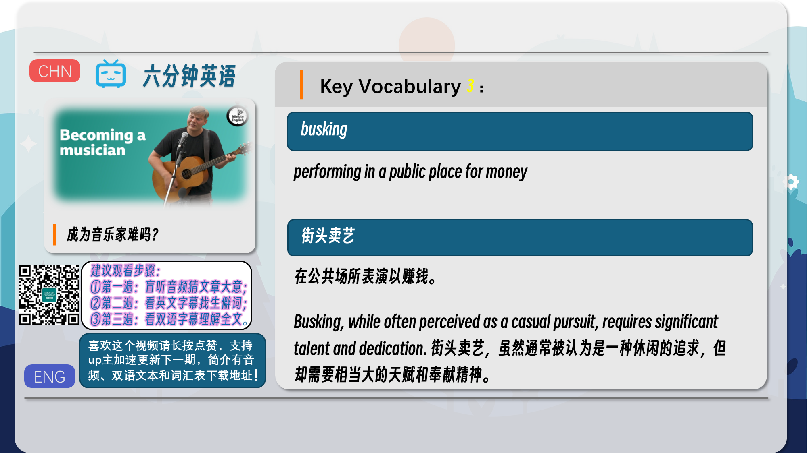
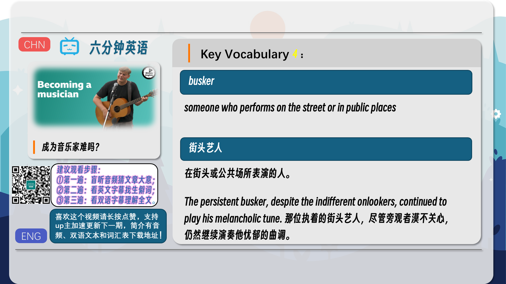
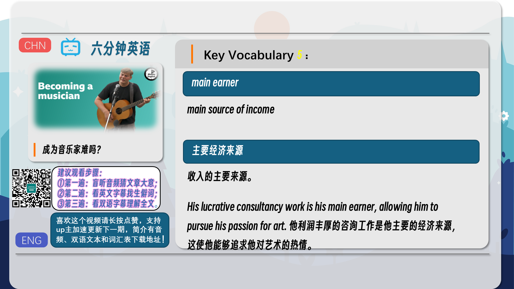
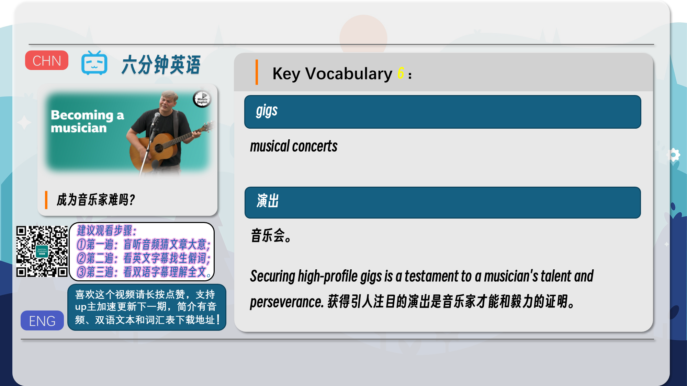
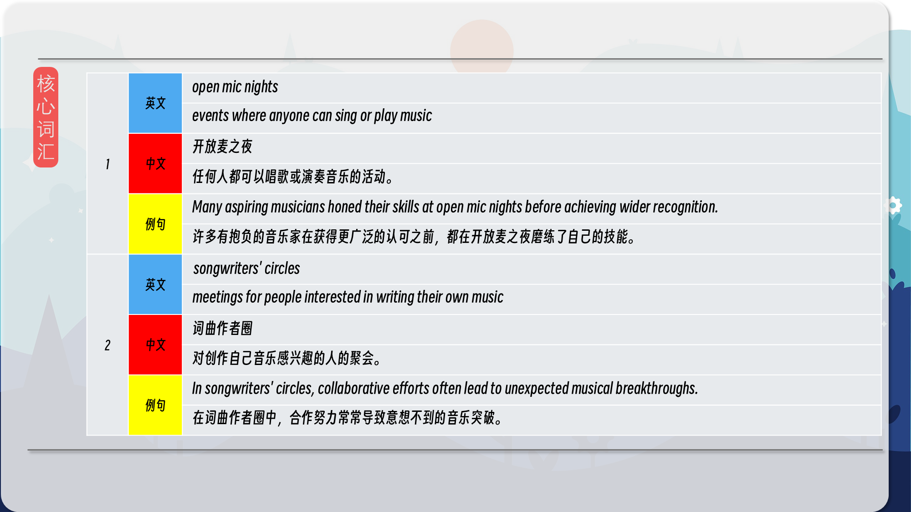
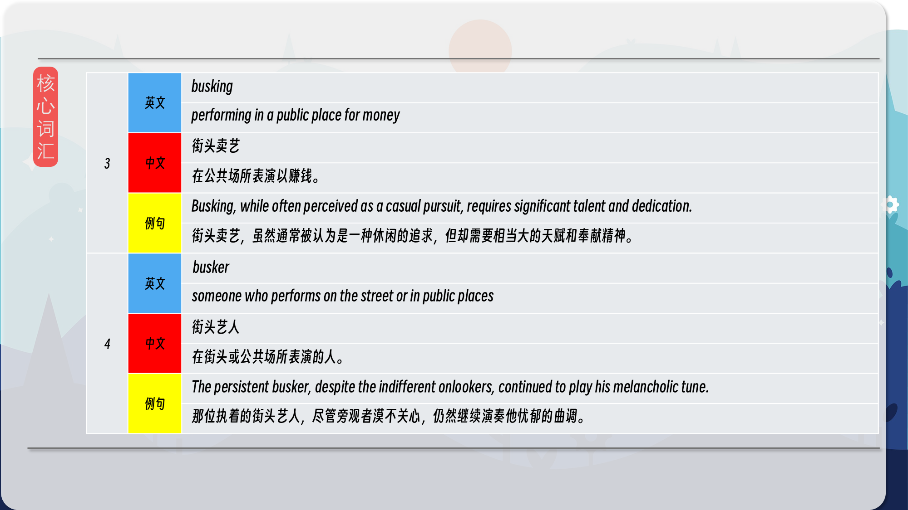
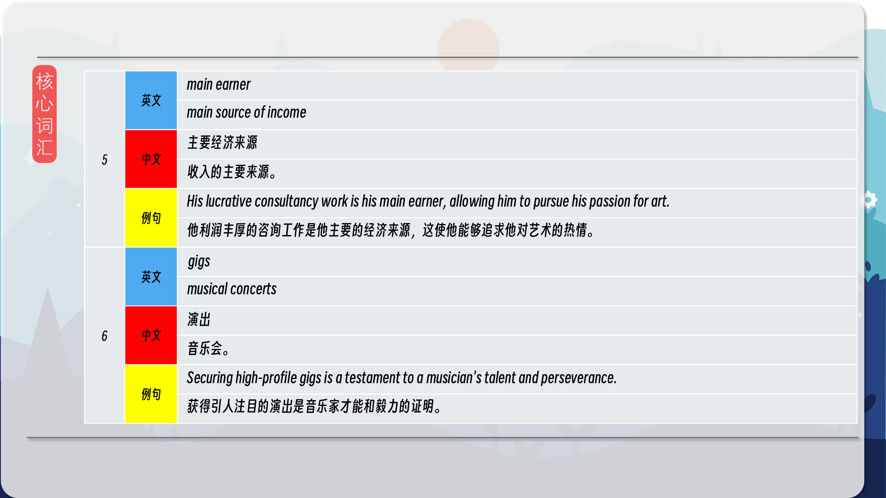
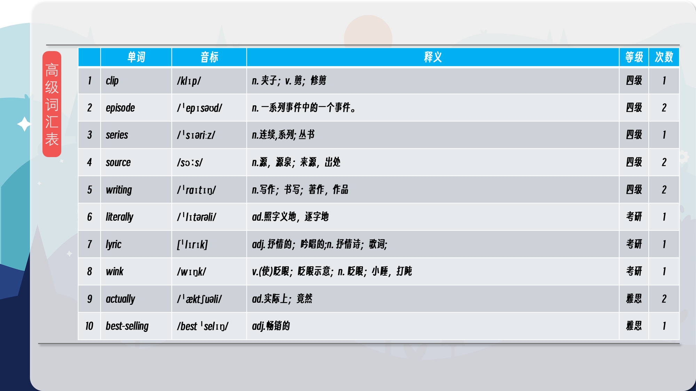
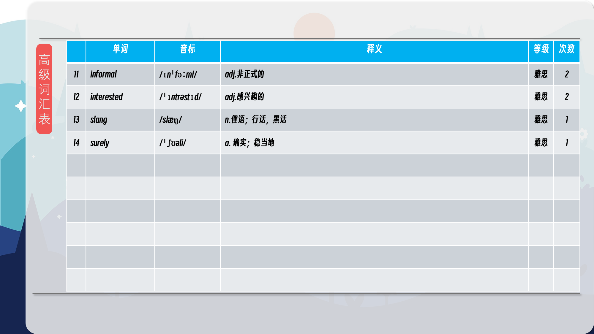

### 【核心词汇】
#### open mic nights
events where anyone can sing or play music
开放麦之夜
任何人都可以唱歌或演奏音乐的活动。
Many aspiring musicians honed their skills at open mic nights before achieving wider recognition.
许多有抱负的音乐家在获得更广泛的认可之前，都在开放麦之夜磨练了自己的技能。
#### songwriters' circles
meetings for people interested in writing their own music
词曲作者圈
对创作自己音乐感兴趣的人的聚会。
In songwriters' circles, collaborative efforts often lead to unexpected musical breakthroughs.
在词曲作者圈中，合作努力常常导致意想不到的音乐突破。
#### busking
performing in a public place for money
街头卖艺
在公共场所表演以赚钱。
Busking, while often perceived as a casual pursuit, requires significant talent and dedication.
街头卖艺，虽然通常被认为是一种休闲的追求，但却需要相当大的天赋和奉献精神。
#### busker
someone who performs on the street or in public places
街头艺人
在街头或公共场所表演的人。
The persistent busker, despite the indifferent onlookers, continued to play his melancholic tune.
那位执着的街头艺人，尽管旁观者漠不关心，仍然继续演奏他忧郁的曲调。
#### main earner
main source of income
主要经济来源
收入的主要来源。
His lucrative consultancy work is his main earner, allowing him to pursue his passion for art.
他利润丰厚的咨询工作是他主要的经济来源，这使他能够追求他对艺术的热情。
#### gigs
musical concerts
演出
音乐会。
Securing high-profile gigs is a testament to a musician's talent and perseverance.
获得引人注目的演出是音乐家才能和毅力的证明。

在公众号里输入6位数字，获取【对话音频、英文文本、中文翻译、核心词汇和高级词汇表】电子档，6位数字【暗号】在文章的最后一张图片，如【220728】，表示22年7月28日这一期。公众号没有的文章说明还没有制作相关资料。年度合集在B站【六分钟英语】工房获取，每年共计300+文档，感谢支持！