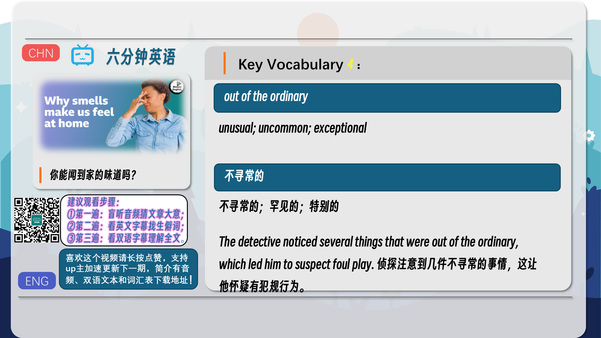
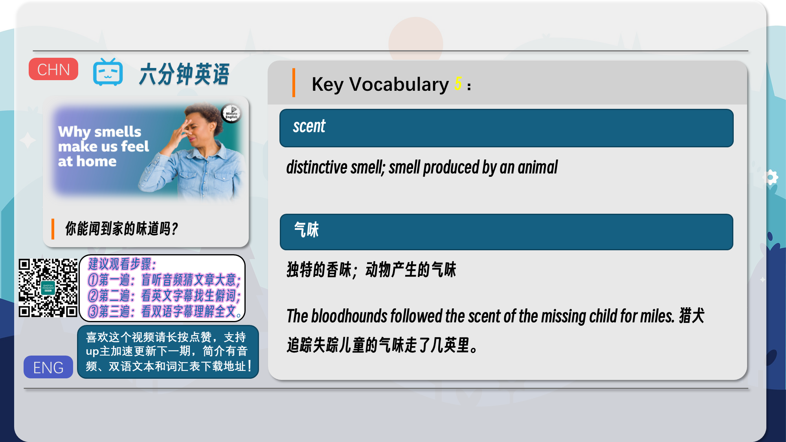
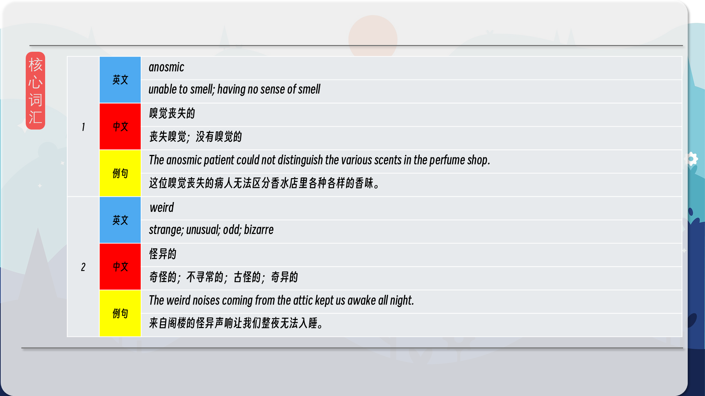
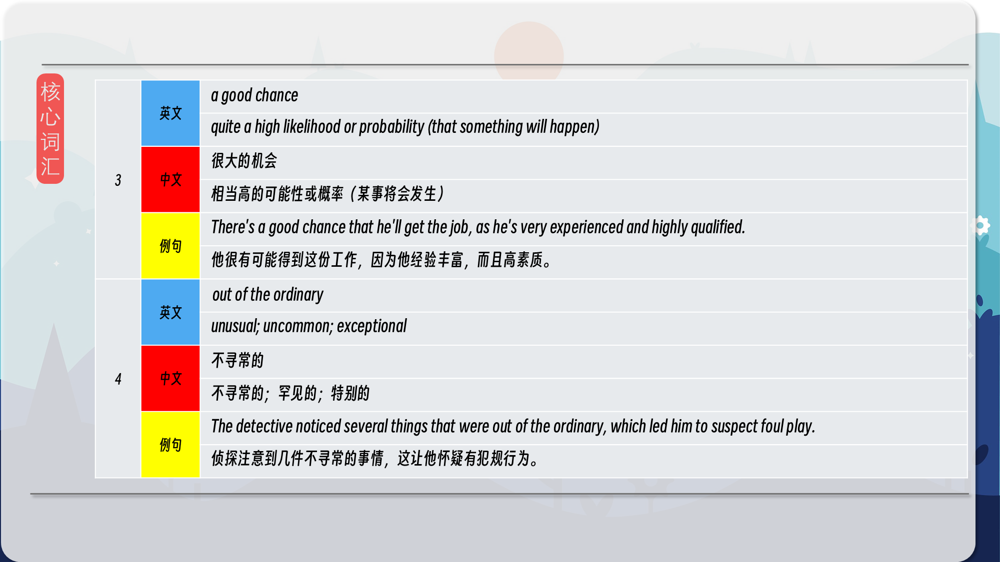
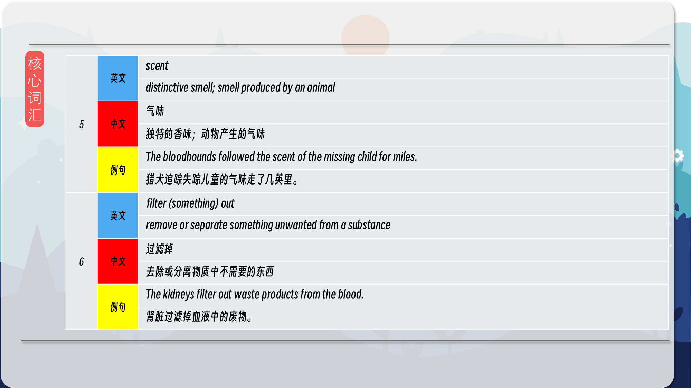

### 【英文脚本】
Phil
Hello. This is 6 Minute English from BBC Learning English. I’m Phil.
 
Beth
And I’m Beth. Phil, what makes home special for you? Maybe it’s sleeping in your own bed, the view from the window, or a loved family pet. What makes you feel like you're home, Phil?
 
Phil
You know what? I think it's just relaxing on my sofa, in my living room.
 
Beth
Very nice!
 
Phil
Well, you may not realise it, but for your brain one of the strongest identifiers of home is smell. Listen as BBC presenters Marnie Chesterton and Tristan Ahtone describe the smells which give them the feeling of home:
 
Marnie Chesterton
My grandad's house smelt of pine and damp and musty books.
 
Tristan Ahtone
I know my mom's perfume, my dad’s preferred soap.
 
Beth
In this programme, we’ll be finding out why our sense of smell is so important to feeling at home, even when we don’t notice it. As always, we’ll be introducing some useful new vocabulary, and if you head over to our website, bbclearningenglish.com, you’ll find a transcript of the programme to read along with as you listen, and there's a free worksheet too!
 
Phil
Good idea, Beth! But now it’s time for my question. The sense of smell is incredibly powerful but not everyone has it. A small amount of the population is anosmic, meaning they can’t smell. So, according to research at the University of Reading, what percentage of people have no sense of smell? Is it: a) 2%? b) 5%? or, c) 7%?
 
Beth
Oh, I'm going to say b) 5%.
 
Phil
Well, we'll find out the correct answer later in the programme. Have you ever come back home from holiday and noticed a strange smell in your house? If you have, don’t worry – it’s not bad, in fact there’s a scientific reason for it, as science writer Tristan Ahtone explained to BBC World Service programme, Unexpected Elements:
 
Tristan Ahtone
One thing I've been thinking about is that every house or home has, well, a smell to it. You might really notice this in your own home when you come back from a long trip, and you step through your front door and things smell, well, just kind of a bit weird. While there's a good chance your house might smell strange because it's been closed up for a few weeks, there's also a chance you might be smelling your home as it usually smells, but you just don't notice it when you're there.
 
Beth
Tristan says that when you return home after being away, there’s a good chance your house smells weird, an adjective meaning strange or unusual. If you say there’s a good chance that something will happen, you mean there’s a high likelihood or probability of it.
 
Phil
The truth is that every home has a smell, although we’re so used to it, we usually don’t notice. When we breathe in, receptor cells in the nose detect molecules in the air and send them to olfactory organs in the brain. These analyse the smells for danger. The reason you can't smell your own home is that it isn’t a threat to you. Here’s science writer Tristan Ahtone again, explaining more to BBC World Service programme, Unexpected Elements:
 
Tristan Ahtone
Well, by filtering out common non-threatening smells it makes it easier to detect things out of the ordinary that might be dangerous. So, for example, if you forget about your toast, and it starts to burn, you can typically smell that quickly because it’s a change to the environment that you're in. Then the other parts of your brain kick in to understand the smell of smoke as a potential harm or threat. But even if we can't smell our own homes, the scent of them still matters because it's entangled with our recognition of comfort and security.
 
Beth
By filtering out familiar smells, our brains are able to detect other smells which are out of the ordinary, unusual or uncommon, and which may be dangerous. To filter something out means to remove or separate something unwanted from something else. For example, filtering out the smell of home means we notice the smell of burning toast or other smells alerting us to possible danger.
 
Phil
Even though we don't usually notice the scent – the particular smell – of our home, it still has an effect on the brain's limbic system which handles memory and emotion. This explains why smell has such a strong effect on our feelings, and why we feel comfortable and safe at home.
 
Beth
Right, Phil, isn’t it time to reveal the answer to your question?
 
Phil
Yes, it is. I asked you what percentage of the population is anosmic, that means they can't smell. And the answer is b) 5% which is what you said, I think.
 
Beth
It is, yeah!
 
Phil
Well done!
 
Beth
OK, let’s recap the vocabulary we’ve learnt in this programme, starting with anosmic, meaning having no sense, or a limited sense, of smell.
 
Phil
The adjective weird means strange, odd or bizarre.
 
Beth
When someone says there’s a good chance something will happen, they mean it’s quite likely to happen.
 
Phil
The phrase out of the ordinary means unusual, uncommon, or exceptional.
 
Beth
If you filter something out, you remove or separate something unwanted from a substance.
 
Phil
And finally, a scent is a distinctive smell, often a pleasant one although it can also mean the smell made by an animal. Once again, our six minutes are up, but if you enjoyed listening to this programme, you’ll find many more, along with a worksheet with a quiz you can try, on our website, bbclearningenglish.com. See you there soon!
 
Beth
Bye!
 

### 【中英文双语脚本】
Phil(菲尔)
I’m Phil.
你好。这是来自 BBC Learning English 的六分钟英语。我是菲尔。

Beth(贝丝)
And I’m Beth. Phil, what makes home special for you? Maybe it’s sleeping in your own bed, the view from the window, or a loved family pet. What makes you feel like you're home, Phil?
我是贝丝。Phil，是什么让家对你来说很特别？也许是睡在自己的床上，窗外的风景，或者是心爱的家庭宠物。是什么让你感觉像在家一样，Phil？

Phil(菲尔)
You know what? I think it's just relaxing on my sofa, in my living room.
你知道吗？我想就是在我的沙发上，在我的客厅里放松。

Beth(贝丝)
Very nice!
很好！

Phil(菲尔)
Well, you may not realise it, but for your brain one of the strongest identifiers of home is smell. Listen as BBC presenters Marnie Chesterton and Tristan Ahtone describe the smells which give them the feeling of home:
好吧，你可能没有意识到，但对于你的大脑来说，家最强的标志之一是气味。听听 BBC 主持人 Marnie Chesterton 和 Tristan Ahtone 描述给他们带来家的感觉的气味：

Marnie Chesterton(玛妮·切斯特顿)
My grandad's house smelt of pine and damp and musty books.
我爷爷的房子闻起来有松树的味道，还有潮湿和发霉的书籍的味道。

Tristan Ahtone(特里斯坦·阿通)
I know my mom's perfume, my dad’s preferred soap.
我知道我妈妈的香水，我爸爸最喜欢的肥皂。

Beth(贝丝)
In this programme, we’ll be finding out why our sense of smell is so important to feeling at home, even when we don’t notice it. As always, we’ll be introducing some useful new vocabulary, and if you head over to our website, bbclearningenglish.com, you’ll find a transcript of the programme to read along with as you listen, and there's a free worksheet too!
在这个节目中，我们将找出为什么我们的嗅觉对家的感觉如此重要，即使我们没有注意到它。与往常一样，我们将介绍一些有用的新词汇，如果您 bbclearningenglish.com 访问我们的网站，您会找到该程序的文字记录，供您在收听时阅读，并且还有一个免费的工作表！

Phil(菲尔)
Good idea, Beth! But now it’s time for my question. The sense of smell is incredibly powerful but not everyone has it. A small amount of the population is anosmic, meaning they can’t smell. So, according to research at the University of Reading, what percentage of people have no sense of smell? Is it: a) 2%? b) 5%? or, c) 7%?
好主意，贝丝！但现在是我提问的时候了。嗅觉非常强大，但并不是每个人都有。一小部分人是嗅觉丧失症，这意味着他们没有气味。那么，根据雷丁大学的研究，没有嗅觉的人占百分之几呢？是：a） 2%吗？b） 5%？或者，c） 7%？

Beth(贝丝)
Oh, I'm going to say b) 5%.
哦，我要说 b） 5%。

Phil(菲尔)
Well, we'll find out the correct answer later in the programme. Have you ever come back home from holiday and noticed a strange smell in your house? If you have, don’t worry – it’s not bad, in fact there’s a scientific reason for it, as science writer Tristan Ahtone explained to BBC World Service programme, Unexpected Elements:
好吧，我们将在节目的后面找到正确答案。你有没有放假回家，注意到家里有一股奇怪的气味？如果你有，别担心 —— 这还不错，事实上有科学原因，正如科学作家特里斯坦·阿通 （Tristan Ahtone） 对 BBC 国际服务节目《意想不到的元素》所解释的那样：

Tristan Ahtone(特里斯坦·阿通)
One thing I've been thinking about is that every house or home has, well, a smell to it. You might really notice this in your own home when you come back from a long trip, and you step through your front door and things smell, well, just kind of a bit weird. While there's a good chance your house might smell strange because it's been closed up for a few weeks, there's also a chance you might be smelling your home as it usually smells, but you just don't notice it when you're there.
我一直在想的一件事是，每栋房子或每个家庭都有一股气味。当你从长途旅行回来时，你可能真的会在自己的家里注意到这一点，当你踏入前门时，东西闻起来有点奇怪。虽然您的房子很有可能因为已经关闭了几周而闻起来很奇怪，但您也有可能闻到家通常闻起来的味道，但当您在那里时，您只是没有注意到它。

Beth(贝丝)
Tristan says that when you return home after being away, there’s a good chance your house smells weird, an adjective meaning strange or unusual. If you say there’s a good chance that something will happen, you mean there’s a high likelihood or probability of it.
特里斯坦说，当你离开后回到家时，你的房子很有可能闻起来很奇怪，这个形容词的意思是奇怪或不寻常。如果你说某事发生的可能性很大，你的意思是它发生的可能性很高。

Phil(菲尔)
The truth is that every home has a smell, although we’re so used to it, we usually don’t notice. When we breathe in, receptor cells in the nose detect molecules in the air and send them to olfactory organs in the brain. These analyse the smells for danger. The reason you can't smell your own home is that it isn’t a threat to you. Here’s science writer Tristan Ahtone again, explaining more to BBC World Service programme, Unexpected Elements:
事实是，每个家都有气味，尽管我们已经习惯了，但我们通常不会注意到。当我们吸气时，鼻子中的受体细胞会检测到空气中的分子，并将它们发送到大脑中的嗅觉器官。这些分析气味是否存在危险。你闻不到自己家的原因是它对你没有威胁。这是科学作家 Tristan Ahtone 再次向 BBC 国际服务节目 Unexpected Elements 解释更多内容：

Tristan Ahtone(特里斯坦·阿通)
Well, by filtering out common non-threatening smells it makes it easier to detect things out of the ordinary that might be dangerous. So, for example, if you forget about your toast, and it starts to burn, you can typically smell that quickly because it’s a change to the environment that you're in. Then the other parts of your brain kick in to understand the smell of smoke as a potential harm or threat. But even if we can't smell our own homes, the scent of them still matters because it's entangled with our recognition of comfort and security.
好吧，通过过滤掉常见的非威胁性气味，可以更容易地检测到可能危险的异常事物。所以，例如，如果你忘记了吐司，它开始燃烧，你通常会很快闻到这种气味，因为这是你所处环境的变化。然后，您大脑的其他部分开始发挥作用，将烟味理解为潜在的伤害或威胁。但是，即使我们无法闻到自己家的气味，它们的气味仍然很重要，因为它与我们对舒适和安全的认识纠缠在一起。

Beth(贝丝)
By filtering out familiar smells, our brains are able to detect other smells which are out of the ordinary, unusual or uncommon, and which may be dangerous. To filter something out means to remove or separate something unwanted from something else. For example, filtering out the smell of home means we notice the smell of burning toast or other smells alerting us to possible danger.
通过过滤掉熟悉的气味，我们的大脑能够检测到其他不寻常、不寻常或不常见且可能很危险的气味。To filter something out 的意思是从其他事物中删除或分离不需要的事物。例如，过滤掉家的气味意味着我们会注意到烤面包燃烧的气味或其他气味，提醒我们可能的危险。

Phil(菲尔)
Even though we don't usually notice the scent – the particular smell – of our home, it still has an effect on the brain's limbic system which handles memory and emotion. This explains why smell has such a strong effect on our feelings, and why we feel comfortable and safe at home.
尽管我们通常不会注意到家中的气味 —— 特殊的气味 —— 但它仍然对大脑处理记忆和情感的边缘系统产生影响。这就解释了为什么气味对我们的感受有如此强烈的影响，以及为什么我们在家里感到舒适和安全。

Beth(贝丝)
Right, Phil, isn’t it time to reveal the answer to your question?
对，Phil，现在是不是该透露你问题的答案了？

Phil(菲尔)
Yes, it is. I asked you what percentage of the population is anosmic, that means they can't smell. And the answer is b) 5% which is what you said, I think.
是的，它是。我问你有多少百分比的人是嗅觉丧失症，这意味着他们没有气味。答案是 b） 5%，我想这就是你说的。

Beth(贝丝)
It is, yeah!
是的，是的！

Phil(菲尔)
Well done!
干的好！

Beth(贝丝)
OK, let’s recap the vocabulary we’ve learnt in this programme, starting with anosmic, meaning having no sense, or a limited sense, of smell.
好，让我们回顾一下我们在这个课程中学到的词汇，从嗅觉丧失开始，意思是没有嗅觉或嗅觉有限。

Phil(菲尔)
The adjective weird means strange, odd or bizarre.
形容词 weird 的意思是奇怪、奇怪或奇异。

Beth(贝丝)
When someone says there’s a good chance something will happen, they mean it’s quite likely to happen.
当有人说某事很有可能发生时，他们的意思是它很可能会发生。

Phil(菲尔)
The phrase out of the ordinary means unusual, uncommon, or exceptional.
短语 out of the ordinary 的意思是不寻常、不常见或例外。

Beth(贝丝)
If you filter something out, you remove or separate something unwanted from a substance.
如果你过滤掉一些东西，你就会从物质中去除或分离不需要的东西。

Phil(菲尔)
And finally, a scent is a distinctive smell, often a pleasant one although it can also mean the smell made by an animal. Once again, our six minutes are up, but if you enjoyed listening to this programme, you’ll find many more, along with a worksheet with a quiz you can try, on our website, bbclearningenglish.com. See you there soon!
最后，气味是一种独特的气味，通常是一种令人愉悦的气味，尽管它也可以指动物产生的气味。我们的六分钟又一次结束了，但如果您喜欢听这个节目，您会在我们的网站上找到更多内容，以及一个带有测验的工作表，您可以尝试，bbclearningenglish.com。期待很快与您相见！

Beth(贝丝)
Bye!
再见！

### 【核心词汇】
#### anosmic
unable to smell; having no sense of smell
嗅觉丧失的
丧失嗅觉；没有嗅觉的
The anosmic patient could not distinguish the various scents in the perfume shop.
这位嗅觉丧失的病人无法区分香水店里各种各样的香味。
#### weird
strange; unusual; odd; bizarre
怪异的
奇怪的；不寻常的；古怪的；奇异的
The weird noises coming from the attic kept us awake all night.
来自阁楼的怪异声响让我们整夜无法入睡。
#### a good chance
quite a high likelihood or probability (that something will happen)
很大的机会
相当高的可能性或概率（某事将会发生）
There's a good chance that he'll get the job, as he's very experienced and highly qualified.
他很有可能得到这份工作，因为他经验丰富，而且高素质。
#### out of the ordinary
unusual; uncommon; exceptional
不寻常的
不寻常的；罕见的；特别的
The detective noticed several things that were out of the ordinary, which led him to suspect foul play.
侦探注意到几件不寻常的事情，这让他怀疑有犯规行为。
#### scent
distinctive smell; smell produced by an animal
气味
独特的香味；动物产生的气味
The bloodhounds followed the scent of the missing child for miles.
猎犬追踪失踪儿童的气味走了几英里。
#### filter (something) out
remove or separate something unwanted from a substance
过滤掉
去除或分离物质中不需要的东西
The kidneys filter out waste products from the blood.
肾脏过滤掉血液中的废物。

在公众号里输入6位数字，获取【对话音频、英文文本、中文翻译、核心词汇和高级词汇表】电子档，6位数字【暗号】在文章的最后一张图片，如【220728】，表示22年7月28日这一期。公众号没有的文章说明还没有制作相关资料。年度合集在B站【六分钟英语】工房获取，每年共计300+文档，感谢支持！