### 【英文脚本】
Phil
Hello, this is 6 Minute English from BBC Learning English, I'm Phil.
 
Beth
And I'm Beth.
 
Phil
If you use the internet, and nearly everyone does, you’ve probably read headlines like this: You won’t believe what plastic surgery this celebrity has had done! Known as clickbait, headlines like these are used to grab your attention and make you read more.
 
Beth
But now, a new trend called rage bait is spreading across social media. Rage bait is online content designed to make you angry or outraged. In this programme, we’ll explore the trend of rage-baiting, and, as usual, we’ll learn some useful new vocabulary, all of which you can find on our website, bbclearningenglish.com.
 
Phil
Great, but first it’s time for my question, Beth, which is about the two terms we’ve been using: 'clickbait' and 'rage bait'. Both contain the word, 'bait', but what is its actual meaning? Is bait: a) a strong feeling of anger? b) food put on a hook to catch fish or animals? c) a piece of computer software?
 
Beth
I am fairly confident that it is b) – food put on a hook.
 
Phil
OK. Well, we'll find out the correct answer later in the programme. Here’s how rage bait works: a creator posts a provocative piece of content online, a message maybe, or a video. People see it, feel outraged, and comment angrily. Others see it, like it and share it around. Either way, the content creates interest, increases internet traffic and makes money for the creator. Here’s marketing strategist, Andrea Jones, explaining more to Megan Lawton, presenter of BBC World Service programme, Business Daily:
 
Andrea Jones
The more content they create, the more engagement they get, the more that they get paid. And so they will do anything… some creators will do anything to get more views because the more views they get, the more that they get paid, even if, even if, those views are negative or inciting rage and anger in people.
 
Megan Lawton
Andrea, how is rage bait different to clickbait or other online tactics? […]
 
Andrea Jones
As a marketer, I'm always, you know, coaching my clients and talking to them about using hooks in their marketing, right? And I think the difference between a hook and rage bait or even its long-lost cousin, clickbait content… When we think about a hook, to me a hook accurately reflects what's in that piece of content and it comes from a place of trust, whereas rage-baiting content is designed to be manipulative.
 
Beth
Andrea says the more reaction a post gets, the more money the creator makes, even if the reactions are hateful. She uses the structure, the more one thing happens, the more something else happens, to show that as one thing happens repeatedly, so another thing increases as a result. For example, the more you practise English, the more you’ll improve.
 
Phil
It doesn’t matter that the content is designed to incite outrage – to encourage unpleasant or violent reactions. That’s why Andrea thinks rage bait is worse than clickbait. While clickbait is more truthful about its content, rage bait is manipulative, meaning it tries to influence something to its own advantage.
 
Beth
So, it’s not hard to see why many people think rage bait is toxic. So, if you’re wondering why people react in the first place, listen as Dr William Brady explains the psychology behind rage bait to BBC World Service’s, Business Daily:
 
Dr William Brady
If you are an influencer and you want to figure out, ‘Well, how do I get more eyeballs on my content?’ Well, you need to exploit those biases we have in our psychology because that's the content we’ll pay more attention to. In turn that's the content that algorithms will amplify, which ultimately means more advertising revenue.
 
Phil
Influencers want more eyeballs on their content – more people to view their website or social media posts – and use human psychology to do it. Psychologically speaking, we all have biases – feelings – which are often unconscious, either for or against a certain idea or group of people.
 
Beth
Biases are emotional, and since listening to our emotions has been vital to the evolution of the human species, creators know that provoking our emotions will grab our attention.
 
Phil
So, what can be done to combat rage bait? Well, we could all take a moment to think before reacting. And remember that by sharing something outrageous you might be making things worse, while also making the creator richer.
 
Beth
OK, Phil, let’s reveal the answer to your question. You asked me what 'bait' is.
 
Phil
I did. And the correct answer is b) food put on a hook to catch a fish or an animal, and isn’t that what you said, Beth?
 
Beth
It is, yes.
 
Phil
Right again! OK, let’s recap the vocabulary we’ve learned in the programme, starting with rage bait, social media content designed to provoke anger, thereby encouraging people to engage with it.
 
Beth
The structure, the more… the more… describes the situation when one thing happening repeatedly results in another thing happening too.
 
Phil
To incite someone means to encourage them to do or feel something unpleasant or violent.
 
Beth
The adjective, manipulative, describes trying to influence or control someone to your own advantage.
 
Phil
Eyeballs is an informal word for the number of people viewing a particular website or television programme.
 
Beth
And finally, biases are feelings, often unconscious, either for or against an idea or a group of people. Once again, our six minutes are up. Goodbye for now!
 
Phil
Bye!
 

### 【中英文双语脚本】
Phil(菲尔)
Hello, this is 6 Minute English from BBC Learning English, I'm Phil.
您好，这里是 BBC Learning English 的六分钟英语，我是菲尔。

Beth(贝丝)
And I'm Beth.
我是贝丝。

Phil(菲尔)
If you use the internet, and nearly everyone does, you’ve probably read headlines like this: You won’t believe what plastic surgery this celebrity has had done! Known as clickbait, headlines like these are used to grab your attention and make you read more.
如果你使用互联网，而且几乎每个人都使用互联网，你可能读过这样的头条新闻：你不会相信这位名人做了什么整容手术！像这样的标题被称为点击诱饵，用来吸引你的注意力并让你阅读更多内容。

Beth(贝丝)
But now, a new trend called rage bait is spreading across social media. Rage bait is online content designed to make you angry or outraged. In this programme, we’ll explore the trend of rage-baiting, and, as usual, we’ll learn some useful new vocabulary, all of which you can find on our website, bbclearningenglish.com.
但现在，一种称为愤怒诱饵的新趋势正在社交媒体上传播。愤怒诱饵是旨在让您生气或愤怒的在线内容。在这个节目中，我们将探索愤怒诱饵的趋势，并且像往常一样，我们将学习一些有用的新词汇，所有这些都可以在我们的网站上找到，bbclearningenglish.com。

Phil(菲尔)
Great, but first it’s time for my question, Beth, which is about the two terms we’ve been using: 'clickbait' and 'rage bait'. Both contain the word, 'bait', but what is its actual meaning? Is bait: a) a strong feeling of anger? b) food put on a hook to catch fish or animals? c) a piece of computer software?
很好，但首先是我的问题，贝丝，这是关于我们一直在使用的两个术语：“点击诱饵”和“愤怒诱饵”。两者都包含“诱饵”一词，但它的实际含义是什么？诱饵是否：a） 强烈的愤怒感？b） 用钩子钓鱼或动物的食物？c） 一个计算机软件？

Beth(贝丝)
I am fairly confident that it is b) – food put on a hook.
我相当有信心它是 b） – 食物上钩。

Phil(菲尔)
OK. Well, we'll find out the correct answer later in the programme. Here’s how rage bait works: a creator posts a provocative piece of content online, a message maybe, or a video. People see it, feel outraged, and comment angrily. Others see it, like it and share it around. Either way, the content creates interest, increases internet traffic and makes money for the creator. Here’s marketing strategist, Andrea Jones, explaining more to Megan Lawton, presenter of BBC World Service programme, Business Daily:
还行。好吧，我们将在节目的后面找到正确答案。愤怒诱饵的工作原理是这样的：创作者在网上发布挑衅性内容，可能是一条消息，或者一个视频。人们看到它，感到愤怒，并愤怒地评论。其他人看到它、喜欢它并分享它。无论哪种方式，内容都会引起兴趣，增加互联网流量并为创作者赚钱。以下是营销策略师 Andrea Jones 向 BBC 世界服务节目主持人 Megan Lawton 解释的更多内容：

Andrea Jones(安德里亚·琼斯)
The more content they create, the more engagement they get, the more that they get paid. And so they will do anything… some creators will do anything to get more views because the more views they get, the more that they get paid, even if, even if, those views are negative or inciting rage and anger in people.
他们创建的内容越多，他们获得的参与度就越高，他们获得的报酬就越多。所以他们会做任何事情......一些创作者会不惜一切代价获得更多观看次数，因为他们获得的观看次数越多，他们获得的报酬就越多，即使这些观看次数是负面的或煽动人们的愤怒和愤怒。

Megan Lawton(梅根·劳顿)
Andrea, how is rage bait different to clickbait or other online tactics? […]
Andrea，愤怒诱饵与点击诱饵或其他在线策略有何不同？[…]

Andrea Jones(安德里亚·琼斯)
As a marketer, I'm always, you know, coaching my clients and talking to them about using hooks in their marketing, right? And I think the difference between a hook and rage bait or even its long-lost cousin, clickbait content… When we think about a hook, to me a hook accurately reflects what's in that piece of content and it comes from a place of trust, whereas rage-baiting content is designed to be manipulative.
作为一名营销人员，我总是，你知道的，指导我的客户，并与他们讨论在他们的营销中使用钩子，对吧？我认为 hook 和 rage bait 甚至它失传已久的表亲 clickbait 内容之间的区别......当我们考虑一个钩子时，对我来说，钩子准确地反映了该内容中的内容，它来自一个信任的地方，而愤怒诱饵的内容则被设计为纵性的。

Beth(贝丝)
Andrea says the more reaction a post gets, the more money the creator makes, even if the reactions are hateful. She uses the structure, the more one thing happens, the more something else happens, to show that as one thing happens repeatedly, so another thing increases as a result. For example, the more you practise English, the more you’ll improve.
Andrea 说，帖子得到的反应越多，创作者赚的钱就越多，即使这些反应是仇恨的。她使用结构，一件事发生得越多，其他事情发生得越多，来表明当一件事反复发生时，另一件事也会因此而增加。例如，你练习英语的次数越多，你的进步就越大。

Phil(菲尔)
It doesn’t matter that the content is designed to incite outrage – to encourage unpleasant or violent reactions. That’s why Andrea thinks rage bait is worse than clickbait. While clickbait is more truthful about its content, rage bait is manipulative, meaning it tries to influence something to its own advantage.
这些内容旨在煽动愤怒 —— 鼓励令人不快或暴力的反应，这并不重要。这就是为什么 Andrea 认为愤怒诱饵比点击诱饵更糟糕。虽然点击诱饵的内容更真实，但愤怒诱饵是纵性的，这意味着它试图影响某事以使其自身有利。

Beth(贝丝)
So, it’s not hard to see why many people think rage bait is toxic. So, if you’re wondering why people react in the first place, listen as Dr William Brady explains the psychology behind rage bait to BBC World Service’s, Business Daily:
所以，不难看出为什么很多人认为愤怒诱饵是有毒的。所以，如果你想知道人们为什么首先会做出反应，请听听威廉·布雷迪博士向 BBC 世界服务部《商业日报》解释愤怒诱饵背后的心理学：

Dr William Brady(WilliamBrady博士)
If you are an influencer and you want to figure out, ‘Well, how do I get more eyeballs on my content?’ Well, you need to exploit those biases we have in our psychology because that's the content we’ll pay more attention to. In turn that's the content that algorithms will amplify, which ultimately means more advertising revenue.
如果你是一个有影响力的人，你想弄清楚，'好吧，我如何在我的内容上获得更多的眼球？嗯，你需要利用我们在心理学中存在的那些偏见，因为那是我们将更加关注的内容。反过来，这就是算法将放大的内容，这最终意味着更多的广告收入。

Phil(菲尔)
Influencers want more eyeballs on their content – more people to view their website or social media posts – and use human psychology to do it. Psychologically speaking, we all have biases – feelings – which are often unconscious, either for or against a certain idea or group of people.
有影响力的人希望他们的内容有更多的眼球 —— 更多的人查看他们的网站或社交媒体帖子 —— 并利用人类心理学来做到这一点。从心理学上讲，我们都有偏见 – 感觉 – 这些偏见通常是无意识的，要么支持要么反对某个想法或一群人。

Beth(贝丝)
Biases are emotional, and since listening to our emotions has been vital to the evolution of the human species, creators know that provoking our emotions will grab our attention.
偏见是情绪化的，由于倾听我们的情绪对人类物种的进化至关重要，创作者知道激发我们的情绪会吸引我们的注意力。

Phil(菲尔)
So, what can be done to combat rage bait? Well, we could all take a moment to think before reacting. And remember that by sharing something outrageous you might be making things worse, while also making the creator richer.
那么，可以做些什么来对抗愤怒诱饵呢？好吧，在做出反应之前，我们都可以花点时间思考一下。请记住，分享一些离谱的东西可能会让事情变得更糟，同时也会让创作者变得更富有。

Beth(贝丝)
OK, Phil, let’s reveal the answer to your question. You asked me what 'bait' is.
好的，Phil，让我们揭示你问题的答案。你问我什么是“诱饵”。

Phil(菲尔)
I did. And the correct answer is b) food put on a hook to catch a fish or an animal, and isn’t that what you said, Beth?
我做了。正确答案是 b） 把食物挂在钩子上以捕捉鱼或动物，贝丝，你不是这么说的吗？

Beth(贝丝)
It is, yes.
是的，是的。

Phil(菲尔)
Right again! OK, let’s recap the vocabulary we’ve learned in the programme, starting with rage bait, social media content designed to provoke anger, thereby encouraging people to engage with it.
又对了！好，让我们回顾一下我们在该计划中学到的词汇，从愤怒诱饵开始，社交媒体内容旨在激起愤怒，从而鼓励人们参与其中。

Beth(贝丝)
The structure, the more… the more… describes the situation when one thing happening repeatedly results in another thing happening too.
结构，越多...越...描述一件事反复发生导致另一件事也发生的情况。

Phil(菲尔)
To incite someone means to encourage them to do or feel something unpleasant or violent.
To agite someone 的意思是鼓励他们做或感受不愉快或暴力的事情。

Beth(贝丝)
The adjective, manipulative, describes trying to influence or control someone to your own advantage.
形容词 manipulative 描述了试图影响或控制某人以为自己谋取利益。

Phil(菲尔)
Eyeballs is an informal word for the number of people viewing a particular website or television programme.
Eyeballs 是一个非正式词，指的是观看特定网站或电视节目的人数。

Beth(贝丝)
And finally, biases are feelings, often unconscious, either for or against an idea or a group of people. Once again, our six minutes are up. Goodbye for now!
最后，偏见是感觉，通常是无意识的，支持或反对一个想法或一群人。我们的六分钟又结束了。再见！

Phil(菲尔)
Bye!
再见！

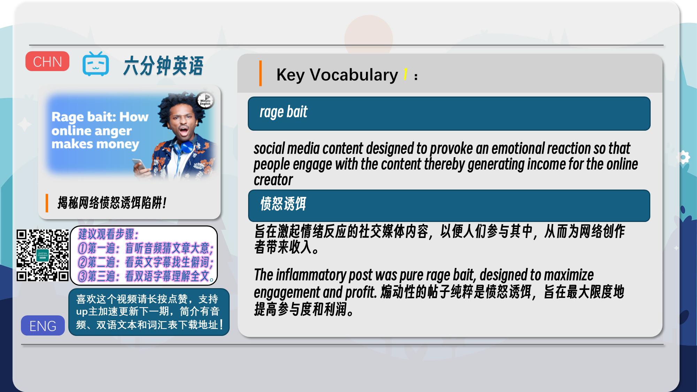
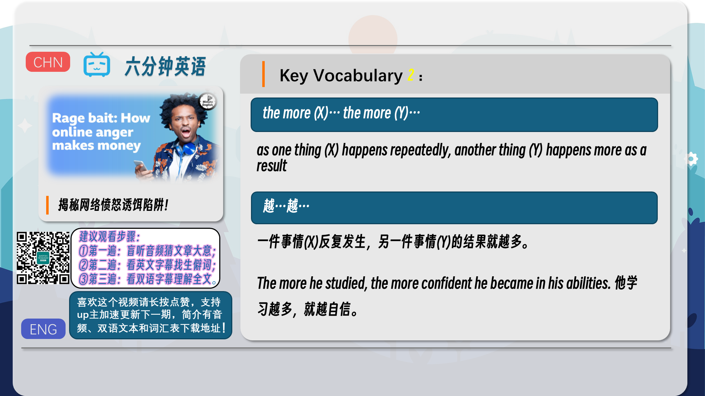
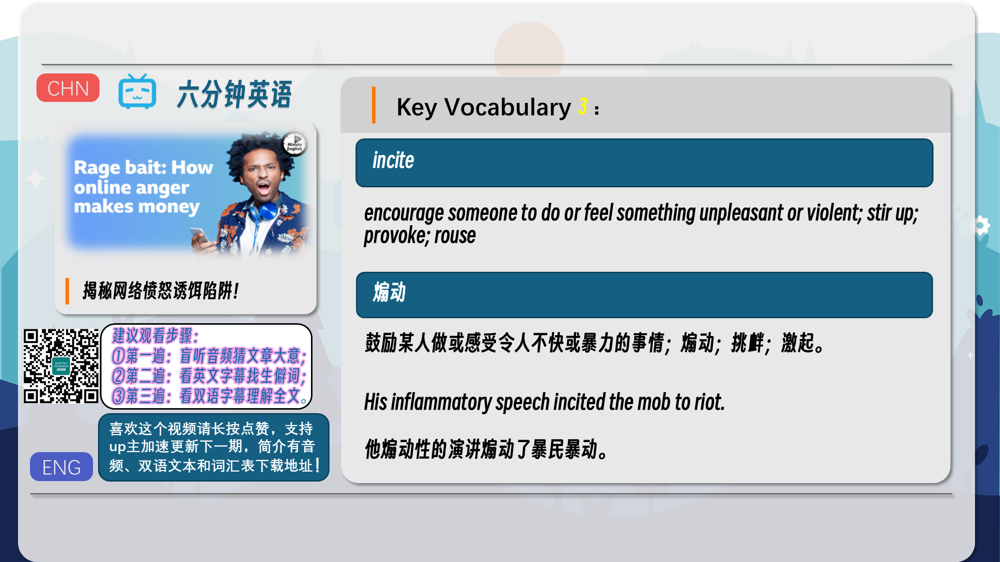
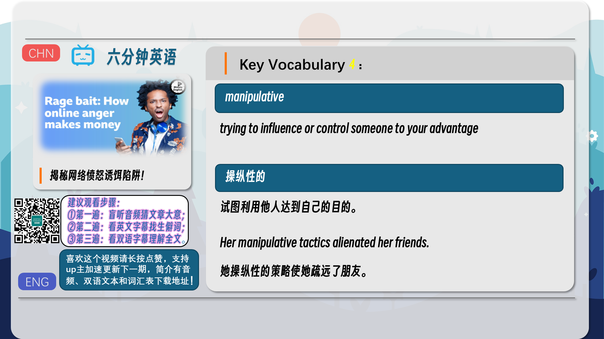
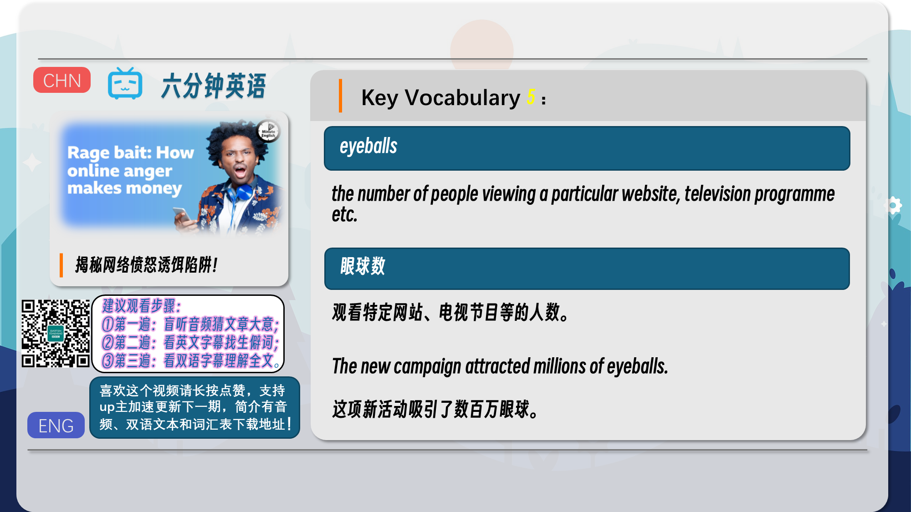
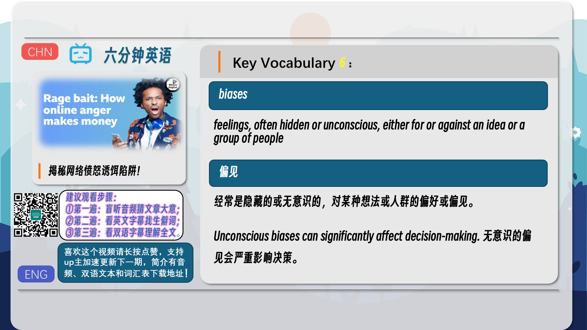
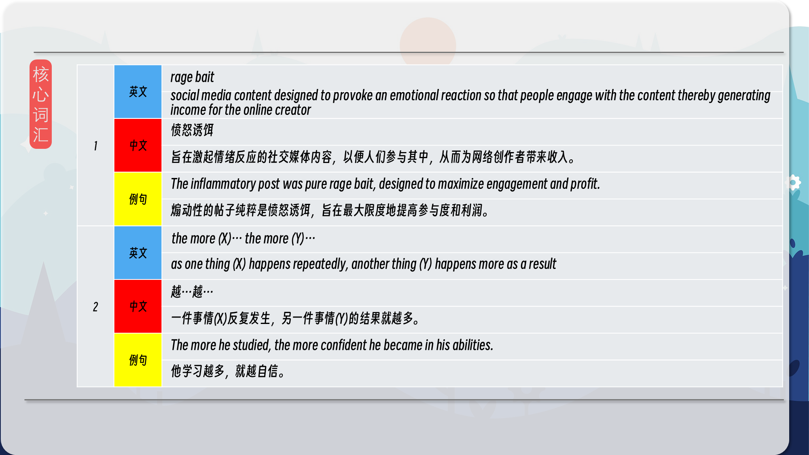
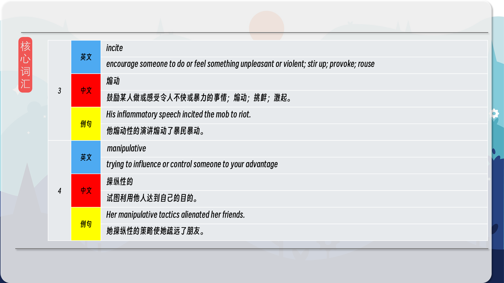
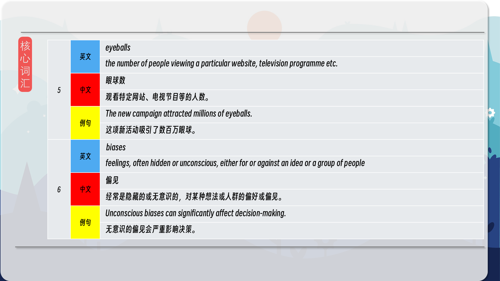
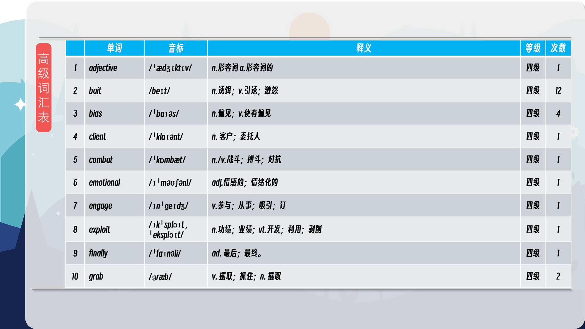
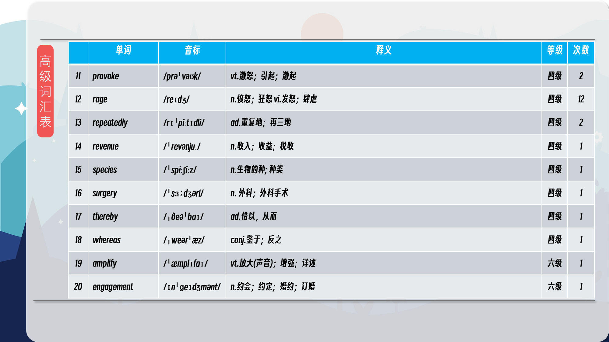
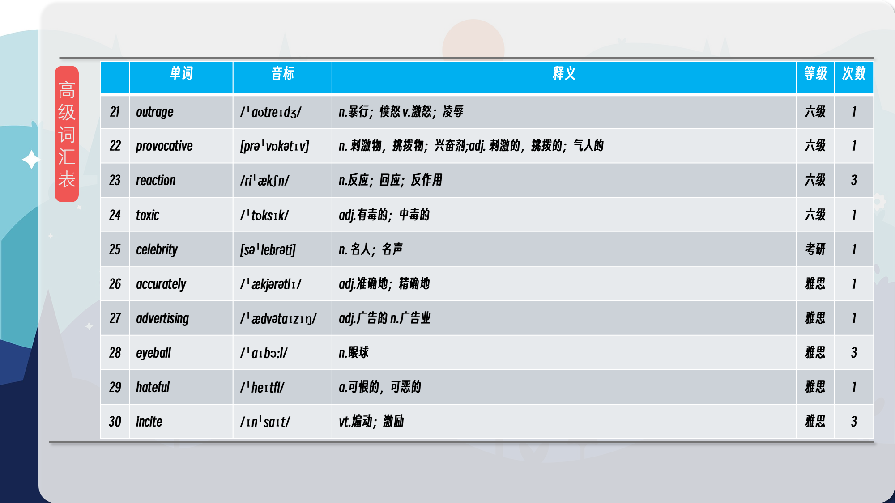
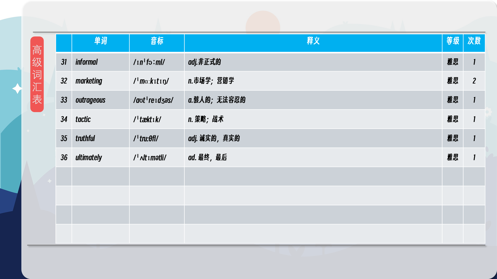

### 【核心词汇】
#### rage bait
social media content designed to provoke an emotional reaction so that people engage with the content thereby generating income for the online creator
愤怒诱饵
旨在激起情绪反应的社交媒体内容，以便人们参与其中，从而为网络创作者带来收入。
The inflammatory post was pure rage bait, designed to maximize engagement and profit.
煽动性的帖子纯粹是愤怒诱饵，旨在最大限度地提高参与度和利润。
#### the more (X)… the more (Y)…
as one thing (X) happens repeatedly, another thing (Y) happens more as a result
越…越…
一件事情(X)反复发生，另一件事情(Y)的结果就越多。
The more he studied, the more confident he became in his abilities.
他学习越多，就越自信。
#### incite
encourage someone to do or feel something unpleasant or violent; stir up; provoke; rouse
煽动
鼓励某人做或感受令人不快或暴力的事情；煽动；挑衅；激起。
His inflammatory speech incited the mob to riot.
他煽动性的演讲煽动了暴民暴动。
#### manipulative
trying to influence or control someone to your advantage
操纵性的
试图利用他人达到自己的目的。
Her manipulative tactics alienated her friends.
她操纵性的策略使她疏远了朋友。
#### eyeballs
the number of people viewing a particular website, television programme etc.
眼球数
观看特定网站、电视节目等的人数。
The new campaign attracted millions of eyeballs.
这项新活动吸引了数百万眼球。
#### biases
feelings, often hidden or unconscious, either for or against an idea or a group of people
偏见
经常是隐藏的或无意识的，对某种想法或人群的偏好或偏见。
Unconscious biases can significantly affect decision-making.
无意识的偏见会严重影响决策。

在公众号里输入6位数字，获取【对话音频、英文文本、中文翻译、核心词汇和高级词汇表】电子档，6位数字【暗号】在文章的最后一张图片，如【220728】，表示22年7月28日这一期。公众号没有的文章说明还没有制作相关资料。年度合集在B站【六分钟英语】工房获取，每年共计300+文档，感谢支持！