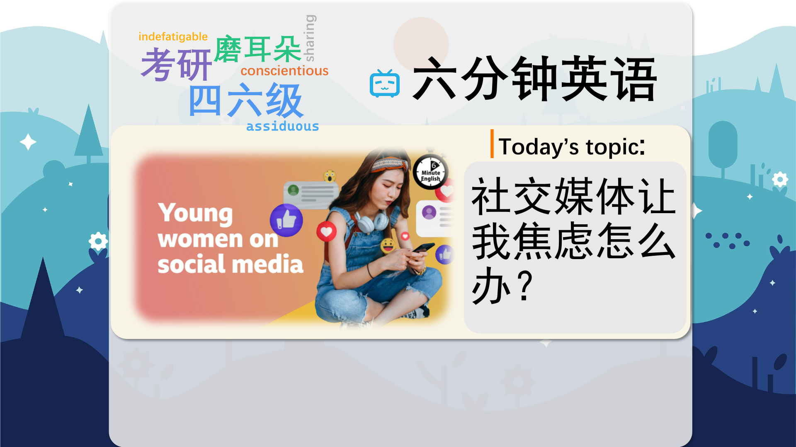

### 【英文脚本】
Neil
Hello. This is 6 Minute English from BBC Learning English. I'm Neil.
 
Beth
And I'm Beth. In this programme, we're discussing the positives and negatives of social media in the lives of young people. And this is a really trending topic at the moment because of what's happening in Australia, where a new law to limit under 16-year-olds’ access to social media is being debated. Neil, tell me one good thing and one bad thing about having social media in your life.
 
Neil
Well, one good thing is it means I can see what friends are doing who live far away and one bad thing is it's really addictive and a massive waste of time.
 
Beth
Well, it's interesting to hear a man's perspective, Neil, because when it comes to issues like cyber-bullying, it's often young women who are most affected, so soon we'll be hearing from women in different countries about their online experiences. And remember you can find all the vocabulary and a worksheet on our website, bbclearningenglish.com.
 
Neil
But first I have a question for you, Beth. In 2024, which was the most regularly used social media platform in the world? Was it: a) Facebook? b) Instagram? or c) TikTok?
 
Beth
Oh, I'm going to say TikTok.
 
Neil
Well, we'll find out the answer at the end of the programme. Now, let's start with the positive side of social media. As a politics student at Oklahoma University, twenty-one-year-old Haleigh Hurst campaigned in the 2024 US presidential election. Here, she explains one benefit of social media to BBC World Service programme, Pick of the World:
 
Haleigh Hurst
I do think social media has played a huge role in educating young voters on different policies and different people who are running. I know Trump has recently said that he has a soft spot in his heart for TikTok. With the growth of social media it has sparked a lot more debates. I think my generation too has seen so many climactic things happen.
 
Beth
Haleigh thinks one good thing about social media is that it sparks debates and conversations – it causes debates to start. She comments that Donald Trump is a fan of social media by saying he has a soft spot for TikTok. If you have a soft spot for something or someone, you feel affectionate and fond of it; you like it a lot.
 
Neil
But of course, that’s not the whole story. Increasingly, young women are reporting the negative impact social media is making on their lives, and the pressure they feel to appear 'perfect' online, especially from men.
 
Beth
Maanvi Sharma, aged 28, is a businesswoman and model with a large Instagram following who lives in Delhi, India. And Kemi Adeyemi, is a twenty-six-year-old travel blogger from Lagos in Nigeria. Both young women discussed these social media worries with BBC World Service programme, Pick of the World:
 
Maanvi Sharma
… the person you're dating, they might leave you just because of the social media. They might think that you're not good for, you know, marriage like…. You can't be a good partner because you're on social media, because you're being watched by a lot of people, and they feel a little intimidated by this… "You know what, we saw your girlfriend - Oh my gosh! She was wearing this, Oh my God!" But it's affecting my personal life…
 
Kemi Adeyemi
Some men or some people, they want you to shrink yourself so that they can, like, be the bigger person. They get to listen to what your friends say about you, what your family says about you, and they are not able to, like, stand up for you, to say, "Oh, I know this person. I believe she's not, like, doing these things for other reasons".
 
Neil
Maanvi thinks some men are intimidated by her popularity on Instagram. Intimidated means to feel frightened or nervous because you lack confidence. She feels people gossip about her posts and photos, using expressions like, 'Oh my gosh!' and 'Oh my God!' to express their shock or surprise.
 
Beth
And Kemi agrees. She says that on social media, some people want her to shrink herself, a phrase meaning that you underuse your full potential in order to avoid making people uncomfortable, or to fit in. When she's bullied online, Kemi says that these people don't stand up for her. To stand up for someone means to defend or support someone who's being criticised or bullied. And I think it's time you revealed the answer to your question, Neil.
 
Neil
I asked which was the most regularly used social media platform in the world in 2024 – Facebook, Instagram or TikTok? What did you say Beth?
 
Beth
TikTok.
 
Neil
I'm afraid you're wrong. It's Facebook, with over three billion regular users. OK, let's recap the vocabulary we've learned in this programme, starting with the verb spark, meaning to cause something, such as a debate or argument, to start happening.
 
Beth
If you have a soft spot for someone, you feel affection for them; you like them very much.
 
Neil
To be intimidated means to feel frightened or nervous because you lack confidence in a situation.
 
Beth
The expressions 'Oh my gosh!' and 'Oh my God!' are exclamations of strong feelings like shock, surprise, anger or disbelief.
 
Neil
If you shrink yourself, you make yourself smaller and don't use your full potential in order to make others feel comfortable, or to fit in with them.
 
Beth
And finally, to stand up for someone means to be vocal in defending a person who is being bullied. Once again, our time is up! But if you're ready for more, head over to the BBC Learning English website to try the worksheet with a quiz for this programme! See you there soon!
 
Neil
Goodbye!
 

### 【中英文双语脚本】
Neil(尼尔)
I'm Neil.
你好。这是来自 BBC Learning English 的六分钟英语。我是 Neil。

Beth(贝丝)
And I'm Beth. In this programme, we're discussing the positives and negatives of social media in the lives of young people. And this is a really trending topic at the moment because of what's happening in Australia, where a new law to limit under 16-year-olds’ access to social media is being debated. Neil, tell me one good thing and one bad thing about having social media in your life.
我是贝丝。在这个节目中，我们将讨论社交媒体在年轻人生活中的积极和消极因素。这是目前一个非常热门的话题，因为澳大利亚正在讨论一项限制 16 岁以下儿童使用社交媒体的新法律。Neil，告诉我在你的生活中拥有社交媒体的一件好事和一件坏事。

Neil(尼尔)
Well, one good thing is it means I can see what friends are doing who live far away and one bad thing is it's really addictive and a massive waste of time.
嗯，一件好事是我可以看到住在很远的朋友在做什么，一件坏事是它真的会让人上瘾，而且会浪费大量时间。

Beth(贝丝)
Well, it's interesting to hear a man's perspective, Neil, because when it comes to issues like cyber-bullying, it's often young women who are most affected, so soon we'll be hearing from women in different countries about their online experiences. And remember you can find all the vocabulary and a worksheet on our website, bbclearningenglish.com.
嗯，Neil 听听男性的观点很有趣，因为当谈到网络欺凌等问题时，受影响最大的往往是年轻女性，所以很快我们就会听到不同国家/地区的女性讲述她们的在线经历。请记住，您可以在我们的网站上找到所有词汇和工作表，bbclearningenglish.com。

Neil(尼尔)
But first I have a question for you, Beth. In 2024, which was the most regularly used social media platform in the world? Was it: a) Facebook? b) Instagram? or c) TikTok?
但首先我有一个问题要问你，贝丝。2024 年，世界上使用最频繁的社交媒体平台是哪个？是：a） Facebook？b） Instagram？或 c） TikTok？

Beth(贝丝)
Oh, I'm going to say TikTok.
哦，我要说的是 TikTok。

Neil(尼尔)
Well, we'll find out the answer at the end of the programme. Now, let's start with the positive side of social media. As a politics student at Oklahoma University, twenty-one-year-old Haleigh Hurst campaigned in the 2024 US presidential election. Here, she explains one benefit of social media to BBC World Service programme, Pick of the World:
好吧，我们将在节目结束时找到答案。现在，让我们从社交媒体的积极一面开始。作为俄克拉荷马大学（Oklahoma University）的一名政治专业学生，21岁的哈利·赫斯特（Haleigh Hurst）参加了2024年美国总统大选。在这里，她向 BBC 世界服务节目 Pick of the World 解释了社交媒体的一个好处：

Haleigh Hurst(哈利·赫斯特)
I do think social media has played a huge role in educating young voters on different policies and different people who are running. I know Trump has recently said that he has a soft spot in his heart for TikTok. With the growth of social media it has sparked a lot more debates. I think my generation too has seen so many climactic things happen.
我确实认为社交媒体在教育年轻选民了解不同的政策和不同的竞选人方面发挥了巨大作用。我知道特朗普最近说，他心里对 TikTok 情有独钟。随着社交媒体的发展，它引发了更多的辩论。我想我们这一代人也见过很多高潮的事情发生。

Beth(贝丝)
Haleigh thinks one good thing about social media is that it sparks debates and conversations – it causes debates to start. She comments that Donald Trump is a fan of social media by saying he has a soft spot for TikTok. If you have a soft spot for something or someone, you feel affectionate and fond of it; you like it a lot.
Haleigh 认为社交媒体的一个好处是它引发了辩论和对话 —— 它导致辩论开始。她评论说唐纳德·特朗普是社交媒体的粉丝，他说他对TikTok情有独钟。如果你对某事或某人情有独钟，你会感到深情和喜欢它；你很喜欢它。

Neil(尼尔)
But of course, that’s not the whole story. Increasingly, young women are reporting the negative impact social media is making on their lives, and the pressure they feel to appear 'perfect' online, especially from men.
但当然，这并不是故事的全部。越来越多的年轻女性报告了社交媒体对她们生活的负面影响，以及她们在网上显得“完美”的压力，尤其是来自男性的压力。

Beth(贝丝)
Maanvi Sharma, aged 28, is a businesswoman and model with a large Instagram following who lives in Delhi, India. And Kemi Adeyemi, is a twenty-six-year-old travel blogger from Lagos in Nigeria. Both young women discussed these social media worries with BBC World Service programme, Pick of the World:
Maanvi Sharma 现年 28 岁，是一名女商人和模特，在 Instagram 上拥有大量粉丝，居住在印度德里。Kemi Adeyemi 是一位来自尼日利亚拉各斯的 26 岁旅游博主。这两位年轻女性都在 BBC 世界服务节目 Pick of the World 中讨论了这些社交媒体上的担忧：

Maanvi Sharma(马安维·夏尔马)
… the person you're dating, they might leave you just because of the social media. They might think that you're not good for, you know, marriage like…. You can't be a good partner because you're on social media, because you're being watched by a lot of people, and they feel a little intimidated by this… "You know what, we saw your girlfriend - Oh my gosh! She was wearing this, Oh my God!" But it's affecting my personal life…
…你正在约会的人，他们可能会因为社交媒体而离开你。他们可能会认为你不适合，你知道的，像......你不能因为你在社交媒体上而成为一个好的伙伴，因为你被很多人看着，他们对此感到有点害怕......“你知道吗，我们看到了你的女朋友 —— 哦，我的天哪！她穿着这个，天哪！但它正在影响我的个人生活......

Kemi Adeyemi(凯米·阿德耶米)
Some men or some people, they want you to shrink yourself so that they can, like, be the bigger person. They get to listen to what your friends say about you, what your family says about you, and they are not able to, like, stand up for you, to say, "Oh, I know this person. I believe she's not, like, doing these things for other reasons".
有些人或有些人，他们希望你缩小自己，这样他们就可以成为更大的人。他们可以听你的朋友怎么说你，你的家人怎么说你，但他们无法站出来为你说，'哦，我认识这个人。我相信她不是因为其他原因做这些事情。

Neil(尼尔)
Maanvi thinks some men are intimidated by her popularity on Instagram. Intimidated means to feel frightened or nervous because you lack confidence. She feels people gossip about her posts and photos, using expressions like, 'Oh my gosh!' and 'Oh my God!' to express their shock or surprise.
Maanvi 认为一些男人被她在 Instagram 上的受欢迎程度吓倒了。Intimidated 的意思是因为你缺乏信心而感到害怕或紧张。她感觉到人们会八卦她的帖子和照片，使用诸如“哦，我的天哪”和“哦，我的上帝”之类的表达来表达他们的震惊或惊讶。

Beth(贝丝)
And Kemi agrees. She says that on social media, some people want her to shrink herself, a phrase meaning that you underuse your full potential in order to avoid making people uncomfortable, or to fit in. When she's bullied online, Kemi says that these people don't stand up for her. To stand up for someone means to defend or support someone who's being criticised or bullied. And I think it's time you revealed the answer to your question, Neil.
凯米同意。她说，在社交媒体上，有些人希望她缩小自己，这句话的意思是你没有充分利用自己的潜力，以避免让人们感到不舒服，或者为了融入。当她在网上被欺负时，凯米说这些人不会为她挺身而出。To stand up for someone 的意思是为受到批评或欺凌的人辩护或支持。我认为你是时候透露你问题的答案了，Neil。

Neil(尼尔)
I asked which was the most regularly used social media platform in the world in 2024 – Facebook, Instagram or TikTok? What did you say Beth?
我问 2024 年世界上使用最频繁的社交媒体平台是哪个 —— Facebook、Instagram 还是 TikTok？你怎么说贝丝？

Beth(贝丝)
TikTok.
TikTok的。

Neil(尼尔)
I'm afraid you're wrong. It's Facebook, with over three billion regular users. OK, let's recap the vocabulary we've learned in this programme, starting with the verb spark, meaning to cause something, such as a debate or argument, to start happening.
恐怕你错了。它是 Facebook，拥有超过 30 亿的固定用户。好，让我们回顾一下我们在这个程序中学到的词汇，从动词 spark 开始，意思是导致某事开始发生，例如辩论或争论。

Beth(贝丝)
If you have a soft spot for someone, you feel affection for them; you like them very much.
如果你对某人情有独钟，你就会对他们产生感情；你很喜欢他们。

Neil(尼尔)
To be intimidated means to feel frightened or nervous because you lack confidence in a situation.
To be intimidated 的意思是因为您对某种情况缺乏信心而感到害怕或紧张。

Beth(贝丝)
The expressions 'Oh my gosh!' and 'Oh my God!' are exclamations of strong feelings like shock, surprise, anger or disbelief.
“Oh my gosh！”和“Oh my God！”这些表达是对强烈情绪的感叹，如震惊、惊讶、愤怒或不相信。

Neil(尼尔)
If you shrink yourself, you make yourself smaller and don't use your full potential in order to make others feel comfortable, or to fit in with them.
如果你缩小自己，你就会让自己变得更小，并且不会充分利用你的潜力来让别人感到舒适，或者为了适应他们。

Beth(贝丝)
And finally, to stand up for someone means to be vocal in defending a person who is being bullied. Once again, our time is up! But if you're ready for more, head over to the BBC Learning English website to try the worksheet with a quiz for this programme! See you there soon!
最后，To stand up for someone 的意思是大声疾呼地为遭受霸凌的人辩护。我们的时间又一次到了！但是，如果您准备好了解更多，请前往 BBC Learning English 网站尝试带有此计划的测验工作表！期待很快与您相见！

Neil(尼尔)
Goodbye!
再见！

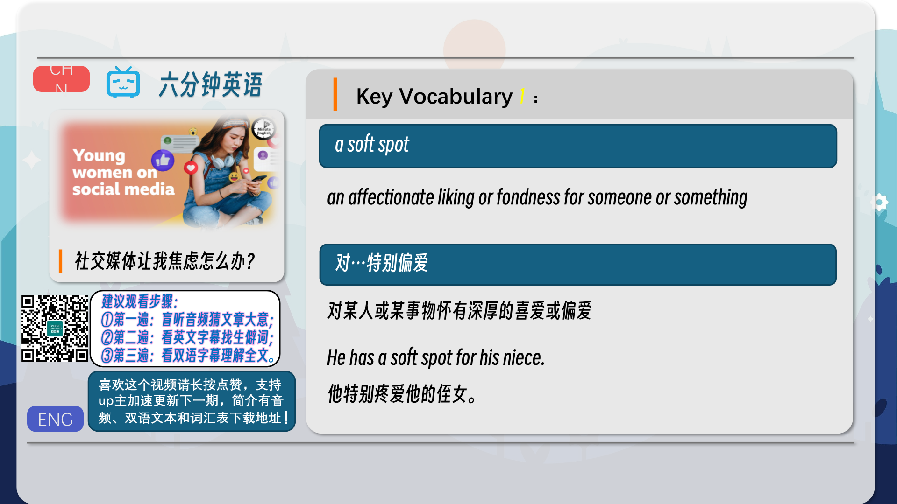
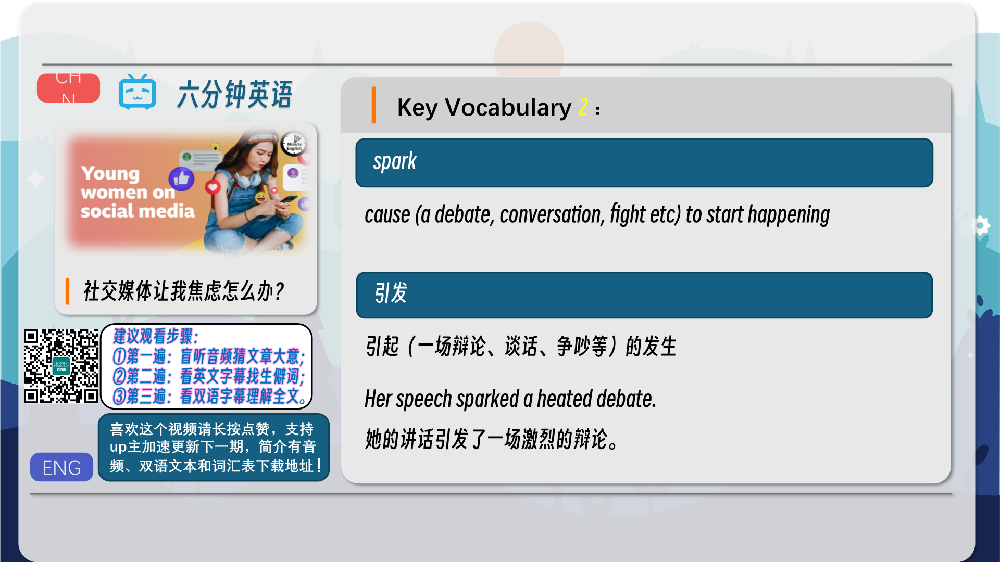
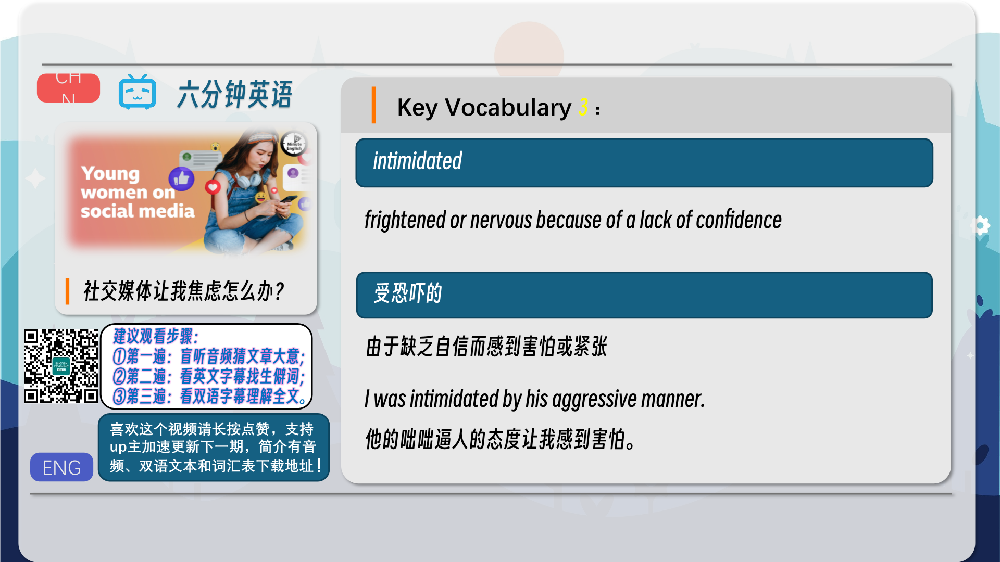
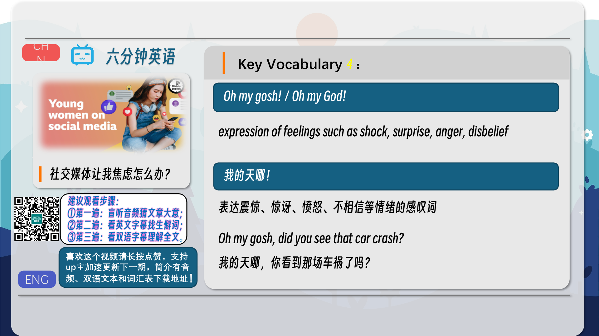
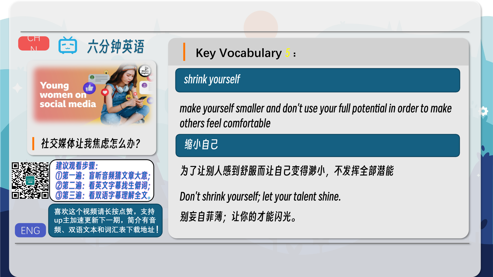
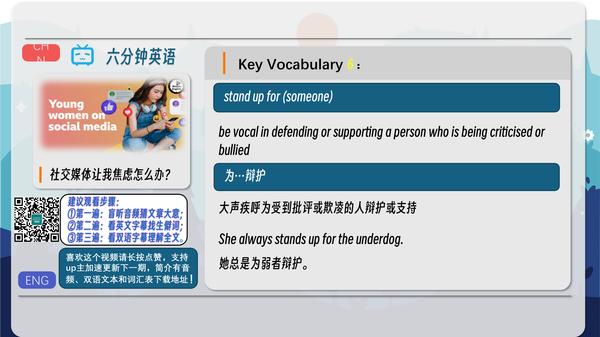
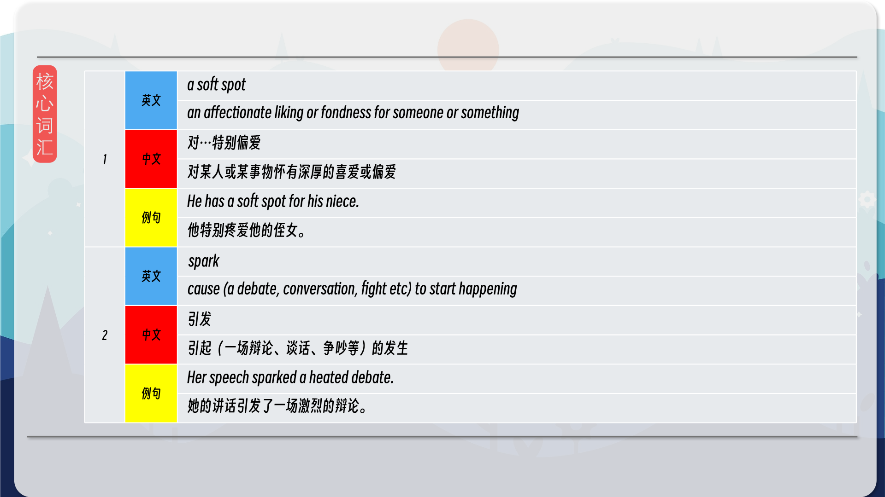
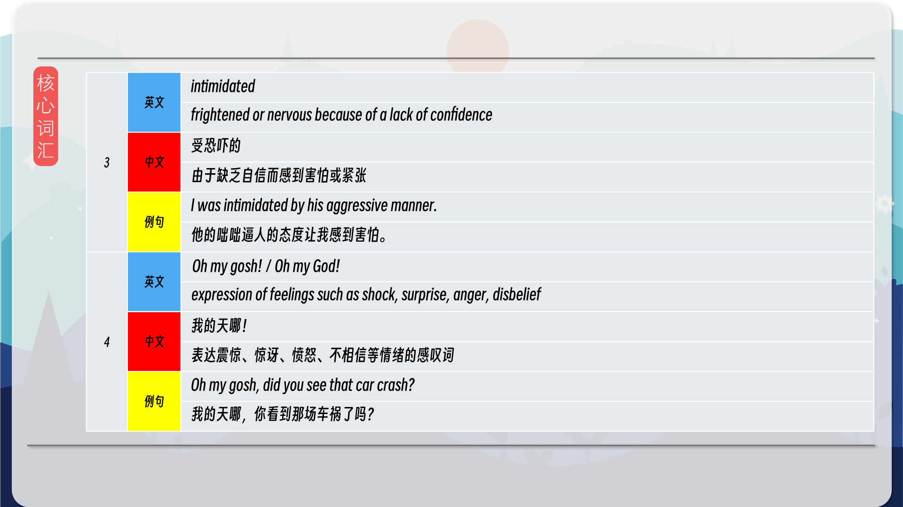
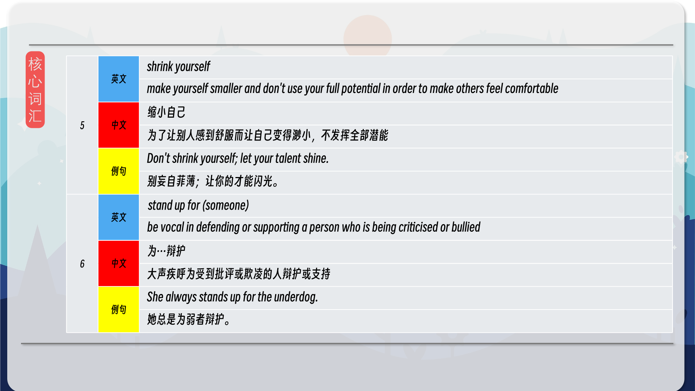
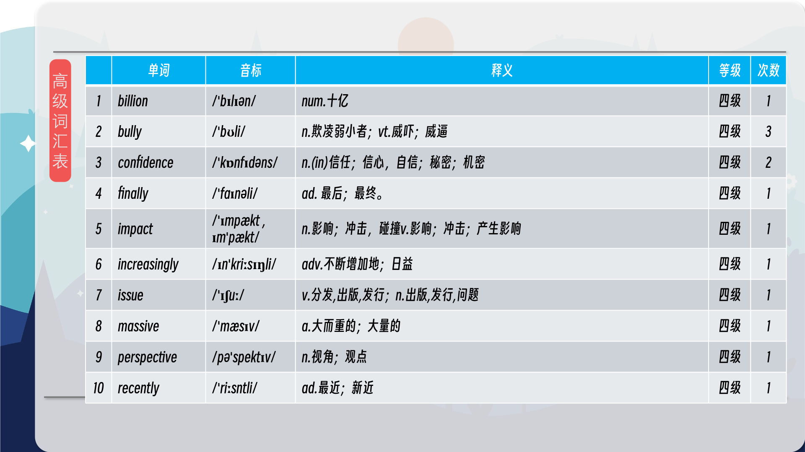
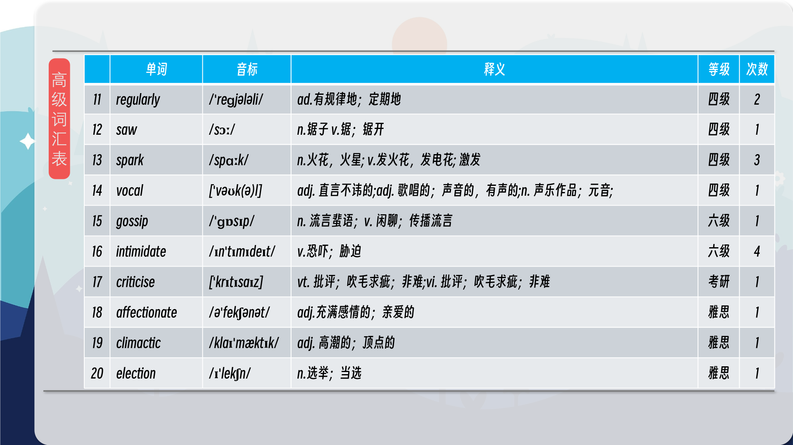
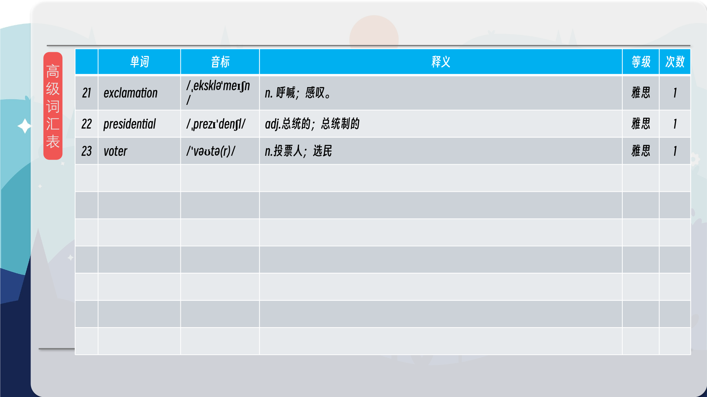

### 【核心词汇】
#### a soft spot
an affectionate liking or fondness for someone or something
对…特别偏爱
对某人或某事物怀有深厚的喜爱或偏爱
He has a soft spot for his niece.
他特别疼爱他的侄女。
#### spark
cause (a debate, conversation, fight etc) to start happening
引发
引起（一场辩论、谈话、争吵等）的发生
Her speech sparked a heated debate.
她的讲话引发了一场激烈的辩论。
#### intimidated
frightened or nervous because of a lack of confidence
受恐吓的
由于缺乏自信而感到害怕或紧张
I was intimidated by his aggressive manner.
他的咄咄逼人的态度让我感到害怕。
#### Oh my gosh! / Oh my God!
expression of feelings such as shock, surprise, anger, disbelief
我的天哪！
表达震惊、惊讶、愤怒、不相信等情绪的感叹词
Oh my gosh, did you see that car crash?
我的天哪，你看到那场车祸了吗？
#### shrink yourself
make yourself smaller and don't use your full potential in order to make others feel comfortable
缩小自己
为了让别人感到舒服而让自己变得渺小，不发挥全部潜能
Don't shrink yourself; let your talent shine.
别妄自菲薄；让你的才能闪光。
#### stand up for (someone)
be vocal in defending or supporting a person who is being criticised or bullied
为…辩护
大声疾呼为受到批评或欺凌的人辩护或支持
She always stands up for the underdog.
她总是为弱者辩护。

在公众号里输入6位数字，获取【对话音频、英文文本、中文翻译、核心词汇和高级词汇表】电子档，6位数字【暗号】在文章的最后一张图片，如【220728】，表示22年7月28日这一期。公众号没有的文章说明还没有制作相关资料。年度合集在B站【六分钟英语】工房获取，每年共计300+文档，感谢支持！