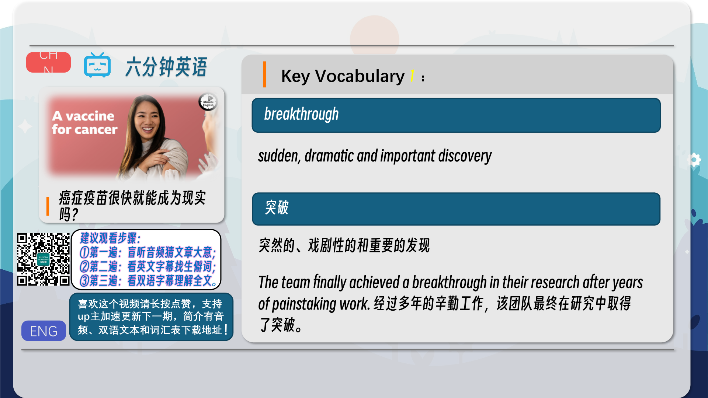
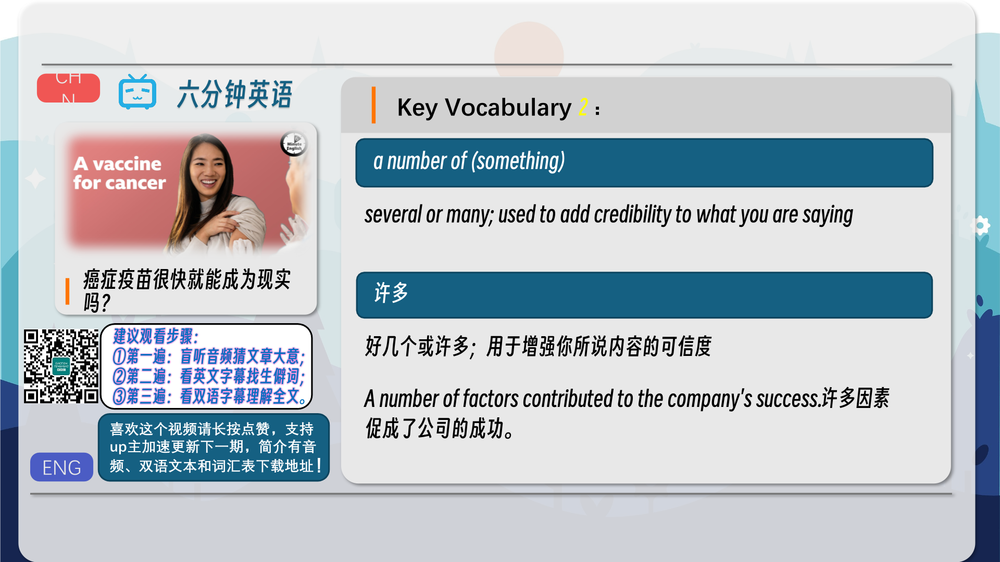
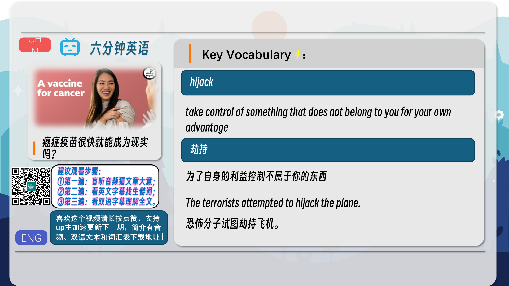
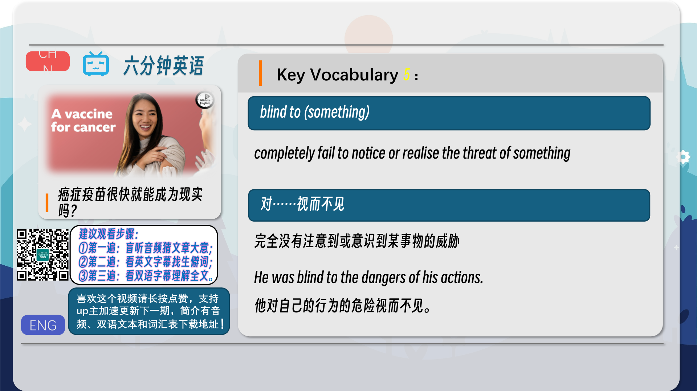
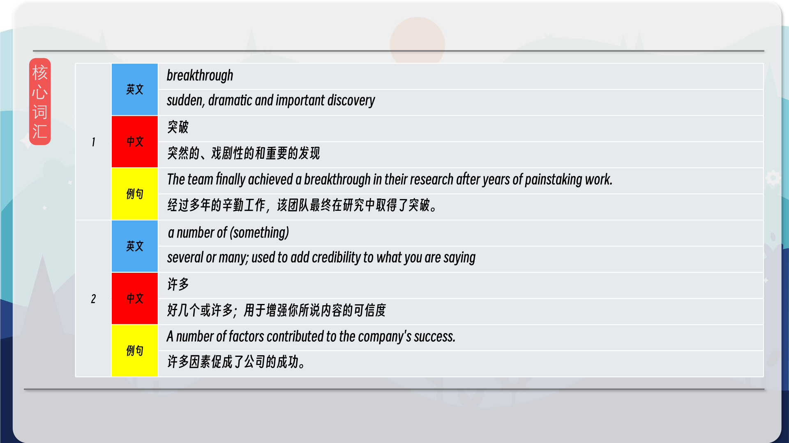
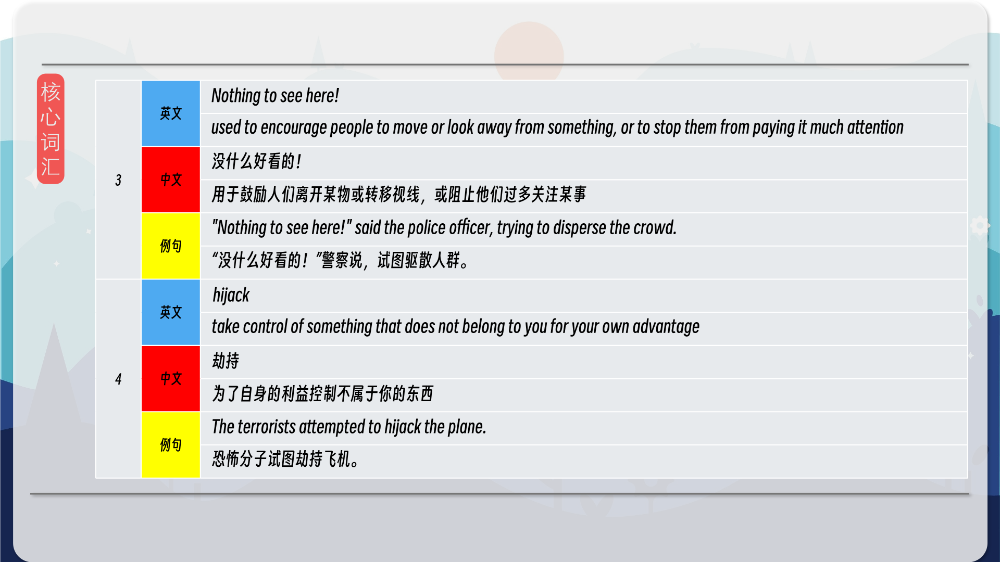
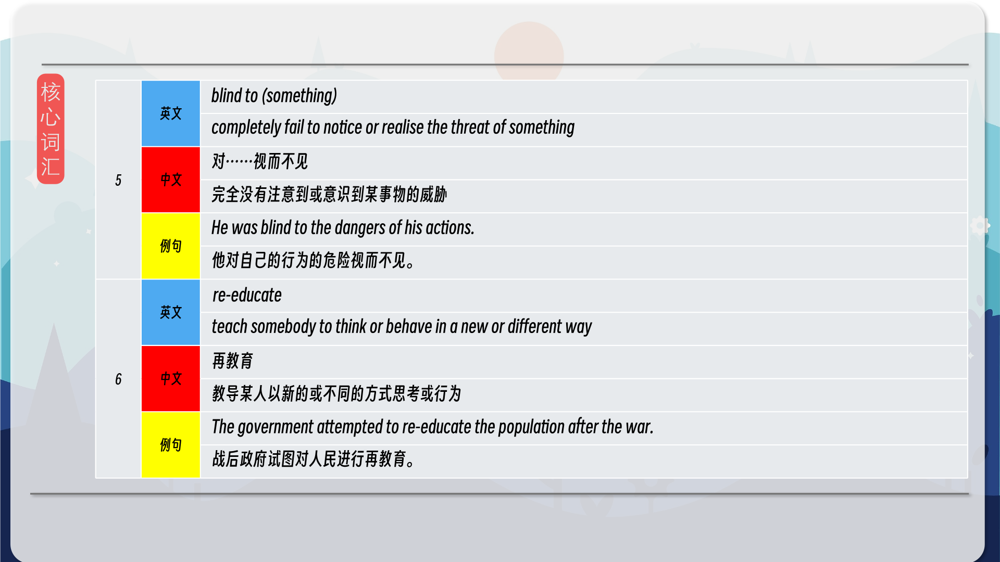
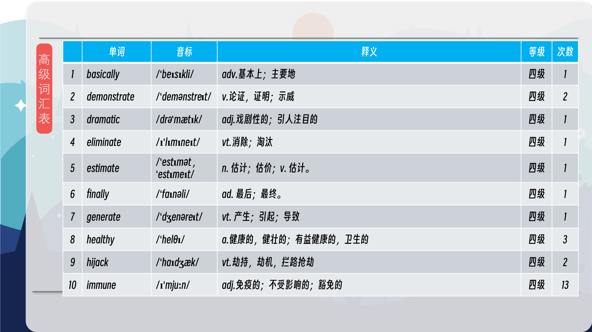
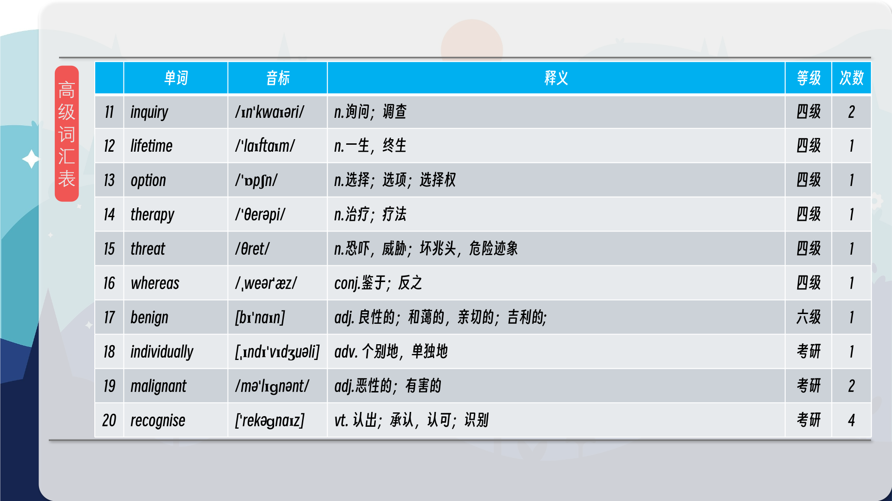
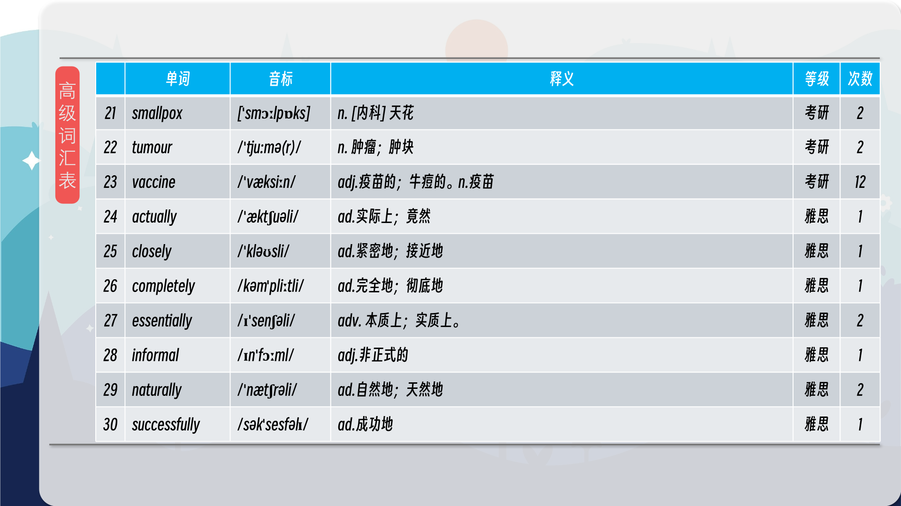

### 【英文脚本】
Neil
Hello. This is 6 Minute English from BBC Learning English. I’m Neil.
 
Beth
And I’m Beth. In our lifetime, 1 in 5 people will be affected by cancer, a disease where cells grow uncontrollably and cause tumours in the body. Tumours can be benign, meaning not cancerous, or malignant, meaning cancerous, and in 2022 there were an estimated 9.7 million deaths from malignant cancers worldwide. But in this programme, we’ll be focusing on some good news instead.
 
Neil
Vaccines are medicine which protect the human body by making it immune from a certain disease. Now, there’s been a sudden and important discovery – a breakthrough - in the development of a new vaccine called mRNA.
 
Beth
So, could a vaccine for cancer soon become a reality? That’s what we’ll be finding out, as well as learning some useful new words and phrases. And remember, if you like listening to 6 Minute English and want to read along at the same time, you can find a transcript for the programme on our website, bbclearningenglish.com.
 
Neil
Now I have a question for you, Beth. We’ve mentioned some of the most recent vaccines, but which disease did the first successful vaccine treat? Was it: a) flu? b) polio? or c) smallpox?
 
Beth
I’m going to say polio.
 
Neil
OK! Well, we’ll find out the correct answer at the end of the programme. You might wonder why the body’s immune system doesn’t fight cancer automatically. The reason is that cancer has clever ways of hiding from our natural defences, as Dr Meredith McKean, director of research at Tennessee Oncology, explained to BBC World Service programme, The Inquiry:
 
Dr Meredith McKean
There's been a number of studies that have demonstrated the different techniques that the cancer has developed to be able to put up signals or proteins, essentially, on the surface of the cancer cells, to tell the immune system, ‘Go away! There's nothing here to look at!’ And so it's actually been hijacking these receptors to essentially tell the immune system to kind of take the brakes off, and be more aggressive in fighting cancer. That's really allowed a breakthrough with immune therapy over the past decade.
 
Beth
Dr McKean says that a number of studies have demonstrated how cancer spreads. She uses the phrase a number of to mean several, but it also makes her statement more convincing, because of course several studies are better than just one.
 
Neil
Cancer cells switch off the immune system by pretending to be healthy cells. It’s like they’re saying Nothing to see here! – an informal phrase which can be used to encourage people to move or look away from something, either in a playful way, or to cover something up. For example, a police officer at a crime scene might say, “Nothing to see here!” to move people on.
 
Beth
So, in other words, cancer hijacks healthy cells – it takes control of something which doesn’t belong to it and uses it for its own advantage.
 
Neil
So, how would a vaccine change things? Well, existing treatments, like chemotherapy, aggressively target the cancer, but also attack healthy tissue, creating unpleasant side effects. New breakthrough vaccines, on the other hand, retrain the immune system to recognise cancer cells and eliminate those, and only those, naturally – even in patients with the disease already. Here’s, Professor Eduardo Sanchez, of the Anderson Cancer Center in Texas, explaining more to BBC World Service’s, The Inquiry:
 
Prof Eduardo Sanchez
Basically the cancer cells are telling the immune system, ‘Don't attack me, don't eat me’, right? The immune system has forgotten how to go about recognising those cancer cells, becoming blind to recognise those aberrations that cancer cells generate, and what we want to do with vaccines is to re-educate the immune system.
 
Beth
In cancer patients, the immune system is blind to cancerous growths – it completely fails to notice them or be aware of their danger, so the vaccine re- educates the immune system, or teaches it to behave, in a different way.
 
Neil
To recap, some cancer treatments work by unblocking our blocked natural defences, whereas vaccines retrain the immune system to find and attack cancer cells naturally. Because these two approaches are quite different, they can be used together and individually.
 
Beth
So, to answer my original question, Neil, a vaccine for cancer might not be too far away. But how about your question – isn’t it time you revealed the answer?
 
Neil
I asked which disease was first successfully treated by a vaccine?
 
Beth
And I said polio. Was I right?
 
Neil
You were wrong, I'm afraid. The correct option was C, which is smallpox. OK, let's recap the vocabulary we've learned in this programme, starting with breakthrough, a sudden, dramatic and important discovery.
 
Beth
A number of something means several, or many, and can add credibility to what you say.
 
Neil
The phrase, Nothing to see here! is used to discourage people from paying attention or looking too closely at something, or to move them away.
 
Beth
If you hijack something, you use something that doesn’t belong to you for your own benefit.
 
Neil
Being blind to something means failing to notice it or recognise it as a threat.
 
Beth
And finally, to re-educate means to teach somebody to think or behave in a new or different way. Once again our six minutes are up, but if you’re hungry for more, head over to our website, bbclearningenglish.com, where you can find the worksheet for this programme, and it has a quiz in it! Good luck and we’ll see you again soon. Bye for now!
 
Neil
Bye!
 

### 【中英文双语脚本】
Neil(尼尔)
I’m Neil.
你好。这是来自 BBC Learning English 的六分钟英语。我是 Neil。

Beth(贝丝)
And I’m Beth. In our lifetime, 1 in 5 people will be affected by cancer, a disease where cells grow uncontrollably and cause tumours in the body. Tumours can be benign, meaning not cancerous, or malignant, meaning cancerous, and in 2022 there were an estimated 9.7 million deaths from malignant cancers worldwide. But in this programme, we’ll be focusing on some good news instead.
我是贝丝。在我们的一生中，每 5 人中就有 1 人会受到癌症的影响，癌症是一种细胞不受控制地生长并导致体内肿瘤的疾病。肿瘤可以是良性的，即非癌性，也可以是恶性的，即癌性，到 2022 年，全球估计有 970 万人死于恶性癌症。但在这个节目中，我们将专注于一些好消息。

Neil(尼尔)
Vaccines are medicine which protect the human body by making it immune from a certain disease. Now, there’s been a sudden and important discovery – a breakthrough - in the development of a new vaccine called mRNA.
疫苗是通过使人体免受某种疾病的免疫来保护人体的药物。现在，在开发一种名为 mRNA 的新疫苗方面，出现了一个突然而重要的发现 —— 一个突破。

Beth(贝丝)
So, could a vaccine for cancer soon become a reality? That’s what we’ll be finding out, as well as learning some useful new words and phrases. And remember, if you like listening to 6 Minute English and want to read along at the same time, you can find a transcript for the programme on our website, bbclearningenglish.com.
那么，癌症疫苗会很快成为现实吗？这就是我们将要发现的，以及学习一些有用的新单词和短语。请记住，如果您喜欢听六分钟英语并想同时阅读，您可以在我们的网站 bbclearningenglish.com 上找到该节目的文字记录。

Neil(尼尔)
Now I have a question for you, Beth. We’ve mentioned some of the most recent vaccines, but which disease did the first successful vaccine treat? Was it: a) flu? b) polio? or c) smallpox?
现在我有一个问题要问你，贝丝。我们已经提到了一些最新的疫苗，但第一个成功的疫苗治疗了哪种疾病？是：a） 流感？b） 脊髓灰质炎？或 c） 天花？

Beth(贝丝)
I’m going to say polio.
我要说的是小儿麻痹症。

Neil(尼尔)
OK! Well, we’ll find out the correct answer at the end of the programme. You might wonder why the body’s immune system doesn’t fight cancer automatically. The reason is that cancer has clever ways of hiding from our natural defences, as Dr Meredith McKean, director of research at Tennessee Oncology, explained to BBC World Service programme, The Inquiry:
还行！好吧，我们将在节目结束时找出正确答案。您可能想知道为什么身体的免疫系统不自动对抗癌症。原因是癌症有巧妙的方式躲避我们的自然防御，正如田纳西州肿瘤学研究主任 Meredith McKean 博士向 BBC 世界服务节目 The Inquiry 解释的那样：

Dr Meredith McKean(MeredithMcKean博士)
There's been a number of studies that have demonstrated the different techniques that the cancer has developed to be able to put up signals or proteins, essentially, on the surface of the cancer cells, to tell the immune system, ‘Go away! There's nothing here to look at!’ And so it's actually been hijacking these receptors to essentially tell the immune system to kind of take the brakes off, and be more aggressive in fighting cancer. That's really allowed a breakthrough with immune therapy over the past decade.
有许多研究表明，癌症已经开发出不同的技术，能够发出信号或蛋白质，本质上是在癌细胞的表面，告诉免疫系统，'走开！这里没什么可看的！因此，它实际上是劫持了这些受体，基本上是告诉免疫系统放松刹车，在对抗癌症方面更加积极。这确实让免疫疗法在过去十年中取得了突破。

Beth(贝丝)
Dr McKean says that a number of studies have demonstrated how cancer spreads. She uses the phrase a number of to mean several, but it also makes her statement more convincing, because of course several studies are better than just one.
McKean 博士说，许多研究已经证明了癌症是如何扩散的。她使用短语 a number of 来表示几个，但这也使她的说法更有说服力，因为当然，几项研究总比一项好。

Neil(尼尔)
Cancer cells switch off the immune system by pretending to be healthy cells. It’s like they’re saying Nothing to see here! – an informal phrase which can be used to encourage people to move or look away from something, either in a playful way, or to cover something up. For example, a police officer at a crime scene might say, “Nothing to see here!” to move people on.
癌细胞通过假装是健康细胞来关闭免疫系统。就好像他们在说 Nothing to see here！– 一个非正式的短语，可以用来鼓励人们以俏皮的方式移动或移开某物，或者掩盖某物。例如，犯罪现场的警察可能会说，“这里没什么可看的！

Beth(贝丝)
So, in other words, cancer hijacks healthy cells – it takes control of something which doesn’t belong to it and uses it for its own advantage.
所以，换句话说，癌症劫持了健康的细胞 —— 它控制了不属于它的东西，并利用它为自己谋取利益。

Neil(尼尔)
So, how would a vaccine change things? Well, existing treatments, like chemotherapy, aggressively target the cancer, but also attack healthy tissue, creating unpleasant side effects. New breakthrough vaccines, on the other hand, retrain the immune system to recognise cancer cells and eliminate those, and only those, naturally – even in patients with the disease already. Here’s, Professor Eduardo Sanchez, of the Anderson Cancer Center in Texas, explaining more to BBC World Service’s, The Inquiry:
那么，疫苗将如何改变现状呢？好吧，现有的治疗方法，如化疗，积极地针对癌症，但也攻击健康组织，产生令人不快的副作用。另一方面，新的突破性疫苗重新训练免疫系统识别癌细胞并自然地消除这些细胞 —— 即使是已经患有这种疾病的患者。以下是德克萨斯州安德森癌症中心的爱德华多·桑切斯 （Eduardo Sanchez） 教授向 BBC 国际频道的 The Inquiry 解释的更多内容：

Prof Eduardo Sanchez(EduardoSanchez教授)
Basically the cancer cells are telling the immune system, ‘Don't attack me, don't eat me’, right? The immune system has forgotten how to go about recognising those cancer cells, becoming blind to recognise those aberrations that cancer cells generate, and what we want to do with vaccines is to re-educate the immune system.
基本上，癌细胞在告诉免疫系统，'不要攻击我，不要吃我'，对吧？免疫系统已经忘记了如何识别这些癌细胞，对识别癌细胞产生的那些畸变变得盲目，我们想用疫苗做的是重新教育免疫系统。

Beth(贝丝)
In cancer patients, the immune system is blind to cancerous growths – it completely fails to notice them or be aware of their danger, so the vaccine re- educates the immune system, or teaches it to behave, in a different way.
在癌症患者中，免疫系统对癌变的生长视而不见 —— 它完全没有注意到它们或意识到它们的危险，因此疫苗以不同的方式重新教育免疫系统或教它行为。

Neil(尼尔)
To recap, some cancer treatments work by unblocking our blocked natural defences, whereas vaccines retrain the immune system to find and attack cancer cells naturally. Because these two approaches are quite different, they can be used together and individually.
回顾一下，一些癌症治疗通过疏通我们受阻的自然防御来起作用，而疫苗则重新训练免疫系统以自然地发现和攻击癌细胞。由于这两种方法完全不同，因此它们可以一起使用，也可以单独使用。

Beth(贝丝)
So, to answer my original question, Neil, a vaccine for cancer might not be too far away. But how about your question – isn’t it time you revealed the answer?
所以，回答我最初的问题，Neil，癌症疫苗可能并不遥远。但是你的问题怎么样 —— 现在是不是该透露答案了？

Neil(尼尔)
I asked which disease was first successfully treated by a vaccine?
我问哪种疾病首先被疫苗成功治疗？

Beth(贝丝)
And I said polio. Was I right?
我说的是小儿麻痹症。我是对的吗？

Neil(尼尔)
You were wrong, I'm afraid. The correct option was C, which is smallpox. OK, let's recap the vocabulary we've learned in this programme, starting with breakthrough, a sudden, dramatic and important discovery.
恐怕你错了。正确的选项是 C，即天花。好，让我们回顾一下我们在这个课程中学到的词汇，从突破开始，一个突然的、戏剧性的和重要的发现。

Beth(贝丝)
A number of something means several, or many, and can add credibility to what you say.
许多事物意味着几个或许多，可以增加你所说的可信度。

Neil(尼尔)
The phrase, Nothing to see here! is used to discourage people from paying attention or looking too closely at something, or to move them away.
短语 Nothing to see here！用于阻止人们注意或过于仔细地观察某物，或将他们移开。

Beth(贝丝)
If you hijack something, you use something that doesn’t belong to you for your own benefit.
如果你劫持了什么东西，你就利用了不属于你的东西来为自己谋取利益。

Neil(尼尔)
Being blind to something means failing to notice it or recognise it as a threat.
对某事视而不见意味着没有注意到它或将其视为威胁。

Beth(贝丝)
And finally, to re-educate means to teach somebody to think or behave in a new or different way. Once again our six minutes are up, but if you’re hungry for more, head over to our website, bbclearningenglish.com, where you can find the worksheet for this programme, and it has a quiz in it! Good luck and we’ll see you again soon. Bye for now!
最后，再教育的意思是教某人以新的或不同的方式思考或行为。我们的六分钟又一次结束了，但如果您渴望更多，请前往我们的网站 bbclearningenglish.com，在那里您可以找到此程序的工作表，其中有一个测验！祝你好运，我们很快就会再次见到你。再见！

Neil(尼尔)
Bye!
再见！

### 【核心词汇】
#### breakthrough
sudden, dramatic and important discovery
突破
突然的、戏剧性的和重要的发现
The team finally achieved a breakthrough in their research after years of painstaking work.
经过多年的辛勤工作，该团队最终在研究中取得了突破。
#### a number of (something)
several or many; used to add credibility to what you are saying
许多
好几个或许多；用于增强你所说内容的可信度
A number of factors contributed to the company's success.
许多因素促成了公司的成功。
#### Nothing to see here!
used to encourage people to move or look away from something, or to stop them from paying it much attention
没什么好看的！
用于鼓励人们离开某物或转移视线，或阻止他们过多关注某事
"Nothing to see here!" said the police officer, trying to disperse the crowd.
“没什么好看的！”警察说，试图驱散人群。
#### hijack
take control of something that does not belong to you for your own advantage
劫持
为了自身的利益控制不属于你的东西
The terrorists attempted to hijack the plane.
恐怖分子试图劫持飞机。
#### blind to (something)
completely fail to notice or realise the threat of something
对……视而不见
完全没有注意到或意识到某事物的威胁
He was blind to the dangers of his actions.
他对自己的行为的危险视而不见。
#### re-educate
teach somebody to think or behave in a new or different way
再教育
教导某人以新的或不同的方式思考或行为
The government attempted to re-educate the population after the war.
战后政府试图对人民进行再教育。

在公众号里输入6位数字，获取【对话音频、英文文本、中文翻译、核心词汇和高级词汇表】电子档，6位数字【暗号】在文章的最后一张图片，如【220728】，表示22年7月28日这一期。公众号没有的文章说明还没有制作相关资料。年度合集在B站【六分钟英语】工房获取，每年共计300+文档，感谢支持！