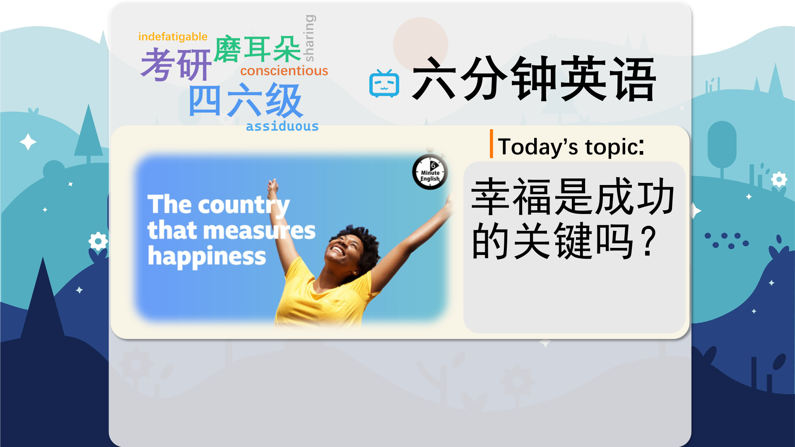

### 【英文脚本】
Neil
Hello. This is 6 Minute English from BBC Learning English. I’m Neil.
 
Pippa
And I’m Pippa. In this programme we’re talking about happiness. So, what makes you happy, Neil?
 
Neil
It makes me happy when I’m with a group of old friends and we’re having a good laugh. How about you, Pippa?
 
Pippa
Cats make me very happy. Especially if I see a cat on the street that I don’t know, and it lets me give it a little stroke. That always makes me happy.
 
Neil
I’m not surprised. That sounds great.
 
Pippa
So, happiness means different things to different people, but what’s for sure is that most people would like to be happy. And the small Himalayan kingdom of Bhutan has taken this to a new level with the idea of Gross National Happiness, or GNH.
 
Neil
We’ll be hearing more about Gross National Happiness and learning some useful new vocabulary soon, but first Pippa, I have a question for you. Of course, it’s not just the people of Bhutan who want to be happy. In fact, the United Nations has even announced an International Day of Happiness. But when is that? Is International Happiness Day: a) the 20th of March? b) the 20th of June? c) the 20th of November?
 
Pippa
I’m going to say the 20th of June, because it would be sunny in the UK.
 
Neil
OK, let’s find out if you're right at the end of the programme. Now, briefly, Gross National Happiness means preserving Bhutan’s natural environment and culture through sustainable and eco-friendly development. Bhutan’s government sees these goals as more important than growing the economy at any cost.
 
Pippa
For many years, Bhutan was closed to the outside world – the first foreign tourists arrived in 1974, and television was only introduced in 1999. The King of Bhutan wanted to modernise the country and give it the benefits of modern technology, but without damaging traditional culture, so he invited outside experts to develop the idea of Gross National Happiness. One expert was Dr Ha Vinh Tho, speaking here to Charmaine Cozier, presenter of BBC World Service programme, The Inquiry:
 
Dr Ha Vinh Tho
So, his idea was: ‘How could we modernise and open our country without losing its culture, its environment, and its very strong social fabric?’ Because Bhutan was one of the only countries in Asia that was never colonised therefore its culture is very intact and vibrant, mainly Buddhist culture. And so the idea was that Gross National Happiness should be the focus on all governmental decisions and policies.
 
Charmaine Cozier
So the wellbeing and happiness of citizens took centre stage.
 
Pippa
Bhutan has a strong social fabric meaning there are good relationships within communities and these hold society together.
 
Neil
Unlike other Asian countries, Bhutan was never colonised, so its Buddhist culture and traditions are intact – they’re complete and unspoiled.
 
Pippa
As a result, the happiness of Bhutan’s people took centre stage, it became the most important thing.
 
Neil
Bhutan’s emphasis on happiness has been admired around the world, but there have been problems too. One is the migration of Bhutanese workers to India and other countries in search of better paid jobs and opportunities, something known as the brain drain.
 
Pippa
So in 2023, the King of Bhutan announced a multi-million dollar project called, The Mindfulness City, a new Himalayan city built on spiritual and environmental principles, all powered by renewable energy.
 
Neil
Originally from Bhutan, Dr Lhawang Ugyel, is the project’s director and spoke with Charmaine Cozier for BBC World Service’s, The Inquiry:
 
Charmaine Cozier
The project is also about reversing Bhutan's brain drain.
 
Dr Lhawang Ugyel
The intention is to have locals run this whole Mindfulness City, so in that sense it's also to attract the migrants that have left, and in the process of having worked abroad, gained the extra skills, come back to the Mindfulness City and work.
 
Pippa
As well as being a futuristic eco-city, the Mindfulness City hopes to stop Bhutan’s brain drain by attracting workers back home to Bhutan. These local workers can then use the extra skills that they’ve learned abroad through upskilling. And upskilling is the process where workers’ skills are improved through training.
 
Neil
The idea of Gross National Happiness might sound unusual, but it’s interesting to see Bhutan balancing economic growth with the happiness of its people.
 
Pippa
Yes, that’s true – and it reminds me of your question, Neil…
 
Neil
Yes, I asked you what the date of International Happiness Day is?
 
Pippa
I said it was the 20th of June in the summer in the UK.
 
Neil
Well, maybe it’s better for people in the Southern hemisphere because it’s the 20th of March.
 
Pippa
Nice.
 
Neil
And if you got that answer right, why not try our interactive quiz which you’ll find on our website, bbclearningenglish.com! OK, let’s recap the vocabulary we’ve learned, starting with modernise, to make something more modern, for example through introducing technology.
 
Pippa
A country’s social fabric means the relationships which connect a community together.
 
Neil
The adjective intact means complete and undamaged.
 
Pippa
If something takes centre stage, it becomes more important than anything else.
 
Neil
A brain drain happens when large numbers of educated and skilled people leave their own country to live and work in another country where they can earn more money.
 
Pippa
And finally, upskilling means improving workers’ skills through training and experience. Once again, our six minutes are up. Goodbye for now!
 
Neil
Goodbye!
 

### 【中英文双语脚本】
Neil(尼尔)
I’m Neil.
你好。这是来自 BBC Learning English 的六分钟英语。我是 Neil。

Pippa(皮帕)
And I’m Pippa. In this programme we’re talking about happiness. So, what makes you happy, Neil?
我是 Pippa。在这个节目中，我们谈论的是幸福。那么，是什么让你快乐呢，尼尔？

Neil(尼尔)
It makes me happy when I’m with a group of old friends and we’re having a good laugh. How about you, Pippa?
当我和一群老朋友在一起，我们开怀大笑时，我很高兴。你呢，皮帕？

Pippa(皮帕)
Cats make me very happy. Especially if I see a cat on the street that I don’t know, and it lets me give it a little stroke. That always makes me happy.
猫让我非常高兴。特别是如果我在街上看到一只我不认识的猫，它让我轻轻抚摸它。这总是让我很高兴。

Neil(尼尔)
I’m not surprised. That sounds great.
我并不感到惊讶。这听起来不错。

Pippa(皮帕)
So, happiness means different things to different people, but what’s for sure is that most people would like to be happy. And the small Himalayan kingdom of Bhutan has taken this to a new level with the idea of Gross National Happiness, or GNH.
所以，快乐对不同的人意味着不同的事情，但可以肯定的是，大多数人都希望快乐。喜马拉雅山上的不丹王国通过国民幸福总值 （GNH） 的理念将其提升到一个新的水平。

Neil(尼尔)
We’ll be hearing more about Gross National Happiness and learning some useful new vocabulary soon, but first Pippa, I have a question for you. Of course, it’s not just the people of Bhutan who want to be happy. In fact, the United Nations has even announced an International Day of Happiness. But when is that? Is International Happiness Day: a) the 20th of March? b) the 20th of June? c) the 20th of November?
我们很快就会听到更多关于 Gross National Happiness 的信息，并学习一些有用的新词汇，但首先 Pippa，我有一个问题要问你。当然，不仅仅是不丹人民想要快乐。事实上，联合国甚至宣布了国际幸福日。但那是什么时候呢？国际幸福日是：a） 3 月 20 日吗？b） 6 月 20 日？c） 11 月 20 日？

Pippa(皮帕)
I’m going to say the 20th of June, because it would be sunny in the UK.
我要说的是 6 月 20 日，因为英国会阳光明媚。

Neil(尼尔)
OK, let’s find out if you're right at the end of the programme. Now, briefly, Gross National Happiness means preserving Bhutan’s natural environment and culture through sustainable and eco-friendly development. Bhutan’s government sees these goals as more important than growing the economy at any cost.
好的，让我们看看您是否在节目结束时。现在，简而言之，国民幸福总值意味着通过可持续和生态友好型发展来保护不丹的自然环境和文化。不丹政府认为这些目标比不惜一切代价发展经济更重要。

Pippa(皮帕)
For many years, Bhutan was closed to the outside world – the first foreign tourists arrived in 1974, and television was only introduced in 1999. The King of Bhutan wanted to modernise the country and give it the benefits of modern technology, but without damaging traditional culture, so he invited outside experts to develop the idea of Gross National Happiness. One expert was Dr Ha Vinh Tho, speaking here to Charmaine Cozier, presenter of BBC World Service programme, The Inquiry:
多年来，不丹一直与外界隔绝 —— 第一批外国游客于 1974 年抵达，而电视直到 1999 年才被引入。不丹国王希望使国家现代化，并赋予其现代技术的好处，但又不损害传统文化，因此他邀请外部专家来发展国民幸福总值的想法。其中一位专家是 Ha Vinh Tho 博士，他在这里与 BBC 世界服务节目 The Inquiry 的主持人 Charmaine Cozier 进行了交谈：

Dr Ha Vinh Tho(HaVinhTho医师)
So, his idea was: ‘How could we modernise and open our country without losing its culture, its environment, and its very strong social fabric?’ Because Bhutan was one of the only countries in Asia that was never colonised therefore its culture is very intact and vibrant, mainly Buddhist culture. And so the idea was that Gross National Happiness should be the focus on all governmental decisions and policies.
所以，他的想法是：'我们如何在不失去文化、环境和强大的社会结构的情况下实现国家的现代化和开放？因为不丹是亚洲唯一从未被殖民的国家之一，所以它的文化非常完整和充满活力，主要是佛教文化。因此，我们的想法是，国民幸福总值应该是所有政府决策和政策的重点。

Charmaine Cozier(查梅因·科齐尔)
So the wellbeing and happiness of citizens took centre stage.
因此，公民的福祉和幸福成为中心议题。

Pippa(皮帕)
Bhutan has a strong social fabric meaning there are good relationships within communities and these hold society together.
不丹拥有强大的社会结构，这意味着社区内部有良好的关系，这些关系将社会团结在一起。

Neil(尼尔)
Unlike other Asian countries, Bhutan was never colonised, so its Buddhist culture and traditions are intact – they’re complete and unspoiled.
与其他亚洲国家不同，不丹从未被殖民，因此其佛教文化和传统完好无损 —— 它们是完整且未受破坏的。

Pippa(皮帕)
As a result, the happiness of Bhutan’s people took centre stage, it became the most important thing.
因此，不丹人民的幸福成为中心，它成为最重要的事情。

Neil(尼尔)
Bhutan’s emphasis on happiness has been admired around the world, but there have been problems too. One is the migration of Bhutanese workers to India and other countries in search of better paid jobs and opportunities, something known as the brain drain.
不丹对幸福的重视受到了全世界的钦佩，但也存在问题。一个是不丹工人迁移到印度和其他国家，以寻找收入更高的工作和机会，这就是所谓的人才流失。

Pippa(皮帕)
So in 2023, the King of Bhutan announced a multi-million dollar project called, The Mindfulness City, a new Himalayan city built on spiritual and environmental principles, all powered by renewable energy.
因此，在 2023 年，不丹国王宣布了一项耗资数百万美元的项目，名为“正念之城”，这是一座基于精神和环境原则建造的新喜马拉雅城市，全部由可再生能源提供动力。

Neil(尼尔)
Originally from Bhutan, Dr Lhawang Ugyel, is the project’s director and spoke with Charmaine Cozier for BBC World Service’s, The Inquiry:
来自不丹的 Lhawang Ugyel 博士是该项目的主任，他与 BBC 国际频道的 Charmaine Cozier 进行了交谈， 调查.

Charmaine Cozier(查梅因·科齐尔)
The project is also about reversing Bhutan's brain drain.
该项目还旨在扭转不丹的人才流失。

Dr Lhawang Ugyel(LhawangUgyel医生)
The intention is to have locals run this whole Mindfulness City, so in that sense it's also to attract the migrants that have left, and in the process of having worked abroad, gained the extra skills, come back to the Mindfulness City and work.
目的是让当地人管理整个正念城市，所以从这个意义上说，这也是为了吸引已经离开的移民，他们在国外工作，获得了额外的技能，回到正念城市工作。

Pippa(皮帕)
As well as being a futuristic eco-city, the Mindfulness City hopes to stop Bhutan’s brain drain by attracting workers back home to Bhutan. These local workers can then use the extra skills that they’ve learned abroad through upskilling. And upskilling is the process where workers’ skills are improved through training.
除了是一个未来主义的生态城市外，正念之城还希望通过吸引工人回到不丹来阻止不丹的人才流失。然后，这些当地工人可以通过提升技能来使用他们在国外学到的额外技能。技能提升是通过培训提高工人技能的过程。

Neil(尼尔)
The idea of Gross National Happiness might sound unusual, but it’s interesting to see Bhutan balancing economic growth with the happiness of its people.
国民幸福总值的概念听起来可能很不寻常，但看到不丹平衡经济增长和人民幸福感是很有趣的。

Pippa(皮帕)
Yes, that’s true – and it reminds me of your question, Neil…
是的，这是真的 —— 这让我想起了你的问题，尼尔......

Neil(尼尔)
Yes, I asked you what the date of International Happiness Day is?
是的，我问你国际幸福日的日期是哪一天？

Pippa(皮帕)
I said it was the 20th of June in the summer in the UK.
我说那是英国夏天的 6 月 20 日。

Neil(尼尔)
Well, maybe it’s better for people in the Southern hemisphere because it’s the 20th of March.
嗯，也许这对南半球的人们更好，因为现在是 3 月 20 日。

Pippa(皮帕)
Nice.
好。

Neil(尼尔)
And if you got that answer right, why not try our interactive quiz which you’ll find on our website, bbclearningenglish.com! OK, let’s recap the vocabulary we’ve learned, starting with modernise, to make something more modern, for example through introducing technology.
如果您答对了，为什么不试试我们的互动测验，您可以在我们的网站上找到 bbclearningenglish.com！好，让我们回顾一下我们学到的词汇，从 modernize 开始，让一些东西更现代，例如通过引入技术。

Pippa(皮帕)
A country’s social fabric means the relationships which connect a community together.
一个国家的社会结构是指将一个社区联系在一起的关系。

Neil(尼尔)
The adjective intact means complete and undamaged.
形容词 intact 的意思是完整和未损坏。

Pippa(皮帕)
If something takes centre stage, it becomes more important than anything else.
如果某件事占据中心位置，它就变得比其他任何事情都重要。

Neil(尼尔)
A brain drain happens when large numbers of educated and skilled people leave their own country to live and work in another country where they can earn more money.
当大量受过教育和技能娴熟的人离开自己的国家到另一个可以赚更多钱的国家生活和工作时，就会发生人才流失。

Pippa(皮帕)
And finally, upskilling means improving workers’ skills through training and experience. Once again, our six minutes are up. Goodbye for now!
最后，技能提升意味着通过培训和经验来提高工人的技能。我们的六分钟又结束了。再见！

Neil(尼尔)
Goodbye!
再见！

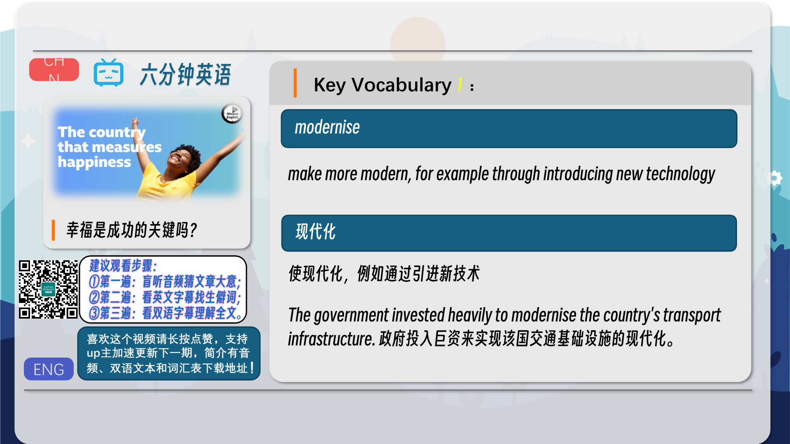
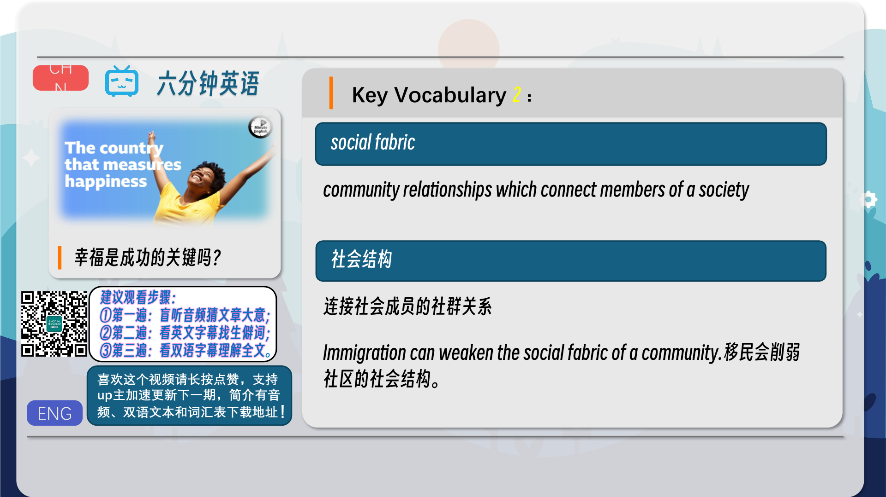
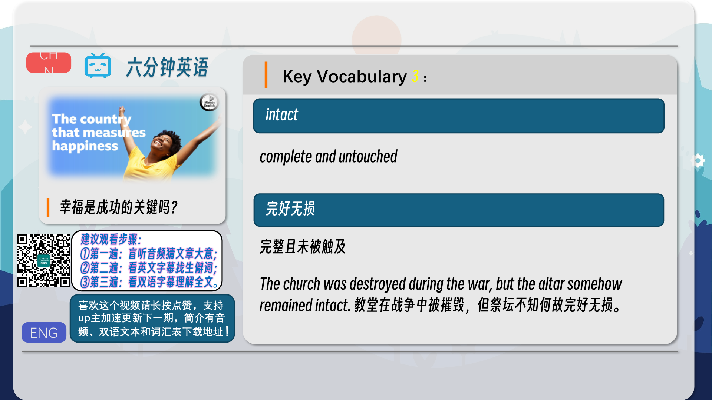
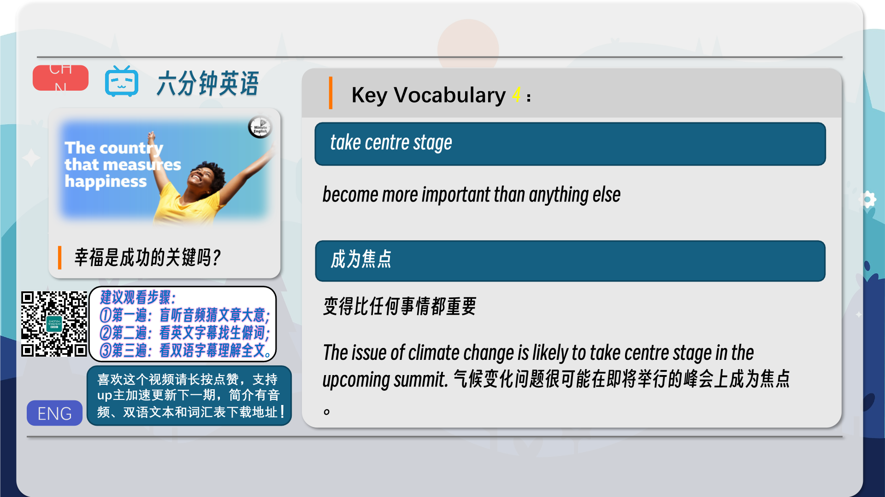
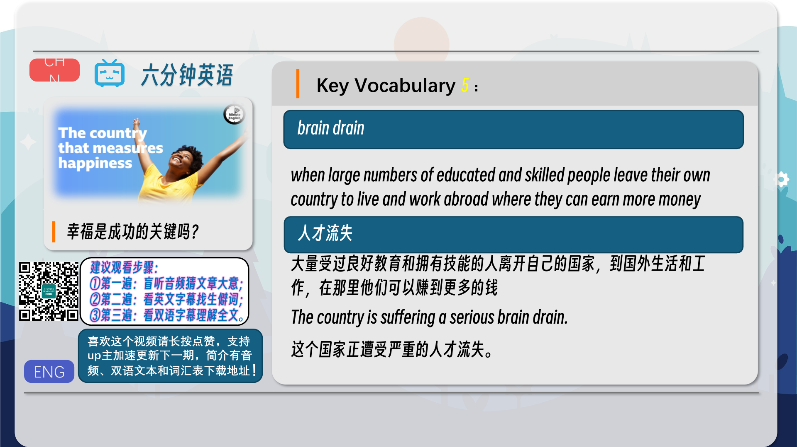
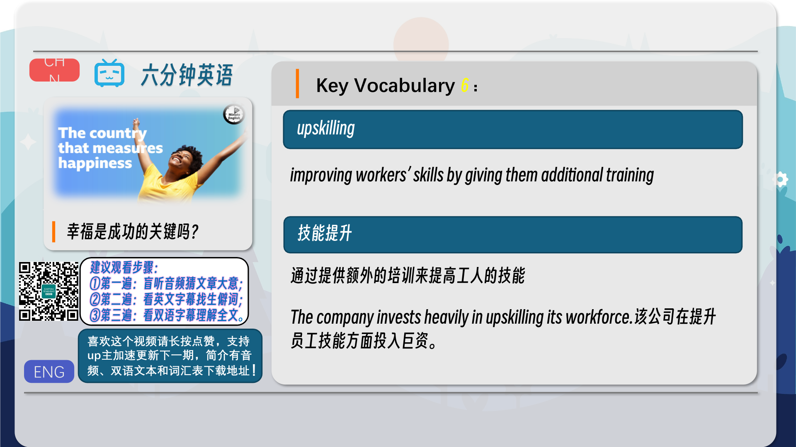
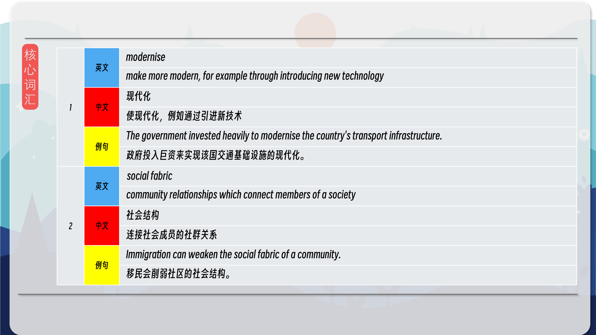
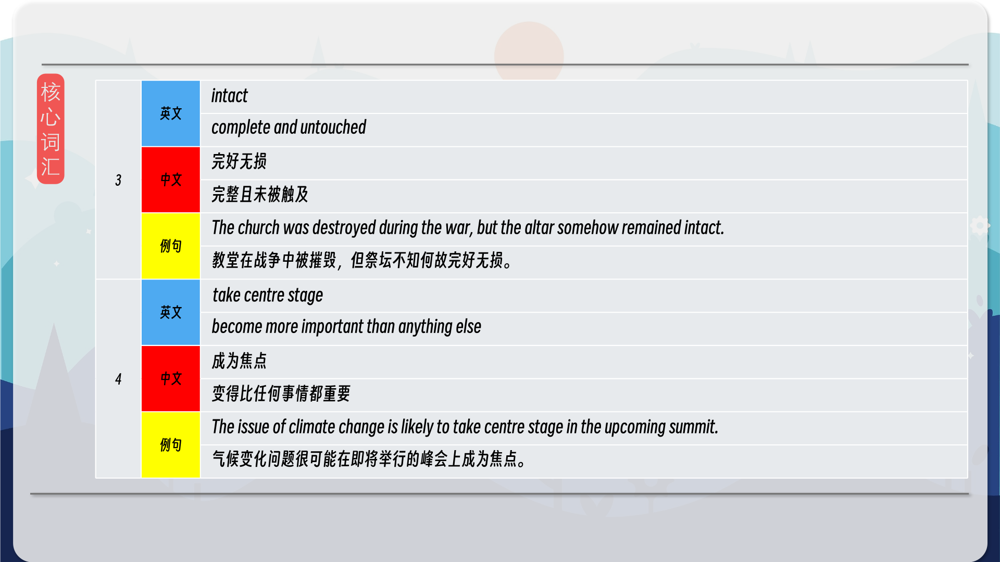
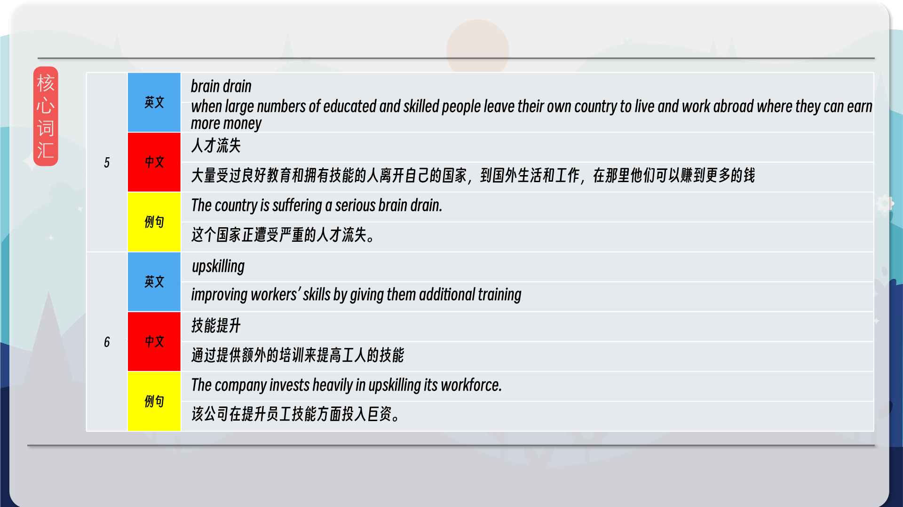
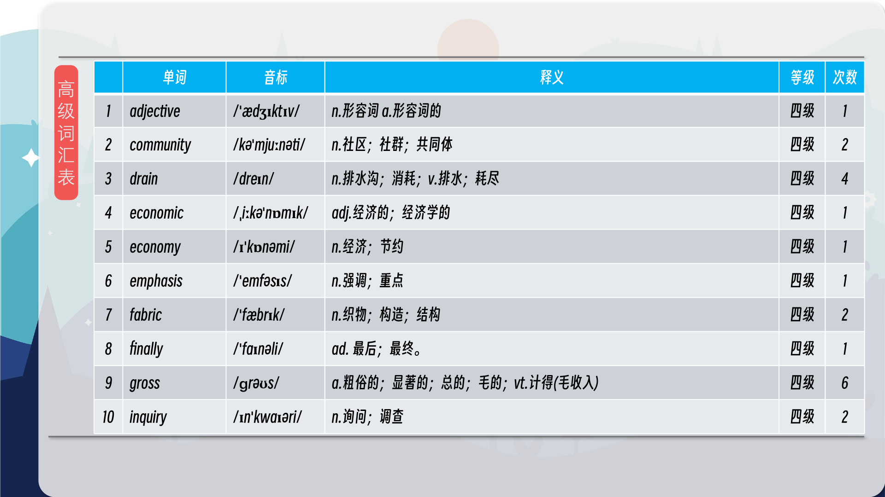
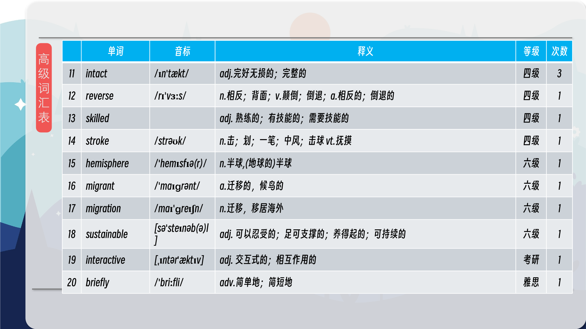
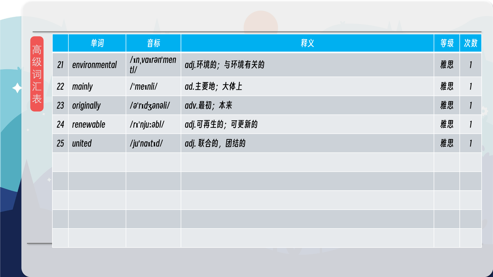

### 【核心词汇】
#### modernise
make more modern, for example through introducing new technology
现代化
使现代化，例如通过引进新技术
The government invested heavily to modernise the country's transport infrastructure.
政府投入巨资来实现该国交通基础设施的现代化。
#### social fabric
community relationships which connect members of a society
社会结构
连接社会成员的社群关系
Immigration can weaken the social fabric of a community.
移民会削弱社区的社会结构。
#### intact
complete and untouched
完好无损
完整且未被触及
The church was destroyed during the war, but the altar somehow remained intact.
教堂在战争中被摧毁，但祭坛不知何故完好无损。
#### take centre stage
become more important than anything else
成为焦点
变得比任何事情都重要
The issue of climate change is likely to take centre stage in the upcoming summit.
气候变化问题很可能在即将举行的峰会上成为焦点。
#### brain drain
when large numbers of educated and skilled people leave their own country to live and work abroad where they can earn more money
人才流失
大量受过良好教育和拥有技能的人离开自己的国家，到国外生活和工作，在那里他们可以赚到更多的钱
The country is suffering a serious brain drain.
这个国家正遭受严重的人才流失。
#### upskilling
improving workers’ skills by giving them additional training
技能提升
通过提供额外的培训来提高工人的技能
The company invests heavily in upskilling its workforce.
该公司在提升员工技能方面投入巨资。

在公众号里输入6位数字，获取【对话音频、英文文本、中文翻译、核心词汇和高级词汇表】电子档，6位数字【暗号】在文章的最后一张图片，如【220728】，表示22年7月28日这一期。公众号没有的文章说明还没有制作相关资料。年度合集在B站【六分钟英语】工房获取，每年共计300+文档，感谢支持！