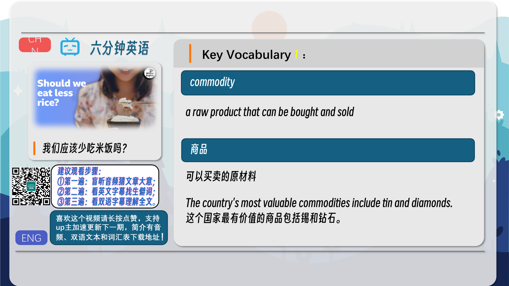
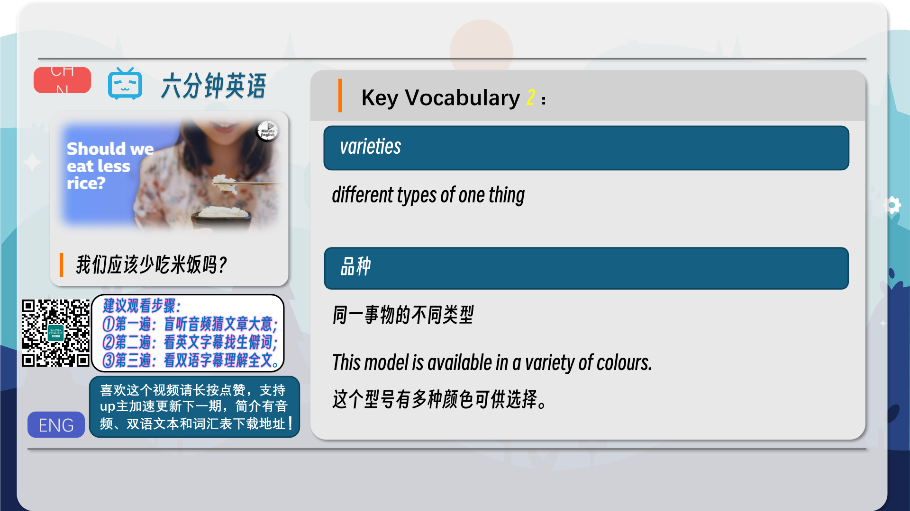
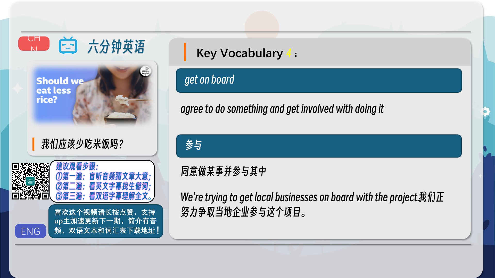
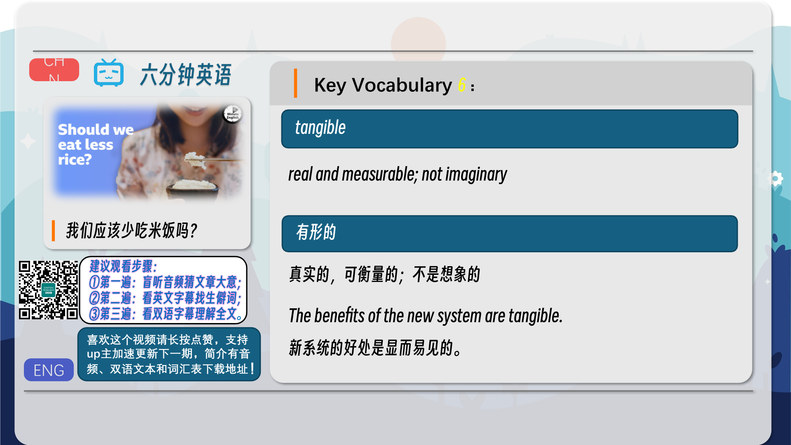
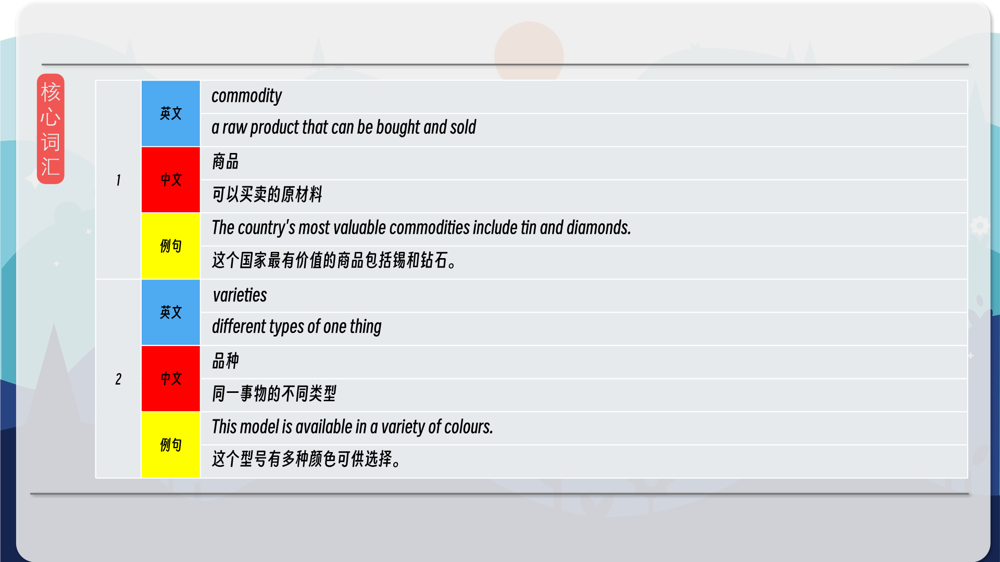
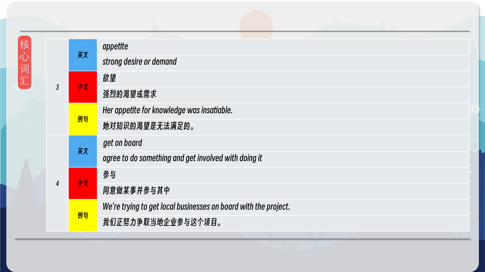
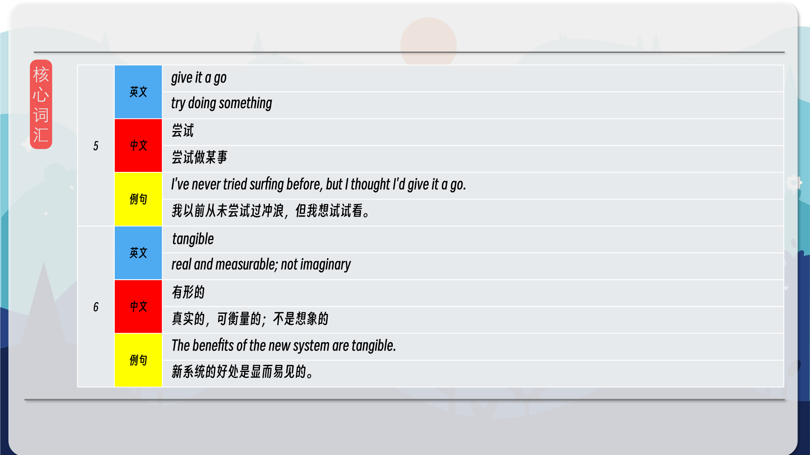
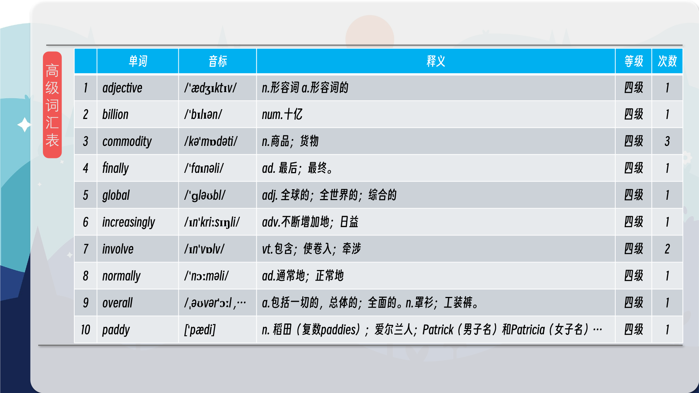
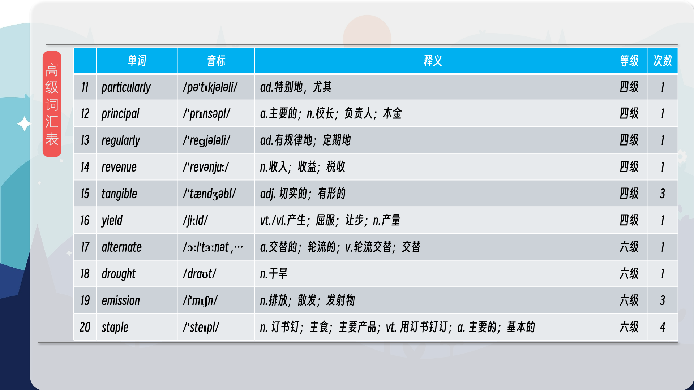
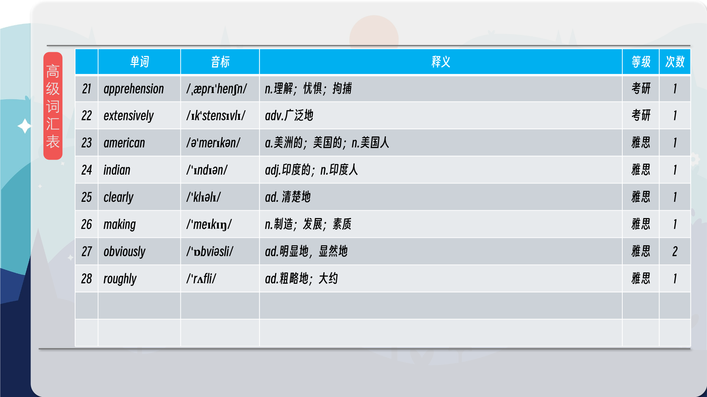

### 【英文脚本】
Neil
Hello. This is 6 Minute English from BBC Learning English. I’m Neil.

Beth
And I’m Beth. Neil, what type of foods do you often eat?

Neil
Well, basic things that fill me up – that's sort of bread, potatoes.

Beth
Well, food like this, which is regularly eaten by many people, is known as a staple. In Britain, bread is a popular staple, but for large parts of the world there’s another food which is number one: rice.

Neil
That’s right. Over half the world’s population eats rice as the staple food, especially in Asia. But rice is a very ‘thirsty’ crop which needs lots of water to grow, and this is becoming a problem because of droughts and flooding caused by climate change.

Beth
In this programme, we’ll be hearing about a pioneering new technique helping farmers to grow rice in the face of a changing climate. As usual, we’ll be learning some useful new words and phrases, and remember you can find all the vocabulary from this programme on our website, bbclearningenglish.com.

Neil
But first I have a question for you, Beth. Just now I mentioned that rice is a very ‘thirsty’ crop – so how much water is needed to grow one kilogram of rice? Is it: a) 1,000 to 3,000 litres? b) 3,000 to 5,000 litres? or, c) 5,000 to 7,000 litres?

Beth
I'm going to say c) 5,000 to 7,000 litres.

Neil
Well, we’ll find out the correct answer at the end of the programme. Dr Yvonne Pinto is Director General of the International Rice Research Institute, or IRRI for short, based in the Philippines. Here she explains more about the global popularity of rice to BBC World Service programme, The Food Chain:

Dr Yvonne Pinto
Between 50 and 56 percent of the world's population rely on rice as the principal staple. Now, that's roughly about four billion people, and it is one of those commodities that is grown really extensively, particularly in South Asia and Southeast Asia. But increasingly the appetite for it is growing in continents like Africa, and of course there are also Latin American and European rice varieties.

Beth
Rice is a commodity, a produce that can be bought and sold. Like other crops, rice has varieties – different types, for example brown rice, long-grained rice or basmati. Much of the research into rice today is focused on making new varieties that can adapt to the changing environment and grow in conditions of either too much or too little water.

Neil
Over half the world’s population eats rice and there’s a growing demand in Africa and Europe too, so clearly there’s an appetite, a strong desire, for rice worldwide.

Beth
So, is it possible to grow rice in a more eco-friendly way? Jean-Philippe Laborde, director of rice company, Tilda, thinks the answer lies in a new growing technique called Alternate Wet Drying, or AWD for short.

Neil
To grow rice, farmers go through cycles of flooding their fields, or paddies, which then dry out and need to be flooded again. With AWD, measuring pipes are placed 15cm underground so that farmers can check water levels at any part of the field. Normally, rice needs 25 cycles of flooding and drying out to grow, but using AWD this is reduced to 20 cycles, saving farmers water and reducing methane emissions. Here’s Jean-Philippe Laborde, telling Ruth Alexander, presenter of BBC World Service’s, The Food Chain, how he began his AWD experiment with farmers in India:

Jean-Philippe Laborde
We've got, last year, 1,268 farmers on board applying this AWD technique to reduce the overall methane emission.

Ruth Alexander
And how did you persuade those farmers to give it a go?

Jean-Philippe Laborde
That was quite challenging because obviously the main challenge is, for farmers, the apprehension to lose revenues. They need to see tangible results at the end of the crop… that they're getting obviously something better.

Neil
Many Indian farmers got on board with Jean-Phillipe’s experiment. If you get on board with something, you agree to a plan of action and get involved. In other words, you give it a go – you try doing something to see if it works.

Beth
As it turned out, the new technique produced tangible results, results which are real and measurable. Using AWD, the amounts of water and electricity needed to grow rice decreased, methane gas emissions reduced, and on top of that, the amount of rice yielded increased… Right, Neil, isn’t it time you revealed the answer to your question?

Neil
I asked how many litres of water are needed to grow just 1 kilogram of rice, and the answer was 3,000 to 5,000 litres so thirsty, but not as thirsty as you thought. OK, let’s recap the vocabulary we’ve learned in this programme, starting with commodity, a product, like rice, that can be bought and sold.

Beth
Varieties of something are different types of it.

Neil
If there’s an appetite for something, there’s a strong desire or demand for it.

Beth
If you get on board with an idea or a plan, you agree to do something and get involved with doing it.

Neil
To give it a go means to try doing something.

Beth
And finally, the adjective tangible means real and measurable. Once again our six minutes are up. If you’ve enjoyed this programme, why not try practising the new vocabulary you’ve learned with our worksheet – it’s available to download now from our website, bbclearningenglish.com… and you could also try out the quiz while you’re there! Goodbye for now!

Neil
Bye!

### 【中英文双语脚本】
Neil(尼尔)
I’m Neil.
你好。这是来自 BBC Learning English 的六分钟英语。我是 Neil。

Beth(贝丝)
And I’m Beth. Neil, what type of foods do you often eat?
我是贝丝。Neil，您经常吃什么类型的食物？

Neil(尼尔)
Well, basic things that fill me up – that's sort of bread, potatoes.
嗯，让我吃饱的基本东西 —— 那种面包、土豆。

Beth(贝丝)
Well, food like this, which is regularly eaten by many people, is known as a staple. In Britain, bread is a popular staple, but for large parts of the world there’s another food which is number one: rice.
嗯，像这样很多人经常吃的食物，被称为主食。在英国，面包是一种流行的主食，但对于世界大部分地区来说，还有另一种食物是第一大食物：米饭。

Neil(尼尔)
That’s right. Over half the world’s population eats rice as the staple food, especially in Asia. But rice is a very ‘thirsty’ crop which needs lots of water to grow, and this is becoming a problem because of droughts and flooding caused by climate change.
没错。世界上超过一半的人口以大米为主食，尤其是在亚洲。但水稻是一种非常“缺水”的作物，需要大量的水才能生长，由于气候变化造成的干旱和洪水，这正在成为一个问题。

Beth(贝丝)
In this programme, we’ll be hearing about a pioneering new technique helping farmers to grow rice in the face of a changing climate. As usual, we’ll be learning some useful new words and phrases, and remember you can find all the vocabulary from this programme on our website, bbclearningenglish.com.
在本节目中，我们将听到一项开创性的新技术，该技术帮助农民在面对不断变化的气候时种植水稻。像往常一样，我们将学习一些有用的新单词和短语，请记住，您可以在我们的网站上找到该程序的所有词汇，bbclearningenglish.com。

Neil(尼尔)
But first I have a question for you, Beth. Just now I mentioned that rice is a very ‘thirsty’ crop – so how much water is needed to grow one kilogram of rice? Is it: a) 1,000 to 3,000 litres? b) 3,000 to 5,000 litres? or, c) 5,000 to 7,000 litres?
但首先我有一个问题要问你，贝丝。刚才我提到水稻是一种非常“口渴”的作物 —— 那么种植一公斤水需要多少水呢？是：a） 1,000 到 3,000 升吗？b） 3,000 至 5,000 升？或者，c） 5,000 至 7,000 升？

Beth(贝丝)
I'm going to say c) 5,000 to 7,000 litres.
我要说的是 c） 5,000 到 7,000 升。

Neil(尼尔)
Well, we’ll find out the correct answer at the end of the programme. Dr Yvonne Pinto is Director General of the International Rice Research Institute, or IRRI for short, based in the Philippines. Here she explains more about the global popularity of rice to BBC World Service programme, The Food Chain:
好吧，我们将在节目结束时找出正确答案。Yvonne Pinto 博士是位于菲律宾的国际水稻研究所（简称 IRRI）的总干事。在这里，她向 BBC 世界服务节目《食物链》解释了更多关于大米在全球流行的情况：

Dr Yvonne Pinto(YvonnePinto医师)
Between 50 and 56 percent of the world's population rely on rice as the principal staple. Now, that's roughly about four billion people, and it is one of those commodities that is grown really extensively, particularly in South Asia and Southeast Asia. But increasingly the appetite for it is growing in continents like Africa, and of course there are also Latin American and European rice varieties.
世界上 50% 到 56% 的人口以大米为主要主食。现在，大约有 40 亿人，它是真正广泛种植的商品之一，尤其是在南亚和东南亚。但在非洲等大陆，人们对它的需求越来越大，当然也有拉丁美洲和欧洲的大米品种。

Beth(贝丝)
Rice is a commodity, a produce that can be bought and sold. Like other crops, rice has varieties – different types, for example brown rice, long-grained rice or basmati. Much of the research into rice today is focused on making new varieties that can adapt to the changing environment and grow in conditions of either too much or too little water.
大米是一种商品，一种可以买卖的产品。与其他作物一样，大米也有多种类型，例如糙米、长粒米或印度樟米。今天对水稻的大部分研究都集中在培育能够适应不断变化的环境并在水过多或过少的条件下生长的新品种。

Neil(尼尔)
Over half the world’s population eats rice and there’s a growing demand in Africa and Europe too, so clearly there’s an appetite, a strong desire, for rice worldwide.
世界上超过一半的人口吃大米，非洲和欧洲的需求也在不断增长，因此很明显，全世界对大米都有胃口和强烈的愿望。

Beth(贝丝)
So, is it possible to grow rice in a more eco-friendly way? Jean-Philippe Laborde, director of rice company, Tilda, thinks the answer lies in a new growing technique called Alternate Wet Drying, or AWD for short.
那么，是否有可能以更环保的方式种植水稻呢？大米公司 Tilda 的董事 Jean-Philippe Laborde 认为，答案在于一种称为交替湿式干燥（简称 AWD）的新种植技术。

Neil(尼尔)
To grow rice, farmers go through cycles of flooding their fields, or paddies, which then dry out and need to be flooded again. With AWD, measuring pipes are placed 15cm underground so that farmers can check water levels at any part of the field. Normally, rice needs 25 cycles of flooding and drying out to grow, but using AWD this is reduced to 20 cycles, saving farmers water and reducing methane emissions. Here’s Jean-Philippe Laborde, telling Ruth Alexander, presenter of BBC World Service’s, The Food Chain, how he began his AWD experiment with farmers in India:
为了种植水稻，农民会经历淹没田地或稻田的循环，然后稻田干涸，需要再次被淹没。使用 AWD 时，测量管被放置在地下 15 厘米处，以便农民可以检查田地任何部分的水位。通常，水稻需要 25 次洪水和干燥循环才能生长，但使用 AWD 可以减少到 20 次循环，从而为农民节省用水并减少甲烷排放。这是让-菲利普·拉博德 （Jean-Philippe Laborde） 告诉 BBC 国际频道《食物链》的主持人露丝·亚历山大 （Ruth Alexander） 他是如何开始对印度农民进行 AWD 实验的：

Jean-Philippe Laborde(让-菲利普·拉博德)
We've got, last year, 1,268 farmers on board applying this AWD technique to reduce the overall methane emission.
去年，我们有 1,268 名农民应用了这种 AWD 技术来减少甲烷总排放量。

Ruth Alexander(露丝·亚历山大)
And how did you persuade those farmers to give it a go?
您是如何说服那些农民试一试的？

Jean-Philippe Laborde(让-菲利普·拉博德)
That was quite challenging because obviously the main challenge is, for farmers, the apprehension to lose revenues. They need to see tangible results at the end of the crop… that they're getting obviously something better.
这相当具有挑战性，因为显然，对于农民来说，主要挑战是担心失去收入。他们需要在作物结束时看到切实的结果......他们显然得到了更好的东西。

Neil(尼尔)
Many Indian farmers got on board with Jean-Phillipe’s experiment. If you get on board with something, you agree to a plan of action and get involved. In other words, you give it a go – you try doing something to see if it works.
许多印度农民都加入了让-菲利普的实验。如果您参与某事，即表示您同意行动计划并参与其中。换句话说，你试一试 – 你尝试做一些事情，看看它是否有效。

Beth(贝丝)
As it turned out, the new technique produced tangible results, results which are real and measurable. Using AWD, the amounts of water and electricity needed to grow rice decreased, methane gas emissions reduced, and on top of that, the amount of rice yielded increased… Right, Neil, isn’t it time you revealed the answer to your question?
事实证明，新技术产生了切实的结果，结果是真实且可衡量的。使用 AWD，种植水稻所需的水和电量减少，甲烷气体排放量减少，最重要的是，水稻产量增加......对，Neil，现在是不是该透露你问题的答案了？

Neil(尼尔)
I asked how many litres of water are needed to grow just 1 kilogram of rice, and the answer was 3,000 to 5,000 litres so thirsty, but not as thirsty as you thought. OK, let’s recap the vocabulary we’ve learned in this programme, starting with commodity, a product, like rice, that can be bought and sold.
我问种植 1 公斤水需要多少升水，答案是 3,000 到 5,000 升水，非常口渴，但并不像你想象的那么口渴。好，让我们回顾一下我们在这个程序中学到的词汇，从商品开始，一种可以买卖的产品，比如大米。

Beth(贝丝)
Varieties of something are different types of it.
某物的种类是它的不同类型的。

Neil(尼尔)
If there’s an appetite for something, there’s a strong desire or demand for it.
如果对某样东西有胃口，就会有强烈的愿望或需求。

Beth(贝丝)
If you get on board with an idea or a plan, you agree to do something and get involved with doing it.
如果你同意一个想法或计划，你就同意做某事并参与其中。

Neil(尼尔)
To give it a go means to try doing something.
To give it a go 的意思是尝试做某事。

Beth(贝丝)
And finally, the adjective tangible means real and measurable. Once again our six minutes are up. If you’ve enjoyed this programme, why not try practising the new vocabulary you’ve learned with our worksheet – it’s available to download now from our website, bbclearningenglish.com… and you could also try out the quiz while you’re there! Goodbye for now!
最后，形容词 tangible 的意思是真实和可衡量的。我们的六分钟又结束了。如果您喜欢这个程序，为什么不尝试通过我们的工作表练习您学到的新词汇 - 现在可以从我们的网站下载，bbclearningenglish.com......你也可以在那里尝试这个测验！再见！

Neil(尼尔)
Bye!
再见！

### 【核心词汇】
#### commodity
a raw product that can be bought and sold
商品
可以买卖的原材料
The country's most valuable commodities include tin and diamonds.
这个国家最有价值的商品包括锡和钻石。
#### varieties
different types of one thing
品种
同一事物的不同类型
This model is available in a variety of colours.
这个型号有多种颜色可供选择。
#### appetite
strong desire or demand
欲望
强烈的渴望或需求
Her appetite for knowledge was insatiable.
她对知识的渴望是无法满足的。
#### get on board
agree to do something and get involved with doing it
参与
同意做某事并参与其中
We're trying to get local businesses on board with the project.
我们正努力争取当地企业参与这个项目。
#### give it a go
try doing something
尝试
尝试做某事
I've never tried surfing before, but I thought I'd give it a go.
我以前从未尝试过冲浪，但我想试试看。
#### tangible
real and measurable; not imaginary
有形的
真实的，可衡量的；不是想象的
The benefits of the new system are tangible.
新系统的好处是显而易见的。

在公众号里输入6位数字，获取【对话音频、英文文本、中文翻译、核心词汇和高级词汇表】电子档，6位数字【暗号】在文章的最后一张图片，如【220728】，表示22年7月28日这一期。公众号没有的文章说明还没有制作相关资料。年度合集在B站【六分钟英语】工房获取，每年共计300+文档，感谢支持！