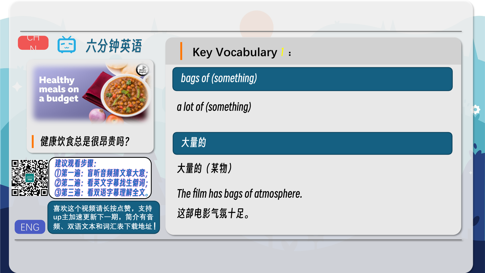
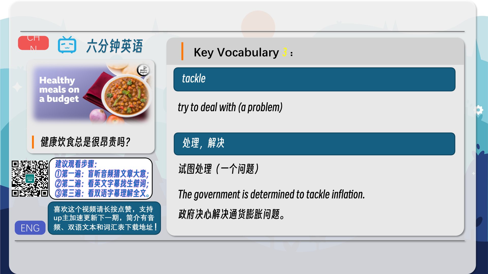
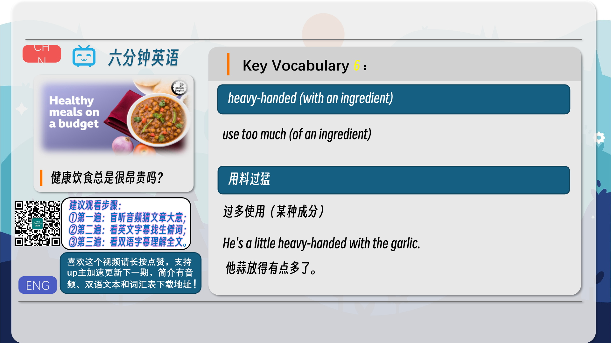
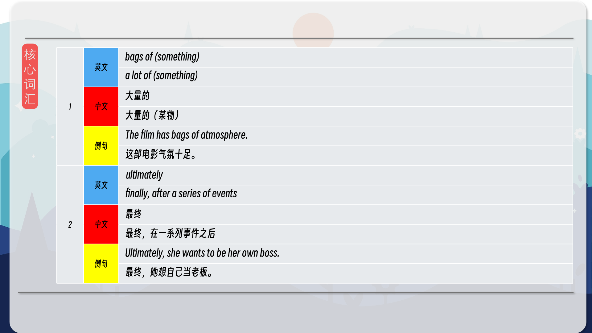
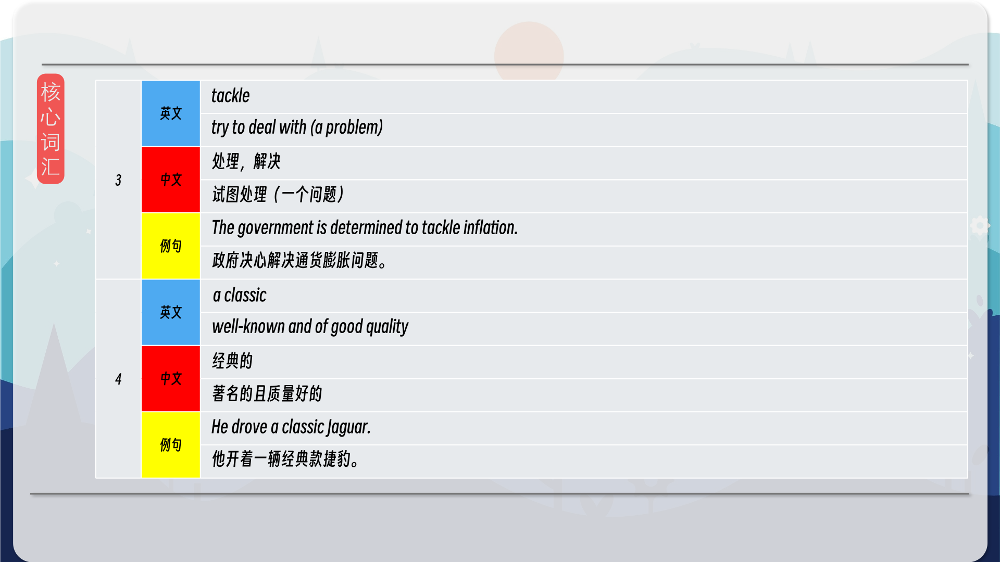
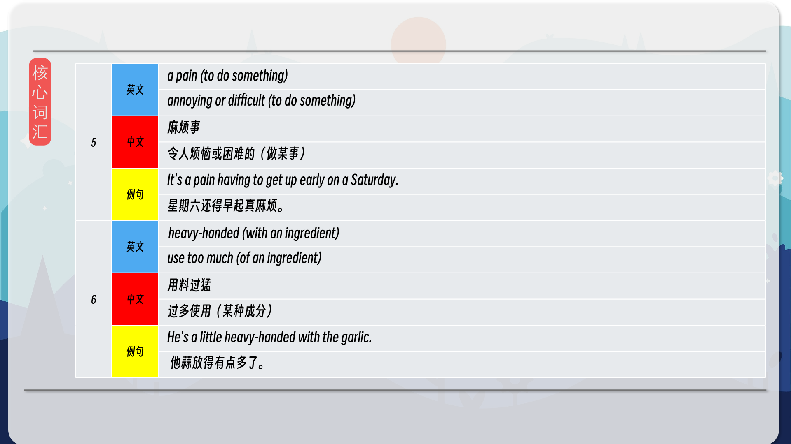
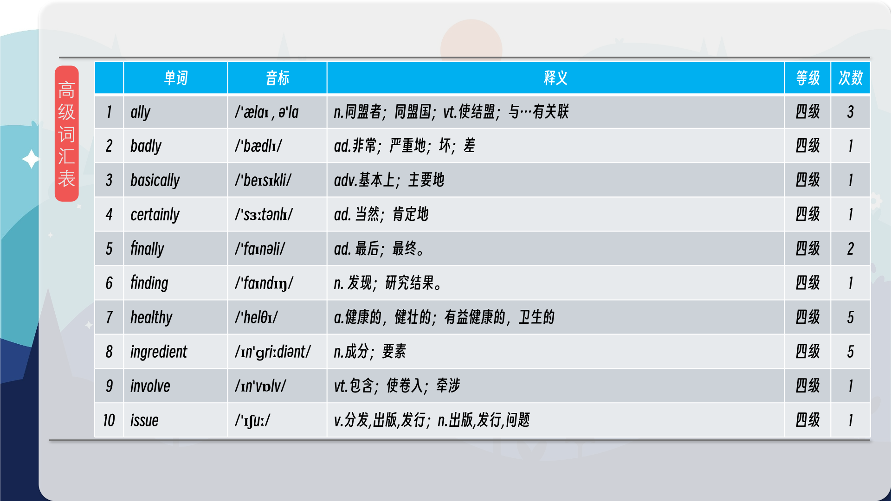
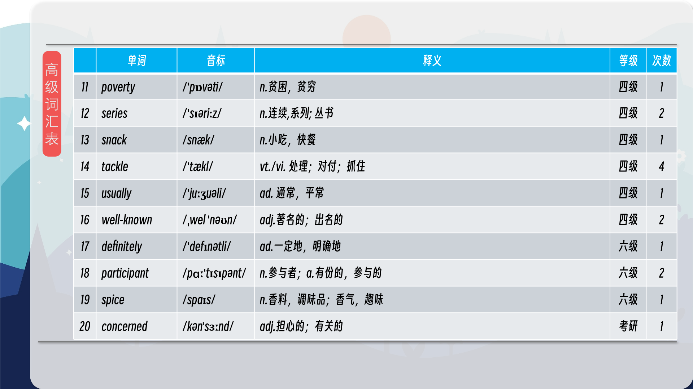
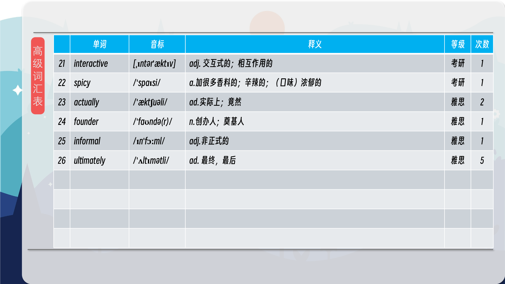

### 【英文脚本】
Pippa
Hello. This is 6 Minute English from BBC Learning English. I'm Pippa.
 
Georgie
And I'm Georgie. In this programme, we're talking about saving money on food. Pippa, are you good at saving money on your food shop?
 
Pippa
I think I'm quite good. I plan what I like to cook so I don't waste money in the supermarket. How about you, Georgie?
 
Georgie
I'm not very good. I usually go to the supermarket when I'm hungry, so I end up buying lots of snacks.
 
Pippa
Oh, that's a terrible idea. Well, in this programme we'll be learning about one way to save money on the food we eat. But first, I've got a question for you, Georgie. The most expensive restaurant in the world is thought to be a restaurant called Sublimotion in Ibiza, which only has 12 customers each night. But how much in euros is a meal per person at the restaurant? a) €650 b) €1,650 c) €2,650
 
Georgie
The most expensive… I'll go with c) €2,650.
 
Pippa
Well, we'll find out the answer at the end of the programme. Now, food in the UK is getting more expensive, as it has been in many parts of the world, and some people are struggling to afford their food shopping.
 
Georgie
But BBC World Service programme, People Fixing the World, has been finding out about a project called ‘Bags of Taste’ which helps people save money on their food shopping and improve their diet at the same time. Bags of something is an informal way to say a lot of something.
 
Pippa
The founder of Bags of Taste, Alicia Weston, became concerned that people in the UK with less money found it difficult to afford a healthy diet.
 
Alicia Weston
People in poverty are eating the worst diets and they are getting sicker younger. And we know that diets are the single largest cause of health inequalities in the UK.
 
Georgie
Alicia found that people didn't know how to cook the kinds of meals they'd like to eat, and they couldn't afford to experiment. Imagine spending lots of money on ingredients and then wasting them by cooking them badly or burning the food. People also thought making healthy food would be too expensive and take too much time.
 
Alicia Weston
So ultimately, we've been able to come up with a programme that basically can tackle all of these issues. So what we do now is we deliver all of the ingredients to their door, because ultimately, behaviour change starts with actually changing your behaviour at home.
 
Pippa
Alicia says that ultimately, she's been able to come up with a solution to help people save money on healthy food. We can use the adverb ultimately to mean finally, after a series of events have happened.
 
Georgie
Alicia wants to tackle the things that stop people eating healthy food on a budget. If you tackle a problem, you try to deal with it. Alicia's solution involves delivering ingredients and recipes to people and then using a WhatsApp group to talk to participants. Each WhatsApp group has a mentor who shares cooking tips and advice.
 
Pippa
To give you an idea of how this works, the team at People Fixing the World read out some of the messages on one of the 'Bags of Taste' WhatsApp chats.
 
Amy, mentor
Remember to put the fridge bag in the fridge. Can we aim to cook recipe one by Tuesday evening? Our first recipe, chana masala is a classic. It needs an onion, which can be a pain to chop. So, try our way. [video posted]
 
Ally
Love this method [chef emoji]. First time I've chopped an onion like this and it's so neat and easy.
 
Georgia
I'm going to cook mine tomorrow. Looking forward to it.
 
Ally
I've finished making my chana masala. I was a bit too heavy-handed with the chilli. My husband likes a lot of spice. So, I'd reduce that next time.
 
Georgie
The mentor in the group, Amy, describes the recipe for chana masala as a classic. We call something a classic to say that it is well-known and of good quality. We can also describe a particular book, film or song as a classic.
 
Pippa
Amy sends a video to show a technique for cutting onions, which she describes as a pain to chop. If something is a pain to do, it is difficult or annoying to do.
 
Georgie
One of the participants, Ally, said that when she made the chana masala, she was a bit heavy-handed with the chilli. If you are heavy-handed with an ingredient, you use too much of it, and so Ally's chana masala was very spicy!
 
Pippa
Bags of Taste helps people learn new recipes and cook healthy food without spending too much money. It's certainly a lot cheaper than a meal at the restaurant in my question, Georgie. I asked you how much it costs for a meal at Sublimotion, thought to be the most expensive restaurant in the world.
 
Georgie
Yes, I said a meal was €2,650.
 
Pippa
Well, you were wrong. It's actually €1,650, but I think that's still pretty expensive.
 
Georgie
It definitely is. OK. Let's recap the vocabulary we've learned, starting with bags of, which means a lot of something.
 
Pippa
We can use the adverb ultimately to say finally, after a series of events.
 
Georgie
If you tackle a problem, you try to deal with it and find a solution.
 
Pippa
If we describe something, like a recipe, as a classic, we mean it's well-known and of good quality.
 
Georgie
If something is a pain to do, it is annoying or difficult to do.
 
Pippa
And if you are heavy-handed with an ingredient, you use too much of it. For example, I made some soup the other day and I was a bit heavy-handed with the salt – it tasted disgusting!
 
Georgie
Oh, that's not very good! OK, once again, our 6 minutes are up. But you can test what you've learned with the interactive quiz on our website. Visit bbclearningenglish.com.
 
Pippa
Bye for now.
 
Georgie
Bye!
 

### 【中英文双语脚本】
Pippa(皮帕)
I'm Pippa.
你好。这是来自 BBC Learning English 的六分钟英语。我是 Pippa。

Georgie(乔治)
And I'm Georgie. In this programme, we're talking about saving money on food. Pippa, are you good at saving money on your food shop?
我是 Georgie。在这个计划中，我们谈论的是节省食物费用。Pippa，你擅长在食品店省钱吗？

Pippa(皮帕)
I think I'm quite good. I plan what I like to cook so I don't waste money in the supermarket. How about you, Georgie?
我觉得我挺好的。我计划我喜欢做什么，这样我就不会在超市浪费钱。你呢，Georgie？

Georgie(乔治)
I'm not very good. I usually go to the supermarket when I'm hungry, so I end up buying lots of snacks.
我不是很好。我通常在饿的时候去超市，所以我最终买了很多零食。

Pippa(皮帕)
Oh, that's a terrible idea. Well, in this programme we'll be learning about one way to save money on the food we eat. But first, I've got a question for you, Georgie. The most expensive restaurant in the world is thought to be a restaurant called Sublimotion in Ibiza, which only has 12 customers each night. But how much in euros is a meal per person at the restaurant? a) €650 b) €1,650 c) €2,650
哦，这真是个糟糕的主意。好吧，在这个计划中，我们将学习一种在我们吃的食物上省钱的方法。但首先，我有一个问题要问你，Georgie。世界上最昂贵的餐厅被认为是伊维萨岛一家名为 Sublimotion 的餐厅，每晚只有 12 名顾客。但是，在餐厅每人吃一顿饭要多少欧元呢？a） 650 欧元 b） 1,650 欧元 c） 2,650 欧元

Georgie(乔治)
The most expensive… I'll go with c) €2,650.
最昂贵的...我选择 c） 2,650 欧元。

Pippa(皮帕)
Well, we'll find out the answer at the end of the programme. Now, food in the UK is getting more expensive, as it has been in many parts of the world, and some people are struggling to afford their food shopping.
好吧，我们将在节目结束时找到答案。现在，英国的食品越来越贵，就像在世界许多地方一样，有些人正在努力负担食品购物的费用。

Georgie(乔治)
But BBC World Service programme, People Fixing the World, has been finding out about a project called ‘Bags of Taste’ which helps people save money on their food shopping and improve their diet at the same time. Bags of something is an informal way to say a lot of something.
但 BBC 世界服务节目 People Fixing the World 一直在了解一个名为“Bags of Taste”的项目，该项目帮助人们节省购买食品的费用，同时改善他们的饮食。Bags of something 是一种非正式的方式，可以表达很多东西。

Pippa(皮帕)
The founder of Bags of Taste, Alicia Weston, became concerned that people in the UK with less money found it difficult to afford a healthy diet.
Bags of Taste 的创始人 Alicia Weston 开始担心，在英国，钱少的人发现很难负担得起健康的饮食。

Alicia Weston(艾丽西亚·韦斯顿)
People in poverty are eating the worst diets and they are getting sicker younger. And we know that diets are the single largest cause of health inequalities in the UK.
贫困人口的饮食习惯最差，而且他们的年龄越来越大。我们知道，饮食是英国健康不平等的最大原因。

Georgie(乔治)
Alicia found that people didn't know how to cook the kinds of meals they'd like to eat, and they couldn't afford to experiment. Imagine spending lots of money on ingredients and then wasting them by cooking them badly or burning the food. People also thought making healthy food would be too expensive and take too much time.
Alicia 发现人们不知道如何烹饪他们想吃的饭菜，而且他们负担不起实验的费用。想象一下，在食材上花了很多钱，然后通过煮得不好或烧焦食物来浪费它们。人们还认为制作健康食品太昂贵且花费太多时间。

Alicia Weston(艾丽西亚·韦斯顿)
So ultimately, we've been able to come up with a programme that basically can tackle all of these issues. So what we do now is we deliver all of the ingredients to their door, because ultimately, behaviour change starts with actually changing your behaviour at home.
因此，最终，我们能够提出一个基本上可以解决所有这些问题的计划。所以我们现在做的是将所有原料送到他们家门口，因为归根结底，行为改变始于真正改变你在家里的行为。

Pippa(皮帕)
Alicia says that ultimately, she's been able to come up with a solution to help people save money on healthy food. We can use the adverb ultimately to mean finally, after a series of events have happened.
Alicia 说，最终，她已经能够想出一个解决方案来帮助人们在健康食品上省钱。我们可以用副词 finally 来表示 finally，在一系列事件发生之后。

Georgie(乔治)
Alicia wants to tackle the things that stop people eating healthy food on a budget. If you tackle a problem, you try to deal with it. Alicia's solution involves delivering ingredients and recipes to people and then using a WhatsApp group to talk to participants. Each WhatsApp group has a mentor who shares cooking tips and advice.
Alicia 希望解决阻碍人们在预算内吃健康食品的问题。如果你解决了一个问题，你就会尝试处理它。Alicia 的解决方案包括将食材和食谱交付给人们，然后使用 WhatsApp 群组与参与者交谈。每个 WhatsApp 群组都有一位导师，他会分享烹饪技巧和建议。

Pippa(皮帕)
To give you an idea of how this works, the team at People Fixing the World read out some of the messages on one of the 'Bags of Taste' WhatsApp chats.
为了让您了解其运作方式，People Fixing the World 的团队在其中一个 “Bags of Taste” WhatsApp 聊天中朗读了一些消息。

Amy, mentor(Amy，导师)
Remember to put the fridge bag in the fridge. Can we aim to cook recipe one by Tuesday evening? Our first recipe, chana masala is a classic. It needs an onion, which can be a pain to chop. So, try our way. [video posted]
记得把冰箱袋放在冰箱里。我们能不能在星期二晚上之前做一个食谱？我们的第一个食谱 chana masala 是经典之作。它需要一个洋葱，切碎可能会很痛苦。所以，试试我们的方式。[视频发布]

Ally(盟友)
Love this method [chef emoji]. First time I've chopped an onion like this and it's so neat and easy.
喜欢这种方法 [厨师表情符号]。我第一次切这样的洋葱，它是如此整洁和简单。

Georgia(格鲁吉亚)
I'm going to cook mine tomorrow. Looking forward to it.
我明天要煮我的。期待它。

Ally(盟友)
I've finished making my chana masala. I was a bit too heavy-handed with the chilli. My husband likes a lot of spice. So, I'd reduce that next time.
我已经完成了我的 chana masala。我对辣椒有点太重了。我丈夫喜欢很多香料。所以，下次我会减少这个数字。

Georgie(乔治)
The mentor in the group, Amy, describes the recipe for chana masala as a classic. We call something a classic to say that it is well-known and of good quality. We can also describe a particular book, film or song as a classic.
该小组的导师 Amy 将 chana masala 的食谱描述为经典之作。我们称某物为经典，以表示它是众所周知的且质量好。我们也可以将特定的书籍、电影或歌曲描述为经典。

Pippa(皮帕)
Amy sends a video to show a technique for cutting onions, which she describes as a pain to chop. If something is a pain to do, it is difficult or annoying to do.
Amy 发送了一段视频，展示了一种切洋葱的技术，她将其描述为切洋葱很痛苦。如果某件事做起来很痛苦，那就很难做或令人讨厌。

Georgie(乔治)
One of the participants, Ally, said that when she made the chana masala, she was a bit heavy-handed with the chilli. If you are heavy-handed with an ingredient, you use too much of it, and so Ally's chana masala was very spicy!
其中一位参与者 Ally 说，当她制作 chana masala 时，她对辣椒有点粗暴。如果你对某种成分很粗暴，你就会用得太多，所以 Ally 的 chana masala 非常辣！

Pippa(皮帕)
Bags of Taste helps people learn new recipes and cook healthy food without spending too much money. It's certainly a lot cheaper than a meal at the restaurant in my question, Georgie. I asked you how much it costs for a meal at Sublimotion, thought to be the most expensive restaurant in the world.
Bags of Taste 帮助人们学习新食谱并烹饪健康食品，而无需花太多钱。在我的问题中，这肯定比在餐厅吃饭便宜得多，Georgie。我问你，在被认为是世界上最昂贵的餐厅 Sublimotion 吃一顿饭要多少钱。

Georgie(乔治)
Yes, I said a meal was €2,650.
是的，我说一顿饭是 2,650 欧元。

Pippa(皮帕)
Well, you were wrong. It's actually €1,650, but I think that's still pretty expensive.
好吧，你错了。它实际上是 1,650 欧元，但我认为这仍然相当昂贵。

Georgie(乔治)
It definitely is. OK. Let's recap the vocabulary we've learned, starting with bags of, which means a lot of something.
绝对是。还行。让我们回顾一下我们学到的词汇，从 bags of 开始，这意味着很多东西。

Pippa(皮帕)
We can use the adverb ultimately to say finally, after a series of events.
我们可以用副词 finally 来表示 finally， after a series of events。

Georgie(乔治)
If you tackle a problem, you try to deal with it and find a solution.
如果你解决了一个问题，你就会尝试处理它并找到解决方案。

Pippa(皮帕)
If we describe something, like a recipe, as a classic, we mean it's well-known and of good quality.
如果我们将某样东西（比如食谱）描述为经典，我们的意思是它是众所周知的并且质量好。

Georgie(乔治)
If something is a pain to do, it is annoying or difficult to do.
如果某件事做起来很痛苦，那么它就是烦人或难以做到的。

Pippa(皮帕)
And if you are heavy-handed with an ingredient, you use too much of it. For example, I made some soup the other day and I was a bit heavy-handed with the salt – it tasted disgusting!
如果你对某种成分很粗暴，你就会用得太多。例如，前几天我做了一些汤，盐有点重 —— 味道很恶心！

Georgie(乔治)
Oh, that's not very good! OK, once again, our 6 minutes are up. But you can test what you've learned with the interactive quiz on our website. Visit bbclearningenglish.com.
哦，那不是很好！好了，我们的六分钟又结束了。但是你可以在我们的网站上测试你通过互动测验学到的知识。访问 bbclearningenglish.com。

Pippa(皮帕)
Bye for now.
再见。

Georgie(乔治)
Bye!
再见！

### 【核心词汇】
#### bags of (something)
a lot of (something)
大量的
大量的（某物）
The film has bags of atmosphere.
这部电影气氛十足。
#### ultimately
finally, after a series of events
最终
最终，在一系列事件之后
Ultimately, she wants to be her own boss.
最终，她想自己当老板。
#### tackle
try to deal with (a problem)
处理，解决
试图处理（一个问题）
The government is determined to tackle inflation.
政府决心解决通货膨胀问题。
#### a classic
well-known and of good quality
经典的
著名的且质量好的
He drove a classic Jaguar.
他开着一辆经典款捷豹。
#### a pain (to do something)
annoying or difficult (to do something)
麻烦事
令人烦恼或困难的（做某事）
It's a pain having to get up early on a Saturday.
星期六还得早起真麻烦。
#### heavy-handed (with an ingredient)
use too much (of an ingredient)
用料过猛
过多使用（某种成分）
He's a little heavy-handed with the garlic.
 他蒜放得有点多了。

在公众号里输入6位数字，获取【对话音频、英文文本、中文翻译、核心词汇和高级词汇表】电子档，6位数字【暗号】在文章的最后一张图片，如【220728】，表示22年7月28日这一期。公众号没有的文章说明还没有制作相关资料。年度合集在B站【六分钟英语】工房获取，每年共计300+文档，感谢支持！